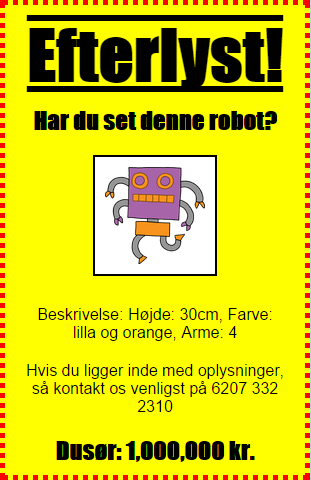
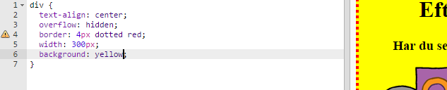
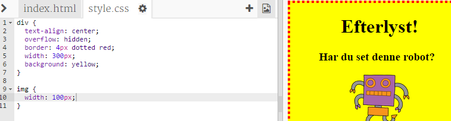
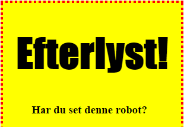
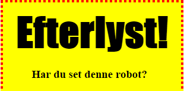

---
title: Efterlyst!
level: HTML & CSS 1
language: dk-DK
embeds: "*.png"
materials: ["Klubleder Ressourcer/*.*","Projekt Ressourcer/*.*"]
stylesheet: web
...

# Introduktion { .intro}

I dette projekt vil du lære, hvordan du laver din egen plakat.



# Trin 1: At style din plakat { .activity}

Lad os begynde med at redigere CSS koden til din plakat.

## Arbejdsliste { .check}

+ Åbn denne trinket: <a href="https://trinket.io/html/a9a3ec7e23" target="_blank">web-efterlyst</a>. Hvis du læser dette online, så kan du også benytte den indlejrede version af denne trinket nedenfor. 

<div class="trinket">
	<iframe src="https://trinket.io/embed/html/0f66cb6386" width="100%" height="550" frameborder="0" marginwidth="0" marginheight="0" allowfullscreen>
	</iframe>
</div>

+ Klik på "style.css" fanen. Du vil lægge mærke til, at der allerede er CSS egenskaber tilknyttet `div` containeren, som indeholder forskellige dele af plakaten.

``` 
	div {
		text-align: center;
	    overflow: hidden;
	    border: 2px solid black;
	    width: 300px;
    }	
``` 

+ Lad os starte med at ændre `text-align` egenskaben:

``` 
	text-align: center;
``` 
	
	Hvad sker der, hvis du ændrer ordet `center` til `left` eller `right`?

+ Hvad med `border` egenskaben?

``` 
	border: 2px solid black;
``` 

	`2px` i ovenstående kode betyder 2 pixels. Hvad sker der, hvis du ændrer `2px solid black` til `4px dotted red`? 

+ Ændr plakatens `width` til `400px`. Hvad sker der med plakaten?

+ Lad os tilføje noget CSS for at lave en baggrundsfarve til plakaten. Gå til linje 5 i din kode og tryk enter, så du får en ny tom linje.

	

	Indtast følgende kode i din nye tomme linje:

``` 
	background: yellow;
``` 

	Sørg for at indtaste koden _nøjagtigt_ som den ser ud ovenfor. Nu skulle baggrunden af din `<div>` gerne være gul. 

	

##Udfordring: Forbedr din plakat {.challenge}
Tilføj følgende CSS egenskab til din `div` style: 

```
border-radius: 40px;
```

Hvad gør egenskaben? Hvad sker der, hvis du ændrer tallet i ovenstående kode?

## Gem dit projekt {.save}

# Trin 2: Style billeder { .activity}

Lad os forbedre stylen af billedet på din plakat.

## Arbejdsliste { .check}

+ Ligenu er der ingen CSS egenskaber for dit `` tag, så lad os tilføje nogle!

	Først, tilføj følgende kode under CSS'en for din div:

``` 
	img {

	}
``` 

	

+ Nu kan vi tilføje CSS egenskaber til billeder mellem `{` og `}` parenteserne.

	For eksempel, tilføj denne kode mellem de krøllede paranteser til at definere bredden på billedet:

``` 
	width: 100px;
``` 

	Du kan se at størrelsen på billedet ændrer sig, sådan at bredden nu er 100 pixels.

	

+ Du kan også tilføje en _border_ (kant) til dit billede med denne kode:

``` 
	border: 1px solid black;
``` 

+ Har du lagt mærke til, at der ikke så meget afstand mellem billedet og kanten?

	

	Dette kan du løse ved at tilføje noget _padding_ (luft) rundt om billedet:

``` 
	padding: 10px;
``` 

	Padding er afstanden mellem indholdet (i dette tilfælde et billede) og dets kant.

	

	Hvad tror du der sker, hvis du ændrer padding til `50px`? 

##Udfordring: Forbedr dit billede {.challenge}
Kan du tilføje en baggrundsfarve til dit billede? Eller en rund kant?  

## Gem dit projekt {.save}

# Trin 3: Style overskrifter { .activity .new-page }

Lad os forbedre stylingen af `<h1>` overskriften.  

## Arbejdsliste { .check}

+ Tilføj følgende kode under CSS'en til dit billede:

``` 
	h1 {

	}
``` 

	Det er så her du tilføjer CSS egenskaber til din `<h1>` hovedoverskrift.

+ For at ændre fonten på din `<h1>` overskrift, så tilføj følgende kode mellem de krøllede paranteser:

``` 
	font-family: Impact;
``` 

+ Du kan også ændre størrelsen på din overskrift:

``` 
	font-size: 50pt;
``` 

+ 	Har du lagt mærke til, at der er ganske stor afstand mellem `<h1>` overskriften og det der ligger rundt om?

	

	Det er fordi der er en margin omkring overskriften. En margin er afstanden mellem et element (i dette tilfælde en overskrift) og alt det andet. 

	Du kan lave din margin mindre med denne kode:

``` 
	margin: 10px;
``` 

	

+ Du kan også understrege din overskrift:

``` 
	text-decoration: underline;
``` 

##Udfordring: Lav en fed plakat! {.challenge}
Tilføj noget mere CSS til at style din `<h3>` overskrift og dine paragrafer. 


Her er en liste over nogle CSS egenskaber, som du kan bruge:

```
color: black;
background: white;
font-family: Arial / Comic Sans MS / Courier / Impact / Tahoma;
font-size: 12pt;
font-weight: bold;
text-decoration: underline overline line-through;
margin: 10px;
padding: 10px;
width: 100px;
height: 100px;
```

## Gem dit projekt {.save}

##Udfordring: Markedsfør en begivenhed! {.challenge}
Kan du lave en plakat til en begivenhed på din skole? Det kunne være et stykke, en sportsbegivenhed, og det kunne faktisk også være en plakat, som gør reklame for din Kodeklub! 

## Gem dit projekt {.save}