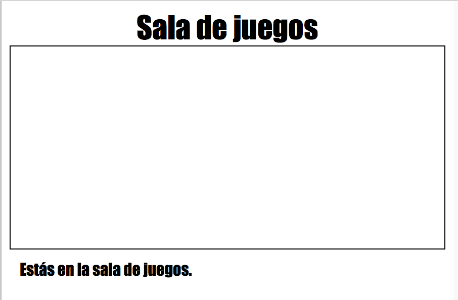
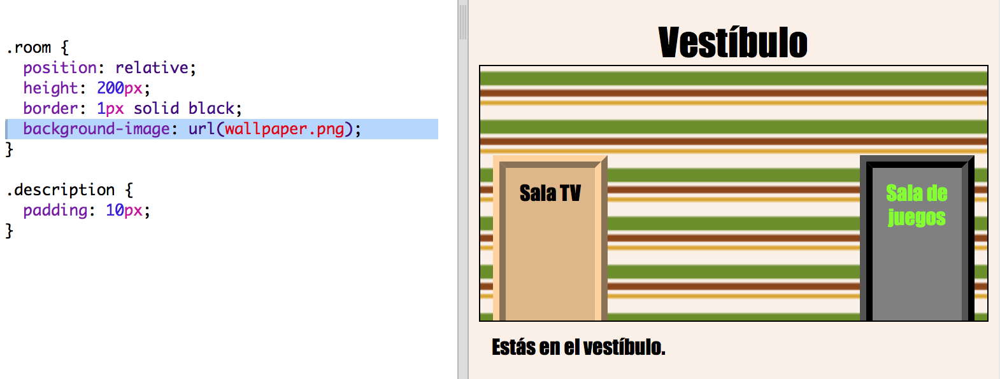

# Einführung {.intro}

In diesem Projekt wirst du ein Set an verknüpften Zimmern erstellen, bei denen jedes Zimmer eine andere Webseite darstellt und du kannst jedes Zimmer, bzw. jede Seite, mit HTML dekorieren. 

  <iframe src="https://trinket.io/embed/html/ba5d27ec68?outputOnly=true&start=result" width="600" height="450" frameborder="0" marginwidth="0" marginheight="0" allowfullscreen>
  </iframe>
  

__Anweisungen__: Klicke auf die Türen, um zwischen den einzelnen Zimmern hin- und hergehen zu können.

# Schritt 1: Stelle eine Verknüpfung zu einer anderen Webseite im gleichen Projekt her {.activity}

Die Webprojekte können aus vielen einzelnen HTML-Dateien hergestellt werden, welche alle miteinander verknüpft werden. 

## Aufgaben-Checkliste { .check}

+ Dieses Trinket öffnen: <a href="http://jumpto.cc/web-rooms" target="_blank">jumpto.cc/web-rooms</a>. 

	Das Projekt sollte so aussehen:

	

+ Das Trinket sollte in „Autorun“ laufen und du befindest dich jetzt im Flur:

	

+ Sieh dir die Liste der Datei-Reiter für dieses Trinket an. Kannst du hier das `tvroom.html` (Fernsehzimmer) entdecken? Klicke darauf.

	

	Dies ist eine andere HTML-Datei im gleichen Projekt. 

+ Um ins `tvroom.html` (Fernsehzimmer) zu gelangen, musst du einen Link im `index.html` (Inhaltsverzeichnis) hinzufügen. 

	Füge den markierten Code in dem `
` mit der Klasse `room` (Zimmer) ein: 

	

+ Teste dein Trinket, indem du auf den __TV Room__ (Fernsehzimmer) Link klickst, um die `tvroom.html` Webseite sehen zu können.

	Beachte bitte, dass das `tvroom.html` auch seine eigene `tvroom.css` Stil-Datei besitzt, welche das Layout für diese Seite definiert. 

	

	
##Aufgabe: Füge einen weiteren Link hinzu {.challenge}

Füge einen `<a>` Link zur `tvroom.html` Webseite, um wieder zurück zur Flur-Webseite mit dem Namen `index.html` (Inhaltsverzeichnis) zu gelangen, Der Link-Text sollte 'Hall' (Flur) sein.

Die Fernsehzimmer-Webseite (TV Room) sollte dann einen klickbaren Link wie diesen hier haben:

Achte darauf, dass du deinen Code testest. Du solltest jetzt in der Lage sein, dich vom Flur ins Fernsehzimmer und wieder zurück zu begeben, indem du auf die Links klickst.  

## Projekt speichern {.save}

# Schritt 2: Füge noch ein Zimmer hinzu {.activity}

Lass uns jetzt ein weiteres Zimmer, einen __Games Room__ (Spielzimmer) hinzufügung. 

+ Klick auf der Hinzufügen Seite, die __+__ Taste:

	

	Tippe `gamesroom.html` (Spielzimmer) als deinen Seitennamen ein:

  	

+ Das HTML für den __Games Room__ ist sehr ähnlich wie zum `tvroom.html`, __kopiere__ dies daher und __füge__ es in `gamesroom.html` ein.
	
	Bearbeite die markierten Posten, damit es sich wie „Games“ (Spielzimmer) und nicht „TV“ (Fernsehzimmer) liest:

		

+ Dein `gamesroom.html` benutzt jetzt `gamesroom.css`, was bislang noch nicht exisitert. 

	Erstelle `gamesroom.css`, indem du auf die __+__ Taste auf der Hinzufügen-Seite klickst. 

+ Der CSS Code für das __Spielzimmer__ ist sehr ähnlich wie zum `tvroom.css`, __kopiere__ dies daher und __füge__ es in `gamesroom.css` ein.

	

+ Füge einen Link vom Flur zum Spielzimmer hinzu:

	

+ Teste dein Projekt, indem du auf den Spielzimmer-Link klickst

	Das __Spielzimmer__ sollte so aussehen:

	

	Nicht gerade sehr spannend, aber du kannst das in der nächsten Aufgabe beheben. 

## Projekt speichern {.save}

##Aufgabe: Gestalte das Spielzimmer und stelle einen Link hierzu her {.challenge}

Bearbeite den HTML und CSS Code für das __Spielzimmer__ , damit die Webseite so aussieht: 

Tipp: Du wirst die Hintergrundfarbe, die Farbe der Schriftart sowie die Farbe des Rahmens in `gamesroom.css` ändern müssen. Die hellgrüne Farbe nennt sich `chartreuse`.  

Tipp: Du wirst einen `<a>` Link im `gamesroom.html` hinzufügen müssen, der sich mit dem `hall.html` (Flur) verknüpft.

## Projekt speichern {.save}

# Schritt 3: Lasse diesen Link wie Türen aussehen {.activity}

Links müssen nicht unbedingt immer nur Text sein. Lass uns eine klickbare Tür mit Hilfe eines `
` einrichten.

## Aufgaben-Checkliste { .check}

+ Öffne das `index.html` (Inhaltsverzeichnis) und füge ein `
` rund um den __Fernsehzimmer__ Link-Text hinzu. Dies muss in dem `<a>` stehen, damit es klickbar wird.

  Füge `id="hall2tv"` hinzu, um es als die Tür zu bezeichnen, die vom Flur aus in das Fernsehzimmer geht, damit du die Tür stylen kannst. 

    

+ Klicke auf den `style.css` Reiter, gehe nach unten und füge den folgenden CSS-Code hinzu, um die Größe und Farbe der Tür zu ändern:

	

+ Teste deine Webseite, indem du irgendwo auf die Tür und nicht nur auf den Text klickst.

+ Lass es uns jetzt noch ein bischen mehr wie eine Tür aussehen, indem wir einen Rahmen rund um die drei Seiten hinzufügen:

	

+ Wir wollen auch noch weiteren CSS-Code hinzufügen, damit der Text auf der Tür besser aussieht:

	

+ Du hast wahrscheinlich schon gemerkt, dass die Tür frei in der Luft schwebt. Lass uns das jetzt reparieren, indem wir die Tür innerhalb des Zimmers positionieren.

		

+ Teste deine Webseite, indem du auf die Tür klickst, um ins __Fernsehzimmer__ zu gelangen.

## Projekt speichern {.save}

##Aufgabe: Füge weitere Türen hinzu! {.challenge}

Verwandele die anderen Links in deinem Projekt auf die gleiche Art und Weise zu Türen. 

Für jede Tür musst du:

+ Den Tür-Link bearbeiten, um ein `
` mit einer ID, wie z. B. `hall2games` (Flur-zu-Spielzimmer) zu benutzen, damit du diesen stylen kannst. 

	Zum Beispiel: 

	`<a href="gamesroom.html">
Games Room
</a>`

+ Füge CSS für die Tür ID zur `.css` Datei für dessen Zimmer hinzu. Benutze _kopieren_ und _einfügen_, um Zeit zu sparen. Du kannst jede Tür anders aussehen lassen, wenn du willst. 

+ Positioniere die Tür mit Hilfe von `bottom:` (unten) und `left:` (links) oder `right:` (rechts).

Der Flur könnte dann evtl. so aussehen:

Das Fernsehzimmer sollte in etwa so aussehen:

	

# Schritt 4: Ein Hintergrundbild hinzufügen {.activity}

Lass uns den Flur mit einem Hintergrundbild dekorieren.

## Aufgaben-Checkliste { .check}

+ Bearbeite den `style.css` Code, um ein Hintergrundbild zum Flur hinzuzufügen:

		

	Das Bild wird wiederholt, um das ganze Zimmer damit zu füllen. 

## Projekt speichern {.save}

##Aufgabe: Füge eine Tapete zum Spielzimmer hinzu {.challenge}

Kannst du das Spielzimmer mit einem Hintergrundbild dekorieren?

Du kannst das `space-invader.png` Hintergrundbild wählen, das in deinem Projekt mit enthalten ist. 

Du musst:

+ Ein `background-image:` (Hintergrundbild) zum `.room` (Zimmer) CSS für das Spielzimmer hinzufügen. 

Das dekorierte Zimmer sollte so aussehen:

	

## Projekt speichern {.save}

##Aufgabe: Gestalte es so wie du es willst! {.challenge}

Füge noch weitere Zimmer zu deinem Projekt hinzu. Denk daran, dass du __kopieren__ und __einfügen__ benutzen kannst, um Zeit zu sparen. Du musst dann einfach nur noch die Dinge ändern, die verschieden sein müssen. 

Für jedes Zimmer musst du:

+ Eine `.html` Datei erstellen
+ Tür-Links für das neue 'room' Zimmer (hinein und hinaus)
+ Eine `.css` Datei mit den Stilen für dein neues Zimmer und dessen Türen erstellen

Du kannst die `background-color:` (Hintergrundfarbe) für jedes Zimmer ändern. Klicke auf das Bildsymbol, um die Hintergrundbilder, unter denen du auswählen kannst, sehen zu können:

	

## Projekt speichern {.save}

