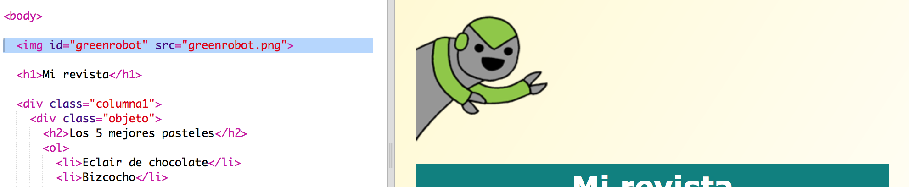

---
title: Zeitschrift
description: Erstelle eine Zeitschriften-Webseite mit mehreren Seiten 
layout: project
notes: "Magazine - notes.md"
...

# Einführung { .intro}

In diesem Projekt lernst du, wie du HTML und CSS benutzen kannst, um eine Zeitschriften-Webseite mit einem Zwei-Seiten-Layout zu erstellen. Du wirst etliche der HTML und CSS Techniken aus früheren Projekten wiederholen. 

  <iframe src="https://trinket.io/embed/html/a41e4e1c5c?outputOnly=true&start=result" width="600" height="500" frameborder="0" marginwidth="0" marginheight="0" allowfullscreen>
  </iframe>
  

# Schritt 1: Überschrift und Hintergrund

Webseiten im Zeitschriftenstil haben oftmals ganz viele kleine Dinge auf einer Seite. Als erstes wirst du eine Überschrift und einen Hintergrund für deine Zeitschrift erstellen. 

## Aufgaben-Checkliste { .check}

+ Dieses Trinket öffnen: <a href="http://jumpto.cc/web-magazine" target="_blank">jumpto.cc/web-magazine</a>. 

	Das Projekt sollte so aussehen:

	

+ Lass uns die Überschrift hinzufügen. 

	Du kannst dir gerne einen besseren Titel für die Zeitschrift ausdenken. 

	

+ Kannst du die Überschrift grafisch gestalten?

	Hier ist ein Beispiel, aber du kannst auch deinen eigenen Stil wählen:

	

+ Lass uns jetzt einen interessanten Hintergrund mit Hilfe von Gradienten erstellen und eine Schriftgröße für die Zeitschrift wählen. 

	Hier sind ein paar Beispiele als Erinnerungshilfe, wie man einen Gradienten erstellt: 

	

## Projekt speichern {.save}

# Schritt 2: Spalten erstellen

Webseiten benutzen oftmals mehrere Spalten. Lass uns ein Zwei-Spalten-Layout für deine Zeitschrift erstellen. 

## Aufgaben-Checkliste { .check}

+ Lass uns als erstes zwei Spalten `div` erstellen.

	Füge den markierten HTML Code zum `index.html` (Inhaltsverzeichnis) hinzu:

	

+ Gestalte die Spalten Divs jetzt so, dass eine nach links und die andere nach rechts „floatet“ (gleitet). 

	

	Jede Spalte beträgt weniger als 50 %, es gibt also Freiraum für die Füllung. 

	Du musst etwas in die Spalte schreiben, um die Wirkung sehen zu können. 

+ Lass uns ein Bild von einem kleinen Kätzchen oben in die 2. Spalte setzen. 

	

	Siehst du, dass das Kätzchenbild ungefähr halbwegs in der Mitte der Seite in der zweiten Spalte positioniert ist? 

	Es ist jedoch ein wenig zu groß!

+ Lass uns `max-width: ` (maximale Breite) benutzen, damit die Bilder in den jeweiligen Kasten passen. 

	Füge den folgenden Stil zu `style.css` hinzu.

	

	Dies gilt für alle Bilder, die du in deiner Zeitschrift benutzt und nicht nur für das Kätzchenbild.

+ Füge jetzt eine Klasse namens `photo` (Foto) zum Bild hinzu, damit du es grafisch gestalten kannst:

	

+ Gestalte jetzt das Bild grafisch, um einen Schatten hinzuzufügen sowie einen kleinen Twist, damit das Foto aus der Seite hervorsticht:

	

	Nimm die Veränderungen so lange vor, bis du mit dem Ergebnis zufrieden bist. 

# Schritt 3: Zeitschriftenartikel grafisch gestalten

Lass uns das Layout noch ein wenig interessanter gestalten. 

## Aufgaben-Checkliste { .check}

+ Füge ein `div` rund um dein Bild mit einer `class` (Klasse) und einer `h2` Überschrift hinzu:

	

+ Gestalte jetzt den Posten und die Überschrift grafisch. 

	Hier ist ein Beispiel, du kannst aber gerne Veränderungen vornehmen:

	

## Projekt speichern {.save}

##Aufgabe: Füge Posten in der linken Spalte hinzu {.challenge}

Kannst du eine geordnete Liste und einen Gradienten-Textaufkleber in der linken Spalte hinzufügen? 

Hier ist ein Beispiel:

Dies ist der Code für das Beispiel, aber du kannst es auch ändern, um deine eigene Idee zu benutzen.

HTML:

CSS:

## Projekt speichern {.save}

# Schritt 4: Eine zweite Seite hinzufügen

Lass uns eine weitere Seite zu deiner Zeitschriften-Webseite hinzufügen. 

## Aktivitäts-Checkliste {.check}

+ Füge eine neue Seite zu deinem Projekt hinzu und nenne sie `page2.html` (Seite2 HTML) :

+ Seite 2 wird sehr ähnlich zur ersten Seite deiner Zeitschrift sein, du kannst daher den HTML Code vom `index.html` (Inhaltsverzeichnis) kopieren und ihn in `page2.html` (Seite2) einfügen.

Siehst du, dass beide Seiten das gleiche `style.css` benutzen? Sie werden daher den gleichen Stil teilen. 

+ Ändere den `<h1>` Titel für Seite2: 

+ Jetzt brauchst du Links zwischen den Seiten, damit du zu Seite 2 gelangen kannst und auch wieder zurück zur Titelseite. 

Gehe zurück zum `index.html` (Inhaltsverzeichnis). Füge einen Link in einem Div in Spalte 2 im `index.html` (Inhaltsverzeichnis) ein:

+ Teste, ob du auf deinen neuen Link klicken kannst und so zu Seite 2 deiner Zeitschrift gelangen kannst. 

##Aufgabe: Füge einen Link zurück zur ersten Seite ein {.challenge}

Kannst du einen Link zu `page2.html` (Seite2) herstellen, damit du darauf klicken kannst, um wieder zurück zur ersten Seite zu gelangen?

Tipp: Schau dir den HTML Code an, den du benutzt hast, um einen Link zu Seite 2 zu erstellen. 

##Aufgabe: Fülle deine zweite Seite {.challenge}

Hier ist der Code für die Beispiele, du kannst aber auch das `div` ändern, bzw. deine eigenen Ideen umsetzen.  

Klicke auf das Bildsymbol, um zu sehen, welche Bilder dir zur Verfügung stehen:

Denk daran, dass du auch deine eigenen Bilder hochladen kannst. Achte darauf, dass du die Erlaubnis für alle Bilder, die du hochlädst, hast. 

# Schritt 5: Eine Animation hinzufügen

Lass uns deiner Zeitschrift eine tolle Animation hinzufügen. 

## Aktivitäts-Checkliste {.check}

+ Gehe zum `index.html` (Inhaltsverzeichnis) und füge das `greenrobot.png` (grüner Roboter) Bild oben auf deiner Seite ein. 

+ Füge jetzt den CSS Code hinzu, um deinen Roboter zu animieren:

##Aufgabe: Füge eine weitere Animation hinzu {.challenge}

Kannst du eine Animation zur 2. Seite deiner Zeitschrift hinzufügen? 

