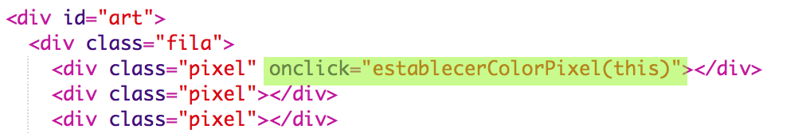
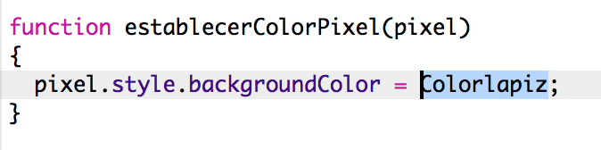

# Einführung {.intro}

In diesem Projekt wirst du einen sog. „Pixel Art Editor” erstellen, um deine Kunstwerke zu bearbeiten. Zusätzlich zum HTML und CSS Code wirst du lernen, wie man JavaScript benutzt, um interaktive Funktionen zu deinem Projekt hinzuzufügen.

  <iframe src="https://trinket.io/embed/html/0e102a306b?outputOnly=true&start=result" width="600" height="450" frameborder="0" marginwidth="0" marginheight="0" allowfullscreen>
  </iframe>
  

__Wie man den Editor benutzt__: Klicke auf eine Farbe in der Farbpalette, um deine Stiftfarbe zu wählen, klicke dann auf die Pixel, um deren Farbe zu ändern.

# Schritt 1: Erstelle ein Pixelraster {.activity}

Lass uns ein Pixelraster erstellen, das du zum Anfertigen von Pixelbildern und Kunstwerken benutzen kannst. CSS bietet einen Tabellenstil für die Raster- und Tabellen-Layouts. 

Die Tabellen enthalten Reihen, welche Felder beinhalten. Du wirst eine Tabelle mit einem schwarzen Hintergrund erstellen und dann weiße Pixel darin platzieren. 

## Aufgaben-Checkliste { .check}

+ Dieses Trinket öffnen: <a href="http://jumpto.cc/web-pixel" target="_blank">jumpto.cc/web-pixel</a>. 

	Das Projekt sollte so aussehen:

	

+ Füge das folgende HTML in den `<body>` (Hauptteil) deiner `index.html` (Inhaltsverzeichnis) Datei, um ein `
` als einen Kasten für deine Pixel Kunst zu erstellen und gib im die ID `art` (Kunst), damit du ihn grafisch gestalten kannst:

	

+ Gehe jetzt zu deiner `style.css` Datei und füge das Tabellen-Styling für das Kunst `
` hinzu.

	

	Dies erstellt eine Tabelle mit Rahmen und es stellt den Abstand im Raster ein. 

	Es sieht jetzt noch nicht sehr interessant aus, du wirst Reihen von Pixeln darin platzieren müssen. 

 + Gehe jetzt zurück zu deiner `index.html` (Inhaltsverzeichnis) Datei und füge eine Reihe mit 3 Pixeln im Kunst `
` hinzu:

	
	
	 Siehst du, dass die drei Pixel-Zeilen gleich sind? Tippe die erste Zeile ein und benutze dann Kopieren und Einfügen, um die anderen Zeilen zu erstellen. 

 	Diesmal wirst du die Klassen benutzen, um die Divs grafisch zu gestalten, weil es ganz viele hiervon gibt. 

 + Füge den folgenden Stil zu den Reihen und Zellen hinzu:

	

 	Jetzt werden deine Pixel in einer Reihe im Raster erscheinen mit schwarzen Linien rund herum. 

 + Füge jetzt zwei weitere Reihen von Pixeln hinzu, um ein 3 x 3 Raster zu erstellen. Denk daran, dass du Kopieren und Einfügen benutzen kannst, um Zeit zu sparen. 

	
	
    
##Aufgabe: Verändere die Einstellung deiner Rastergröße {.challenge}

3 x 3 ist ein recht kleines Raster für Pixel-Kunst. Kannst du das Raster vergrößern? 8 x 8 ist eine gute Größe für Pixel-Kunst. 

Probiere mal Ausschneiden und Einfügen aus, anstatt alles neu einzutippen. 

## Projekt speichern {.save}

# Schritt 2: Die Pixel färben {.activity}

HTML wird benutzt, um den Inhalt zu organisieren und CSS wird benutzt, um den Inhalt grafisch zu gestalten. JavaScript ist eine Programmiersprache, die benutzt werden kann, um eine Webseite zu ändern, während man damit interagiert. 

Du könntest HTML und CSS benutzen, um die Hintergrundfarbe von einzelnen Pixeln einzustellen, aber das wäre ein sehr langwieriger Prozess! Statt dessen wirst du JavaScript Code hinzufügen, um deine Pixel automatisch zu färben, bzw. bunt zu gestalten, wenn du auf sie klickst. 

+ In JavaScript wird der Code in eine `function` (Funktion) platziert, die aufgerufen werden kann, wenn wir diesen Code laufen lassen wollen. 

	Du wirst eine Funktion namens `setPixelColour` (Pixel-Farbe einstellen) erstellen

	Die `setPixelColour` (Pixel-Farbe einstellen) Funktion muss wissen, welche Pixel die Farbe ändern sollen, dies ist eine `input` (Eingabe).

	Füge den folgenden Code zur `script.js` Datei hinzu, um die Hintergrundfarbe eines Pixels einzustellen:

	

	Hast du bemerkt, dass `backgroundColor` (Hintergrundfarbe) die amerikanische Buchstabierweise benutzt: „color“ statt Britisch Englisch „colour“? 

+ Wir müssen jetzt diese Funktion aufrufen, wenn ein Pixel angeklickt wird.

	HTML benutzt `onclick` (beim Anklicken), um eine Funktion aufzurufen, wenn ein Element angeklickt wird. Du wirst in 'this' (dieses) als die Eingabe daran vorbeigehen müssen, damit deine Funktion weiß, für welche Pixel es die Farbe ändern soll. 

	Gehe zum `index.html` (Inhaltsverzeichnis) und füge den folgenden Code zum ersten Pixel hinzu:

	

+ Teste deinen Code, indem du auf das erste Pixel klickst. Es sollte jetzt schwarz werden:

	

	Du hast den `onclick` (beim Anklicken) Code nur zum ersten Pixel hinzugefügt, dies wird also noch nicht bei den anderen Pixeln funktionieren. 

##Aufgabe: Mache alle Pixel anklickbar {.challenge}

Kannst du alle Pixel anklickbar machen? Benutze Auschneiden und Einfügen, damit es schneller geht. 

Erstelle ein rasches Pixel-Kunstwerk. 

Tipp: Du kannst auf __Autorun__ (automatisch laufen lassen) klicken, um alle Pixel zu entfernen. 

# Schritt 3: Füge eine Farbpalette hinzu {.activity}

Findest du es nervig, dass du eine Pixel-Farbe nicht wieder zu weiß verwandeln kannst, wenn du einen Fehler gemacht hast? Lass uns dieses Problem beheben, indem wir eine Farbpalette erstellen, damit du auf eine Farbe klicken kannst, um die Stiftfarbe zu ändern. 

+ Lass uns als erstes den Stiftstil erstellen. 

	Füge den folgenden Code unten in deiner `style.css` Datei hinzu:

	

+ Erstelle jetzt schwarze und weiße Stiftfarben, die diesen Stil benutzen. 

	Füge den folgenden Code zum `index.html` (Inhaltsverzeichnis) nach dem `<body>` (Hauptteil) hinzu:

	

	`style=` Stil ermöglicht dir, den CSS Code in deinem HTML hinzuzufügen, was sehr bequem und einfach ist. 

+ Du willst in der Lage sein, die Stiftfarbe zu ändern, wenn die Farbpalette angeklickt wird. 

	Die Variablen werden benutzt, um Informationen zu speichern. Lass uns eine Stiftfarben-Variable in `script.js` erstellen.

	Füge den folgenden Code oben in der Datei hinzu:

	

	Füge dann eine Funktion hinzu, um die Stiftfarbe zu ändern:

	

+ Du wirst auch die Stiftfarbe benutzen müssen, wenn du die Farbe eines Pixels ändern willst. 

	Ändere die `setPixelColour` (Pixel-Farbe einstellen) Funktion, um die `penColour` (Stiftfarbe) Variable anstelle von `black` (schwarz) zu benutzen:

	 

+ Jetzt musst du die `setPenColour` (Stiftfarbe einstellen) Funktion aufrufen, wenn die Stiftfarbe angeklickt wird. 

	Füge den markierten `onclick` Code zu deinen Stiftfarben hinzu:

	

+ Teste jetzt, ob du die Stiftfarbe zwischen schwarz und weiß wechseln kannst, um die Pixel auszumalen oder zu löschen.

## Projekt speichern {.save}

##Aufgabe: Füge weitere Farben zur Palette hinzu {.challenge}

Kannst du weitere Farben zur Palette hinzufügen? Wähle die Farben, die du willst, um deine Pixel-Kunst zu erstellen. 

Fertige dann ganz tolle Pixel-Kunst an.

Tipp: Die hellgrüne Farbe nennt sich `chartreuse`.

Frage deinen Club-Leiter, ob du das Windows Snipping Tool oder eine Alternative hierzu benutzen kannst, um eine Kopie deiner Pixel-Kunst als Bild speichern zu können. 

## Projekt speichern {.save}

