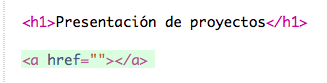

# Einführung {.activity}

In diesem Projekt wirst du ein Vorzeigeprojekt deiner HTML-Projekte erstellen und etwas über Links sowie die Einbettung von Ressourcen lernen. 

# Schritt 1: Links zu Webseiten hinzufügen {.activity}

Text-Links ermöglichen dir auf Worte zu klicken, um zu einer anderen Webseite zu gelangen, diese sind normalerweise unterstrichen.

## Aufgaben-Checkliste { .check}

+ Dieses Trinket öffnen: <a href="https://jumpto.cc/web-showcase">jumpto.cc/web-showcase</a>. 

	Das Projekt sollte so aussehen:

	

+ HTML benutzt das `<a>` Tag für die Links. 

+ Finde das `<a>` Tag in deinem Projekt. 

+ Füge die Code Club Webseitenadresse hinzu <a href="https://www.codeclub.org.uk">`https://www.codeclub.org.uk`</a> sowie den Link Text:

+ Klicke auf „Run“ (laufen lassen), um dein Trinket zu testen.

+ Klicke auf den Code Club Link, um deine Webseite zu testen. Dein Trinket wird jetzt die Code Club Webseite anzeigen: 	

+ Um zurück zu deiner Seite zu gelangen, kannst du entweder: 

	+ dein Trinket erneut laufen lassen,

	+ auf die Rückwärts-Taste auf der Tastatur drücken oder

	+ auf die rechte Maustaste klicken und „Zurück“ wählen. 

## Aufgaben-Checkliste { .check}

+ Stelle deinen Link jetzt in einen Satz innerhalb eines Absatzes:

Teste deine Webseite. 

## Aufgabe: Füge einen weiteren Link hinzu {.challenge}

Füge einen Satz mit einem Link zu einer Webseite hinzu, die hilfreich war, um Webprojekte zu erstellen. Zum Beispiel: <a href="https://trinket.io">https://trinket.io</a> or <a href="https://trinket.io/docs/colors">https://trinket.io/docs/colors</a>.

# Speichern {.activity}

# Schritt 2: Link zu einem Trinket {.activity}

Du kannst den Link zur Webseite für ein Trinket benutzen. 

## Aufgaben-Checkliste { .check}

+ Hast du den Link zu deinem „Happy Birthday“ Trinket aufbewahrt? Falls ja, dann öffne dieses Trinket in einem anderen Browser-Reiter, bzw. Fenster. Ansonsten öffne das Trinket von diesem fertig gestellten Beispiel hier: <a href="https://trinket.io/html/e996dc0380">https://trinket.io/html/e996dc0380</a>

+ Klicke auf das Teilen-Menü oberhalb deines Trinkets und wähle „Link“:

Falls du das Trinket von deinem Konto aus geöffnet hast, suche statt dessen nach der „Teilen“ Option unter deinem Trinket:

+ Wähle 'Only show code or result (let users toggle between them)' (Nur Code oder Ergebnis zeigen (Nutzer zwischen diesen beiden umschalten lassen) und kopiere den Link ins Trinket. 

+ Gehe zurück zu deinem „Project Showcase“ Trinket und füge einen `<h2>` Titel und einen Link zu deinem „Happy Birthday“ Projekt ein.

Teste deine Webseite, sie sollte jetzt etwa so aussehen:

Klicke auf den „Happy Birthday“ Link, um zu testen, dass du so zum Trinket weitergelangst.

## Projekt speichern {.save}

## Aufgabe: Erstelle eine Liste deiner Projekte {.challenge}

Füge manche der anderen HTML &amp; CSS Projekte hinzu, die du im Code Club erstellt hast. Benutze die `<h2>` Titel, um deine Webseite zu organisieren. 

Falls du keine Links zu deinen Projekte haben solltest, dann kannst du die Code Club Beispiele benutzen:

+ Happy Birthday: <a href="https://trinket.io/html/e996dc0380">https://trinket.io/html/e996dc0380</a>

+ Eine Geschichte erzählen: <a href="https://trinket.io/html/c8afdef912">https://trinket.io/html/c8afdef912</a>

+ Gesucht!: <a href="https://trinket.io/html/ebeb56398a">https://trinket.io/html/ebeb56398a</a>

+ Rezept: <a href="https://trinket.io/html/c0fd9b40cd">https://trinket.io/html/c0fd9b40cd</a>

+ Geheimnisvoller Brief: <a href="https://trinket.io/html/1d4d4c5ce1">https://trinket.io/html/1d4d4c5ce1</a>

Deine fertige Seite sollte dann etwa so aussehen:

## Projekt speichern {.save}

# Schritt 3: Einbettung von Projekten {.activity}

Zusätzlich zum Link zu Trinkets als Webseiten können wir diese auch in einer Webseite einbetten.

## Aufgaben-Checkliste { .check}

+ Du solltest vielleicht versuchen, im Vollbildanzeigemodus zu arbeiten, damit du mehr Platz hast:

Drücke auf die Esc-Taste, um aus dem Vollbildmodus herauszukommen.

+ Lasse dein Trinket laufen und klicke auf den „Happy Birthday“ Link. 

+ Klicke auf das Trinket-Menü und wähle __einbetten__. Wenn du nicht im Vollbildmodus bist, musst du eventuell hoch oder runter scrollen. Benutze die Bildlaufleiste rechts oder den Pfeil nach unten auf deiner Tastatur.

## Aufgaben-Checkliste { .check}

+ Wähle 'Only show code or result (let users toggle between them)' (Nur Code oder Ergebnis zeigen (Nutzer zwischen diesen beiden umschalten lassen) und __kopiere__ den eingebetteten Code für das Trinket. 

+ Trinket hat ein wenig HTML-Code für dich erstellt, den du in deine Webseite mit einbeziehen kannst. Es benutzt ein `<iframe>` Tag, welches ermöglicht, dass der Inhalt auf einer Seite eingebettet werden kann. 

+ Füge jetzt diesen Code unter  dem Link zum „Happy Birthday“ Trinket ein:

+ Lasse dein Trinket laufen, um es zu testen und du solltest jetzt dein „Happy Birthday“ Projekt in der Webseite eingebettet sehen können. 

+ Du wirst eventuell sehen, dass die Unterseite deines Trinkets nicht angezeigt wird. Du kannst dies beheben, indem du den Höhenwert im `<iframe>` einstellst. 

Stelle die Höhe zu __400__ ein. Falls du Änderungen am „Happy Birthday“ Projekt vorgenommen hast, müsstest du eventuell einen anderen Wert benutzen. 

## Projekt speichern {.save}

## Aufgabe: Weitere Projekte einbetten {.challenge}

Bette weitere deiner Projekte im Vorzeigeprojekt ein. Denk daran, dass du deren Trinket-Seiten leicht finden kannst, indem du auf die Links zu deiner Webseite klickst. 

# Schritt 4: Erstelle ein Inhaltsverzeichnis {.activity}

Lass uns ein Inhaltsverzeichnis hinzufügen, damit wir schnell und einfach zu jedem Projekt gelangen können. 

## Aufgaben-Checkliste { .check}

+ Zusätzlich zum Link zu anderen Webseiten können wir zu einem bestimmten Teil einer Webseite gelangen, wenn wir ihm eine ID geben. 

Füge eine ID zum `<h2>` Titel des „Happy Birthday“ Projekts hinzu:

+ Füge eine je eine ID für jedes einzelne Projekt hinzu und gib jeder davon einen Kurznamen, wie z. B. Geschichte, Gesucht, Rezept und Brief. 

+ Du kannst mit Hilfe einer ID einen Link zu einem Element herstellen, indem du das Rautensymbol ‘#’ vor dessen Namen stellst. Z. B. , `#birthday`. 

Erstelle eine geordnete Liste an Links für deine Projekte. (Die geordneten Listen sind im „Rezept“ Projekt eingeführt worden.)

+ Lass dein Projekt laufen und teste es, indem du auf die Links klickst, um zu deinen Projekten zu gelangen. 

## Projekt speichern {.save}

# Schritt 5: Zurück nach oben gelangen {.activity}

## Aufgaben-Checkliste { .check}

+ Es ist auch hilfreich, in der Lage zu sein, wieder zurück nach oben auf einer Seite zu gelangen. HTML hat ein `#top` (oben) für diesen Zweck. 

+ Füge einen Link zu `#top` (oben) nach jedem eingebetteten Projekt in deiner Webseite hinzu:

+ Teste deine Links, indem du auf „Oben“ klickst, um zurück nach oben auf der Seite zu gelangen. 

## Projekt speichern {.save}

## Aufgabe: Verbessere dein Vorzeigeprojekt {.challenge}

Benutze den CSS-Code, den du gelernt hast, um deine Seite noch interessanter zu gestalten. Probiere mal, die Hintergrundfarbe der Seite oder die Schriftart für die Überschriften zu ändern. 

Du kannst auch zusätzliche Informationen über jedes Projekt hinzufügen und sagen, was dir daran besonders gut gefallen hat. 

## Aufgabe: Ein neues Vorzeigeprojekt erstellen {.challenge}

Trinkets sind nicht das Einzige, was du in einer Webseite einbetten kannst. Du kannst Videos, Widgets (wie z. B. ein Wetter-Widget) oder Scratch Projekte einbetten. 

Öffne“eingebettetes Scratch-Beispiel Trinket öffnen” und lass es laufen: <a href="https://trinket.io/html/9f7212b8fe">https://trinket.io/html/9f7212b8fe</a>

Gehe zur Scratch Webseite und suche nach einem Projekt, das dir gefällt. Es kann eins von deinen sein oder eins, das du entdeckt hast.

Wenn du angemeldet bist, kannst du auf die 'Embed' (einbetten) Taste unter dem Projekt klicken, um den HTML Einbettungscode zu erhalten. 

Falls du nicht angemeldet bist, suche nach der Scratch Projektzahl in dessen Webadresse. 

Fertige eine Kopie des `<iframe>` Codes im Scratch Einbettungsbeispiel an und tausche die Projektzahl gegen eine Zahl für das Projekt, das du einbetten willst, aus:

## Projekt speichern {.save}
