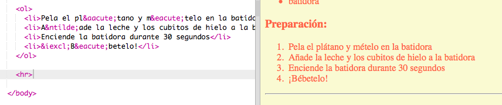
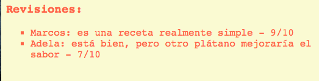

# Einführung { .intro}

In diesem Projekt lernst du, wie du eine Webseite mit deinem Lieblingsrezept anfertigst.


# Schritt 1: Wähle ein Rezept aus { .activity}

Ehe du mit dem Programmieren beginnst, musst du ein Rezept auswählen.

## Aufgaben-Checkliste { .check}

+ Denk dir ein Rezept aus, das du mit deinen Freunden teilen kannst. Es könnte z. B. Folgendes sein:
	+ Ein Rezept, das du online gefunden hast;
	+ Deine Lieblingsspeise;
	+ Etwas, das du dir ausgedacht hast!

Das Musterrezept, das du in diesem Projekt sehen wirst, ist ein Rezept für einen Bananen-Milchshake. Du kannst dieses Rezept natürlich kopieren, falls du kein eigenes Rezept finden kannst.

# Schritt 2: Zutaten { .activity}

Lass uns die Zutaten, die wir für dieses Rezept brauchen, auflisten.

## Aufgaben-Checkliste { .check}

+ Öffne das Vorlage-Trinket: [jumpto.cc/html-template](http://jumpto.cc/html-template).

	Das Projekt sollte so aussehen:

	

+ Für deine Zutatenliste wirst du mit Hilfe des `<ul>` Tags eine __ungeordnete Liste__ benutzen. Gehe zu Zeile 8 der Vorlage und füge diesen HTML-Code hinzu und ersetze den Text in der `<h1>` Überschrift mit dem Namen deines eigenen Rezepts:

```
<h1>Bananen-Milchshake</h1>

<h3>Zutaten:</h3>

<ul>

</ul>
```

+ Sieh dir deine Webseite an und du solltest jetzt deine beiden Überschriften sehen können.


Du wirst jedoch noch nicht deine Liste sehen können, weil du bisher noch keine Posten hierfür hinzugefügt hast!

+ Der nächste Schritt ist, die einzelnen Posten mit Hilfe des `<li>` Tags zu deiner Liste hinzuzufügen. Füge den folgenden Code innerhalb deines `<ul>` Tags hinzu:

```
<li>1 Banane</li>
```


Da deine Liste unsortiert, bzw. ungeordnet ist, gibt es keine Zahlen neben der Listenposten, nur die einzelnen Gliederungspunkte.

##Aufgabe: Noch mehr Zutaten {.challenge}
Kannst du alle Zutaten für __dein__ Rezept hinzufügen?

Deine Webseite sollte jetzt etwa so aussehen:


## Projekt speichern {.save}

# Schritt 3: Methode { .activity }

Als nächstes müssen wir erklären, wie wir dein Rezept herstellen.

## Aufgaben-Checkliste { .check}

+ Du wirst eine weitere Liste benutzen, um deine Methode aufzuschreiben, aber dieses Mal wirst du eine __geordnete Liste__ mit Hilfe des `<ol>` Tags benutzen. 

Eine sortierte, bzw. geordnete Liste ist eine durchnummerierte Liste, die du benutzen solltest, wenn die Reihenfolge der einzelnen Schritte wichtig ist.

Füge diesen Code unterhalb deiner Zutatenliste hinzu und achte darauf, dass er exakt in deinem `<body>` Tag steht:

```
<h3>Methode:</h3>

<ol>

</ol>
```


+ Jetzt musst du nur noch die einzelnen Posten in deine neue, geordnete Liste hinzufügen:

```
<li>Die Banane pellen und in den Mixer legen</li>
```


Siehst du, dass die einzelnen Posten automatisch nummeriert werden?

##Aufgabe: Weitere Schritte {.challenge}
Kannst du all die einzelnen Schritte, die für die Herstellung __deines__ Rezepts wichtig sind, hinzufügen?

Deine Methode sollte etwa so aussehen:


## Projekt speichern {.save}

# Schritt 4: Farben! { .activity}

Lass uns ein paar Farben zu deiner Rezept-Webseite hinzufügen.

## Aufgaben-Checkliste { .check}

+ Du hast bereits gelernt, wie man bunten Text zu einer Webseite hinzufügt. Füge diesen Code in deiner `style.css` Datei hinzu, damit der gesamte Text auf deiner Webseite Blau erscheint:

```
body {
    Farbe: Blau;
}
```


+ Dein Browser kennt Farben wie `blue` (Blau), `yellow` (Gelb) und auch `lightgreen` (Hellgrün), wusstest du aber, dass dein Browser tatsächlich die __Farbnamen__ von mehr als 500 verschiedenen Farben kennt?

Es gibt eine Liste an Farbnamen, die du benutzen kannst: Gehe zu [jumpto.cc/colours](http://jumpto.cc/colours) dort findest du Farbnamen wie `tomato` (Tomate), `firebrick` (Feuerziegel) und `peachpuff` (Pfirsichhauch).

Ändere die Textfarbe von `blue` (Blau) zu `tomato` (Tomate).


+ Dein Browser kennt nicht nur die Namen von 140 Farben, sondern er kennt tatsächlich auch die __Farbwerte__ von über 16 Millionen Farben!


Um dem Browser mitteilen zu können, welche Farbe er anzeigen soll, musst du nur sagen können, wie viel Rot, Grün und Blau benutzt werden soll.

Die Menge an Rot, Grün und Blau wird als Ziffer zwischen `0` und `255` geschrieben.


Füge diesen Code zum CSS für den Body deiner Webseite hinzu, um einen hellgelben Hintergrund anzuzeigen:

```
Hintergrund: rgb(250,250,210);
```


+ Wenn du magst, kannst du dem Browser sagen, welche Farbe er anzeigen soll, indem du den Hexadezimal Code (oder __hex code__) benutzt. Dies funktioniert ähnlich zum `rgb()` Code, wie oben beschrieben, mit Ausnahme, dass der Hexadezimal Code immer mit einem Rautenzeichen beginnt `#` und man die Hexadezimal ‘Zahlen’ zwischen `00` und `ff` für die Menge an Rot, Grün und Blau benutzt.


Ersetze den `rgb()` Code in deinem CSS mit diesem Hexadezimal Code:

```
Hintergrund: #fafad2;
```


Du solltest jetzt das gleiche Hellgelb wie zuvor sehen können!

## Projekt speichern {.save}

# Schritt 5: Der letzte Schliff { .activity}

Lass uns noch etwas mehr HTML- und CSS-Code hinzufügen, um deine Webseite zu verbessern.

## Aufgaben-Checkliste { .check}

+ Du kannst eine horizontale Linie am Ende deines Rezepts einfügen, indem du das <hr> Tag benutzt.



Hast du bemerkt, dass dieses Tag kein End-Tag besitzt, genau wie das `` Tag?

+ Die Zeile, die du soeben eingefügt hast, passt allerdings nicht zum Rest deiner Webseite. Lass uns das beheben, indem wir weiteren CSS-Code hinzufügen:

```
hr {
    Höhe: 2px;
    Grenze: keine;
    Hintergrundfarbe: Tomate;
}
```


+ Du kannst mit Hilfe dieses CSS-Codes sogar auch ändern, wie deine Gliederungspunkte aussehen sollen:

```
ul {
    Listenstil Art: quadratisch;
}
```


##Aufgabe: Noch mehr Farben! {.challenge}
Ändere die Farben in deinem Code, indem du Farbnamen, `rgb()` Werte und Hexadezimal Code benutzt. Es gibt eine Liste mit jeder Menge Farben unter <a href="http://jumpto.cc/colours" target="_blank">jumpto.cc/colours</a> oder du gehst zu <a href="http://jumpto.cc/colour-picker" target="_blank">jumpto.cc/colour-picker</a> und produzierst deine eigenen Farben!

Hier sind ein paar Farbbeispiele:

+ Rot kann geschrieben werden als:
	+ `red` (Rot) – natürlich! 
	+ `rgb(255,0,0)` (jede Menge Rot, kein Grün und kein Blau)
	+ `#ff0000`

+ Oliven-farben kann geschrieben werden als:
	+ `olive`
	+ `rgb(128, 128, 0)` (ein bischen Rot und Grün, aber kein Blau)
	+ `#808000`

Versuche darauf zu achten, dass die Farben auch zu deinem Rezept passen!

## Projekt speichern {.save}

##Aufgabe: Beurteilungen {.challenge}
Bitte ein paar deiner Freunde, dir eine Beurteilung über dein Rezept zu schreiben. Du wirst hierfür eine weitere Liste anfertigen müssen.



## Projekt speichern {.save}

##Aufgabe: Noch mehr Gestaltungsmöglichkeiten {.challenge}
Kannst du deiner Webseite ein Bild hinzufügen? Oder die Schriftgröße ändern? Hier ist ein Beispiel, wie deine Webseite aussehen könnte:


Hier sind ein paar Codes, die nützlich sein könnten:

```
Schriftart: Arial / Comic Sans MS / Courier / Impact / Tahoma;
Schriftgröße: 12pt;
Schriftstärke: Fett;


```

## Projekt speichern {.save}
