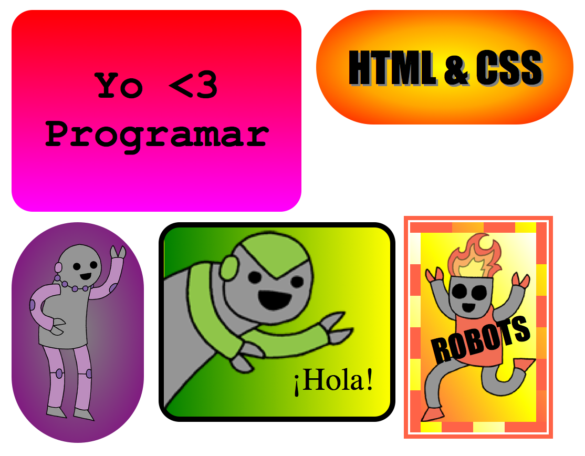
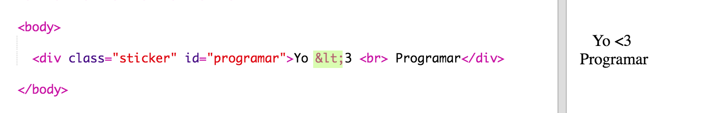
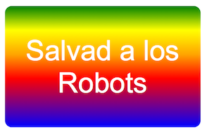

# Einführung {.intro}

In diesem Projekt wirst du viele tolle Aufkleber kreieren, die du benutzen kannst, um deine Webseiten damit zu dekorieren. Du wirst über die Nutzung von Gradienten lernen, bei denen die Farbschattierung nach und nach von einer Farbe zur Anderen hinübergleitet, damit deine Aufkleber dann so richtig cool aussehen. 

# Schritt 1: Farbig kodierte Aufkleber {.activity}

Ein Gradient ist eine graduelle Veränderung von einer Farbe zur Nächsten. Gradienten können benutzt werden, um coole Effekte zu erzeugen Du wirst die Gradienten benutzen, um Aufkleber herzustellen, die du dann auf deinen Webseiten benutzen kannst. 

+ Dieses Trinket öffnen: <a href="http://jumpto.cc/web-stickers" target="_blank">jumpto.cc/web-stickers</a>. 

	Das Projekt sollte so aussehen:

	

+ Lass uns einen 'I <3 Coding' Aufkleber anfertigen. 

	Benutze ein `
` mit einer `sticker` (Aufkleber) Klasse und einer `coding` ID, damit du ihn stylen kannst: 

	

+ Hmm, hast du gemerkt dass dir ein Fehler unterlaufen ist? Das liegt daran, dass  '<' ein besonderes Zeichen in HTML ist. Anstatt '<' zu benutzen, musst du den speziellen Code `&lt;` benutzen. 

	Akutalisiere deinen Code, um `&lt;` zu benutzen, damit die Fehlermeldung verschwindet. 

	

	` ` gibt dir eine neue Zeile. 

+ Lass uns jetzt deinen Aufkleber noch interessanter gestalten. 

	Schalte zur `style.css` Datei hinüber. Du wirst sehen, dass dir die `.sticker` (Aufkleber) Klasse hier schon bereit gestellt wurde. Dies wird das Layout der Aufkleber auf der Seite für dich herstellen sowie den Inhalt automatisch in die Mitte setzen. 

	Denk daran, dass du das ID `coding` zu deinem Aufkleber hinzugefügt hast. Füge unten beim `style.css` den folgenden Code hinzu, um den Text zu stylen:

	

+ Jetzt kannst du einen Gradienten für den Hintergrund des Aufklebers hinzufügen. Ein linearer Gradient ändert sich von einer Farbe zur Nächsten entlang einer geraden Linie.

	Dieser Gradient wird sich von Rot oben zu Magenta unten ändern. Füge den Gradienten-Code zu deinem `coding` Stil hinzu:

	

+ Du kannst das Ergebnis durch Füllung und abgerundete Ecken verbessern. 

	Füge den markierten Code hinzu:

	

	Der `padding` (Füllung) Stil fügt eine Füllung von 50px oben und unten sowie 30px links und rechts hinzu. 

## Projekt speichern {.save}

# Schritt 2: HTML und CSS Aufkleber {.activity}

Gradienten können auch die Farbe von der Mitte nach außen hin gehend ändern, dies nennt sich radialer Gradient.  

+ Lass uns einen Aufkleber erstellen mit dem Text `HTML & CSS.` Das  `&` Zeichen ist ein weiteres Zeichen, welches in HTML kodiert werden muss. Der Code ist `&amp;`.

	Füge den markierten Code hinzu, um einen neuen Aufkleber herzustellen: 

	

+ Schalte jetzt zur `style.css` Datei und füge einen Stil für deinen neuen Aufkleber hinzu:

	

	Der `text-shadow` (Textschatten) Code fügt einen Schatten hinzu,  der auf 2px nach unten und nach rechts vom Text verlängert wird, damit dieser noch mehr betont wird. 

+ Jetzt kommen wir zum Gradienten. Diesmal wollen wir einen radialen Gradienten benutzen. Die Farbe wird sich von Gelb in der Mitte über Orange bis hin zu Rot ändern. 

	

	Siehst du, dass die Gradienten mehrere Farben (und nicht bloß zwei) beinhalten können? 

+ Der Aufkleber wird viel besser mit etwas Füllung und einem abgerundeten Rahmen aussehen. 

	Füge den markierten Code hinzu:

	

## Projekt speichern {.save}

##Aufgabe: Erstelle deinen eigenen Gradienten-Aufkleber {.challenge}

Stelle jetzt deinen eigenen Gradienten-Aufkleber her. Probiere mal die linearen und radialen Gradienten mit Hilfe der HTML Farben aus. 

Du musst:

+ Füge ein `
` zu deinem Aufklebertext `index.html` (Inhaltsverzeichnis) hinzu und gib ihm die `sticker` (Aufkleber) Klasse und eine neue `id` (ID).
+ Füge den Stil für die `id` (ID), die du in `style.css` gewählt hast, hinzu. Du könntest einen der Aufkleberstile, den du bereits erstellt hast, kopieren und diesen dann bearbeiten. 

Es gibt eine Liste mit all den Farbnamen unter denen du wählen kannst: [jumpto.cc/web-colours](http://jumpto.cc/web-colours), dies enthält Namen wie `tomato` (Tomate), `firebrick` (Feuerziegel) und `peachpuff` (Pfirsichhauch).

Wenn du die Textfarbe ändern möchtest, kannst du `color:` (Farbe) benutzen.

Hier ist ein Beispiel, was du mit mehreren Farbein in einem linearen Gradienten erreichen kannst:

## Projekt speichern {.save}

# Schritt 3: Ausgefallener Roboter-Aufkleber  {.activity}

Du kannst einen Gradienten-Aufkleber mit einem Bild herstellen. Wenn du ein Bild mit einem transparenten Hintergrund benutzt, dann wird der Gradient diesen durchdringen. 

Du kannst auch Gradienten erstellen, die in verschiedene Richtungen fließen. 

+ Füge einen Aufkleber zu `index.html` (Inhaltsverzeichnis) mit HIlfe des `firerobot.png` (Feuer-Roboter) Bildes:

	

	Du kannst die `height` (Höhe) einstellen, um die Bildgröße zu verändern, die Breite wird sich automatisch ändern. 

+ Normalerweise läuft ein linearer Gradient von oben nach unten, aber du kannst `to` (nach) benutzen, um die Richtung zu ändern. Zum Beispiel: `to top` (nach oben), `to left` (nach links) oder `to right` (nach rechts).

	Für einen diagonalen Gradienten musst du zwei Richtungen angeben. Dieses Beispiel hier benutzt `to bottom left` (nach unten links).

	Füge diesen Stil zum `style.css` hinzu, um deinem neuen Roboteraufkleber einen diagonalen Gradienten und einen witzigen Rahmen zu verleihen:

	

	Bitte beachte, dass du `outline` (Kontur) benutzen kannst, um einen weiteren Rahmen rund um den normalen Rahmen zu erstellen. 
	`outline-offset` (Kontur Versatz) liefert den Freiraum zwischen dem Rahmen und der Kontur. 

+ Lass uns jetzt den Text für diesen Aufkleber hinzufügen. 

	Füge ein `` ein, das den Text „ROBOTER“ enthält, zum `index.html` (Inhaltsverzeichnis) hinzu und gib ihm eine ID. 

	

+ Der Text wird besser aussehen, wenn du ihn größer machst und entsprechend positionierst. 

	Um den Text zu positionieren, musst du `position: relative;` (Position: relativ) zu deinem `#greensticker` (grünen Aufkleber) und auch `position: absolute` (Position: absolut) zu `#greentext` (grüner ‚Text) hinzufügen. Die Positionierung wird im Detail im `Build a Robot` (Baue einen Roboter) Projekt erläutert. 

	Füge den folgenden Code zu `style.css`:

	

+ Und als letzten Schliff können wir den Text mit Hilfe von `transform: rotate` (transformieren: drehen) drehen.

	

	Probiere mal die Gradanzahl, in welcher der Text gedreht wird, zu ändern. 

## Projekt speichern {.save}

##Aufgabe: Noch mehr Aufkleber erstellen {.challenge}

Lass uns jetzt noch mehr Aufkleber mit Hilfe von verschiedenen Gradienten-Richtungen erstellen und Bilder sowie Text hinzufügen und dann auch Rahmen und Konturen benutzen. 

Tipp: Du musst für jeden Aufkleber HTML und CSS hinzufügen. 

Du kannst eins unserer Beispiele kopieren und bearbeiten und Änderungen an dem neuen Aufkleber vornehmen. 

Dein Projekt beinhaltet bereits ein Set an Roboterbildern. Klicke auf das Bilder-Symbol, um die verfügbaren Bilder sehen zu können. 

Dieses Beispiel benutzt einen linearen Gradienten mit `to right` (nach rechts):

## Projekt speichern {.save}
