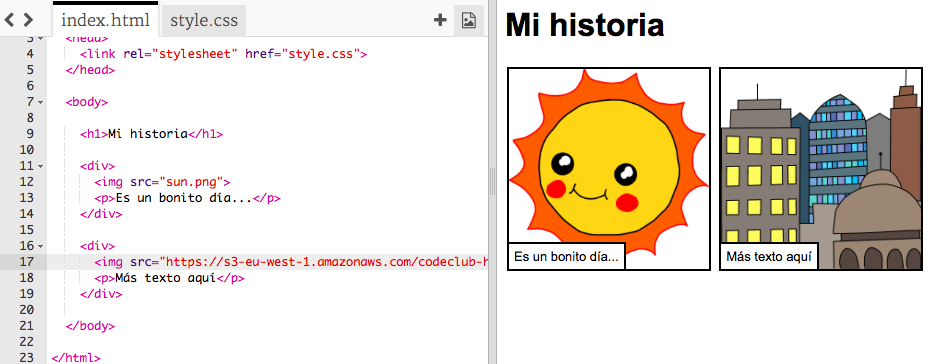

# Einführung { .intro}

In diesem Projekt lernst du, wie du deine eigene Webseite erstellst, um eine Geschichte, einen Witz oder ein Gedicht zu erzählen.


# Schritt 1: Denk dir eine Geschichte aus { .activity}

Bevor du mit dem Programmieren beginnst, musst du dir eine Geschichte ausdenken, bzw. auswählen, welche du erzählen willst.

## Aufgaben-Checkliste { .check}

+ Denke ein wenig über die Geschichte nach. Es könnte:
	+ eine berühmte Geschichte sein;
	+ eine Geschichte sein, die du erfunden hast;
	+ etwas sein, das entweder dir oder einem Freund/einer Freundin passiert ist.

	Es muss nicht unbedingt eine Geschichte sein. Es könnte auch ein Witz oder ein Gedicht sein oder etwas ganz anderes, das du erzählen willst!

# Schritt 2: Die Geschichte bearbeiten { .activity}

Lass uns damit beginnen, den HTML Inhalt und CSS Stil der Geschichten-Webseite zu bearbeiten.

## Aufgaben-Checkliste { .check}

+ Dieses Trinket öffnen: <a href="http://jumpto.cc/web-story" target="_blank">jumpto.cc/web-story</a>. 

	Das Projekt sollte so aussehen:
	
	

+ Du wirst dich vielleicht noch an das 'Happy Birthday' Projekt erinnern: Der Webseiteninhalt kommt in den `<body>` (Body, bzw. Hauptteil) des HTML Dokuments.

	Gehe zu Zeile 7 des Codes und du solltest den Webseiteninhalt, der sich in den `<body>` und den `</body>` Tags befindet, sehen können.

	

+ Kannst du unterscheiden, welche Tags benutzt werden, um die verschiedenen Komponente der Webseite zu erstellen?

	

	+ `<h1>` ist eine __Überschrift__. Du kannst die Zahlen von 1 bis 6 benutzen, um Überschriften in unterschiedlichen Größen zu erstellen;
	+ `<div>` ist eine Abkürzung für __Division__ (bzw. Teilung) und ist eine Methode, um Dinge zusammen zu gruppieren. Bei dieser Webseite wirst du es benutzen, um alle Dinge für jeden Aspekt deiner Geschichte zusammen zu gruppieren;
	+ `` ist ein __Bild__ (bzw. „Image“);
	+ `<p>` ist ein __Absatz__ (bzw. „Paragraph“) von Text.

##Aufgabe: Nimm ein paar Veränderungen vor {.challenge}
Bearbeite den HTML und den CSS Code, um deine Webseite speziell und eigen anzufertigen.


Du kannst die Farben ändern, die auf der Webseite benutzt werden, und du kannst auch folgende Schriftgrößen benutzen <span style="font-family: Arial;">Arial</span>, <span style="font-family: Comic Sans MS;">Comic Sans MS</span>, <span style="font-family: Impact;">Impact</span> and <span style="font-family: Tahoma;">Tahoma</span>.

Du findest weitere CSS Farbnamen unter <a href="http://jumpto.cc/colours" target="_blank">jumpto.cc/colours</a>.

Falls du weitere Hilfestellung benötigst, kannst du dich auf das 'Happy Birthday' Projekt beziehen.

## Projekt speichern {.save}

# Schritt 3: Eine Geschichte erzählen { .activity}

Lass uns einen zweiten Teil zu deiner Geschichte hinzufügen.

## Aufgaben-Checkliste { .check}

+ Gehe zu Zeile 15 des Codes und füge ein weiteres Set von `<div>` und `</div>` Start- und End-Tags hinzu. Dies erstellt ein neues Kästchen für den nächsten Teil deiner Geschichte.

	

+ Füge einen Textabsatz innerhalb deines neuen `<div>` Tags hinzu.

	```
	<p>Noch mehr Text hier!</p>
	```

	

+ Zum Schluss kannst du ein Bild zu deinem neuen Kästchen hinzufügen, indem du diesen Code innerhalb deines `<div>` Tags hinzufügst:

	```
	
	```

	

	Beachte bitte, dass die `` Tags etwas anders als die anderen Tags sind, weil sie keinen End-Tag besitzen.

+ Bei HTML Bildern musst du die __Quelle__ des Bildes innerhalb der Anführungszeichen hinzufügen. 

	Klicke auf das Bildsymbol, um zu sehen, welche Bilder dir für deine Geschichte zur Verfügung stehen.

	

+ Finde den Namen eines Bildes, das du hinzufügen möchtest, z. B. `buildings.png` (Gebäude). Du kannst dann auf `index.html` klicken, um wieder zurück zu deinem Code zu gelangen.

	

+ Du kannst dann den Namen des Bildes zwischen den Anführungszeichen in deinem `` Tag hinzufügen.

	```
	
	```

	

# Schritt 4: Finde deine eigenen Bilder { .activity}

Lass uns ein Bild aus dem Internet finden, um es zu deiner Geschichte hinzuzufügen.

## Aufgaben-Checkliste { .check}

+ Gehe zu <a href="http://jumpto.cc/html-images" target="_blank">jumpto.cc/html-images</a> und finde ein Bild, das du mit in deine Geschichte einbeziehen möchtest.

+ Klicke mit der rechten Maustaste auf das Bild und klicke auf 'Copy image URL' (Bild URL kopieren). Das __URL__ ist die Bildadresse.

	

+ Füge das URL zwischen den Anführungszeichen in deinem `` Tag ein. Du solltest jetzt sehen können, wie dein Bild erscheint!

	

## Projekt speichern {.save}

# Schritt 5: Bilder hochladen { .activity}

__Wenn du ein Trinket Konto hast__, kannst du auch deine eigenen Bilder zur Webseite hochladen!

## Aufgaben-Checkliste { .check}

+ Klicke auf das Bildsymbol oberhalb deines Trinkets und klicke dann auf 'Add Image' (Bild hinzufügen).

	

+ Finde dein Bild auf deinem Computer und ziehe es mit der Maus in dein Trinket.

	

+ Du brauchst dann nur noch den Namen deines neuen Bildes zwischen die Anführungszeichen in deinem `` Tag einzufügen, so wie hier dargestellt:

	```
	
	```

## Projekt speichern {.save}

##Aufgabe: Mach weiter so! {.challenge}
Benutze das, was du in diesem Projekt gelernt hast, um deine Geschichte zu Ende zu erzählen! Hier ist ein Beispiel:


## Projekt speichern {.save}
