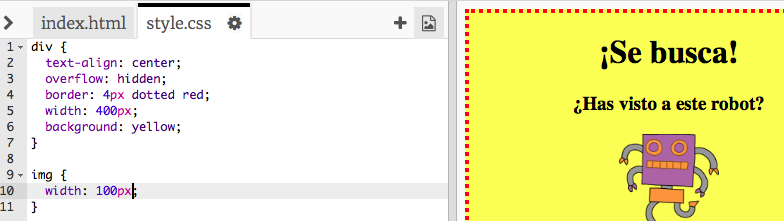
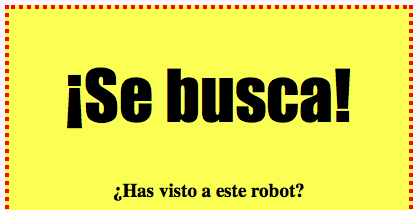

# Einführung { .intro}

In diesem Projekt lernst du, wie du dein eigenes Poster anfertigen kannst.


# Schritt 1: Poster Gestaltung { .activity}

Lass uns damit beginnen, den CSS Code für das Poster zu bearbeiten.

## Aufgaben-Checkliste { .check}

+ Dieses Trinket öffnen: <a href="http://jumpto.cc/web-wanted" target="_blank">jumpto.cc/web-wanted</a>. 

	Das Projekt sollte so aussehen:
	
	

+ Klicke auf den "style.css" (Stil) Reiter. Du wirst sehen, dass es bereits CSS Eigenschaften für `div` gibt, welche die verschiedenen Teile des Posters enthalten.

	```
	div {
		Textausrichtung: Mitte;
	    Überhang: versteckt;
	    Rand: 2px durchgehend schwarz; 
	    Breite: 300px;
    }	
	```

+ Lass uns damit beginnen, die `text-align` (Textausrichtung) Eigenschaften zu verändern:

	```
	Textausrichtung: Mitte;
	```
	
	Was passiert, wenn du das Wort `center` (Mitte) zu `left` (links) oder `right` (rechts) änderst?

+ Wie sieht es mit der `border` (Rand) Eigenschaft aus?

	```
	Rand: 2px durchgehend schwarz;
	```

	`2px` in dem o.g. Code bedeutet: 2 Pixel. Was passiert, wenn du `2px solid black` (2px durchgehend schwarz) zu `4px dotted red` (4px rot gepunktet) änderst?

+ Ändere die `width` Posterbreite zu `400px`. Was geschieht dann mit dem Poster?

+ Lass uns jetzt CSS hinzufügen, um die Hintergrundfarbe des Posters zu gestalten. Gehe zum Ende der Zeile 5 deines Codes und drücke die Eingabetaste, damit du eine neue, leere Zeile erhältst.

	

	Tippe den folgenden Code in deine neue, leere Zeile ein:

	```
	Hintergrund: gelb;
	```

	Achte darauf, dass du den Code _exakt_ so eintippst, wie er oben geschrieben ist. Du solltest jetzt bemerken können, dass der Hintergrund für `<div>` nun gelb ist.

	

##Aufgabe: Verbessere dein Poster {.challenge}
Füge die folgenden CSS Eigenschaften zu deinem `div` Stil hinzu:

```
Rand Radius: 40px;
```

Was bewirkt diese Eigenschaft? Was geschieht, wenn du die Zahl in dem o.g. Code abänderst?

## Projekt speichern {.save}

# Schritt 2: Bilder gestalten { .activity}

Lass uns den Stil des Posterbilds verbessern.

## Aufgaben-Checkliste { .check}

+ Derzeit gibt es keine CSS Eigenschaften für dein `` Tag, lass uns also noch mehr hinzufügen!

	Als erstes, füge den folgenden Code unterhalb des CSS für dein div:

	```
	img {

	}
	```

	

+ Wir können jetzt die CSS Eigenschaften für Bilder zwischen `{` and `}` geschweiften Klammern setzen.

	Zum Beispiel: Füge disen Code zwischen die geschweiften Klammern ein, um die Bildbreite einzustellen:

	```
	Breite: 100px;
	```

	Du wirst sehen, dass sich die Bildgröße verändern wird, sodass die Bildbreite jetzt 100 Pixel beträgt.

	

+ Du kannst auch mit Hilfe dieses Codes einen Rand rund um das Bild machen:

	```
	Rand: 1px durchgehend schwarz;
	```

+ Hast du bemerkt, dass nicht viel Platz zwischen dem Bild und dem Rand besteht?

	

	Du kannst dies beheben, indem du etwas Füllung rund um das Bild einfügst:

	```
	Füllung: 10px;
	```

	Die Füllung ist der Raum zwischen dem Inhalt (in diesm Fall ein Bild) und dessen Rand.

	

	Was meinst du wird passieren, wenn du die Füllung zu `50px` ändern würdest?

##Aufgabe: Verbessere dein Bild {.challenge}
Kannst du eine Hintergrundfarbe zu deinem Bild hinzufügen? Oder einen abgerundeten Rand?

Du findest weitere CSS Farbnamen unter <a href="http://jumpto.cc/colours" target="_blank">jumpto.cc/colours</a>.

## Projekt speichern {.save}

# Schritt 3: Überschriftsstile { .activity .new-page }

Lass uns den Stil der `<h1>` Überschrift verbessern.

## Aufgaben-Checkliste { .check}

+ Füge den folgenden Code unter dem CSS deines Bildes hinzu:

	```
	h1 {

	}
	```

	Hier ist der Platz, an dem du alle CSS Eigenschaften für deine Hauptüberschrift `<h1>` einfügst.

+ Um die Schriftart deiner `<h1>` Hauptüberschrift zu ändern, kannst du den folgenden Code zwischen die geschweiften Klammern setzen:

	```
	Schriftart: Impact;
	```

+ Du kannst auch die Schriftgröße der Überschrift ändern:

	```
	Schriftgröße: 50pt;
	```

+ 	Hast du bemerkt, dass es einen großen Freiraum zwischen der `<h1>` Überschrift und den Dingen rund herum gibt?

	

	Das liegt daran, dass es eine Grenze rund um die Überschrift gibt. Eine Grenze ist der Platz zwischen einem Element (in diesem Fall die Überschrift) und den anderen Dingen drum herum.

	Du kannst die Grenze mit Hilfe dieses Codes kleiner machen:

	```
	Grenze: 10px;
	```

	

+ Du kannst deine Überschrift auch unterstreichen:

	```
	Textdekoration: unterstreichen;
	```

##Aufgabe: Lass dein Poster einfach irre aussehen! {.challenge}
Füge weiteren CSS Code hinzu, um deine `<h3>` Überschriften und Textabschnitte zu gestalten. 


Hier ist eine Liste der CSS Eigenschaften, die du benutzen kannst:

```
Farbe: schwarz;
Hintergrund: weiß;
Schriftart: Arial / Comic Sans MS / Courier / Impact / Tahoma;
Schriftgröße: 12pt;
Schriftdichte: Fett;
Textdekoration: unterstrichen überstrichen durchgestrichen;
Grenze: 10px;
Füllung: 10px;
Breite: 100px;
Höhe: 100px;
```

## Projekt speichern {.save}

##Aufgabe: Werbung für ein Event! {.challenge}
Kannst du ein Poster für ein Event an deiner Schule anfertigen? Es könnte z. B. ein Theaterstück oder eine Sportveranstaltung sein oder gar ein Poster, das Werbung für deinen Code Club macht!

## Projekt speichern {.save}
