---
title: Happy Birthday
level: HTML & CSS 1
language: en-GB
embeds: "*.png"
materials: ["Club Leader Resources/birthday-finished/*.*", "Project Resources/birthday/*.*", "Project Resources/intro/*.*", "Project Resources/template/*.*"]
stylesheet: web
...

# Introduction { .intro}

In this project, you'll be introduced to HTML & CSS by learning how to make your own customised birthday card.

<div class="trinket">
  <iframe src="https://trinket.io/embed/html/e996dc0380?outputOnly=true&start=result" width="600" height="450" frameborder="0" marginwidth="0" marginheight="0" allowfullscreen>
  </iframe>
  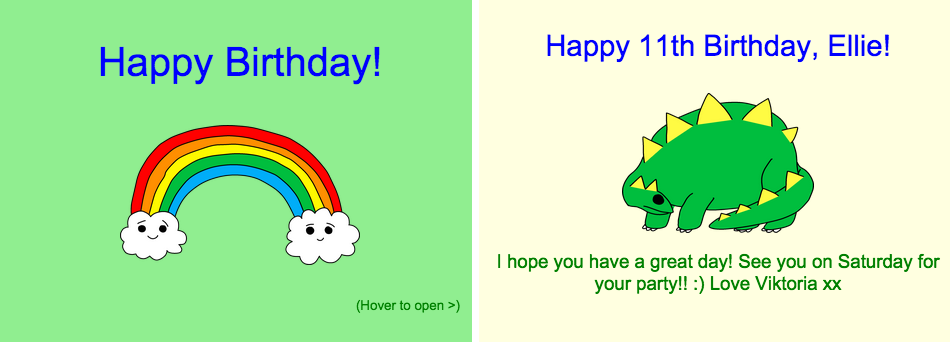
</div>

# Step 1: What is HTML? { .activity}

HTML stands for __HyperText Markup Language__, and is the language used to make webpages. Let's have a look at an example!

## Activity Checklist { .check}

+ You'll be using a website called Trinket to write HTML. Open this Trinket: <a href="http://jumpto.cc/web-intro" target="_blank">jumpto.cc/web-intro</a>. If you're reading this online, you can also use the embedded version of this Trinket below.

<div class="trinket">
	<iframe src="https://trinket.io/embed/html/850a678202" width="100%" height="400" frameborder="0" marginwidth="0" marginheight="0" allowfullscreen>
	</iframe>
</div>

+ The code that you can see on the left of the Trinket is HTML. On the right of the Trinket you can see the webpage that the HTML code has made.

	HTML uses __tags__ to build webpages. Can you see this HTML at line 8 of your code?

	```
	<p>Hi. My name is Andy.</p>
	```

	`<p>` is an example of a tag, and is short for __paragraph__. You can start a paragraph with `<p>` and end a paragraph with `</p>`.

+ Can you spot any other tags? One other tag you might have spotted on line 9 is `<b>`, which stands for __bold__:

	```
	<b>running</b>
	```

	Here are some more:

	+ `<html>` and `</html>` mark the start and end of the HTML document;
	+ `<head>` and `</head>` is where stuff like CSS goes (we'll get to that later!);
	+ `<body>` and `</body>` is where your website content goes.

	

+ Make a change to one of the paragraphs of text in the HTML (on the left). Click 'Run' and you should see your webpage change (on the right)!

	

+ If you have made a mistake and want to undo your changes, you can click the menu button and then click 'Reset'. Try it!

	

## Save Your Project {.save}

__You don't need a Trinket account to save your projects!__ 

If you don't have a Trinket account, click the down arrow and then click 'Link'. This will give you a link that you can save and come back to later. You'll need to do this every time you make changes, as the link will change!

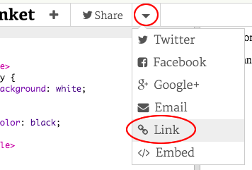

If you have a Trinket account, the easiest way to save your webpage is to click the 'Remix' button on the top of the Trinket. This will save a copy of the Trinket on your profile.

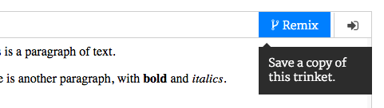

##Challenge: Add another paragraph {.challenge}
Can you add a 3rd paragraph of text to your webpage, below the other 2? Remember that your new paragraph should start with a `<p>` tag, and end with `</p>`.

Here's how your webpage should look:


Can you add __bold__ and <u>underlined</u> text to your new paragraph? You should use `<u>` and `</u>` for underlined text.

## Save Your Project {.save}

# Step 2: What is CSS? { .activity}

CSS stands for __Cascading Style Sheets__, and is the language used to style webpages and make them look nice. You can link your webpage to a CSS file in the `<head>` of an HTML document like this:


## Activity Checklist { .check}

+ CSS lists all of the __properties__ for a particular tag. Click the 'style.css' tab to see the CSS for your webpage.

	

+ Find this code:

	```
	p {
		color: black;
	}
	```

	This CSS code has one property for paragraphs, which is that the text colour should be black.

+ Change the word 'black' in the CSS to 'blue'. You should see the text colour of all paragraphs change to blue.

	

## Save Your Project {.save}

##Challenge: Add more style {.challenge}
Can you make the paragraphs of text orange? Or the background grey?

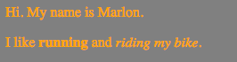

## Save Your Project {.save}

# Step 3: Making a birthday card { .activity}

Let's use what you've learnt about HTML and CSS to make your own custom birthday card.

## Activity Checklist { .check}

+ Open this Trinket: <a href="http://jumpto.cc/web-card" target="_blank">jumpto.cc/web-card</a>, or use the embedded version below if you're reading this online.

<div class="trinket">
	<iframe src="https://trinket.io/embed/html/90506676c9" width="100%" height="400" frameborder="0" marginwidth="0" marginheight="0" allowfullscreen>
	</iframe>
</div>

Don't worry if you don't understand all of the code. This birthday card looks pretty boring, so you're going to make some changes to this HTML and CSS.

+ Click the button on the front of the card, and you should see it open to reveal the inside.

	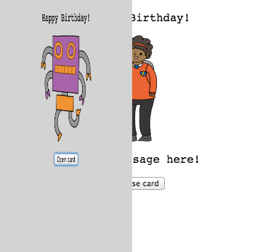

+ Go to line 13 of the code. Just like in the earlier example, you can edit any of the text in the HTML to customise the card.

	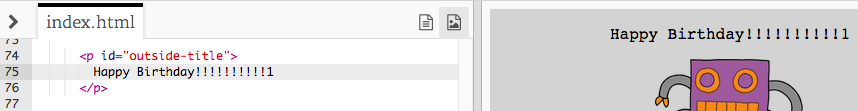

+ Can you find the HTML for the robot image? (Hint: it's on line 16!) Change the word `robot` to `sun`, and you'll see the image change!

	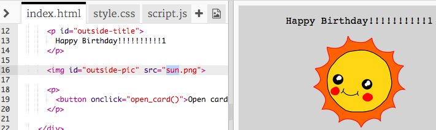

	You can use any of the words `boy`, `diamond`, `dinosaur`, `flowers`, `girl`, `rainbow`, `robot`, `spaceship`, `sun`, `tea`, or `trophy`.

+ You can also edit the CSS of the birthday card. Click on the tab for “style.css”. It begins with all of the CSS for the `outside` of the card. Change the `background-color` to `lightgreen`.

	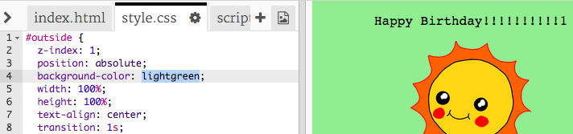

+ You can also change the size of an image. Go to line 29 of the CSS, and change the `width` and `height` of the outside image to `200px` (`px` stands for pixels).

	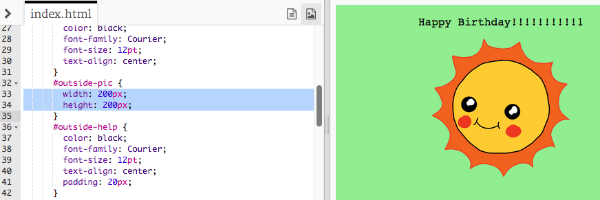	

+ The font can be changed too. Go to line 24 and change the `font-family` to `Comic Sans MS` and the `font-size` to `16pt`.

	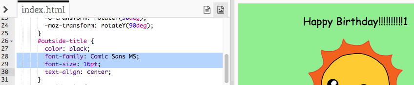

	You can use other fonts like <span style="font-family: Arial;">arial</span>, <span style="font-family: impact;">Impact</span> and <span style="font-family: tahoma;">Tahoma</span>. 

## Save Your Project {.save}

##Challenge: Create a personalised card {.challenge}
Use everything you've learnt about HTML and CSS to finish making a personalised card. It doesn't even have to be a birthday card, it could be for any occasion!

Here's an example:


You can find more CSS colour names at <a href="http://jumpto.cc/colours" target="_blank">jumpto.cc/colours</a>

## Save Your Project {.save}

Now that you've finished your card, you can share or email it to someone.

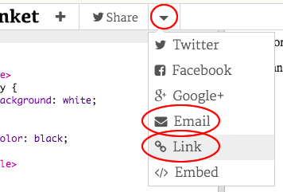
