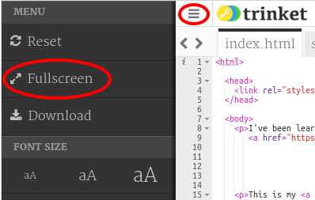
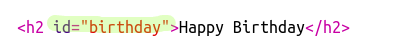
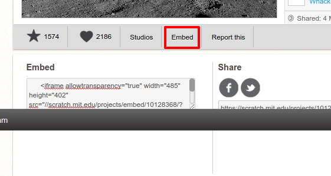

---
title: Project Showcase
level: HTML & CSS 1
language: en-GB
embeds: "*.png"
materials: ["Club Leader Resources/project-showcse-finished/*.*", "Project Resources/project-showcse/*.*", "Project Resources/template/*.*"]
stylesheet: web
...

# Introduction {.activity}

In this project, you will create a showcase of your HTML projects and learn about links and embedding resources. 

# Step 1: Adding Links to Webpages {.activity}

Text links allow you to click on words to go to another web page; they are usually underlined.

## Activity Checklist { .check}

+ Open this trinket: <a href="https://trinket.io/html/9ad31460f0">https://trinket.io/html/9ad31460f0</a>. If you're reading this online then that's a link, you can also use the embedded trinket below. 

  <iframe src="https://trinket.io/embed/html/9ad31460f0" width="100%" height="400" frameborder="0" marginwidth="0" marginheight="0" allowfullscreen>
  </iframe>

+ HTML uses the `<a>` tag for links. 

+ Find the `<a>` tag in your project. 

+ Add the Code Club website address <a href="https://www.codeclub.org.uk">`https://www.codeclub.org.uk`</a> and link text:

+ Click Run to test your trinket.

+ Click on the Code Club link to test your webpage. Your trinket will now show the Code Club webpage: 	

+ To get back to your page you can either: 

	+ Run your trinket again,

	+ Tap the Backspace key on the keyboard, or

	+ Right-click and choose Back. 

## Activity Checklist { .check}

+ Now put your link into a sentence inside a paragraph:

Test your webpage. 

## Challenge: Add another link {.challenge}

Add a sentence with a link to a website that has been helpful for creating web projects. For example: <a href="https://trinket.io">https://trinket.io</a> or <a href="http://colours.neilorangepeel.com">http://colours.neilorangepeel.com</a>.

## Save Your Project {.save}

# Step 2: Link to A Trinket {.activity}

You can link to the web page for a trinket. 

## Activity Checklist { .check}

+ Did you keep a link to your Happy Birthday trinket? If you did then open that trinket in another browser tab or window. Otherwise open the finished example trinket: <a href="https://trinket.io/html/e996dc0380">https://trinket.io/html/e996dc0380</a>

+ Click on the Share menu above your trinket and choose Link:

If you opened the trinket from your account then look for the Share option below your trinket instead:

+ Choose 'Only show code or result (let users toggle between them)' and copy the link to the trinket. 

+ Go back to your Project Showcase trinket and add an `<h2>` heading and a link to your Happy Birthday Project.

Test your webpage; it should look something like this:

Click the Happy Birthday link to test that it takes you to the trinket.

## Save Your Project {.save}

## Challenge: Create a List of Your Projects {.challenge}

Add some of the other HTML &amp; CSS projects that you have created at Code Club. Use `<h2>` headings to organise your webpage.

If you don't have links to the projects you created then you can use the Code Club examples:

+ Happy Birthday: <a href="https://trinket.io/html/e996dc0380">https://trinket.io/html/e996dc0380</a>

+ Tell a Story: <a href="https://trinket.io/html/c8afdef912">https://trinket.io/html/c8afdef912</a>

+ Wanted: <a href="https://trinket.io/html/ebeb56398a">https://trinket.io/html/ebeb56398a</a>

+ Recipe: <a href="https://trinket.io/html/c0fd9b40cd">https://trinket.io/html/c0fd9b40cd</a>

+ Mystery Letter: <a href="https://trinket.io/html/1d4d4c5ce1">https://trinket.io/html/1d4d4c5ce1</a>

Your finished page should look something like this:

## Save Your Project {.save}

# Step 3: Embedding Projects {.activity}

As well as linking to trinkets as webpages we can also embed them in a web page.

## Activity Checklist { .check}

+ You might want to try working in Fullscreen mode so you have more space:

Press Esc to exit Fullscreen mode.

+ Run your trinket and click on the Happy Birthday link. 

+ Click on the trinket menu and select __embed__. If you're not in Fullscreen mode you may have to scroll. Use the scroll bar on the right or the down arrow on the keyboard.

## Activity Checklist { .check}

+ Choose 'Only show code or result (let users toggle between them)' and __copy__ the embed code for the trinket. 

+ Trinket has created some HTML for you to include in your webpage. It uses an `<iframe>` tag which allows content to be embedded within a page. 

+ Now paste that code under the link to the Happy Birthday trinket:

+ Run your trinket to test it and you should see your Happy Birthday project embedded in the webpage. 

+ You may find that the bottom of your trinket isn't displayed. You can fix that by changing the height value on the `<iframe>`. 

Set the height to __400__. If you made changes to the Happy Birthday project you might need to choose a different value. 

## Save Your Project {.save}

## Challenge: Embed More Projects {.challenge}

Embed more of your projects into the Showcase. Remember that you can easily find their trinket pages by clicking on the links on your webpage. 

# Step 4: Create a Table of Contents {.activity}

Let's add a Table of Contents so we can easily get to each project. 

## Activity Checklist { .check}

+ As well as being able to link to other webpages, we can link to parts of a webpage if we give them an id. 

Add an id to the `<h2>` heading for the Happy Birthday project:

+ Add ids to each of your projects and give them short names: story, wanted, recipe and letter. 

+ You can link to an element with an id by putting a hash ‘#’ symbol in front of its name. For example, `#birthday`. 

Create an ordered list of links to your projects. (Ordered lists are introduced in the Recipe project.)

+ Run your project and test it by clicking on the links to move to your projects. 

## Save Your Project {.save}

# Step 5: Getting Back to the Top {.activity}

## Activity Checklist { .check}

+ It's also useful to be able to navigate back to the top of the page. HTML has `#top` for this purpose. 

+ Add a link to `#top` after each embedded project in your webpage:

+ Test your links by clicking on Top to get back to the top of the page. 

## Save Your Project {.save}

## Challenge: Improve Your Showcase {.challenge}

Use the CSS you have learnt to make your page more interesting. Try changing the background colour of the page or the font used for the headings.

You can also add some information about each project and what you liked about making it. 

## Challenge: Create a New Showcase {.challenge}

Trinkets aren't the only thing you can embed in a webpage. You can embed videos, widgets (such as a weather widget) or Scratch projects. 

Open the Embed Scratch Example trinket and Run it: <a href="https://trinket.io/html/9f7212b8fe">https://trinket.io/html/9f7212b8fe</a>

Go to the Scratch website and find a project that you like. It can be one of your own or one you've found.

If you are logged in you can click the 'Embed' button below the project to get the HTML embed code. 

If you are not logged in then look for the Scratch project number in its web address. 

Make a copy of the `<iframe>` code in the Scratch Embed example and change the project number to the one for the project you want to embed:

## Save Your Project {.save}
