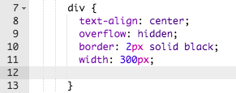
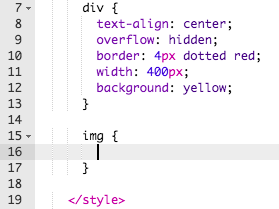
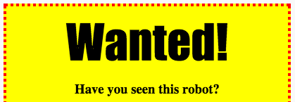

---
title: Wanted!
level: HTML & CSS 1
language: en-GB
embeds: "*.png"
materials: ["Club Leader Resources/*.*","Project Resources/*.*"]
stylesheet: web
...

# Introduction { .intro}

In this project, you'll learn how to make your own poster.


# Step 1: Styling your poster { .activity}

Let's start by editing the CSS code for the poster.

## Activity Checklist { .check}

+ Open this trinket: <a href="http://jumpto.cc/web-wanted" target="_blank">jumpto.cc/web-wanted</a>. If you're reading this online, you can also use the embedded version of this trinket below.

<div class="trinket">
	<iframe src="https://trinket.io/embed/html/58318bee1f" width="100%" height="550" frameborder="0" marginwidth="0" marginheight="0" allowfullscreen>
	</iframe>
</div>

+ If you go to line 7, you'll notice that there are already CSS properties for the `div` containing the different parts of the poster.

	```
	div {
		text-align: center;
	    overflow: hidden;
	    border: 2px solid black;
	    width: 300px;
    }	
	```

+ Let's start by altering the `text-align` property:

	```
	text-align: center;
	```
	
	What happens when you change the word `center` to `left` or `right`?

+ How about the `border` property?

	```
	border: 2px solid black;
	```

	`2px` in the code above means 2 pixels. What happens when you change `2px solid black` to `4px dotted red`?

+ Change the `width` of the poster to `400px`. What happens to the poster?

+ Let's add some CSS to set the background colour of the poster. Go to the end of line 11 of your code and press return, so that you have a new blank line.

	

	Type the following code on your new blank line:

	```
	background: yellow;
	```

	Make sure that you type in the code _exactly_ as it is above. You should notice that the background of the `<div>` is now yellow.

	

##Challenge: Improving your poster {.challenge}
Add the following CSS property to your `div` style:

```
border-radius: 40px;
```

What does this property do? What happens if you change the number in the code above?

## Save Your Project {.save}

# Step 2: Styling images { .activity}

Let's improve the style of the image in the poster.

## Activity Checklist { .check}

+ At the moment, there aren't any CSS properties for your `` tag, so let's add some!

	Firstly, add the following code underneath the CSS for your div:

	```
	img {

	}
	```

	

+ We can now add CSS properties for images between the `{` and `}` curly brackets.

	For example, add this code between the curly brackets to set the width of the image:

	```
	width: 100px;
	```

	You'll see that the size of the image changes, so that it's width is 100 pixels.

	

+ You can also add a border around the image with this code:

	```
	border: 1px solid black;
	```

+ Have you noticed that there's not much space between the image and the border?

	

	You can fix this by adding some padding around the image:

	```
	padding: 10px;
	```

	Padding is the space between the content (in this case an image) and it's border.

	

	What do you think would happen if you changed the padding to `50px`?

##Challenge: Improving your image {.challenge}
Can you give your image a background colour? Or a rounded border?

## Save Your Project {.save}

# Step 3: Styling headings { .activity .new-page }

Let's improve the style of the `<h1>` heading.

## Activity Checklist { .check}

+ Add the following code underneath your image's CSS:

	```
	h1 {

	}
	```

	This is where you'll add CSS properties for your main `<h1>` heading.

+ To change the font of your `<h1>` headings, add the following code between the curly brackets:

	```
	font-family: Impact;
	```

+ You can also change the size of the heading:

	```
	font-size: 50pt;
	```

+ 	Have you noticed that there's a big space between the `<h1>` heading and the stuff around it?

	

	This is because there's a margin around the heading. A margin is the space between the element (in this case a heading) and the other stuff around it.

	You can make the margin smaller with this code:

	```
	margin: 10px;
	```

	

+ You can also underline your heading:

	```
	text-decoration: underline;
	```

##Challenge: Make your poster awesome! {.challenge}
Add more CSS code to style your `<h3>` headings and your paragraphs. 


Here's a list of some CSS properties you can use:

```
color: black;
background: white;
font-family: Arial / Comic Sans MS / Courier / Impact / Tahoma;
font-size: 12pt;
font-weight: bold;
text-decoration: underline overline line-through;
margin: 10px;
padding: 10px;
width: 100px;
height: 100px;
```

## Save Your Project {.save}

##Challenge: Advertise an event! {.challenge}
Can you make a poster for an event happening at your school? It could be a play, a sporting event, or even a poster advertising your Code Club!

## Save Your Project {.save}