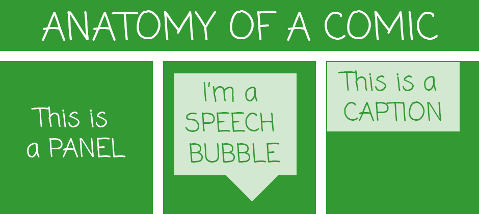
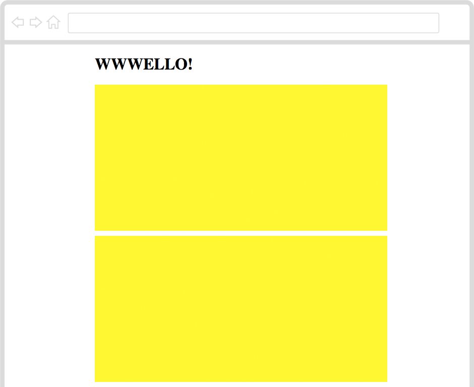
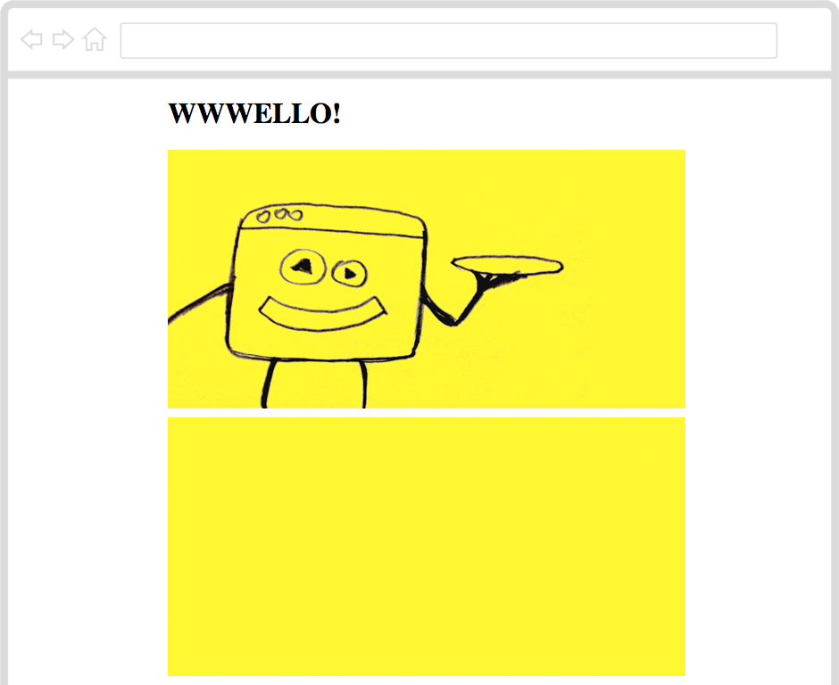
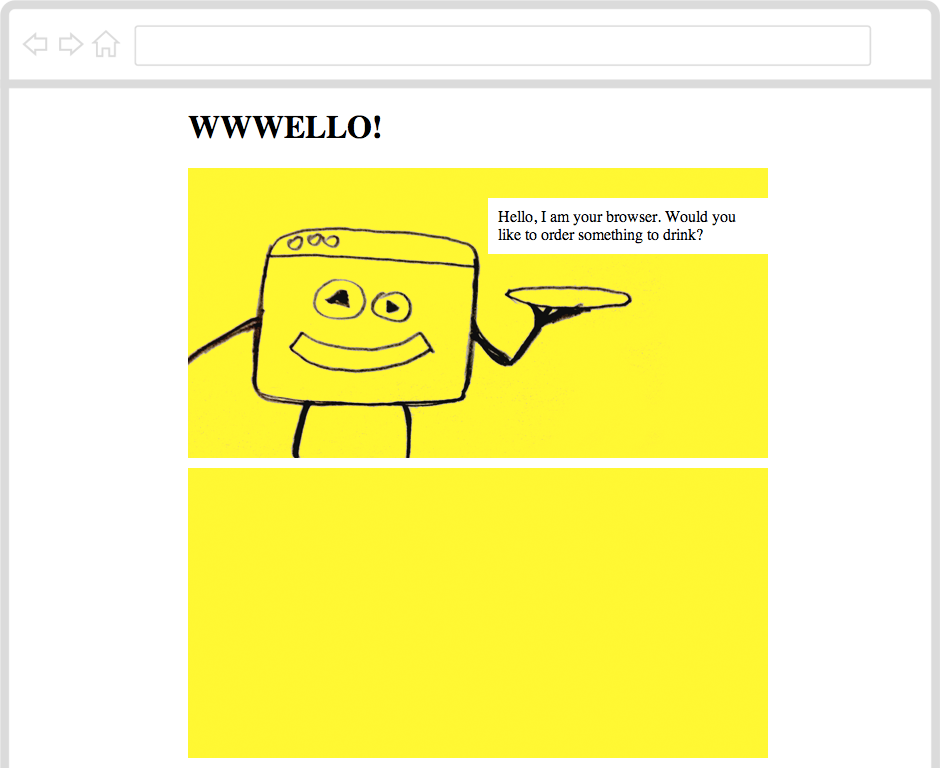
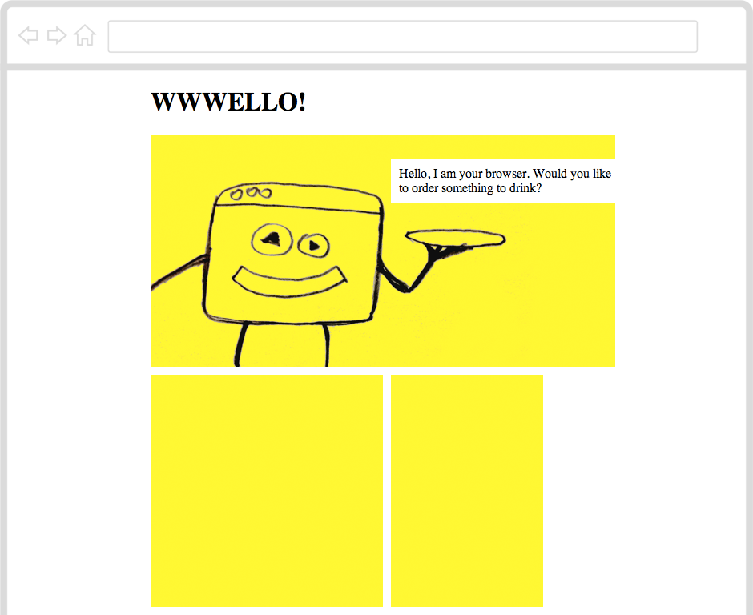
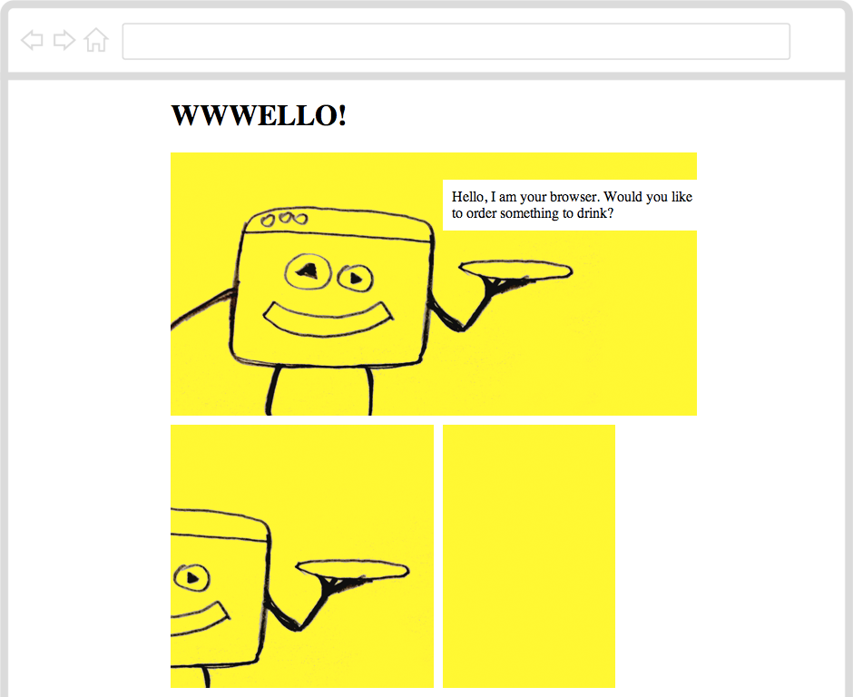
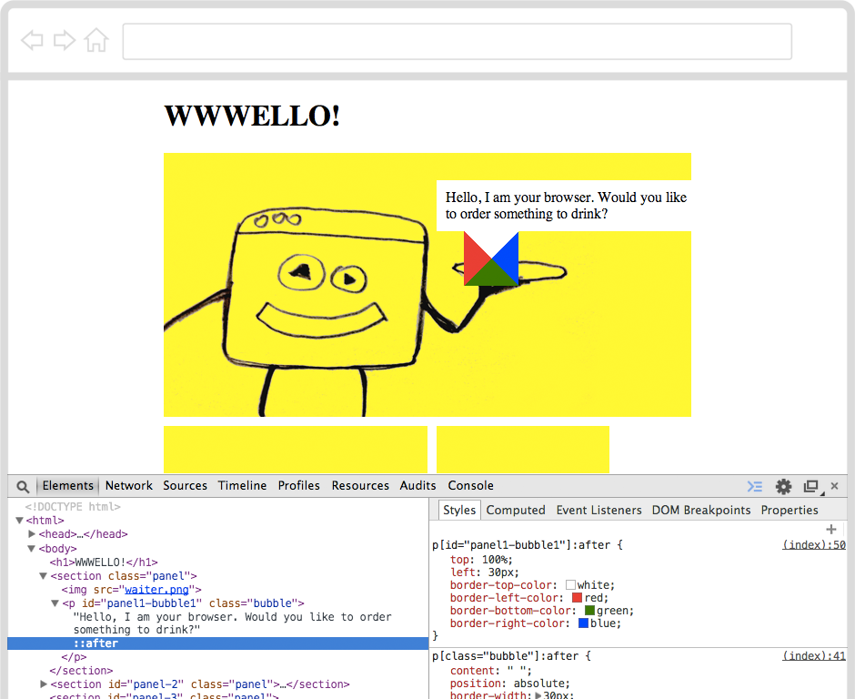

---
title: (BETA) Coding a comic
level: Lesson 10
language: en-GB
embeds: "*.png"
materials: "Resources"
stylesheet: web
author: Matteo Menapace
note: "notes.md"
...

## Heads up! { .beta}

This project is in **Beta**. This means we're still testing it, and there's a small chance there could be some bugs or typos. 

If you're a **club leader** trying out this project, make sure you [complete this short questionnaire](https://docs.google.com/forms/d/1eMCfpYe3v7eYu5M8rSqLKlmq7cczLCLHx66csgyUyVU/viewform) (or email projects@codeclub.org.uk) to let us know how it went! 

# Introduction { .intro}

Do you **like comics**? 

Do you have a **story to tell**?

Can you turn a bunch of images into **your own Web-comic**?

# Step 1: Are you ready? { .activity}

## Activity Checklist { .check}

Here is a list of things to check before you dig into your comic.

* **Open your code editor**. Do you have an app on your computer to write your code? 
	* NO. Talk to your teacher or volunteer about installing a code editor: we recommend [Sublime Text 2](http://www.sublimetext.com/2).
	* YES. Great, move on.
* **Create a new file**. 

* Here is the skeleton of an HTML[^1] document. 
  
**Copy-paste it** into your new file. 
   
   	<!DOCTYPE html>
	<html>
		<head>
			<title>Code Club comic</title>
			
		</head>
		<body>
			<h1>HELLO!</h1>
		</body>
	</html>

     
* **Save your file**. You can save it as whatever you want to call it. Just remember to end your file name with `.html` so that your computer knows it's an HTML file. For instance, you could call your file `comic.html`. Can you think of a less boring name?
* Do you know where your HTML file has gone? 
	* NO. Ok, it's somewhere on your computer. Can you find it?
	* YES. Good, let's move on.
	
* **Open your browser**[^2]. 
* From your browser, **open your HTML file** . Does it say `HELLO!`? 
* Go **back to the code editor**. Can you change the `HELLO!` text to the title of your comic?
* **Save** your HTML file.
* **Back to your browser**, can you refresh[^3] the page where you opened your HTML file?
* Great! Now you've got your **tools ready**: code editor to write your code, browser to *debug*[^4] your code.

# Step 2: How do you **make a panel**? { .activity}

## Activity Checklist { .check}

What makes a comic, a **comic**?

To make a comic you put a bunch of **images and text in sequence** and place them next to each other.

You *frame* each *moment* of your comic into a **panel**. 

To make a sequence you need at least two panels. 

#### Let's start with one panel

    <section class="panel">
    
	</section>	

* Copy-paste this code inside your HTML document. Where? Anywhere between the `<body>` *opening tag* and the `</body>` *closing tag*.

Using the `class` attribute you can *classify* your HTML elements. 

Here we have a particular kind of `<section>` which we called "panel". You could call it whatever you like, for example "comic panel" or "cute cat": **`class` names are entirely up to you**. Since we're making a comic panel, it makes sense to just call it "panel". 

* Save, go to your browser and refresh the page. Do you see a panel? 

No, indeed. That's because your `<section class="panel">` is empty and can't be seen. 

You can use CSS[^5] to make it visible.

    section[class="panel"]
	{
		border-bottom: 10px solid white;
		border-right: 10px solid white;

		background-color: yellow;
		
		height: 300px;
		width: 100%;
	}
	
* Copy-paste this code into your HTML document. Where? Anywhere between the `` *closing tag*.	
	
## Challenge { .try}

* Using your browser's Inspector[^6], can you **work out what those CSS rules do**?

* Now that you have one panel, can you **make another panel** under the first one?

# Step 3: How do you **add images**? { .activity}

## Activity Checklist { .check}

So far, you have the building block of your comic: the *panel*. 

No matter how many `<section>` elements you add to your HTML document, as long as you *classify* them with `class="panel"` your browser will give them all the same "yellow box" style. 
 
`class` names are useful for **shared rules**.

Now, empty panels don't really tell a story, do they? Why not **add images** to get your story off the ground?

HTML calls images `` and wants you to write down exactly where to find an image's *source*, or `src`.

* Copy-paste the `waiter.png` image, from this project's *Resources* folder into the folder where you saved your HTML file.

* Add `` inside one of your panels. That means the image will be *nested* between the `<section class="panel">` *opening tag* and the `</section>` *closing tag*.

* Save, go to your browser and refresh your page. What do you see?

## Challenge { .try}

* Can you make (or find online) images for the first two panels of your comic? 

* Can you **add these images to your comic**?

# Step 4: How do you **make a speech bubble**? { .activity}

## Activity Checklist { .check}

Now that you have images, you can start writing your story.

In comics, you can use ***speech bubbles*** <!--💬--> to make your characters "talk".

A speech bubble is usually a short *paragraph*, which HTML calls `
`.

* Can you **add a `
` element** inside your panel, after the ``?

* Since this is a special kind of paragraph, can you think of an appropriate `class` name for it? 

How about this?

    
Hello, I am your browser. Would you like to order something to drink?

* Save, go to your browser and refresh the page. What do you see? 

Nothing, indeed. That's because your speech bubble appeared under the image.

## Challenge { .try}

* Can you **move your speech bubble on top of the image**?

Using `position: absolute;` you can position texts and images within your panel, no matter where your browser initially puts them.

    p[class="bubble"]
    {
    	background-color: white;
    	padding: 10px;
    	margin: 0;
    	
    	position: absolute;
    }
    
* Copy-paste the code above into your HTML document. Where? Anywhere between the `` *closing tag*.

* Save, go to your browser and refresh the page. Where is your speech bubble now?

You can use these CSS properties to move your speech bubble around:

* `top`
* `left`
* `right`
* `bottom`

For example, you can try with `top: 30px;` and then tweak it.

# Step 5: How do you make **many speech bubbles**? { .activity}

## Activity Checklist { .check}

What if you want another speech bubble? What if you want many speech bubbles, all in **different positions**?

`class` won't cut it this time, you need another HTML attribute. 

Meet `id`.

    
Hello, I am your browser. Would you like to order something to drink?

<!-- this is where highlighting inside the code would be great, so that we can highlight the id="panel1-bubble1" part -->

Unlike `class`, which you can can give to as many HTML elements as you please, there can be **only one** element in your HTML document with a certain `id`. 

An **`id` is unique**, just like you :)

* In your `` *closing tag*.
  
For example, this rule will apply only to the one bubble *identified* as `panel1-bubble1`.     

    p[id="panel1-bubble1"]
    {
    	top: 30px;
    	left: 300px;
    	width: 300px;
    }
   
    
## Challenge { .try}  

Do you know your *classes* from your *ids*?

* Can you **make many more speech bubbles**, give them unique `id` names and position them inside your panels?

You can call them whatever you like: **`id` names are entirely up to you**. 

# Step 6: How do you get **many panels on the same row**? { .activity}

## Activity Checklist { .check}

Your story is coming to life now. How many panels have you got?

You can **use `id` to make panels unique** too!

For example, you may want to change the `width` or `height` of your panels:

 	section[id="panel2"]
    {
    	width: 300px;
    }
    
    section[id="panel3"]
    {
    	width: 200px;
    }
    
* Copy-paste the code above into your HTML document. Where? Anywhere between the `` *closing tag*.

* Can you **give the correct `id` names to two panels** in your HTML document?

## Challenge { .try}

What if you want to have those **two panels in the same row**?

* Can you add `float: left;` inside your `section[class="panel"]` CSS rule?

* Save, go to your browser and refresh the page. What do you see?

# Step 7: What if **images are bigger than panels**? { .activity}

## Activity Checklist { .check}

Now you know how to change the `width` or `height` of your panels.

What if you have an image that is too big for its panel? So big that it *overflows* into other panels?

Well, there's a CSS property for that.

	overflow: hidden;

## Challenge { .try}

* Can you add `overflow: hidden;` inside your `section[class="panel"]` CSS rule? 

* Then, how about using these CSS properties to move your images inside your panels?

* `position`
* `top`
* `left`

## EXTRA How do you **make different voices**? { .activity}

## Activity Checklist { .check}

While you were busy styling panels and images, your browser has taken care of styling texts inside your speech bubbles.

What if you want to change the way your texts look?

You can **use fonts** to "dress" your texts in many ways and express different voices, moods or feelings, for example a whispering voice or a screaming voice. 

Experiment with these CSS properties to make your speech bubbles more expressive:

* font-family
* font-size
* text-transform
* letter-spacing

## Challenge { .try}

Your browser gives you a handful of font families, out of the box. There's more to comics than that!

* Go to [Google Fonts](https://www.google.com/fonts) and **find fonts** that suit your story. That page will tell you how to *choose*, *review* and *use* the fonts you like.

* Can you **add your chosen fonts to your comic**?

## EXTRA How do you **make a speech bubble arrow**? { .activity}

## Activity Checklist { .check}

Have you noticed that your speech bubbles are missing something? 

Yes, that **little arrow pointing at your character**, which makes it clear who's talking. 

    p[class="bubble"]:after
    {
    	content: " ";
		position: absolute;
		
		border-width: 30px;
		border-style: solid;
    }
    
    p[id="panel1-bubble1"]:after 
	{
		top: 100%;
		left: 30px;
			
		border-top-color: white;
		border-left-color: red;
		border-bottom-color: green; 
		border-right-color: blue; 
	} 
	
* Copy-paste the code above into your HTML document. Where? Anywhere between the `` *closing tag*.
	
* Save, go to your browser and refresh the page. What do you see?

A white-red-green-blue "jewel" has appeared *after* your speach bubble.   

* Right-click on your speech bubble, then choose *Inspect Element* to see what is going on.

That "jewel" is, technically speaking, an empty element with a very fat border: `30px`. 

The top border is `white`, just like the rest of your speech bubble. The left border is `red`, the bottom border is `green` and the right border is `blue`.

## Challenge { .try}

* Can you turn the left, right and bottom borders to `transparent`?

That leaves you only with the top white border, which looks like an **arrow pointing down**! 

* Now, can you add arrows to your other speech bubbles? Experiment with `top` and `left` values to move your arrows around, and switch `border-color` values on (`white`) and off (`transparent`) to make your arrows point in the directions you want.

<!-- FOOT NOTES -->

[^1]: **HTML** stands for ***H**yper**T**ext **M**arkup **L**anguage*, which is the language that every website in the World "speaks". To make a website, you teach your computer how to "translate" your ideas into HTML.

[^2]: **What's a browser?** A web browser is a special app that knows how to interpret text files written in HTML. The most popular browsers are Internet Explorer, Google Chrome and Mozilla Firefox. 

[^3]: **How do you refresh a page in the browser?** If you're on a Windows computer, use the keyboard shortcut **CTRL+R** (that is, hold the *CTRL* key down and press the *R* key once). On a Mac, use **⌘+R**.

[^4]: **What's debugging?** Debugging means to find and correct glitches in your code. It takes both patience and speed, just like catching a flying bug. Luckily, debugging HTML code in your browser is easy: right-click anywhere on a page and choose **Inspect Element**. This will pop open your browser's **Inspector**, where you can see every page's *source code*, *styles* and much more. When you hover over the source code with your mouse, the corresponding HTML element on the page will light up. When you click on an HTML tag in the source code (left panel), you'll see all its CSS styles (on the right panel).

[^5]: **CSS** stands for ***C**ascading **S**tyle **S**heets* and it's the language you can use to tell your browser to change colours, sizes and many other *stylistic* aspects of your HTML documents.

[^6]: **What's a browser's Inspector?** In your browser, right-click anywhere on a page and choose **Inspect Element**. This will pop open your browser's **Inspector**, where you can see every page's *source code*, *styles* and much more. When you hover over the source code with your mouse, the corresponding HTML element on the page will light up. When you click on an HTML tag in the source code (left panel), you'll see all its CSS styles (on the right panel). 
