# Introduction { .intro}

Under which cup is the the ball?

Can you **code your own Cups & Balls game**, so that anyone on the Web can enjoy playing it?

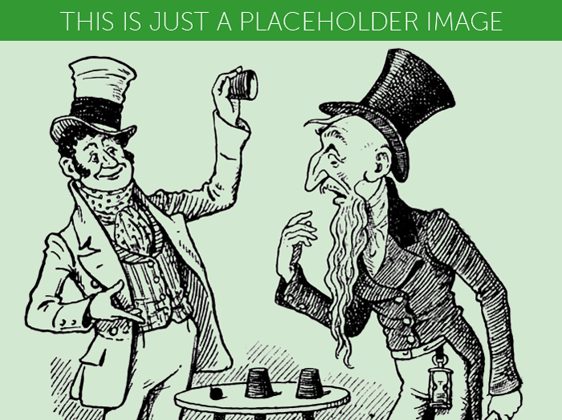

# Step 1: Are you ready? { .activity}

## Activity Checklist { .check}

Here is a list of things to check before you dig into your game.

* **Open your code editor**. Do you have an app on your computer to write your code? 
	* NO. Talk to your teacher or volunteer about installing a code editor: we recommend [Sublime Text 2](http://www.sublimetext.com/2).
	* YES. Great, move on.
* **Create a new file**. 

* Here is the skeleton of an HTML[^1] document. 
  
**Copy-paste it** into your new file. 
   
   	<!DOCTYPE html>
	<html>
		<head>
			<title>Code Club Cups</title>
			
		</head>
		<body>
			<h1>HELLO!</h1>
		</body>
	</html>

     
* **Save your file**. You can save it as whatever you want to call it. Just remember to end your file name with `.html` so that your computer knows it's an HTML file. For instance, you could call your file `cups-balls-game.html`. Can you think of a less boring name?
* Do you know where your HTML file has gone? 
	* NO. Ok, it's somewhere on your computer. Can you find it?
	* YES. Good, let's move on.
	
* **Open your browser**[^2]. 
* From your browser, **open your HTML file** . Does it say `HELLO!`? 
* Go **back to the code editor**. Can you change the `HELLO!` text to the name of your game?
* **Save** your HTML file.
* **Back to your browser**, can you refresh[^3] the page where you opened your HTML file?
* Great! Now you've got your **tools ready**: code editor to write your code, browser to *debug*[^4] your code.

# Step 2: How do you **make a ball**? { .activity}

## Activity Checklist { .check}

<!-- introduce .shortcut -->

<!-- make a square -->

Let's *throw a ball* into your HTML document. How?

    

    
* Copy-paste this code inside your HTML document. Where? Anywhere between the `<body>` *opening tag* and the `</body>` *closing tag*.  

Since there is no specific `<ball>` element in HTML, you can **use the generic `
`** instead. It may be a bad word in English, but it's a very useful **building block** in the HTML language.

Use `
` with a meaningful `class` name. You could call it whatever you like, for example "spherical object", "barking dog" or "tooth-brush": **`class` names are entirely up to you**. Since we're making a ball, it makes sense to just call it "ball". 

* Save, go to your browser and refresh the page. Do you see a ball? 

No ball. That's because your `

` has no size. 

You can use CSS[^5] to give the ball some dimension.

    div.ball
	{
		width: 60px;
		height: 60px;
		
		background-color: orange;
	} 

* Copy-paste this code into your HTML document. Where? Anywhere between the `` *closing tag*.

See that `.ball`? It's a **shortcut** for `[class="ball"]` 

**In CSS `.` stands for `class`** 

For example, you can write `div.ball` instead of `div[class="ball"]`

Do you like shortcuts?

## Challenge { .try}

* Using your browser's Inspector[^6], can you **work out what those CSS rules do**?

* Now that you have an orange block, can you use the `border-radius` CSS property to **turn it into a circle**?

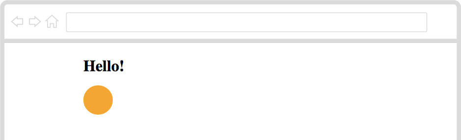

# Step 3: How do you **make a cup**? { .activity}

## Activity Checklist { .check}

To make a ball, you made a square HTML block, and chiseled its corners away until it became well round.

You are a **Web sculptor**!

To make a cup, you can **carve a rectangle block into a *trapezium***. 

Do you know what a trapezium is? It's a wonky rectangle, where only two sides are parallel.

    

    
* Copy-paste this code inside your HTML document, after `

` and before the `</body>` *closing tag*.

As you know, just *classifying* your `
` as a trapezium won't make it look like one. 

You need CSS to give your `
` that wonky shape.

    .trapezium 
	{
		width: 200px;
		border-bottom: 300px solid green;
		border-left: 30px solid transparent;
	}

* Copy-paste this code into your HTML document. Where? Anywhere between the `` *closing tag*.

See that `.trapezium`? It's a **shortcut** for `[class="trapezium"]`  

Instead of setting a `height` you can **use borders** to create shapes with CSS. 

* Save, go to your browser and refresh the page. What do you see? 

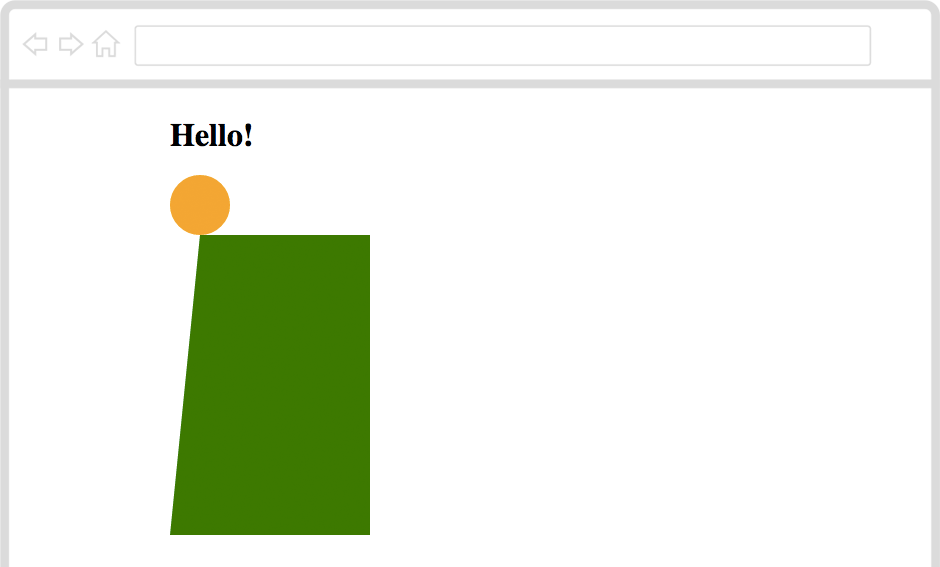

  

## Challenge { .try}

* Right-click on your green trapezium, then choose *Inspect Element* to inspect it.
* Play around with `border-bottom` and `border-left` to **change the shape of your trapezium**.
* Can you add a new line for `border-right` and **make your trapezium look like a cup turned upside down**?

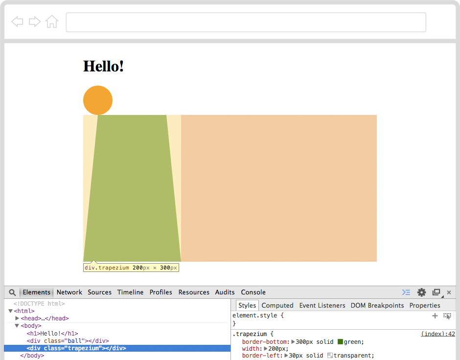

# Step 4: How do you **make many cups**? { .activity}

## Activity Checklist { .check}

You just cut a really nice cup! 

<!-- introduce multiple classes per element -->

Well, are you sure it's a cup? At the moment, it is a `
` *classified* as *trapezium*. 

* Can you add an appropriate class name to your `

` so that your browser knows it's not just a *trapezium*, but also a *cup*?

You see, you can **add as many class names as you wish** to your HTML elements. For example, you can have one class name to describe the shape of your element (*trapezium*) and another class name to describe the type of object your element represents (*cup*).

    

Now, a game with only one cup is not really fun to play, is it? Should we **make another two cups** then?

* Can you make another two *trapezium cup* elements in your HTML document? 

You can copy-paste the first one, to save yourself some typing.

* Save, go to your browser and refresh the page. What do you see? 

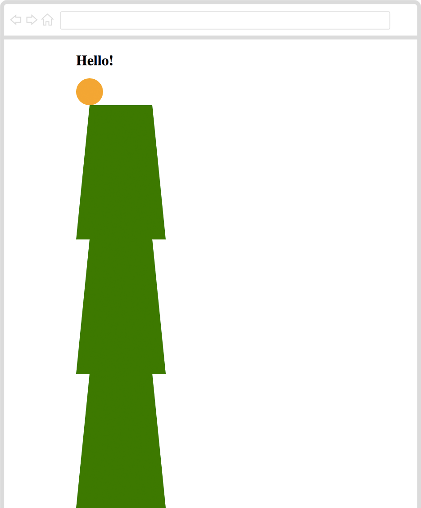

## Challenge { .try}

<!-- use float: left; -->

The cups are stuck on top of each other. That's because your browser likes to **pile HTML blocks up**.

With CSS, you can tell your browser to **put all cups next to each other**.

* Can you add `float: left;` inside a new `.cup` CSS rule?

* Save, go to your browser and refresh the page. What do you see?

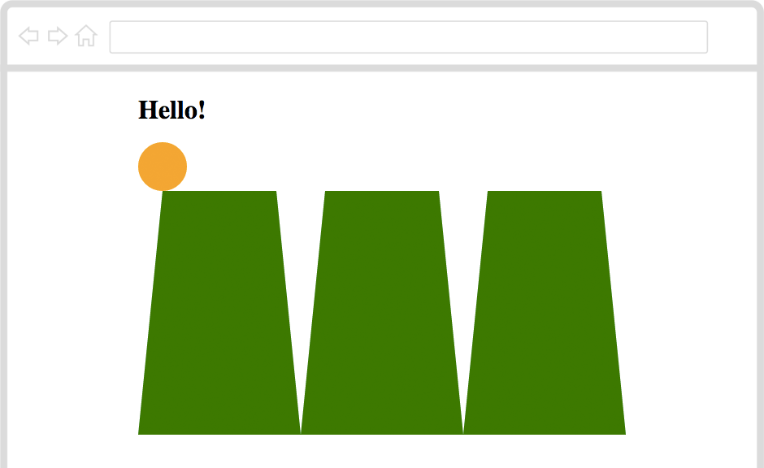

# Step 5: How do you **hide the ball**? { .activity .new-page}

## Activity Checklist { .check}

<!-- use position: relative; and offset from the top -->

Now all cups look *grounded*. According to your browser though, **the cups are *floating***. Bizzarre way to put it, don't you think? 

And that ball, doesn't it look like it's about to fall? Should we **move the ball**?

* Add `left: 70px;` inside your `div.ball` CSS rule.

* Save, go to your browser and refresh the page. Did the ball move?

Your browser *offset* the ball `70px` from the `left` where it was before.

## Challenge { .try}

* Can you **move the ball down** so that it's hidden by the first cup?

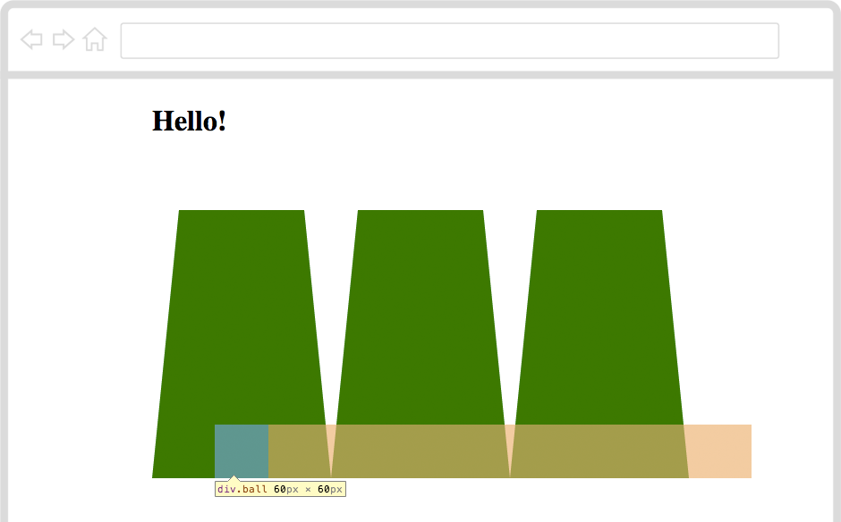

# Step 6: How do you **show the ball**? { .activity}

## Activity Checklist { .check}

You hid the ball. Good trick, **magician**! 

Using your CSS wizardry, can you **lift the cups** when you click them?

<!-- introduce :active pseudo-class -->

    .cup:active
    {
    
    }

When you click on an element, CSS calls it ***active***.

See that `:active` after `.cup`? It means "when any *cup* element is being clicked".

## Challenge { .try}

* Can you **offset the cup from the bottom**, so that when clicked it lifts up?

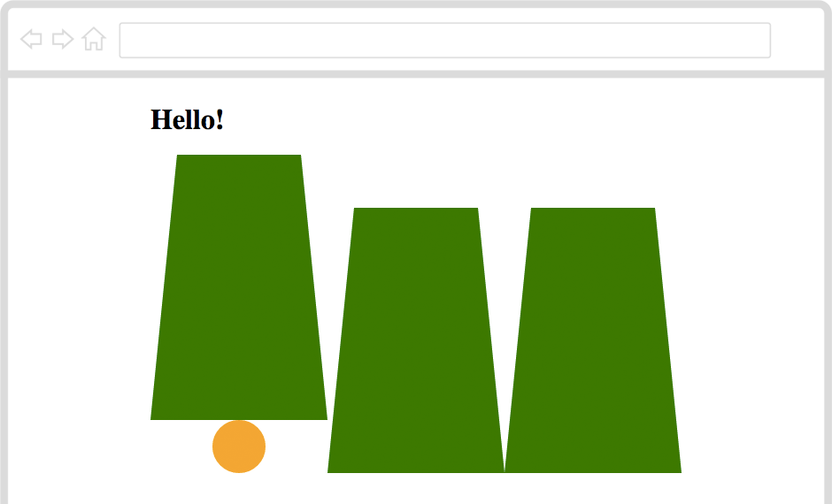

# Step 7: How do you **shuffle the ball**? { .activity}

## Activity Checklist { .check}

Now comes the **tricky part**, wizard!

How do you shuffle the ball, so that it's not always under the same cup?

<!-- play around with left:XX; -->

* Play around with the value of `left` in the `div.ball` CSS rule. 

For example, if you set it  to `left: 270px;` the ball will go under the second cup.

* Can you **move the ball under the third cup**? 

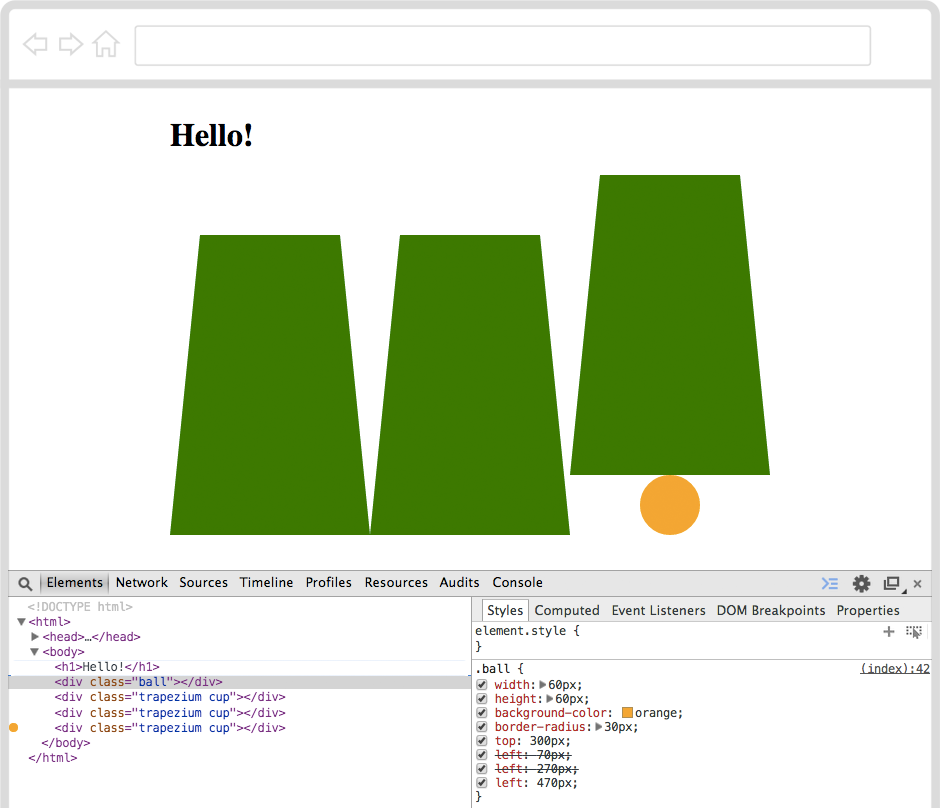

Now you know how to shuffle the ball from one cup to another. 

# Step 8: What about **getting your browser to shuffle the ball for you**? { .activity}

## Activity Checklist { .check}

Yes, you can! With JavaScript[^7].

If you *speak JavaScript* to your browser, it will do maths for you, move things around, make them appear and disappear, and much more.

There is JavaScript running on your page, right now. Should we play around with it?

* Right-click anywhere on your page, then choose *Inspect Element*.
* This time, when the Inspector pops up **click on Console**.

The Console is like a **chat with your browser**: you can type something into it and your browser will answer straight back. 

* Can you say `hello` to your browser?

* Press the `Enter`[^8] key. What does your browser reply?

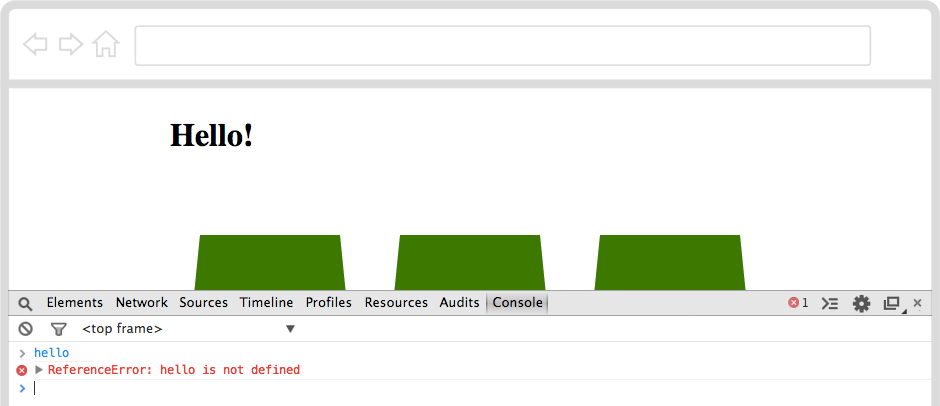

* Can you try again, this time with `"hello"` wrapped in `"` speech marks?

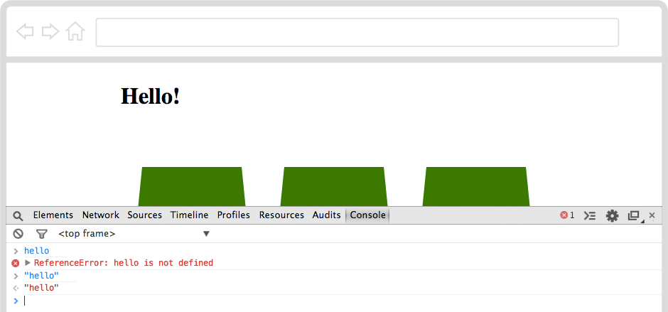

The second time your browser replied politely :)

That's because in JavaScript texts must be wrapped in `"` speech marks. Your browser calls "text" a **string** of characters.

* Can you ask your browser to do some math, for example `3 + 7`?

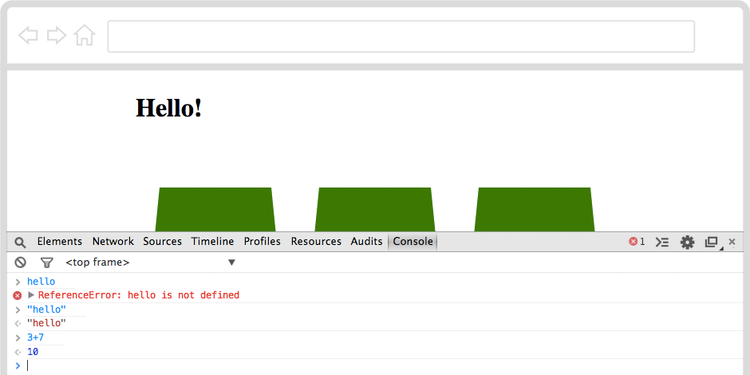

Your browser can talk **numbers**.

* Can you type in `alert( 3+7 )`?

Your browser popped up the result in a new window this time. Did you click `OK`?

You can use `alert()` to get your browser to *shout things at you*. 

`alert()` is one of many **functions** that your browser can do.

You can **write your own functions**, to get the browser to make complex things for you. And you can **borrow code** that other smart people have already made and kindly shared on the Web.

#### Back to your game 

What exactly do you need your browser to do, in order to shuffle that ball?

As you noticed, the ball `left` offset can be `70px`, `270px` or `470px` to be hidden under the first, second or third cup. 

How can you get your browser to 

1. pick one of those values *at random* for you
2. then move the ball there? 

For this time, let's **borrow some code** from other smart and kind people. Next time, you'll write your own functions!

* Copy-paste the `underscore.js` file, from this project's *Resources* folder into the folder where you saved your HTML file.

* Add `` to the `<head>` of your document. Where? Just before the `</head>` *closing tag*.

* Save, go to your browser and refresh the page.

* Right-click anywhere on your page, choose *Inspect Element*. When the Inspector pops up, click on *Console*.

You've just loaded your browser with a new helper, called **Underscore**, which gives you plenty of functions to play with.

* Type `_.` in the Console

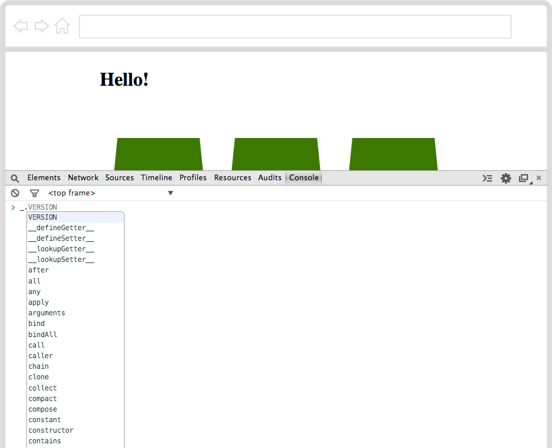

Your browser will suggest you all the functions available from *Underscore*.

`_` is the nickname your browser gives to *Underscore*.

In JavaScript you can use `.` to peep inside things.

So `_.` tells your browser to find *Underscore* and start looking inside it

* Type in `_.sample( [ "70px", "270px", "470px" ] )` and press the `Enter` key.

`_.sample()` is a function to **pick a random *sample* from a *list***, a bit like picking a random card from a deck.

Your browser will pick one of the three *strings* that you gave it.

* Press the `↑` arrow on your keyboard. That will bring up the last "order" you gave to your browser, so that you don't have to type it again.
* Press the `Enter` key.
* Repeat `↑` + `Enter` a few times.

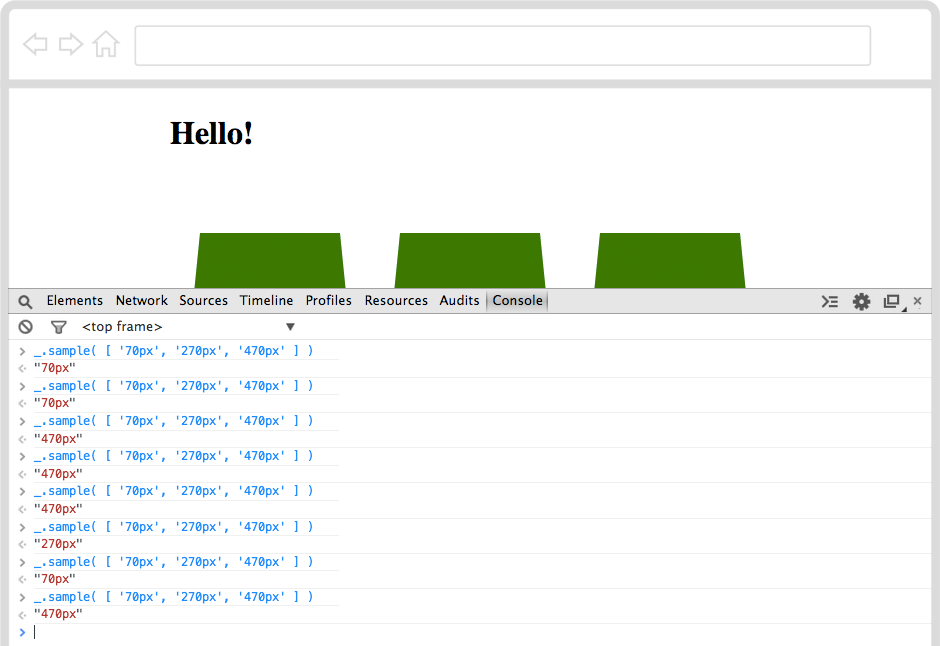

Each time your browser will pick one of the three strings, in an unpredictable way.
 
That's handy. How can you **store that random string**?

* Type in `var randomOffset = _.sample( [ "70px", "270px", "470px" ] )` and press the `Enter` key.

This time, your browser doesn't answer the random string back to you, but it stores it in a box, or *variable*[^9] as it calls it.

It's no secret though. If you know how to ask, you browser will tell you which string it picked.

* Type in `randomOffset` and press the `Enter` key. Does your browser answer which string it picked?

<!-- 

Math.random() or http://chancejs.com/? 

Actually, Underscore provides a better solution
http://underscorejs.org/#sample

-->

## Challenge { .try}

Now you know how to ask your browser to **pick a random thing** for you and store that in a *variable*. Can you write it down in your HTML document? This way you won't need to type it every time in the Console.

    

* Copy-paste this code in your HTML document. Where? Just before the `</body>` ends.
* Inside that `` to the `<head>` of your document. Where? Just before the `</head>` *closing tag*.

* Save, go to your browser and refresh the page.

* Right-click anywhere on your page, choose *Inspect Element*. When the Inspector pops up, click on *Console*.

Now your browser has two helpers, *Underscore* nicknamed `_`, and *jQuery* nicknamed `$`.

* Type `$.` in the Console. 

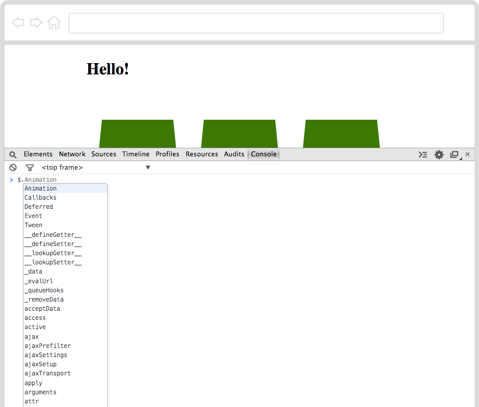

Your browser will start peeping inside the `$` helper.

Now *jQuery* is useful to **select** and *manipulate* things that are already in your HTML document. You can select HTML elements with *jQuery* in a similar way you do it in CSS.

For example, to select the `<body>` element, you can write `$("body")`.

How can you select the ball with *jQuery*? In CSS, you can write `div.ball`, but what about *jQuery*?

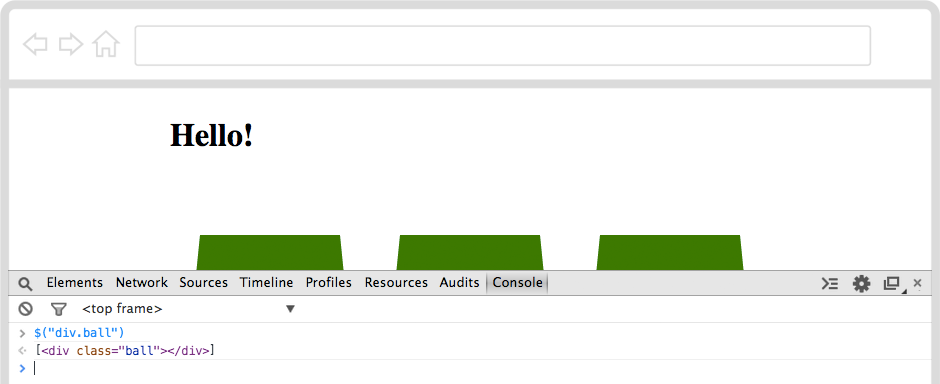

* Type `$("div.ball").css("top","0px")` in the Console and press the `Enter` key.

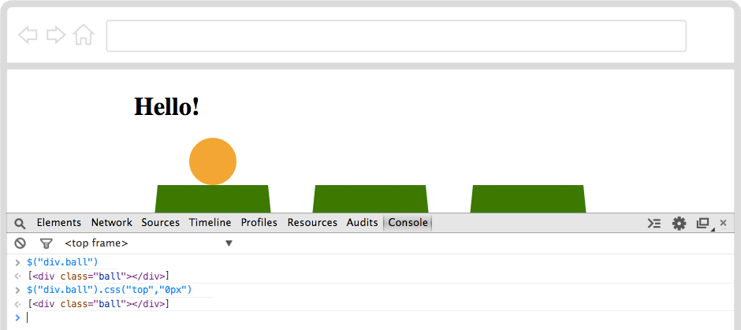

Can you see the ball moved back on top of the cups? Using *jQuery* you can tell your browser to change CSS rules on the fly!

Let's **read that line of code**.

`$("div.ball")` selects the `
` element *classified* as `ball`

`.css()` is the function to **change CSS rules**, which asks you two questions

1. Which *property* should I change?
2. What *value* should I use for such *property*? 

For example, `.css("top","0px")` answers

1. Change the `top` property
2. Make it `0px`

You can use any CSS property with this *jQuery* function! 

* Type `$("div.ball").css("background","blue")` and press the `Enter` key.

Did the ball turn blue? 

## Challenge { .try}

Good, let's go back to shuffling, sorcerer.

You summoned your browser to pick a random string for you, and that string represents an offset that the ball can take.

* Can you **make your browser use the `randomOffset` to move the ball with *jQuery***?

Every time you refresh your page, your browser will shout out the value of `randomOffset`. This is spoiling your trick isn't it?

See that `//` at the beginning of `// write your JavaScript code under this line`?

That is a *comment*, which your browser will ignore.

To *comment* a line in JavaScript you simply put `//` at the beginning, then your browser knows it's not a command for it to run.

*Comments* are useful to make notes in your code, to leave notes or cute messages for other coders to read. You can also use them to *hide* things from the browser, without deleting them.

* Can you ***comment* the `alert(randomOffset)` line**?

* Save, go to your browser and refresh the page.

Every time you refresh the page, your browser will shuffle the ball under a random cup.

Well done Web magician, now go and challenge your friends!

<!-- FOOT NOTES -->

[^1]: **HTML** stands for **H**yper**T**ext **M**arkup **L**anguage, which is the language that every website in the World "speaks". To make a website, you teach your computer how to "translate" your ideas into HTML.

[^2]: **What's a browser?** A web browser is a special app that knows how to interpret text files written in HTML. The most popular browsers are Internet Explorer, Google Chrome and Mozilla Firefox.

[^3]: **How do you refresh a page in the browser?** If you're on a Windows computer, use the keyboard shortcut **CTRL+R** (that is, hold the *CTRL* key down and press the *R* key once). On a Mac, use **⌘+R**.

[^4]: **What's debugging?** Debugging means to find and correct glitches in your code. It takes both patience and speed, just like catching a flying bug. Luckily, debugging HTML code in your browser is easy: right-click anywhere on a page and choose **Inspect Element**. This will pop open your browser's **Inspector**, where you can see every page's *source code*, *styles* and much more. When you hover over the source code with your mouse, the corresponding HTML element on the page will light up. When you click on an HTML tag in the source code (left panel), you'll see all its CSS styles (on the right panel).

[^5]: **CSS** stands for **C**ascading **S**tyle **S**heets and it's the language you can use to tell your browser to change colours, sizes and many other *stylistic* aspects of your HTML documents.

[^6]: **What's a browser's Inspector?** In your browser, right-click anywhere on a page and choose **Inspect Element**. This will pop open your browser's **Inspector**, where you can see every page's *source code*, *styles* and much more. When you hover over the source code with your mouse, the corresponding HTML element on the page will light up. When you click on an HTML tag in the source code (left panel), you'll see all its CSS styles (on the right panel).

[^7]: **JavaScript** is a **programming language** that you can use to *instruct* your browser to do things for you. Just as you used to control adults with screams and tears, you can control your browser with statements written in JavaScript!

[^8]: **Which one is the `Enter` key?** It's bigger than the others, usually on the right-hand side of your keyboard, with this **↲** arrow pointing down-left printed on it.

[^9]: **What's a variable?** The word *variable* is made by "vary" and "able" and it means "can change". Variables can store many different things and can change these many times. They are pretty much like boxes where you store thing. You put something in a variable, and then grab it later when you need it.