# Introduction {.intro}

In this project, you'll create a set of linked rooms where each room is a different web page. 

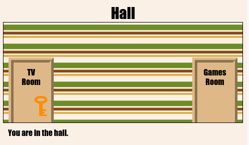

# Step 1: Linking to another web page in the same project {.activity}

Web projects can be made up of lots of HTML files linked together. 

## Activity Checklist { .check}

+ Open this trinket: <a href="http://jumpto.cc/web-rooms" target="_blank">jumpto.cc/web-rooms</a>. If you're reading this online then that's a link, you can also use the embedded trinket below. 

  <iframe src="https://trinket.io/embed/html/ef608f0733" width="100%" height="400" frameborder="0" marginwidth="0" marginheight="0" allowfullscreen>
  </iframe>

+ Run the trinket and you should find yourself in the Hall:

	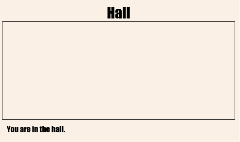

+ Look at the list of file tabs for this trinket. Can you see `tvroom.html`? 

	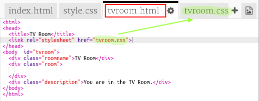

	This is another html file in the same project. 

	It also has its own linked `tvroom.css` style file.

+ To get to `tvroom.html` you need to add a link in `index.html` 

	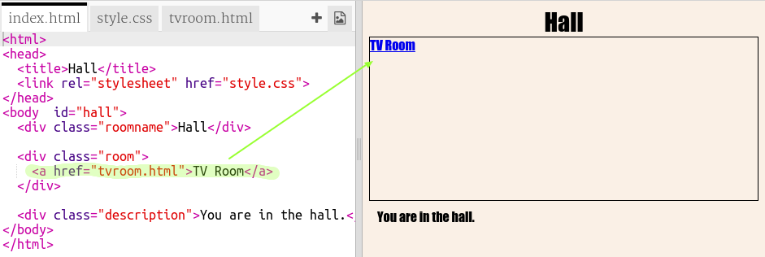

	Test your trinket by clicking on the __TV Room__ link to see the `tvroom.html` webpage:

	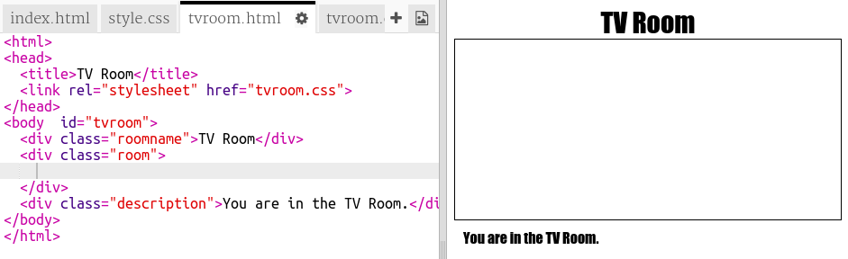

##Challenge: Add another link {.challenge}

Add a link to the `tvroom.html` webpage to get you back to the Hall webpage which is called `index.html`.

The TV Room webpage should have a clickable link like this:

## Save Your Project {.save}

# Step 2: Add another room {.activity}

Now let's add another room, a __Games Room__. 

+ Click on the add page __+__ button:

	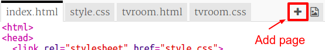

	Type `gamesroom.html` as the page name:

  	

+ The HTML for the __Games Room__ is very similar to `tvroom.html` so copy that and paste it into `gamesroom.html`.
	
	Edit the highlighted items so they say Games not TV:

	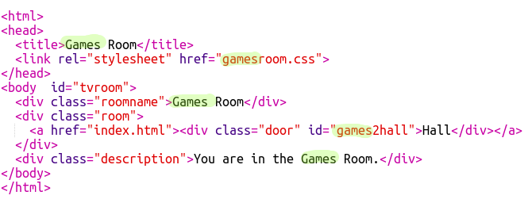	

+ Your `gamesroom.html` now uses `gamesroom.css`. 

	Create `gamesroom.css` by clicking on the add page __+__ button. 

	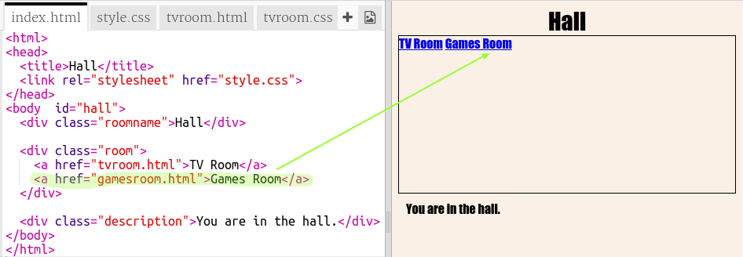

+ The CSS for the __Games Room__ is very similar to `tvroom.css` so copy that and paste it into `gamesroom.css`.

+ Add a link from the Hall to the Games room:

	

+ Test your project by clicking on the Games Room link

	The __Games Room__ should look like this:

	

	Not very exciting, but you can fix that in the next challenge. 

## Save Your Project {.save}

##Challenge: Style and link the Games Room {.challenge}

Edit the HTML and CSS for the __Games Room__ so that the webpage looks like this: 

Hint: The bright green colour is called `chartreuse`.

## Save Your Project {.save}

# Step 3: Make the links look like doors {.activity}

Links don't just have to be text. Let's make a clickable door using a `
`.

## Activity Checklist { .check}

+ Open `index.html` and add a `
` around the __TV Room__ link text. It needs to be inside the `<a>` to make it clickable.

  Include `class="door"` so that you can add CSS to make it look like a door.

  And include `id="hall2tvroom"` so that you can position it. 

  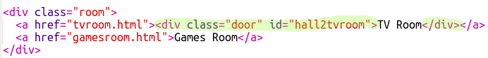  

+ Click on the `style.css` tab and add the following CSS to change the size and colour of the door:

	

+ Test your webpage by clicking anywhere on the door, not just on the text.

+ Now let's make it look a bit more like a door by adding a border around three sides:

	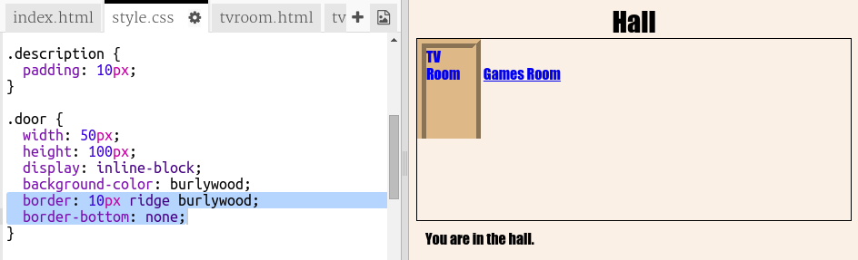

+ And let's add some CSS to make the text on the door look better:

	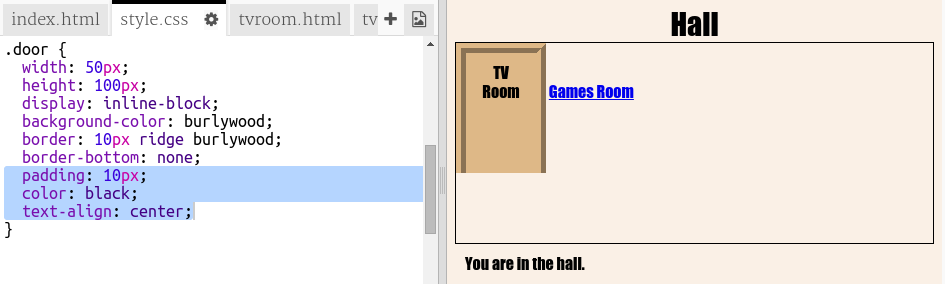

+ You've probably noticed that the door is floating in the air. Let's fix that by positioning the door using its `id`.

	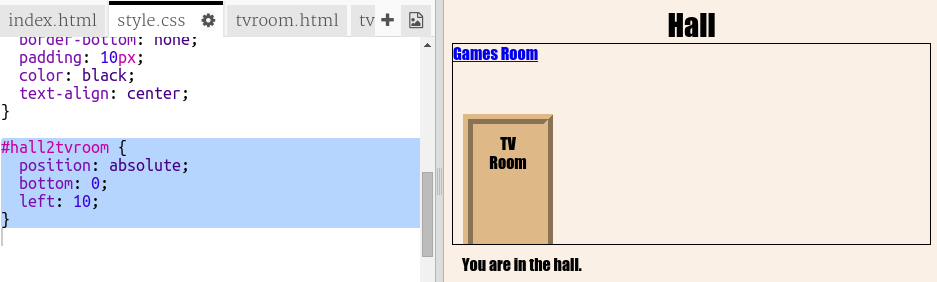	

+ Test your webpage by clicking on the door to get to the __TV Room__.

## Save Your Project {.save}

##Challenge: Add more doors! {.challenge}

Turn the rest of the links in your project into doors in the same way. 

The rooms have their own css files so don't forget to add the door style to them. 

The TV Room should look something like this:

	
	

# Step 4: Adding a background image {.activity}

Let's decorate the hall with a background image.

## Activity Checklist { .check}

+  Edit the `style.css` to add a background image to the Hall:

	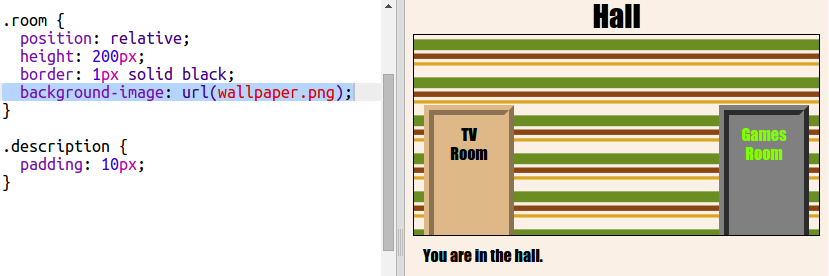	

	The image will be repeated to fill the whole room. 

+ Test your project. 

## Save Your Project {.save}

##Challenge: Add wallpaper to the Games Room {.challenge}

Can you decorate the games room with a background image?

You can use:

- The space-invader.png background image

The decorated room should look like this:

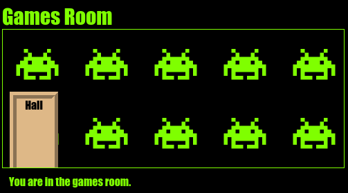	

## Save Your Project {.save}

# Step 5: Adding a key cursor

## Activity Checklist { .check}

+ Another fun thing to do is add an image cursor. Open `style.css` and add a custom cursor to the `.door` class so that the cursor turns into a key when the mouse moves over a door. 

	

	The `key.png` image is included in your project.

	The `, auto` means that the usual cursor will be used if the image can't be displayed.

+ Add the key cursor to the `tvroom.css` and `gamesroom.css` files. 

+ Test your project. You should see the cursor turn into a key whenever the mouse moves over a door in any of the rooms. 

## Save Your Project {.save}

##Challenge: Make it yours! {.challenge}

Add more rooms to your project. 

You can use the following images to decorate if you like:

+ tiles.png

## Save Your Project {.save}
