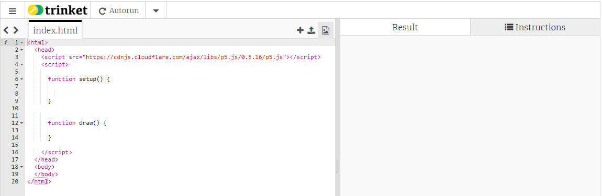
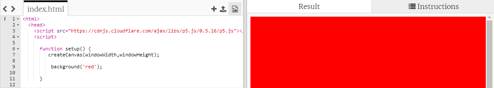

# Introduction { .intro }

In this project, you'll create objects by combining simple shapes. You'll be introduce the basics of JavaScript to make different geometrical shapes using HTML Canvas.

<iframe src="https://trinket.io/embed/html/cfe39e41f3?outputOnly=true" width="100%" height="600" frameborder="0" marginwidth="0" marginheight="0" allowfullscreen></iframe>

# Step 1: What is Javascript? { .activity }

Javascript is a programming language used to create interactive effect in webpages.Let's have a look at an example!

## Activity Checklist { .check }
+ You'll be using a website called Trinket to write HTML. Open this Trinket: <a href="https://trinket.io/embed/html/50ddc249a1"  target="_blank">jumpto.cc/makingshapes-intro</a>.
	The project should look like this:
	
+ The code within the  tag is the Javascript code.
+ Within the script tags their are two functions: 
	1- function setup - where the canvas is created and background is set. 
	2- function draw - where you can draw shapes.
+ Function is always written as 
	
	
+ Now , lets create the canvas and give it a background color.For creating canvas we have to write 'createCanvas',which is written in CAMEL CASE meaning if you have to write 'car wash' it will be written as 'carWash'.

	
 Background color can be any 'green','blue'or any RGB ('255, 87, 51') or HEX color ('#FF5733') can be used.
+ The steps should be broken down into a number of checkpoints. You can add text in __bold__ or _italics_ to add emphasis to key words or important points.

+ Each checkpoint should clearly explain what the child needs to do.

+ To aid clarity, you can also include images, like this:

	

+ You should also regularly remind children to save their project:

## Save your project { .save }

## Test your project { .flag }
You should regularly ask children to test their project, so that they can see the effects of the code they're creating. You can even use these points as opportunities to fix bugs and improve code.

## Challenge: Challenge name {.challenge}
You should add at least 1 challenge, to allow children to apply what they've during the project. You can ask children to fix a problem or improve or adapt their project in some way. 
