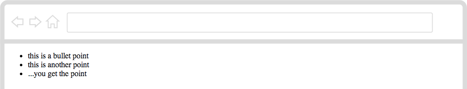
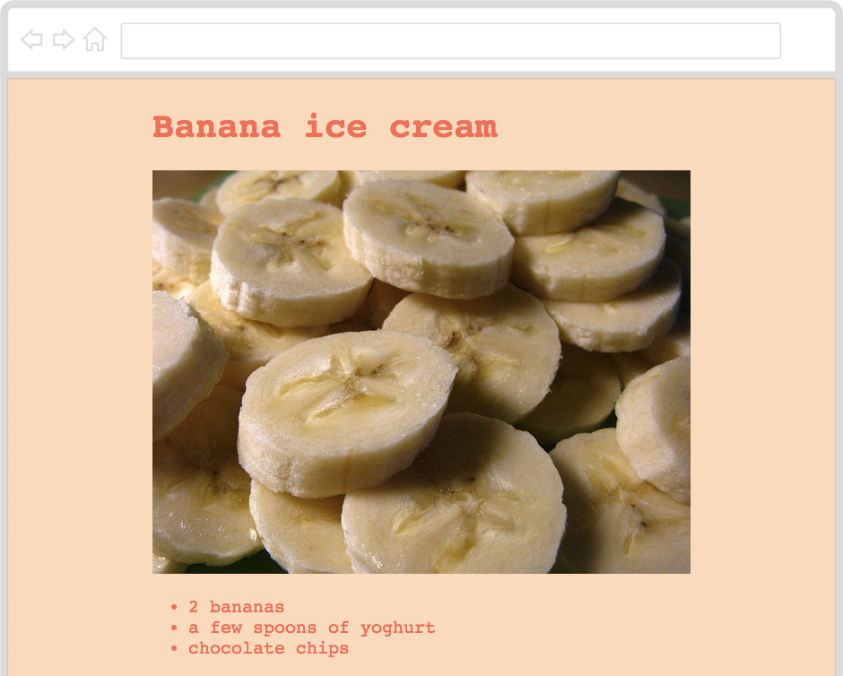
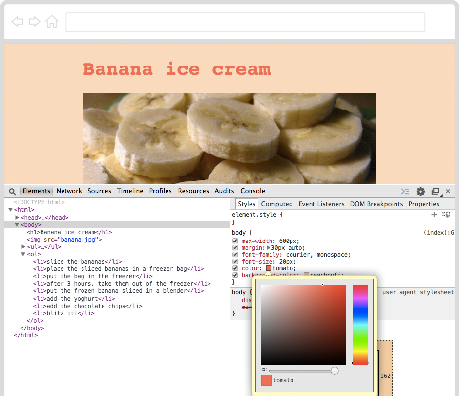

---
title: (BETA) Coding a recipe
level: Lesson 9
language: en-GB
embeds: "*.png"
materials: "Resources"
stylesheet: web
author: Matteo Menapace
note: "notes.md"
...


## Heads up! { .beta}

This project is in **Beta**. This means we're still testing it, and there's a small chance there could be some bugs or typos. 

If you're a **club leader** trying out this project, make sure you [complete this short questionnaire](https://docs.google.com/forms/d/1eMCfpYe3v7eYu5M8rSqLKlmq7cczLCLHx66csgyUyVU/viewform) (or email projects@codeclub.org.uk) to let us know how it went! 


# Introduction { .intro}

Hey, what's **your favourite dish**? 

Can you **write down your recipe** for it in HTML[^1] so that anyone on the Web can enjoy making it too?


# Step 1: Are you ready? { .activity}

## Activity Checklist { .check}

Here is a list of things to check before you dig into your recipe.

* **Open your code editor**. Do you have an app on your computer to write your code? 
	* NO. Talk to your teacher or volunteer about installing a code editor: we recommend [Sublime Text 2](http://www.sublimetext.com/2).
	* YES. Great, move on.
* **Create a new file**. 

* Here is the bare skeleton of an HTML document, **copy-paste it** into your new file. 

Does it look familiar?

```HTML
<!DOCTYPE html>
<html>
	<head>
		<title>Code Club recipe</title>
	</head>
	<body>
		HELLO!
	</body>
</html>	
```
     
* **Save your file**. You can save it as whatever you want to call it. Just remember to end your file name with `.html` so that your computer knows it's an HTML file. For instance, you could call your file `recipe.html`. Can you think of a less boring name?
* Do you know where your HTML file has gone? 
	* NO. Ok, it's somewhere on your computer. Can you find it?
	* YES. Good, let's move on.
	
* **Open your browser**[^2]. 
* From your browser, **open your HTML file** . Does it say `HELLO!`? 
* Go **back to the code editor**. Can you change the `HELLO!` text to something else? 
* **Save** your HTML file.
* **Back to your browser**, can you refresh[^3] the page where you opened your HTML file?
* Great! Now you've got your **tools ready**: code editor to write your code, browser to *debug*[^4] your code.


# Step 2: How do you **make a list**? { .activity}

## Activity Checklist { .check}

**Do you make lists?** For instance, a list of things to do for a party, or a playlist of your favourite videos... you know what we're talking about.

You can **make lists in HTML** too! Here's a code example:

```HTML
<ul>
	<li>this is a bullet point</li>
	<li>this is another point</li>
	<li>...you get the point</li>
</ul>	
```
	
* Copy-paste the code above in your HTML file. Where? After the `<body>` *opening tag*, and before the `</body>` *closing tag*.

* Save, go to your browser and refresh the page. What do you see?


	 
## Challenge { .try}

* Can you **make a list of ingredients for your recipe**?


# Step 3: How do you **order your lists**? { .activity}

## Activity Checklist { .check}

Not all lists are the same. In some lists, the order of things doesn't matter.

HTML calls these lists `<ul>` which stands for **U**n-ordered **L**ist. In these kind of lists, you put **L**ist **I**tems `<li>` in no particular order, a bit like in your bedroom :)

Now, can you guess what `<ol>` stands for?

Exactly.

## Challenge { .try}

In a recipe, it's quite important to list the steps in a particular order. Because you can't bake a cake, if you haven't prepared the mix first.

* Can you **list the steps to make your favourite dish**, from start to finish?


# Step 4: How do you **add images**? { .activity}

## Activity Checklist { .check}

So far, you have the basics for your recipe:

1.  A `<ul>` list of ingredients
2.  A `<ol>` list of steps, to turn these ingredients into a tasty dish

Some people like to see what a dish will look like once it's made, to decide if they want to make it or not. 

Why not **add an image** or two to whet their appetite?

HTML calls images `` and wants you to write down exactly where to find an image's *source*, or `src`.

* Copy-paste the `banana.jpg` image, from this project's *Resources* folder into the folder where you saved your HTML file.

<!-- this may change if we use Thimble -->

* Add `` to your HTML document. Save, go to your browser and refresh your page, you should see some freshly chopped banana slices. Yummy?


## Challenge { .try}

* Can you make some images of your ingredients? 
* Can you **add these images to your recipe's HTML file**?


# Step 5: How do you add **extra info**? { .activity}

## Activity Checklist { .check}

Your recipe looks much better now, don't you think?

Still, some people want to know how long it would take them to make this recipe, whether it's an easy or difficult one, how many people it serves, what to call this recipe, and so on.

For a *starter*, you could **add the name of your recipe** at the top of your HTML document, using a `<h1>`, which stands for **H**eading **1** and it's what HTML calls the most important piece of information in a document. What is your recipe called?

## Challenge { .try}

How can you **help people decide**? What kind of information would they want to find in your recipe?

* Think of **what extra information you want to add to your recipe**. Then code it!


# Step 6: How do you **make things look stylish**? { .activity}

## Activity Checklist { .check}

Now your recipe contains all the information one may want.

Should we try and make it look as nice as it tastes?

Ok, have you heard of CSS[^5]? You can use this language to **style your recipe**.

You can write your CSS inside a `<style>` tag, placed in the `<head>` of your HTML document, like in the code example below.

```HTML
<!DOCTYPE html>
<html>
	<head>
		<title>Code Club recipe</title>
		<style>
			
			/* WRITE YOUR CSS UNDER HERE */
			
			
		</style>
	</head>
	...
</html>	
```

Just like HTML, CSS needs to be written in a particular way for your browser to make sense of it.

```CSS
body 
{
	max-width: 600px;
	margin: 30px auto; 
}
```
	
## Challenge { .try}	

* Copy-paste the code above into your HTML document. Where? Anywhere between the `<style>` *opening tag* and the `</style>` *closing tag*.

* Using your browser's Inspector[^6], can you work out what the `max-width: 600px;` and `margin: 30px auto;` rules do?


# Step 7: How do you **make things easier to read**? { .activity}

## Activity Checklist { .check}

Now your recipe should sit in the middle of the page, instead of sticking to the left. 

Using CSS, you can **tell your browser how to display your text**, for example:

* Use `font-size` to make text *xx-large*, *xx-small* or anything in between[^7]
* Use `text-align` to make text stick to the *left*, *right* or *center*
* Use `font-weight` to make text *bold*, *bolder* or *lighter* 
* Use `line-height` to squish text lines together, or to give them more room
* Use `font-family` to choose the font[^8] for your text

## Challenge { .try}

* Play around with the CSS properties above.

* Can you **make your recipe easier to read**, so that even a granny can read it?

You can start from this code example. Place it inside the CSS rule for `body`.

```CSS
font-family: courier, monospace;
font-size: 20px;
line-height: 1.5;
```
    

    
    
# Step 8: How do you **add colours**? { .activity}
  
## Activity Checklist { .check}

Using CSS, you can **get creative with colours**. Do you want your text to look like <span style="color:tomato;">tomatoes</span> on <span style="background:peachpuff;padding:2px 4px">peachpuff</span>? No problem.

* Copy-paste the code example below into your HTML document. Place it inside the CSS rule for `body`.
 
```CSS    
color: tomato;
background-color: peachpuff;
```
    
* Save, go to your browser and refresh your page. What do you see?



Now, how many colours do you know? Your browser knows more than **16 million colours**. Pretty impressive, isn't it? 

The good thing is that you can choose between those millions, and tell your browser exactly which colours you want. 

Also, there's no need for you to remember any of those colours, because you can use your browser's Inspector to **pick the colours you like**.    
   
## Challenge { .try}

* With your HTML page open in your browser, right-click anywhere on your page.
* Choose **Inspect Element** from the menu that will pop up. 
* Click on the `<body>` element on the left panel (where your HTML is) and its *Styles* will show up in the right panel.

You should see something similar to the image below.


* Click on the red box next to the word *tomato*. 



When you click on one of these coloured boxes, you can play around with 16 millions colours! 

* Use this *colour picker* tool to **change your recipe's colours**, then copy-paste them into your HTML document.


# EXTRA How do you **make specific styles**? { .activity}

## Activity Checklist { .check}

What if you want to make only *some* parts of your HTML a certain colour?

CSS and HTML use **different ways to call the same things**. In HTML you say `<body> ... </body>` and in CSS you say `body { ... } ` 

* To change the colour of your `<h1>` HTML element, add this CSS. 

```CSS
h1 
{
	color: maroon;
}
```	

* Save, go to your browser and refresh your page. What do you see?

Now `<h1>` has a new `color`, while the rest of your page *inherits* the `color` you gave to the `<body>`.

The `h1` `color` takes precedence over the `body` one, because the *selector* `h1` is **more specific** than `body`. CSS likes *specificity*.

## Challenge { .try}

* Can you make the ingredients a **different colour** than the steps?

* What else can you make, using **specific CSS rules**?

<!-- Footnotes -->

[^1]: **HTML** stands for **H**ow **T**o **M**ake **L**unch... well, no. HTML stands for **H**yper**T**ext **M**arkup **L**anguage, which is the language that every website in the World "speaks". To make a website, you teach your computer how to "translate" your ideas into HTML.


[^2]: **What's a browser?** A web browser is a special app that knows how to interpret text files written in HTML. The most popular browsers are Internet Explorer, Google Chrome and Mozilla Firefox.

[^3]: **How do you refresh a page in the browser?** If you're on a Windows computer, use the keyboard shortcut **CTRL+R** (that is, hold the *CTRL* key down and press the *R* key once). On a Mac, use **⌘+R**.

[^4]: **What's debugging?** Debugging means to find and correct glitches in your code. It takes both patience and speed, just like catching a flying bug. Luckily, debugging HTML code in your browser is easy: right-click anywhere on a page and choose **Inspect Element**. This will pop open your browser's **Inspector**, where you can see every page's *source code* and much more. When you hover over the source code with your mouse, the corresponding HTML element on the page will light up. 

[^5]: **CSS** deals with how we **C**ook, **S**tyle and **S**erve food... well, no. CSS stands for **C**ascading **S**tyle **S**heets and it's the language you can use to tell your browser to change colours, sizes and many other *stylistic* aspects of your HTML documents.

[^6]: **What's a browser's Inspector?** In your browser, right-click anywhere on a page and choose **Inspect Element**. This will pop open your browser's **Inspector**, where you can see every page's *source code*, *styles* and much more. When you hover over the source code with your mouse, the corresponding HTML element on the page will light up. When you click on an HTML tag in the source code (left panel), you'll see all its CSS styles (on the right panel).

[^7]: **How can you control the size of things in CSS?** Using `px`, which stands for *pixel*. Try to go really close to your computer screen: do you see little dots? Every little dot on your computer screen is a *pixel*. So, `20px` means 20 of those little dots.

[^8]: **What's a font?** You can think of a font as the "dress code" for the letters of the alphabet, numbers and punctuation. You can use fonts to "dress" the same text in many different ways, and express certain moods or feelings, for example <span style="font-family:monospace;font-size: 125%;">this</span>, <span style="font-family:Times,serif;font-size: 125%;">this</span>, <span style="font-family:Helvetica,Arial,sans-serif;font-size: 125%;">this</span>, <span style="font-family:cursive;font-size: 125%;">this</span> or <span style="font-family:Impact,Charcoal,sans-serif;font-size: 115%;">this</span>. You can explore and use hundreds of free fonts on [Google Fonts](https://www.google.com/fonts).  
