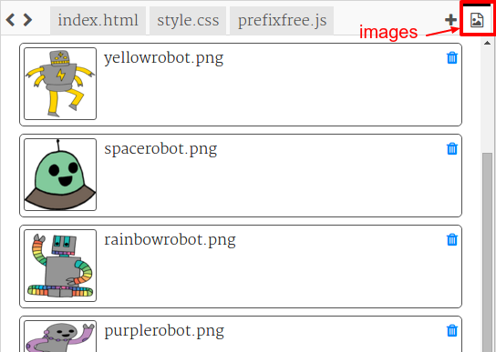

# Introduction {.intro}

In this project, you'll create lots of fun stickers that you can use to decorate web pages. You'll learn about using gradients to make your stickers look cool. 

  <iframe src="https://trinket.io/embed/html/bb4e538e0a?outputOnly=true&start=result" width="600" height="450" frameborder="0" marginwidth="0" marginheight="0" allowfullscreen>
  </iframe>
  

# Step 1: Make a linear gradient sticker {.activity}

A gradient is a gradual change from one colour to another. Gradients can be used to create cool effects. You're going to use them to create stickers that you can use on your web pages. 

+ Open this trinket: <a href="http://jumpto.cc/web-stickers" target="_blank">jumpto.cc/web-stickers</a>. If you're reading this online, you can also use the embedded trinket below. 

  <iframe src="https://trinket.io/embed/html/af0ea6fa35" width="100%" height="400" frameborder="0" marginwidth="0" marginheight="0" allowfullscreen>
  </iframe>

+ Let's make an 'I <3 Coding' sticker. 

	Use a `
` with a `sticker` class and a `coding` id so that you can style it: 

	

+ Hmm did you notice that you got an error? This is because '<' is a special character in HTML. Instead of '<' you need to use the special code `&lt;`. 

	Update your code to use `&lt;` so that the error goes away. 

	

	` ` gives a new line. 

+ Now let's make the sticker look interesting. 

	Switch to the `style.css` file. You'll see that the `.sticker` class has been provided for you. This will layout stickers on the page and centre their content. 

	Remember that you added the id `coding` to your sticker. At the bottom of `style.css` add the following code to style the text:

	

+ Now you can add a gradient for the background of the sticker. A linear gradient changes from one colour to another along a straight line.

	This gradient will change from red at the top to magenta at the bottom. Add the gradient code to your `coding` style:

	

+ You can improve on the result by adding padding and rounded corners. 

	Add the highlighted code:

	

	The `padding` style adds padding of 50px at the top and bottom and 30px on the left and right. 

## Save Your Project {.save}

# Step 2: Make a radial gradient sticker {.activity}

Gradients can also change colour from the centre out to the edges, this is called a radial gradient. 

+ Let's create a sticker with the text `HTML & CSS.`  `&` is another character that needs encoding in HTML, the code is `&amp;`.

	Add the highlighted code to create a new sticker: 

	

+ Now switch to your `style.css` file and add a style for your new sticker:

	

	The `text-shadow` code adds a shadow which extends 2px below and to the right of the text to make it stand out. 

+ Now for the gradient. This time let's use a radial gradient. The colour will change from yellow in the centre through to orange and then red. 

	

	Notice that gradients can include multiple colours, not just two. 

+ The sticker will look much better with some padding and a rounded border. 

	Add the highlighted code:

	

## Save Your Project {.save}

##Challenge: Create your own gradient sticker {.challenge}

Now make your own gradient sticker. Try linear and radial gradients using multiple HTML colours. 

You'll need to:

+ Add a `
` with your sticker text to `index.html` and give it the `sticker` class and a new `id`.
+ Add style for the `id` you chose in `style.css`. You could copy one of the sticker styles you have already made and edit that. 

There’s a list of all the colour names you can use: [jumpto.cc/web-colours](http://jumpto.cc/web-colours), which includes colour names like `tomato`, `firebrick` and `peachpuff`.

If you want to change the text colour you can use `color:`.

Here's an example of what you can do with multiple colours in a linear gradient:

## Save Your Project {.save}

# Step 3: Make a gradient sticker with an image  {.activity}

You can also make a gradient sticker using an image. If you use an image with a transparent background then the gradient will show through. 

+ First let's create an sticker that includes an image. 

	Your project already includes an image called `purplerobot.png`.

	Add the highlighted code to `index.html`:

	

	You can adjust the `height` to resize the image, the width will change automatically. 

+ Now add the style code to create a gradient background for your image sticker:

	

## Save Your Project {.save}

##Challenge: Make your own image sticker {.challenge}

Now make your own image sticker with a gradient. 

You'll need to:

+ Add a new sticker `
` to `index.html` which includes an image. 
+ Add the `sticker` class and a new id to your sticker div.
+ Create a style for your new id with a gradient and padding. 

Your project already includes a set of robot images. Click on the images icon to see the available images. 

Here's an example image sticker with a linear gradient:

## Save Your Project {.save}

# Step 4: Horizontal gradients  {.activity}

Gradients can be horizontal as well as vertical. 

+ Let's create another image sticker. 

	This time we'll use `greenrobot.png`. Add the following code to `index.html`:

	

+ Normally a linear gradient runs from top to bottom, but if we add `to right` then we can make it run from left to right. 

	Add the highlighted code to `style.css` to add a horizontal gradient to your green robot sticker. 

	

	Notice that the gradient runs from green on the left to yellow on the right. 

+ This robot looks like he wants to say something. Let's also add some text to your sticker. 

	Go to `index.html` and add the text 'Hello!' to your green robot sticker, put it inside a `` with an id so that you'll be able to style it:  

	

+ The text will look better if you make it bigger and position it. 

	To position the text you'll need to add `position: relative;` to `#greensticker` and `position: absolute` to `#greentext`. This is covered in more detail in the `Build a Robot` project. 

	Add the highlighted code to `style.css`:

	

	Now the 'Hello!' text is positioned relative to the bottom right corner of the sticker. 

## Save Your Project {.save}

# Step 5: Diagonal gradients  {.activity}

You can also create diagonal gradients that run from corner to corner. 

+ Add a sticker to `index.html` using the `firerobot.png` image:

	

+ With a diagonal gradient you give two directions. The example uses `to bottom left`.

	Add this style to `style.css` to give your new robot sticker a diagonal gradient and a fancy border:

	

	Note that you can use `outline` to create another border outside the usual one. 
	`outline-offset` gives the gap between the border and the outline. 

+ Let's add some text to this sticker. 

	Add a `` containing the text "ROBOTS!" to `index.html` and give it an id. 

	

+ Now you can position the text by adding the following style:

	

+ And for a final twist, let's rotate the text using `transform: rotate`.

	

	Try changing the number of degrees that the text is rotated. 

## Save Your Project {.save}

##Challenge: Make more stickers {.challenge}

Now try making more stickers using different gradient directions and adding images and text and using borders and outlines. 

You can copy one of your examples and make changes to create a new sticker. 

Here's an example using a diagonal gradient:

## Save Your Project {.save}
