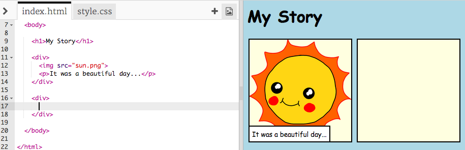
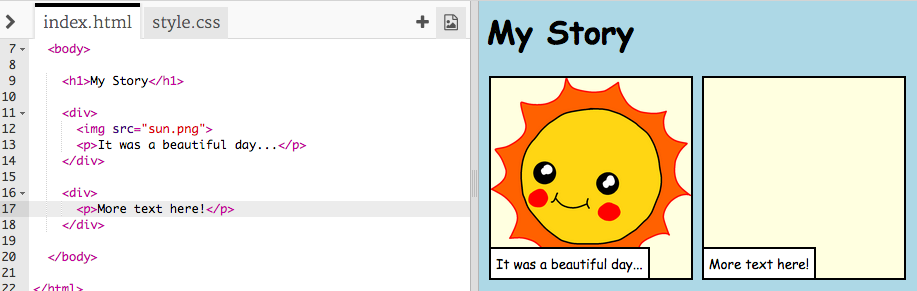
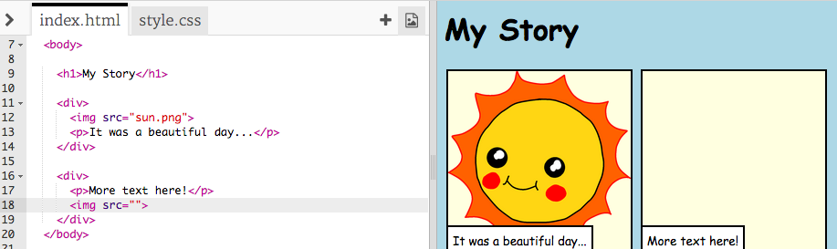
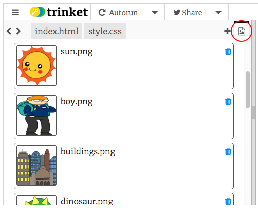
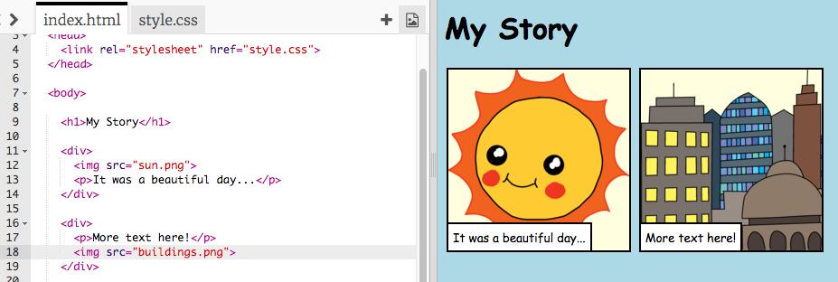

# Introduction { .intro}

In this project, you'll learn how to create your own webpage to tell a story, joke or poem.


# Step 1: Decide on a story { .activity}

Before you get coding, you'll need to decide on a story to tell.

## Activity Checklist { .check}

+ Think about the story you want to tell. It could be:
	+ A famous story;
	+ A story you have made up;
	+ Something that has happened to you or someone you know.

	It doesn't even have to be a story. It could be a joke, a poem, or anything else you want!

# Step 2: Editing your story { .activity}

Let's start by editing the HTML content and CSS style of the story webpage.

## Activity Checklist { .check}

+ Open this trinket: <a href="http://jumpto.cc/web-story" target="_blank">jumpto.cc/web-story</a>. If you're reading this online, you can also use the embedded version of this trinket below.

<div class="trinket">
  <iframe src="https://trinket.io/embed/html/8083cfebb3" width="100%" height="400" frameborder="0" marginwidth="0" marginheight="0" allowfullscreen>
  </iframe>
</div>

+ You might remember from the 'Happy Birthday' project that webpage content goes in the `<body>` of the HTML document.

	Go to line 7 of the code, and you should see the webpage content, which is inside `<body>` and `</body>` tags.

	

+ Can you tell which tags are used to create the different parts of the webpage?

	

	+ `<h1>` is a __heading__. You can use the numbers 1 to 6 to create headings of different sizes;
	+ `<div>` is short for __division__, and is a way of grouping stuff together. In this webpage, you'll use it to group together all the stuff for each part of your story;
	+ `` is an __image__;
	+ `<p>` is a __paragraph__ of text.

##Challenge: Make some changes {.challenge}
Edit the HTML and the CSS code to customise your webpage.


You can alter the colours used in the webpage, and you can also use fonts like <span style="font-family: Arial;">Arial</span>, <span style="font-family: Comic Sans MS;">Comic Sans MS</span>, <span style="font-family: Impact;">Impact</span> and <span style="font-family: Tahoma;">Tahoma</span>.

If you need more help, you can use the 'Happy Birthday' project to help you.

## Save Your Project {.save}

# Step 3: Telling your story { .activity}

Let's add a second part to your story.

## Activity Checklist { .check}

+ Go to line 15 of the code, and add in another set of `<div>` and `</div>` start and end tags. This will create a new box for the next part of your story.

	

+ Add a paragraph of text inside your new `<div>` tag.

	```
	<p>More text here!</p>
	```

	

+ Finally, you can add an image to your new box, by adding this code inside your `<div>` tag:

	```
	
	```

	

	Notice that `` tags are a bit different to other tags, as they don't have an end tag.

+ For HTML images, you need to add the __source__ of the image, inside the speech marks. 

	Click the image icon to see the images available for your story.

	

+ Find the name of an image you want to add, for example `buildings.png`. You can then click `index.html` to get back to your code.

	

+ You can then add the name of the image between the speech marks in your `` tag.

	```
	
	```

	

# Step 4: Finding your own images { .activity}

Let's find an image from the web to add to your story.

## Activity Checklist { .check}

+ Go to <a href="http://jumpto.cc/web-images" target="_blank">jumpto.cc/web-images</a> and find an image that you want to include in your story.

+ Right-click the image, and click 'Copy image URL'. The __URL__ is the address of the image.

	

+ Paste the URL between the speech marks in your `` tag. You should see your image appear!

	

## Save Your Project {.save}

# Step 5: Uploading images { .activity}

__If you have a Trinket account__, you can also upload your own images to your webpage!

## Activity Checklist { .check}

+ Click the image icon at the top of your trinket and then click 'Add Image'.

	

+ Find your image on your computer, and drag it into your trinket.

	

+ You can then just add the name of your new image between the speech marks in your `` tag, like this:

	```
	
	```

## Save Your Project {.save}

##Challenge: Keep going! {.challenge}
Use what you've learnt in this project to finish telling your story! Here's an example:


## Save Your Project {.save}
