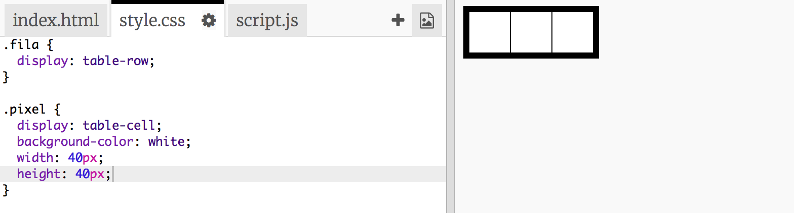
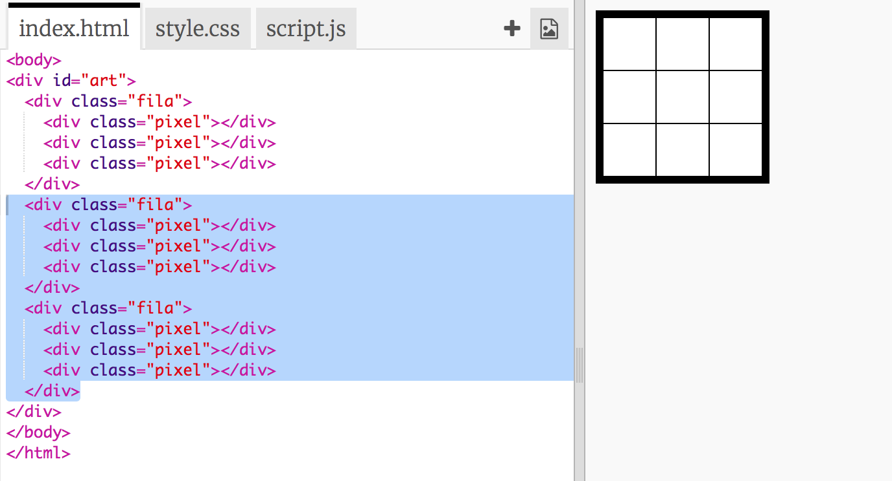
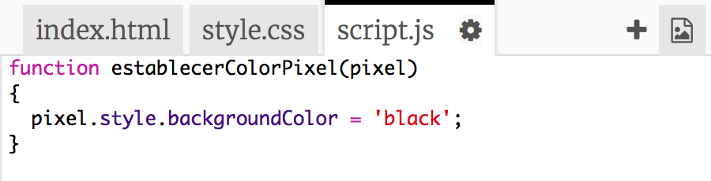
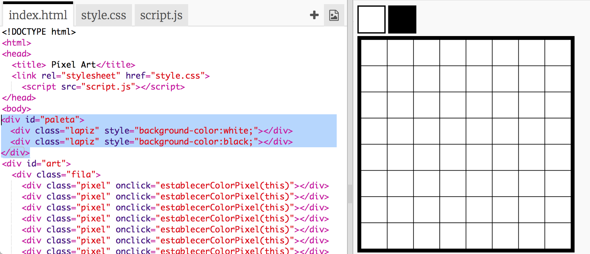
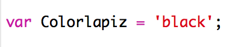

---
title: Pixel Art
level: HTML & CSS 2
language: es-ES
embeds: "*.png"
materials: ["Recursos para el líder del Club/*.*","Recursos del proyecto/*.*"]
stylesheet: web
...

# Introducción {.intro}

En este proyecto, vamos a crear un editor de pixel art. Además de usar HTML y CSS, aprenderás a usar JavaScript para dar interactividad a tu proyecto.

  <iframe src="https://trinket.io/embed/html/0e102a306b?outputOnly=true&start=result" width="600" height="450" frameborder="0" marginwidth="0" marginheight="0" allowfullscreen>
  </iframe>
  

__Cómo usar el editor__: Haz clic en un color de la paleta para escoger el color de dibujo, y después haz clic en los píxeles para cambiar su color.

# Paso 1: Crear una cuadrícula de píxeles {.activity}

Vamos a crear una cuadrícula de píxeles que puedas usar para crear pixel art. CSS tiene estilos de tabla para diseñar cuadrículas y tablas. 

Las tablas contienen filas que contienen celdas. Vamos a crear una tabla de fondo negro, y le vamos a añadir píxeles de color blanco. 

## Lista de tareas de la actividad { .check}

+ Abre este trinket: <a href="http://jumpto.cc/web-pixel" target="_blank">jumpto.cc/web-pixel</a>. Si estás leyendo este proyecto en línea, también puedes usar el trinket incrustado que encontrarás a continuación. 

  <iframe src="https://trinket.io/embed/html/705f264f59" width="100%" height="400" frameborder="0" marginwidth="0" marginheight="0" allowfullscreen>
  </iframe>

+ Añade el siguiente html en el `<body>` (cuerpo) del archivo `index.html` para crear un `
` que contenga tu pixel art, y asígnale un id `art` para que le puedas dar estilo:

	

 	A continuación, selecciona el archivo `style.css` y añade el estilo de tabla en el `
` art. Fíjate en que las tres líneas de píxel son iguales. Escribe la primera, y usa copiar y pegar para crear las demás. 

	

	Esto crea una tabla con borde, y establece la separación dentro de la cuadrícula. 

	Todavía no parece muy interesante, ya que tienes que añadir filas de píxeles dentro de la cuadrícula. 

 + Vuelve al archivo `index.html` y añade una fila de 3 píxeles dentro del `
` art:

	

 	En esta ocasión, estás usando categorías ("class") para dar estilo a los divs, ya que habrá varios de ellos. 

 	Añade el siguiente estilo a las filas y celdas:

	

 	Ahora tus píxeles se alinearán en una cuadrícula con líneas negras alrededor. 

 + A continuación, añade otras dos filas de píxeles para crear una cuadrícula de 3 x 3. Recuerda usar copiar y pegar para ir más rápido. 

	
	
    
##Desafío: Modifica el tamaño de la cuadrícula {.challenge}

Una cuadrícula de 3x3 es demasiado pequeña para crear pixel art. ¿Puedes hacer que la cuadrícula sea más grande? 8x8 es un buen tamaño para crear pixel art. 

Intenta usar copiar y pegar en lugar de escribirlo todo de nuevo. 

## Guarda tu proyecto {.save}

# Paso 2: Colorea los píxeles {.activity}

HTML se usa para organizar los contenidos, y CSS para darle estilo. JavaScript es un lenguaje de programación que se puede usar para cambiar una página web al interactuar con ella. 

Podrías usar HTML y CSS para cambiar el color de fondo de cada uno de los píxeles, ¡pero sería muy lento! En lugar de eso, vamos a añadir código de JavaScript para colorear los píxeles de forma automática cuando hagas clic en ellos. 

+ En JavaScript, el código se escribe en una `función` a la que podemos llamar cuando queramos ejecutar ese código. 

	Vamos a crear una función que se llame `establecerColorPixel`

	La función `establecerColorPixel` necesita saber a qué píxel tiene que cambiar el color; esto es una entrada o `input`.

	Añade el siguiente código en el archivo `script.js` para establecer el color de fondo de un píxel:

	

	¿Te has fijado en que `backgroundColor` se escribe siguiendo las normas de la ortografía estadounidense, y no la británica (colour)?. 

+ Ahora tenemos que llamar a esta función cada vez que se haga clic en un píxel.

	En HTML se usa `onclick` para llamar una función cuando se hace clic en un elemento. Tendrás que pasar la expresión 'this' como el input para que la función identifique a qué píxel debe cambiar el color. 

	Ve a `index.html` y añade el siguiente código al primer píxel:

	

+ Prueba el código haciendo clic en el primer píxel. Debería volverse negro:

	

	Solo has añadido el código `onclick` en el primer píxel, así que en el resto de píxeles no funcionará aún. 

##Desafío: Haz que todos los píxeles sean clicables {.challenge}

¿Puedes hacer que todos los píxeles sean clicables? Usa cortar y pegar para ir más rápido. 

Crea una obra sencilla de pixel art. 

Consejo: Puedes hacer clic en __Autorun__ para borrar todos los píxeles. 

# Paso 3: Añade una paleta de colores {.activity}

¿No te parece molesto que no puedas volver a cambiar el color de un píxel a blanco si te has equivocado? Vamos a arreglarlo creando una paleta de colores en la que puedas pulsar en un color para cambiar el color del lápiz. 

+ Empezaremos por crear un estilo de lápiz. 

	Añade el siguiente código al final del archivo `style.css`:

	

+ A continuación, crearemos lápices de color blanco y negro que usen ese estilo. 

	Añade el siguiente código en `index.html` después de `<body>`:

	

	`style=` nos permite añadir CSS dentro del HTML, lo que en este caso nos va muy bien. 

+ Podremos cambiar el color del lápiz cuando hagamos clic en un color de la paleta. 

	Las variables se usan para almacenar información. Vamos a crear la variable ColorLapiz en `script.js`.

	Añade el siguiente código en la parte superior del archivo:

	

	A continuación, añade una función para cambiar Colorlapiz:

	

+ También tendrás que usar el color del lápiz cuando quieras cambiar el color de un píxel. 

	Cambia la función `establecerColorPixel` para que use la variable `Colorlapiz` en lugar de `black` (negro):

	 

+ A continuación tendrás que llamar a la función `establecerColorLapiz` cuando se haga clic en el color de un lápiz. 

	Añade el código `onclick` marcado a los colores de tus lápices:

	

+ Prueba si puedes cambiar el color del lápiz entre blanco y negro, para colorear o borrar píxeles.

## Guarda tu proyecto {.save}

##Desafío: Añade más colores a la paleta {.challenge}

¿Puedes añadir más colores a la paleta? Escoge los colores con los que te gustaría crear pixel art. 

Y crea un pixel art muy chulo.

Pista: El color verde chillón se llama `chartreuse`.

Pregunta al líder del club si puedes usar la herramienta de Recorte de Windows u otra alternativa para guardar una copia de tu pixel art como imagen. 

## Guarda tu proyecto {.save}

