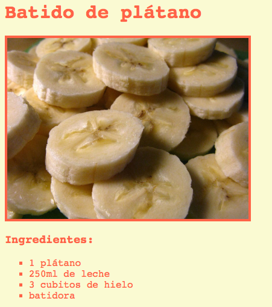
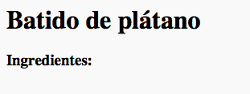
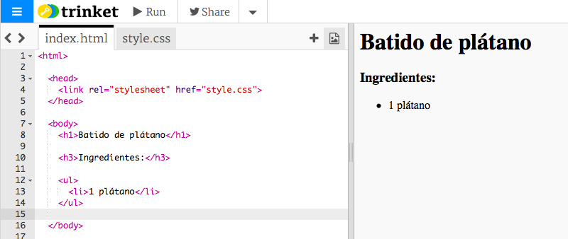
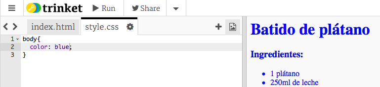
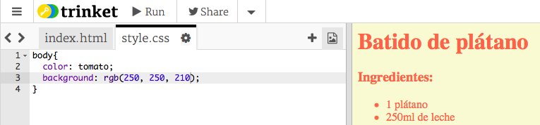
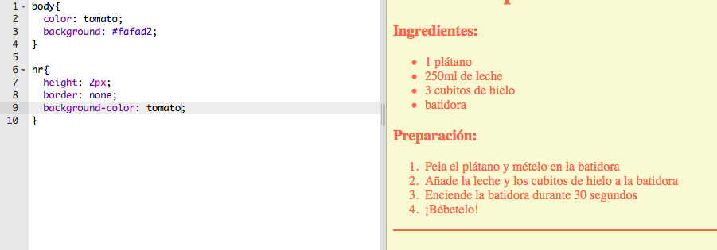
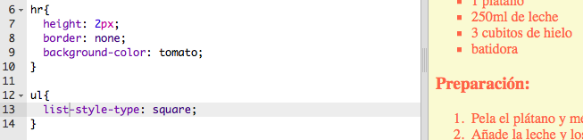

---
title: Receta
level: HTML y CSS 1
language: es-ES
embeds: "*.png"
materials: ["Club Leader Resources/*.*","Project Resources/*.*"]
stylesheet: web
...

# Introducción { .intro}

En este proyecto aprenderás a crear una pagina web para tu receta favorita.



# Paso 1: Decide que receta quieres hacer { .activity}

Antes de empezar a codificar tienes que pensar en una receta.

## Lista de tareas de la actividad { .check}

+ Piensa en una receta para compartir con tu amigos. Esta podría ser: 
	+ Una receta que encuentres online;
	+ Tu comida preferida;
	+ Algo que hayas hecho

La receta utilizada en este proyecto es un batido de plátano. Puedes copiar esta recete si no encuentras una por tu cuenta.

# Paso 2: Ingredientes { .activity}

Vamos a mostrar la lista de ingredientes necesarios para tu receta.

## Lista de tareas de la actividad { .check}

+ Abre esta plantilla de trinket: [jumpto.cc/trinket-template](http://jumpto.cc/trinket-template). Si estás leyendo esto en el navegador incluso podrías usar la versión embebida del trinket que verás abajo.

<div class="trinket">
  <iframe src="https://trinket.io/embed/html/ef4c882ae6" width="100%" height="400" frameborder="0" marginwidth="0" marginheight="0" allowfullscreen>
  </iframe>
</div>

+ Para la lista de ingredientes vamos a usar una __lista desordenada__ usando la etiqueta `<ul>`. Ve a la línea 8 de la plantilla y añade este HTML, reemplazando el texto entre las etiquetas `<h1>` con el nombre de tu receta:

```
<h1>Batido de plátano</h1>

<h3>Ingredientes:</h3>

<ul>

</ul>
```

+ Revisa tu página web, deberías ver dos encabezados.



Aún no verás los ingredientes porque todavía no has añadido ninguna lista de elementos.

+ El siguiente paso es añadir una lista de elementos en tu lista. Para ello usaremos la etiqueta `<li>`. Añade el siguiente código dentro de la etiqueta `<ul>`:

```
<li>1 plátano</li>
```


Como tu lista es una lista desordenada no hay números delante de los elementos, solo hay puntos.

##Desafío: Más ingredientes {.challenge}
¿Puedes añadir todos los ingredientes de __tu__ receta?

Tu página web debería quedar parecida a esta:


## Guarda tu proyecto {.save}

# Paso 3: Preparación { .activity }

A continuación vamos a explicar como hacer la receta.

## Lista de tareas de la actividad { .check}

+ Ahora vamos a usar otra lista para escribir la preparación, pero esta vez vamos a usar una __lista ordenada__ utilizando la etiqueta `<ol>`.

Una lista ordenada es una lista numérica, que deberíamos emplear cuando el orden de los pasos es importante.

Añade este código bajo la lista de ingredientes. Asegurate de que este dentro de las etiquetas de `<body>`:

```
<h3>Preparación:</h3>

<ol>

</ol>
```


+ Ahora solo tienes que añadir la lista de elementos dentro de la nueva lista ordenada:

```
<li>Pela el plátano y mételo en la batidora</li>
```


Date cuente de que los elementos de la lista están numerado automáticamente.

##Desafío: Más pasos {.challenge}
¿Puedes añadir todos los pasos para hacer __tu__ receta?

La preparación debería quedar algo así:


## Guarda tu proyecto {.save}

# Paso 4: ¡Colores! { .activity}

Vamos a añadir algo de color a tu página web.

## Lista de tareas de la actividad { .check}

+ Ya habíamos aprendido como añadir color al texto de la página web. Añade el siguiente código dentro del fichero `style.css` para que el color de todo el texto del la página web sea azul:

```
body {
    color: blue;
}
```



+ El navegador conoce colores como `blue` (azul), `yellow` (amarillo) e incluso `lightgreen` (verde claro), pero, ¿sabías que los navegadores actuales conocen más de 500 __nombres__ de colores distintos?

Existe una lista con todos los nombres de color que puedes usar: [jumpto.cc/web-colours](http://jumpto.cc/web-colours), que incluye nombres de colores como `tomato` (tomate), `firebrick` (ladrillo refractario) y `peachpuff` (melocotón pocho).

Cambia el color del texto de `blue` (azul) to `tomato` (tomate).


+ Tu navegador conoce el nombre de 140 colores, pero, ¡conoce los __valores__ de más de 16 millones de colores!


Así como debes saber, todos los colores se pueden obtener a partir de los colores primarios: rojo, verde y azul. Para indicarle al navegador que color mostrar tan solo necesitas saber que cantidad de cada color primario emplear.

La cantidad de color rojo, verde y azul que se usará puede ser escrito como un número entre `0` y `255`.


Añade este código al CSS para cambiar el color del cuerpo de la página web, se mostrará un color amarillo claro en el fondo:

```
background: rgb(250,250,210);
```



+ Si lo prefieres puedes decirle al navegador que color mostrar mediante código hexadecimal (o __hex code__). Esto funciona de una manera similar al código `rgb()` de arriba, excepto que los códigos hexadecimales empiezan con el símbolo `#`, y usan ‘números’ hexadecimales entre `00` y `ff` para la cantidad de rojo, verde y azul.


Sustituye el código `rgb()` en la CSS con este código hexadecimal:

```
background: #fafad2;
```


Deberías ver el mismo tono de amarillo claro que antes

## Guarda tu proyecto {.save}

# Paso 5: Toques finales { .activity}

Vamos a añadir un poco más de HTML y CSS para mejorar tu página web.

## Lista de tareas de la actividad { .check}

+ Puedes añadir una línea horizontal al final de la receta usando la etiqueta `<hr>`.


Date cuenta de que esta etiqueta no tiene etiqueta de finalización, como la etiqueta ``.

+ La línea que acabamos de añadir no encaja con el estilo del resto de la página. Vamos a arreglar esto añadiendo algo de código CSS:

```
hr {
    height: 2px;
    border: none;
    background-color: tomato;
}
```



+ Incluso puedes cambiar como son los puntos de las listas desordenadas con este código CSS:

```
ul {
    list-style-type: square;
}
```



##Desafío: ¡Más colores! {.challenge}
Cambia los colores en tu código utilizando nombres de color, valores `rgb()` y códigos hexadecimales. Existe una lista de colores en <a href="http://jumpto.cc/web-colours" target="_blank">jumpto.cc/web-colours</a>.

Algunos ejemplos de colores:

+ Rojo se puede escribir como:
	+ `red` (¡obviamente!)
	+ `rgb(255,0,0)` (todo de rojo, sin verde y sin azul)
	+ `#ff0000`

+ Verde oliva se puede escribir como:
	+ `olive`
	+ `rgb(128, 128, 0)` (un poco de rojo y un poco de verde, y sin azul)
	+ `#808000`

Intenta que los colores que uses encajen con tu receta.

## Guarda tu proyecto {.save}

##Desafío: Revisiones {.challenge}
Pídele a tus amigos que dejen una revisión para tu receta. Necesitarás crear otra lista para hacer esto.


## Guarda tu proyecto {.save}

##Desafío: Más estilos {.challenge}
¿Puedes añadir una imagen en tu receta? ¿O cambiar el tipo de fuente? Así es como tu página web podría quedar:


Este código te podrá ayudar:

```
font-family: Arial / Comic Sans MS / Courier / Impact / Tahoma;
font-size: 12pt;
font-weight: bold;


```

## Guarda tu proyecto {.save}

## Community Contributed Translation { .challenge .pdf-hidden }

This project was translated by Javier Suárez Jiménez. Our amazing translation volunteers help us give children around the world the chance to learn to code.  You can help us reach more children by translating a Code Club project via [Github](https://github.com/CodeClub/curriculum_documentation/blob/master/contributing.md) or by getting in touch with us at hello@codeclubworld.
