---
title: Revista
level: HTML & CSS 2
language: es-ES
embeds: "*.png"
materials: ["Recursos para el líder del Club/*.*","Recursos del proyecto/*.*"]
stylesheet: web
...

# Introducción { .intro}

En este proyecto, vamos a aprender a usar HTML y CSS para crear una página web que muestre una revista con un diseño de dos páginas. También volveremos a usar un montón de técnicas de HTML y CSS que hemos visto en otros proyectos. 

  <iframe src="https://trinket.io/embed/html/a41e4e1c5c?outputOnly=true&start=result" width="600" height="500" frameborder="0" marginwidth="0" marginheight="0" allowfullscreen>
  </iframe>
  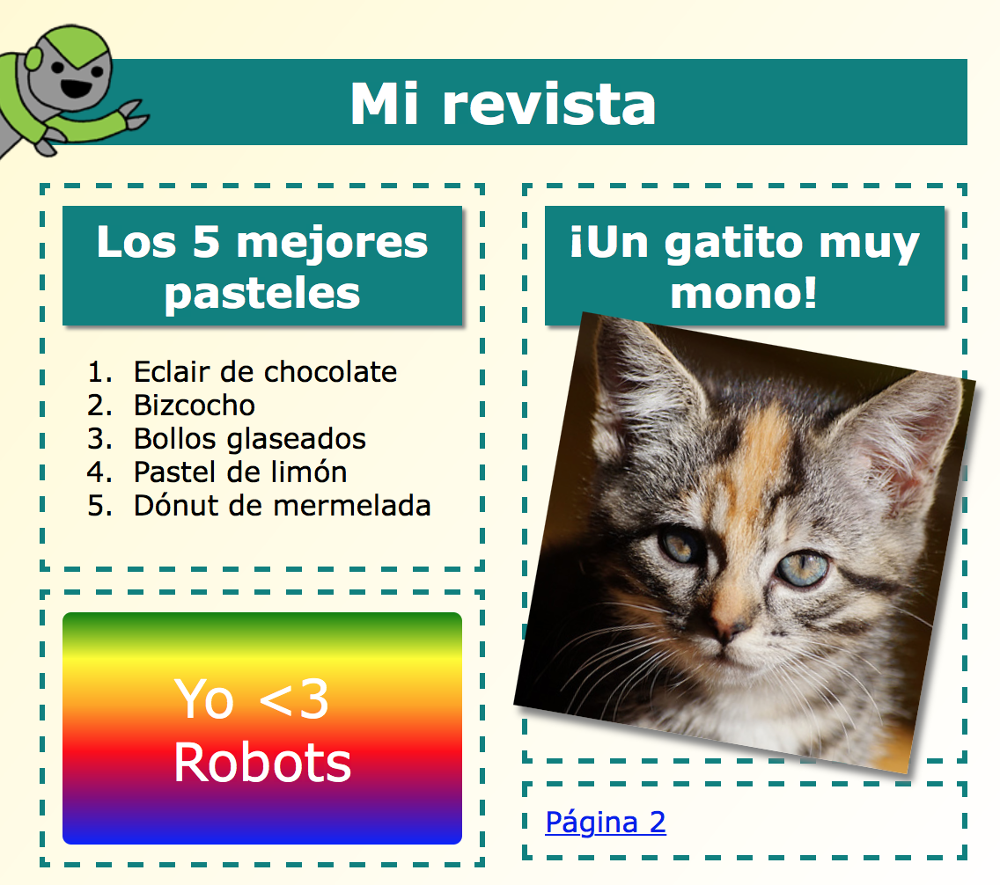

# Paso 1: Encabezado y fondo

Las páginas web diseñadas al estilo de una revista a menudo tienen muchos objetos pequeños en sus páginas. En primer lugar, vamos a crear un encabezado con un fondo para tu revista. 

## Lista de tareas de la actividad { .check}

+ Abre este trinket: <a href="http://jumpto.cc/web-magazine" target="_blank">jumpto.cc/web-magazine</a>. Si estás leyendo este proyecto en línea, también puedes usar la versión incrustada de este trinket que encontrarás más abajo.

  <iframe src="https://trinket.io/embed/html/cef5e64bc0" width="100%" height="400" frameborder="0" marginwidth="0" marginheight="0" allowfullscreen>
  </iframe>

+ Vamos a añadir un encabezado. 

	Puedes cambiar el título de tu revista por otro mejor que se te ocurra. 

	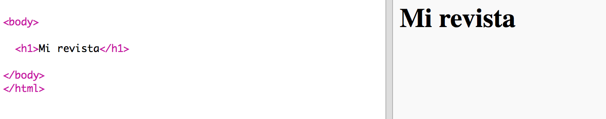

+ ¿Puedes dar estilo al encabezado?

	Este es un ejemplo, pero puedes escoger tu propio estilo:

	

+ Ahora crearemos un fondo interesante usando el degradado, y escogeremos una fuente para la revista. 

	Aquí tienes un ejemplo de estilo para recordarte cómo se crea un degradado: 

	

## Guarda tu proyecto {.save}

# Paso 2: Crear columnas

Las páginas web a menudo utilizan varias columnas. Vamos a hacer que tu revista tenga una distribución de dos columnas.

## Lista de tareas de la actividad { .check}

+ Primero, crea dos `div` de columna.

	Añade el siguiente HTML a `index.html`:

	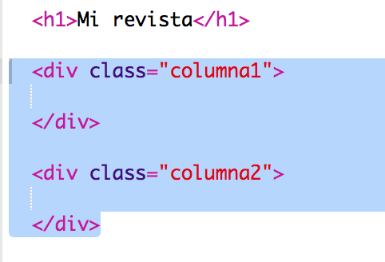

+ A continuación, dale estilo a los div de columna para que uno flote a la izquierda y el otro a la derecha. 

	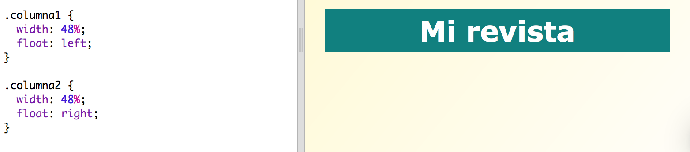

	Las columnas ocupan menos del 50% para dejar espacio de relleno. 

	Tendrás que añadir algo a una columna para ver el efecto. 

+ Vamos a añadir la foto de un gatito en la parte superior de la columna 2. 

	

	Fíjate que la imagen del gatito está situada más o menos en la mitad de la página, en la segunda columna. 

	¡Parece un poco grande!

+ Vamos a usar `max-width: ` para hacer que las imágenes encajen en su contenedor. 

	Añade este estilo en `style.css`.

	

	Este estilo se aplicará a todas las imágenes que uses en tu revista, no sólo a la del gatito.

+ Ahora añade una categoría ("class") de `foto` a la imagen para poder darle estilo:

	

+ Dale estilo a la imagen añadiendo sombra e inclinándola para que parezca que sobresale de la página:

	

	Haz varios cambios hasta que te guste el resultado. 

# Paso 3: Dar estilo a los objetos de la revista

Vamos a hacer que la presentación sea un poco  más interesante. 

## Lista de tareas de la actividad { .check}

+ Añade un `div` alrededor de tu imagen con un `class`, y añade un encabezado `h2`:

	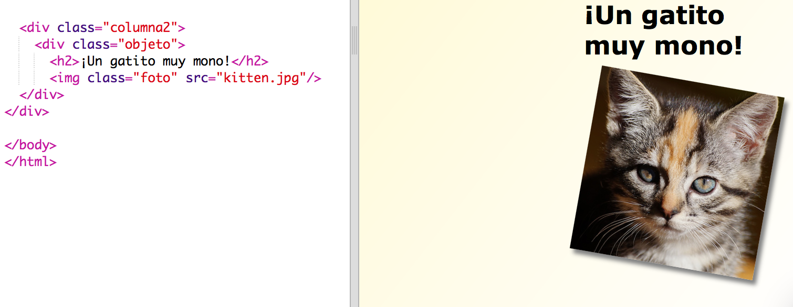

+ A continuación dale estilo al objeto y al encabezado. 

	Fíjate en este ejemplo, aunque puedes hacer cambios:

	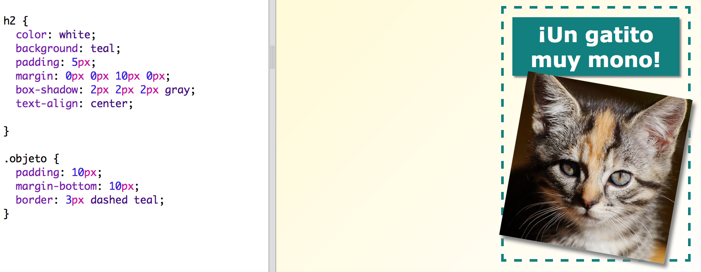

## Guarda tu proyecto {.save}

##Desafío: Añade objetos en la columna izquierda {.challenge}

¿Puedes añadir una lista numerada y una etiqueta con texto y degradado en la columna de la izquierda? 

Fíjate en este ejemplo:

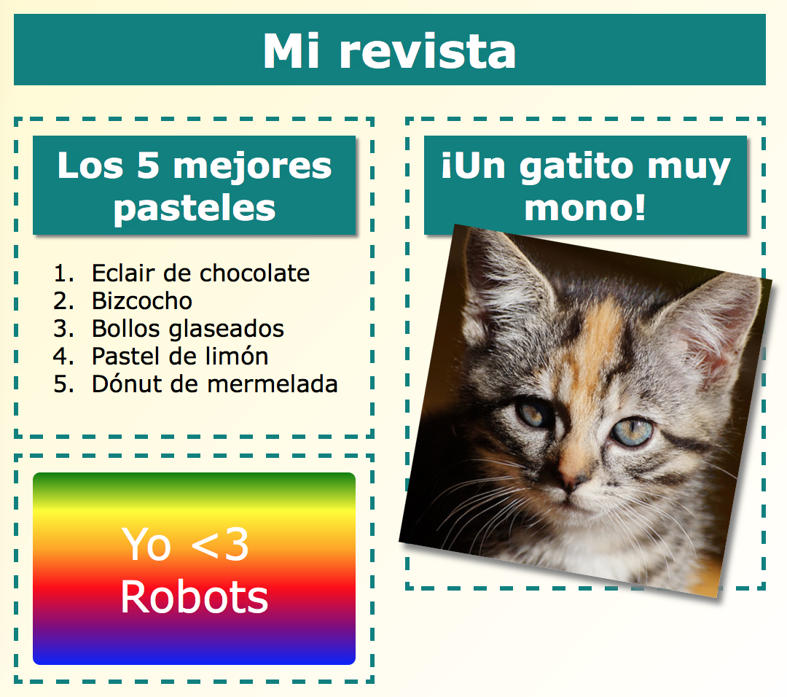

Este es el código del ejemplo, pero puedes cambiarlo o inventarte tu propio código.

HTML:

CSS:

## Guarda tu proyecto {.save}

# Paso 4: Añade otra página

Vamos a añadir otra página a la página web de tu revista. 

## Lista de tareas de la actividad {.check}

+ Añade una nueva página a tu proyecto y llámala `pagina2.html`:

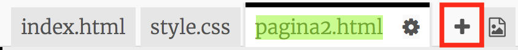

+ La página 2 será muy parecida a la primera página de tu revista, así que puedes copiar el html de `index.html` y pegarlo en `pagina2.html`.

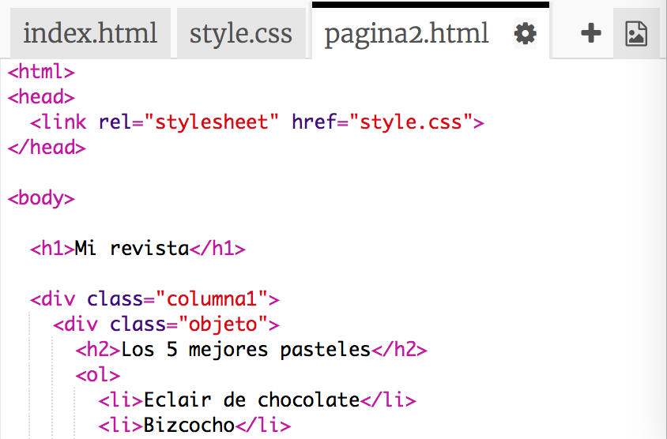

Fíjate que las dos páginas usan el mismo `style.css`, así que compartirán los mismos estilos. 

+ Cambia el título de `<h1>` por Página 2: 

+ Ahora necesitarás enlaces entre las páginas para que puedas saltar a la página 2 y volver a la página principal. 

Vuelve a `index.html`. Añade un enlace dentro de un div en la columna 2 de `index.html`:

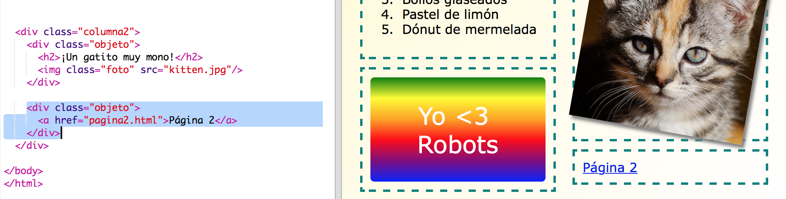

+ Prueba si al hacer clic en el nuevo enlace te lleva a la página 2 de tu revista. 

##Desafío: Añade un enlace que te devuelva a la primera página {.challenge}

¿Puedes añadir un enlace en `pagina2.html` que te devuelva a la primera página cuando hagas clic en él?

Pista: Fíjate en el HTML que has usado para crear un enlace a la página 2. 

##Desafío: Completa la segunda página {.challenge}

Aquí tienes el código para los ejemplos, aunque también puedes cambiar los `div` o aplicar tus propias ideas.  

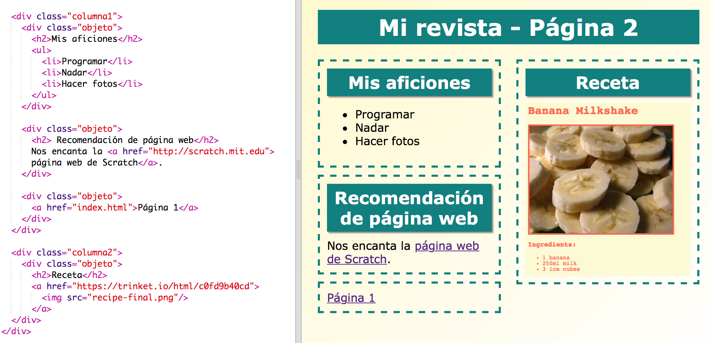

Haz clic en el icono de las imágenes para ver qué imágenes se pueden usar:

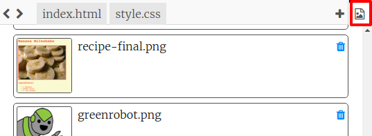

Recuerda que puedes cargar tus propias imágenes para usarlas. Asegúrate de que tienes permiso para usar las imágenes que cargues. 

# Paso 5: Incluir una animación

Vamos a hacer que tu revista sea más divertida. 

## Lista de tareas de la actividad {.check}

+ Selecciona `index.html` e incluye la imagen `greenrobot.png` en la parte superior de la página. 

+ A continuación añade este CSS para animar a tu robot:

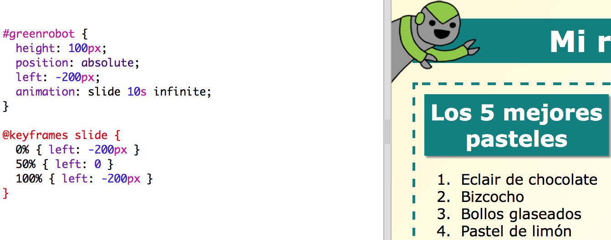

##Desafío: Incluye otra animación {.challenge}

¿Puedes añadir una animación en la segunda página de tu revista? 

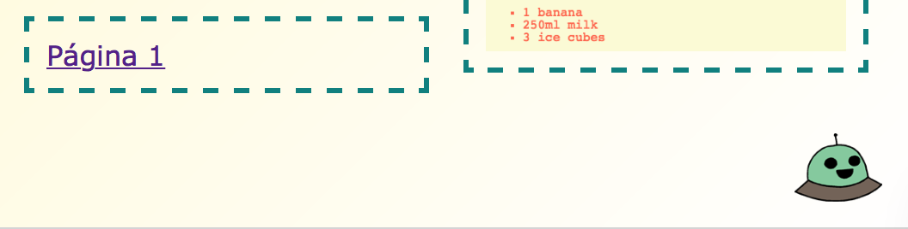

