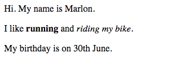

# Introducción { .intro}

En este proyecto, empezarás a usar HTML y CSS para aprender cómo hacer tu propia tarjeta de cumpleaños personalizada.


# Paso 1: ¿Qué es HTML? { .activity}

HTML son las siglas de __HyperText Markup Language__ (Lenguaje de Marcas de Hipertexto), y es el lenguaje que se usa para crear páginas web. ¡Vamos a ver un ejemplo!

## Lista de tareas de la actividad { .check}

+ Tendrás que usar una página web llamada Trinket para escribir HTML. Abre este Trinket: <a href="http://jumpto.cc/web-intro" target="_blank">jumpto.cc/web-intro</a>. Si estás leyendo este proyecto online, también puedes usar la versión incrustada de Trinket que aparece a continuación:

<div class="trinket">
	<iframe src="https://trinket.io/embed/html/850a678202" width="100%" height="400" frameborder="0" marginwidth="0" marginheight="0" allowfullscreen>
	</iframe>
</div>

+ El código que aparece a la izquierda del Trinket es HTML. A la derecha, aparece la página web que se crea con el código HTML.

	HTML usa __etiquetas__ para crear páginas web. ¿Puedes ver este HTML en la línea 8 de tu código?

	```
	<p>Hi. My name is Andy.</p>
	```

	`<p>` es un ejemplo de etiqueta, y es la abreviación de __paragraph__ (párrafo). Puedes empezar un párrafo con `<p>` y acabarlo con `</p>`.

+ ¿Eres capaz de encontrar otras etiquetas? Otra etiqueta que a lo mejor has visto en la línea 9 es `<b>`, que es la abreviación de __bold__ (negrita):

	```
	<b>running</b>
	```

	Éstos son algunos ejemplos más:

	+ `<html>` y `</html>` marcan el inicio y el final del documento de HTML;
	+ `<head>` y `</head>` (cabecera) es donde se encuentran cosas como CSS (Hablaremos de esto más adelante);
	+ `<body>` y `</body>` (cuerpo) es donde se añade el contenido de la página web.

	

+ Cambia uno de los párrafos de texto en el HTML (a la izquierda). Presiona 'Run' (ejecutar) y podrás ver el cambio en la página web (a la derecha).

	

+ Si te has equivocado y quieres deshacer los cambios, puedes hacer clic en el botón de menú y seleccionar 'Reset' (Reiniciar). ¡Haz una prueba!

	

## Guarda tu proyecto {.save}

__¡No necesitas una cuenta de Trinket para guardar tus proyectos!__ 

Si no tienes una cuenta de Trinket, haz clic en la flecha hacia abajo y selecciona 'Link' (Enlace). Esto te proporcionará un enlace que puedes guardar y al que puedes volver más tarde. ¡Tendrás que hacer esto cada vez que hagas modificaciones, ya que el enlace cambia!


Si tienes una cuenta de Trinket, la forma más fácil de guardar tu página web es hacer clic en el botón 'Remix' (Remezclar) en la parte superior del Trinket. Esto guardará una copia del Trinket en tu perfil.


##Reto: Añade otro párrafo {.challenge}
¿Puedes añadir un tercer párrafo de texto a tu página web, por debajo de los otros dos? Recuerda que el nuevo párrafo tiene que empezar con una etiqueta `<p>`, y acabar con `</p>`.

Tu página web debería parecerse a ésta:



¿Puedes añadir texto __en negrita__ y <u>subrayado</u> al nuevo párrafo? Para subrayar texto, necesitarás usar `<u>` y `</u>`.

## Guarda tu proyecto {.save}

# Paso 2: ¿Qué es CSS? { .activity}

CSS son las siglas de __Cascading Style Sheets__ (Hojas de Estilos en Cascada), y es el lenguaje que se usa para crear el estilo de las páginas web y que sean atractivas. Puedes vincular tu página web a un archivo de CSS en el apartado `<head>` de un documento HTML así:


## Lista de tareas de la actividad { .check}

+ CSS contiene todas las __propiedades__ para una etiqueta en concreto. Haz clic en la pestaña 'style.css' para ver el CSS de tu página web.

	

+ Encuentra este código:

	```
	p {
		color: black;
	}
	```

	Este código CSS especifica una propiedad para los párrafos, y hace que el color del texto sea negro.

+ Cambia la palabra 'black' (negro) en el CSS por 'blue' (azul). Tendrías que ver cómo cambia el color del texto de todos los párrafos a azul.

	

## Guarda tu proyecto {.save}

##Reto: Añade más estilo {.challenge}
¿Puedes hacer que el color de los párrafos de texto cambie a naranja? ¿Puedes cambiar el color de fondo a gris?


## Guarda tu proyecto {.save}

# Paso 3: Crear una tarjeta de cumpleaños { .activity}

Vamos a usar lo que has aprendido sobre HTML y CSS para crear tu propia tarjeta de cumpleaños personalizada.

## Lista de tareas de la actividad { .check}

+ Abre este Trinket: <a href="http://jumpto.cc/web-card" target="_blank">jumpto.cc/web-card</a>, o usa la versión incrustada que aparece más abajo si estás leyendo este proyecto online.

<div class="trinket">
	<iframe src="https://trinket.io/embed/html/90506676c9" width="100%" height="400" frameborder="0" marginwidth="0" marginheight="0" allowfullscreen>
	</iframe>
</div>

No te preocupes si no entiendes todo el código. Esta tarjeta de cumpleaños es bastante aburrida, así que vamos a hacer algunos cambios en este HTML y CSS.

+ Haz clic en el botón que hay delante de la tarjeta, y verás cómo se abre y muestra la parte interior.

	

+ Ve a la línea 13 del código. Igual que en el ejemplo anterior, puedes editar el texto en el HTML para personalizar la tarjeta.

	

+ ¿Puedes encontrar el HTML para la imagen del robot? (Pista: ¡está en la línea 16!) Cambia la palabra `robot` por `sol`, ¡y verás cambiar la imagen!

	

	Puedes usar las palabras `chico`, `diamante`, `dinosaurio`, `flores`, `chica`, `arcoíris`, `robot`, `nave`, `sol`, `té`, o `trofeo`.

+ También puedes editar el CSS de la tarjeta de cumpleaños. Presiona la pestaña “style.css”. Empieza con el CSS para el `exterior` de la tarjeta. Cambia el `background-color` (color de fondo) a `lightgreen` (verde claro).

	

+ Además, puedes cambiar el tamaño de las imágenes. Ve a la línea 29 del CSS, y cambia `width` (anchura) y `height` (altura) de la imagen exterior a `200px` (`px` significa píxeles).

		

+ Otra cosa que puedes cambiar es la fuente. Ve a la línea 24 y cambia `font-family` (tipo de fuente) a `Comic Sans MS` y `font-size` (tamaño de fuente) a `16pt`.

	

	Puedes usar otras fuentes como <span style="font-family: Arial;">arial</span>, <span style="font-family: impact;">Impact</span> y <span style="font-family: tahoma;">Tahoma</span>. 

## Guarda tu proyecto {.save}

##Reto: Crea una tarjeta personalizada {.challenge}
Usa todo lo que has aprendido sobre HTML y CSS para acabar tu tarjeta personalizada. No tiene que ser una tarjeta de cumpleaños, ¡podría ser para cualquier ocasión!

Mira este ejemplo:


## Guarda tu proyecto {.save}

Ahora que has acabado tu tarjeta, puedes compartirla o enviársela por correo a alguien.


## Community Contributed Translation { .challenge .pdf-hidden }

This project was translated by Montse Verdaguer. Our amazing translation volunteers help us give children around the world the chance to learn to code.  You can help us reach more children by translating a Code Club project via [Github](https://github.com/CodeClub/curriculum_documentation/blob/master/contributing.md) or by getting in touch with us at hello@codeclubworld.
