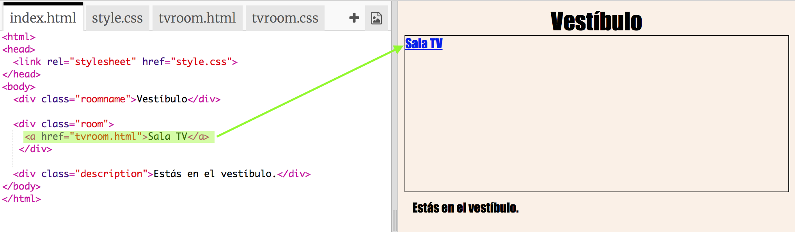
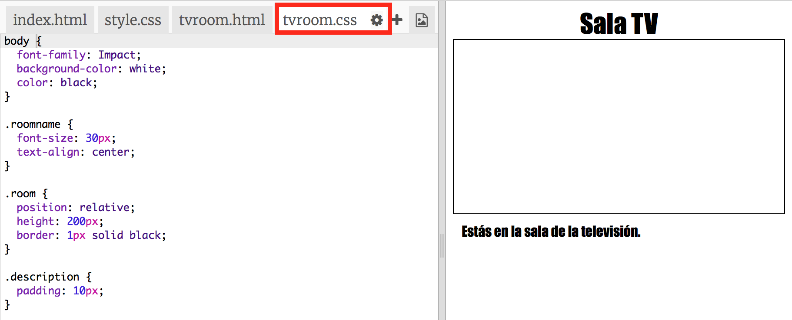
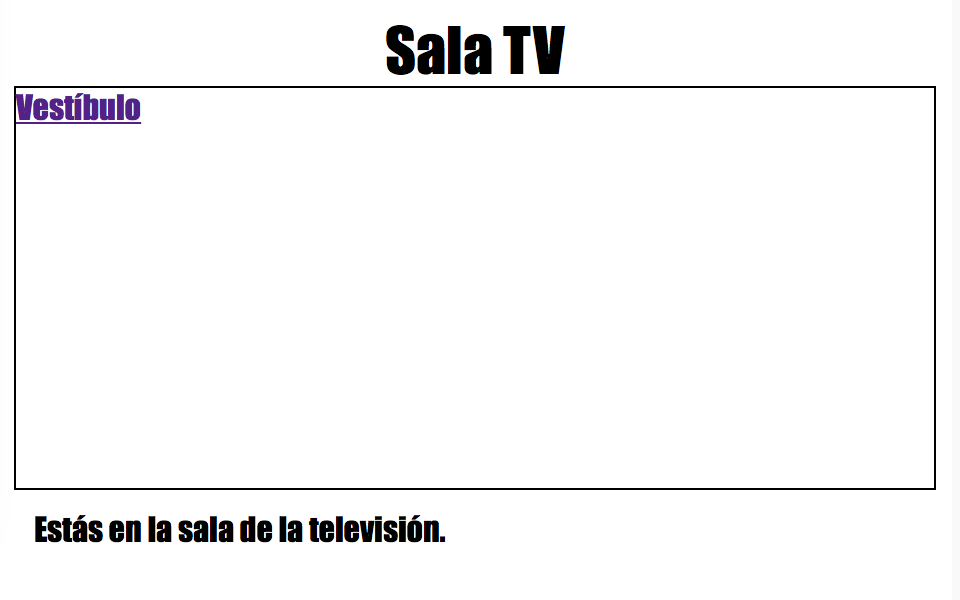
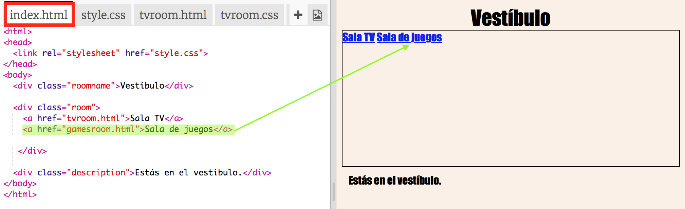
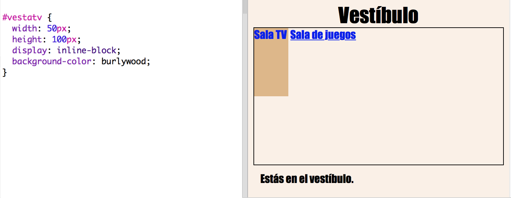

# Introducción {.intro}

En este proyecto vamos a crear varias salas enlazadas, cada una de las cuales será una página web diferente que podrás decorar con HTML.

  <iframe src="https://trinket.io/embed/html/ba5d27ec68?outputOnly=true&start=result" width="600" height="450" frameborder="0" marginwidth="0" marginheight="0" allowfullscreen>
  </iframe>
  

__Instrucciones__: Haz clic en las puertas para moverte entre las salas.

# Paso 1: Crear un enlace a otra página web en el mismo proyecto {.activity}

Los proyectos web pueden estar formados por un montón de archivos HTML enlazados entre si.

## Lista de tareas de la actividad { .check}

+ Abre este trinket: <a href="http://jumpto.cc/web-rooms" target="_blank">jumpto.cc/web-rooms</a>. Si estás leyendo este proyecto en línea, también puedes usar el siguiente trinket incrustado:

  <iframe src="https://trinket.io/embed/html/ef608f0733" width="100%" height="400" frameborder="0" marginwidth="0" marginheight="0" allowfullscreen>
  </iframe>

+ El trinket debería ejecutarse automáticamente, y tú deberías encontrarte en el vestíbulo:

	

+ Fíjate en la lista de pestañas de este trinket. ¿Ves la pestaña`tvroom.html`? Haz clic en ella.

	

	Este es otro archivo html dentro del mismo proyecto.

+ Para poder llegar a `tvroom.html` tienes que añadir un enlace en `index.html`.

	Añade el código subrayado al `
` que contiene la categoría ("class") `room`:

	

+ Prueba tu trinket haciendo clic en el enlace __Sala TV__ para ver la página web `tvroom.html`.

	Fíjate que `tvroom.html` también tiene su propio archivo de estilo `tvroom.css`, que define el diseño de esta página.

	

##Desafío: Añadir otro enlace {.challenge}

Añade un enlace `<a>` a la página web `tvroom.html` para poder volver a la página web del vestíbulo, que se llama `index.html`. El texto del enlace debería ser 'Vestíbulo'.

Para ello, la página web de la sala de TV debería tener un enlace como este:

Asegúrate de comprobar el código. Deberías de poder moverte del vestíbulo a la Sala de TV y volver haciendo clic en los enlaces.  

## Guarda tu proyecto {.save}

# Paso 2: Añadir otra sala {.activity}

Ahora vamos a añadir otra sala, una __Sala de juegos__.

+ Haz clic en el botón de añadir página __+__:

	

	Llama a la nueva página `gamesroom.html`:

  	

+ El HTML para la __Sala de juegos__ es muy parecido al de `tvroom.html`, así que __copia__ el código y __pégalo__ en `gamesroom.html`.

	Modifica los elementos subrayados para que aparezca juegos en lugar de TV:

	

+ La página `gamesroom.html` está usando `gamesroom.css`, que aún no existe.

	Crea `gamesroom.css` haciendo clic en el botón de añadir página __+__.

+ El CSS de la __Sala de juegos__ es muy parecido al de `tvroom.css`, así que __cópialo__ y __pégalo__ en `gamesroom.css`.

	

+ Crea un enlace en el vestíbulo a la Sala de juegos:

	

+ Prueba tu proyecto haciendo clic en el enlace de la Sala de juegos.

	La __Sala de juegos__ debería de parecerse a esta:

	

	No parece muy interesante, pero podemos arreglarlo en el próximo desafío.

## Guarda tu proyecto {.save}

##Desafío: Dar estilo y enlazar la Sala de juegos {.challenge}

Modifica el HTML y el CSS de la __Sala de juegos__ para que la página web se parezca a esta:

Pista: Tendrás que cambiar el color de fondo, color de fuente y color de borde en `gamesroom.css`. El color verde chillón se llama `chartreuse`.  

Pista: Tendrás que incluir un enlace `<a>` en `gamesroom.html` que lleve a `hall.html`.

## Guarda tu proyecto {.save}

# Paso 3: Haz que los enlaces parezcan puertas {.activity}

Los enlaces no tienen por que ser sólo texto. Vamos a crear una puerta en la que podamos clicar usando un `
`.

## Lista de tareas de la actividad { .check}

+ Abre `index.html` y añade un `
` alrededor del texto del enlace __Sala TV__. Tiene que estar dentro de la `<a>` para que podamos hacer clic en él.

  Añade `id="vestatv"` para etiquetarlo como la puerta que va del vestíbulo a la Sala TV, y así podamos darle estilo.

    

+ Haz clic en la pestaña `style.css`, sitúate en el final de la página y añade el siguiente CSS para cambiar el tamaño y el color la de la puerta:

	

+ Prueba la página web haciendo clic en cualquier parte de la puerta, no sólo en el texto.

+ Ahora haremos que se parezca más a una puerta añadiendo un marco en tres de sus lados:

	

+ También añadiremos algo de CSS para hacer que el texto de la puerta sea más atractivo:

	

+ Seguramente te has dado cuenta de que la puerta está suspendida en el aire. Vamos a arreglarlo situando la puerta dentro de la sala.

	

+ Prueba tu página web haciendo clic en la puerta para entrar en la __Sala TV__.

## Guarda tu proyecto {.save}

##Desafío: ¡Añadir más puertas! {.challenge}

Convierte el resto de enlaces del proyecto en puertas siguiendo el mismo método.

Para cada puerta tendrás que:

+ Modificar el enlace de la puerta para usar un `
` con un id, como por ejemplo `vestajuegos`, para que puedas darle estilo.

	Por ejemplo:

	`<a href="gamesroom.html">
Sala de Juegos
</a>`

+ Añade CSS al id de la puerta en el archivo `.css` de la habitación. Usa _copiar_ y _pegar_ para ir más rápido. Si quieres, puedes hacer que cada puerta sea diferente.

+ Escoge la posición de la puerta usando `bottom:` (abajo), y `left:` (izquierda) o `right:` (derecha).

El vestíbulo podría parecerse a este:

La sala de TV debería de parecerse a esta:

# Paso 4: Añadir una imagen de fondo {.activity}

Vamos a decorar el vestíbulo con una imagen de fondo.

## Lista de tareas de la actividad { .check}

+  Modifica `style.css` para añadir una imagen de fondo al vestíbulo:

	

	La imagen se repetirá para cubrir la sala entera.

## Guarda tu proyecto {.save}

##Desafío: Empapelar la Sala de juegos {.challenge}

¿Puedes decorar la sala de juegos con una imagen de fondo?

Puedes usar la imagen de fondo `space-invader.png`, que está incluida en tu proyecto.

Tendrás que:

+ Añadir `background-image:` en el CSS `.room` de la Sala de juegos.

La sala decorada debería de parecerse a esta:

## Guarda tu proyecto {.save}

##Desafío: ¡Hazlo tuyo! {.challenge}

Añade más salas a tu proyecto. Recuerda que puedes usar __copiar__ y __pegar__ para ir más rápido, y después cambiar los elementos que tienen que ser diferentes.

Para cada sala tendrás que:

+ Crear un archivo `.html
+ Añadir enlaces en las puertas hacia y desde la nueva 'sala'
+ Crear un archivo `.css` con los estilos para la nueva sala y sus puertas

Puedes cambiar el `background-color:` (color de fondo) de las salas. Haz clic en el icono de imágenes para ver las imágenes de fondo que puedes escoger:

## Guarda tu proyecto {.save}
