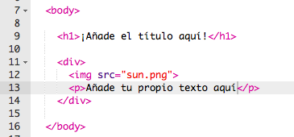
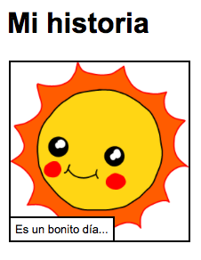

# Introducción { .intro}

En este proyecto tu aprenderás a crear tu propia página web para contar una historia, chiste o poema


# Paso 1: Decide que quieres contar { .activity}

Antes de empezar a codificar tienes que decidir que historia quieres contar.

## Lista de tareas de la actividad { .check}

+ Piensa sobre la historia que quieres contar. Podría ser:
	+ Una historia famosa;
	+ Una historia inventada por tí;
	+ Algo que te haya pasado o le haya pasado a alguien que conoces.

	Ni siquiera tiene que ser una historia. Puede ser un chiste, un poema o lo que tú quieras!

# Paso 2: Edita tu historia { .activity}

Vamos a empezar editando el contenido HTML y los estilos CSS de la página web.

## Lista de tareas de la actividad { .check}

+ Abre este trinket: <a href="http://jumpto.cc/web-story" target="_blank">jumpto.cc/web-story</a>. Si estás leyendo esto en el navegador incluso podrías usar la versión embebida del Trinket que verás abajo.

<div class="trinket">
	<iframe src="https://trinket.io/embed/html/8083cfebb3" width="100%" height="400" frameborder="0" marginwidth="0" marginheight="0" allowfullscreen>
	</iframe>
</div>

+ También debes recordar del proyecto 'Cumpleaños feliz' que el contenido de la página web va en el `<body>` del documento HTML.

	Ve a la línea 7 del código y deberías ver el contenido de la página web, que está entre las etiquetas de `<body>` y `</body>`.

	

+ ¿Podrías decir que etiquetas se usan para crear las distintas partes de la página web?

	

	+ `<h1>` es una __cabecera__. Puedes usar los números del 1 al 6 para los distintos tamaños de cabecera;
	+ `<div>` es la abreviatura de __division__, y es la manera de agrupar cosas juntas. En esta página web se usará para agrupar todo el contenido de tu historia;
	+ `` es una __imagen__;
	+ `<p>` es un __parrafo__ de texto.

##Desafío: Haz algunos cambios {.challenge}
Edita el código HTML y CSS para personalizar tu página web.



Puedes modificar los colores de la página web y también puedes elegir que fuentes utilizar como por ejemplo, <span style="font-family: Arial;">Arial</span>, <span style="font-family: Comic Sans MS;">Comic Sans MS</span>, <span style="font-family: Impact;">Impact</span> y <span style="font-family: Tahoma;">Tahoma</span>.

Si necesitas más ayuda mira el proyecto 'Cumpleaños feliz'.

## Guarda tu proyecto {.save}

# Paso 3: Contando tu historia { .activity}

Vamos a añadir una seguna parte a tu historia.

## Lista de tareas de la actividad { .check}

+ Ve a la línea 17 del código y añade un par de etiquitas `<div>` y `</div>`. Esto creará una nueva viñeta para la siguiente parte de tu historia.

	

+ Añade un parrafo de texto dentro de tus etiquetas `<div>`.

	

+ Finalmente puedes añadir una imagen en tu nueva viñeta. Para eso añade el siguiente código dentro de tu etiqueta `<div`:

	```
	
	```

	Fíjate que la etiqueta `` es un poco diferente que el resto de las etiquetas, esta no tiene etiqueta de fin.

+ Para las imágenes HTML necesitas añadir la __fuente__ de la imagen entre las comillas. Vamos a buscar una imagen para añadirla a tu historia.

	Ve a <a href="http://jumpto.cc/web-images" target="_blank">jumpto.cc/web-images</a>, y busca la imagen que quieras incluir en la historia.

+ Haz click sobre el botón derecho sobre la imagen y pincha en 'Copiar la url de la imagen'. La URL es la dirección de la imagen.

	

+ Pega la URL entre las comillas de tu etiqueta ``. ¡Deberías ver aparecer tu imagen!

	

+ __Si tienes una cuenta en Trinket__, incluso podrías añadir tu propias imágenes a tu página web! Para hacer esto, pincha el icono de imagen y después pincha en el botón de 'subir'.

	

+ Busca una imagen de tu ordenador y añadela al trinket.

	

+ Basta con que añadas el nombre de tu imagen entre las comillas de la etiqueta ``, de esta manera:

	```
	
	```

## Guarda tu proyecto {.save}

##Desafío: ¡Continuamos! {.challenge}
Usa lo que has aprendido para terminar tu historia, aquí un ejemplo:


## Guarda tu proyecto {.save}

## Community Contributed Translation { .challenge .pdf-hidden }

This project was translated by Javier Suárez Jiménez. Our amazing translation volunteers help us give children around the world the chance to learn to code.  You can help us reach more children by translating a Code Club project via [Github](https://github.com/CodeClub/curriculum_documentation/blob/master/contributing.md) or by getting in touch with us at hello@codeclubworld.