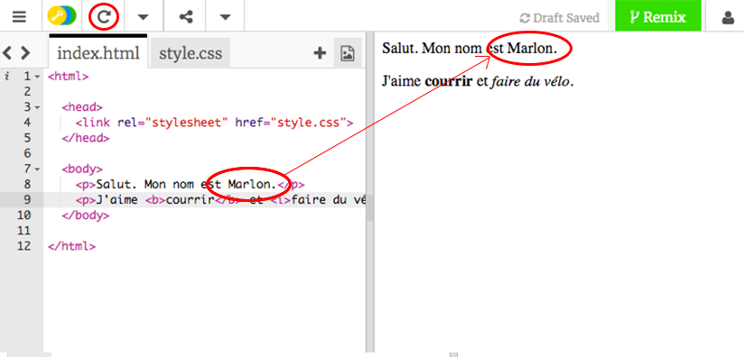
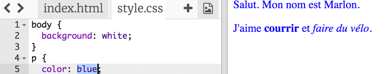
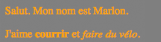
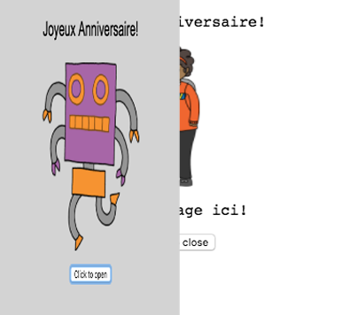
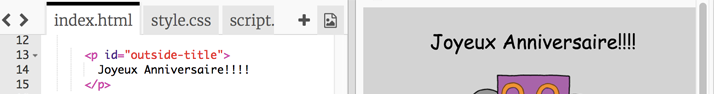
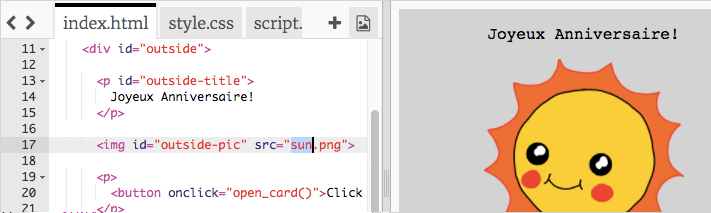
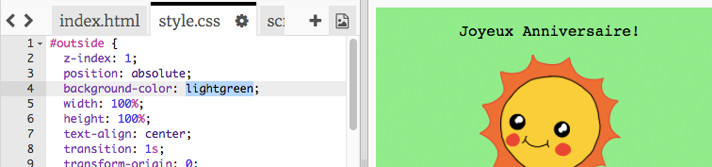
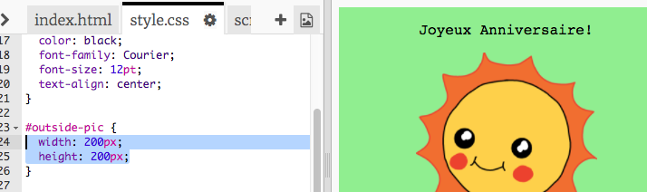
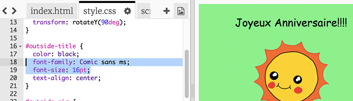

---
title: Joyeux Anniversaire
level: HTML & CSS 1
language: fr-FR
embeds: "*.png"
materials: ["Club Leader Resources/birthday-finished/*.*", "Project Resources/birthday/*.*", "Project Resources/intro/*.*", "Project Resources/template/*.*"]
stylesheet: web
...

# Introduction { .intro}

Dans ce projet, tu vas apprendre les bases d'HTML et CSS en fabriquant ta propre carte d'anniversaire.

<div class="trinket">
  <iframe src="https://trinket.io/embed/html/e996dc0380?outputOnly=true&start=result" width="600" height="450" frameborder="0" marginwidth="0" marginheight="0" allowfullscreen>
  </iframe>
  
</div>

# Step 1: C'est quoi HTML? { .activity}

HTML veux dire __HyperText Markup Language__, et c'est le langage utilisé pour faire des sites internet. Prenons un example!

## Liste d'activités { .check}

+ Tu vas utiliser un site internet qui s'appelle Trinket pour écrire du HTML. Ouvre ce Trinket: <a href="http://jumpto.cc/web-intro" target="_blank">jumpto.cc/web-intro</a>. Si tu lis ce cours en ligne, tu peux aussi utiliser la version incorporé de ce Trinket ci-dessous.

<div class="trinket">
	<iframe src="https://trinket.io/embed/html/850a678202" width="100%" height="400" frameborder="0" marginwidth="0" marginheight="0" allowfullscreen>
	</iframe>
</div>

+ Le code que tu vois à gauche du Trinket, c'est du HTML. A droite tu peux voir la page internet que le code HTML a créé.

	HTML utilise des __tags__ pour fabriquer des pages internet. Peut-tu voir ce code HTML à la ligne 8 de ton code ?

	```
	<p>Salut. Mon nom est Andy.</p>
	```

	`<p>` est un exemple de tag, cela veux dire __paragraphe__. Tu peux commencer un paragraphe par `<p>` et le terminer par `</p>`.

+ Peut-tu voir un autre tag ? Un autre tag que tu a peut-etre remarqué à la ligne 9 est le `<b>`, qui veux dire __bold__ (traduit par 'gras' en Francais):

	```
	<b>courrir</b>
	```

	Et en voila d'autres:

	+ `<html>` et `</html>` marque le debut de ton document HTML;
	+ `<head>` et `</head>` c'est la ou, entre autres, va le code CSS (On reviendra la dessus plu tard!);
	+ `<body>` et `</body>` c'est la ou le contenu de ton site internet doit etre.

	

+ Fait un changement sur un des paragraphes dans le code HTML (sur la gauche). Appuie sur 'Run' et tu devrais voir ta page internet changer (sur la droite)!

	

+ Si tu as fait une erreur et que tu veux revenir en arrière, tu peux cliquer sur le bouton du menu et cliquer sur 'Reset'. Essaye-le!

	

## Enregistre ton Projet {.save}

__Tu n'as pas besoin d'un compte Trinket pour enregistrer tes projets!__ 

Si tu n'as pas de compte Trinket, clique sur la flèche descendante et clique sur 'Link'. Ceci devrais te donner un lien qui te permettra de revenir plu tard sur ta page. Tu dois faire ceci à chaque fois que tu changes ton projet, le lien sera different à chaque fois.


Si tu as un compte Trinket, la facon la plus simple est de sauvegarder ta page en cliquant sur le bouton 'Remix' en haut de ton Trinket. Ceci enregistera ton projet dans ton profil.


##Défi: Ajoute un autre paragraphe {.challenge}
Peut tu ajouter un 3e paragraphe de texte a ta page, en dessous des deux autres? n'oublie pas qu'un paragraphe dois commencer par un tag `<p>`, et finir avec un tag `</p>`.

Voici a quoi ta page devrais ressembler maintenant:	


Peut-tu ajouter un tag __bold__ et un texte <u>souligné</u> a ton nouveau paragraphe ? Tu devras utiliser le tag `<u>` et `</u>` pour souligner du texte.

## Enregistre ton projet {.save}

# Step 2: CSS, c'est quoi? { .activity}

CSS veux dire __Cascading Style Sheets__ (En Francais, page de style en cascade), et c'est le language utilisé pour rendre les page internet plus jolies. Tu peux lier ta page internet avec ton fichier CSS dans le `<head>` de ton document HTML comme ceci:


## Liste d'activités { .check}

+ CSS liste toutes les __propriétés__ pour un tag en particulier. Clique sur l'onglet 'style.css' pour voir le CSS de ta page.

	

+ Trouve ce code:

	```
	p {
		color: black;
	}
	```

	Ce code CSS est a une propriété pour les paragraphes, qui va changer la couleur du texte en noir

+ Change le mode 'black' (noir en Francais) dans le CSS, par 'blue' (bleu en Francais). Tu devrais voir la couleur de tous les paragraphes changer en bleu.

	

## Enregistre ton projet {.save}

##Défi: Encore plus de styles! {.challenge}
Peux-tu changer la couleur des pragraphes en orange ? et le background (couleur du fond de la page) en gris?



## Enregistre ton projet {.save}

# Step 3: Fabriquer une carte d'anniversaire { .activity}

Aller, maintenant nous allons utiliser ce qu'on a appris en HTML et CSS pour fabriquer une carte d'anniversaire.

## Liste d'activités { .check}

+ Ouvre ce Trinket: <a href="http://jumpto.cc/web-card" target="_blank">jumpto.cc/web-card</a>, ou utilise la version incorporé si tu utilises la version en ligne.

<div class="trinket">
	<iframe src="https://trinket.io/embed/html/90506676c9" width="100%" height="400" frameborder="0" marginwidth="0" marginheight="0" allowfullscreen>
	</iframe>
</div>

Ne t'inquietes pas si tu ne comprends pas tout le code. Cette carte d'anniversaire à l'air plutot ennuyante, du coup, nous allons faire quelques changement en HTML et CSS

+ Appuie sur le bouton sur la face recto de la carte, et tu devrais voir l'intérieur de la carte apparaitre.

	

+ Va à la ligne 13 de ce code. Comme dans le dernier exemple, essaye de changer le texte en HTML pour customiser ta carte.

	

+ Peut-tu trouver le code HTML de l'image du robot? (Indice: c'est à la ligne 16!) Change le mot `robot` par `sun` (soleil en Francais), et tu verras l'image changer!

	

	Tu peux utiliser les mots `boy`, `diamond`, `dinosaur`, `flowers`, `girl`, `rainbow`, `robot`, `spaceship`, `sun`, `tea`, ou `trophy`.

+ Tu peux aussi changer le CSS de ta carte d'anniversaire. Clique sur l'onglet “style.css”. Le code commence avec le style pour le coté `recto` de la carte. Change le `background-color` (Couleur de fond) en `lightgreen` (Vert clair en Francais).

	

+ Tu peux aussi changer la taille de ton image. Va à la ligne 29 de ton code CSS, et change `width` (longueur) et `height` (hauteur) de ton image en `200px` (`px` veux dire pixels).

		

+ Tu peux aussi changer la typographie. Va à la ligne 24 et change `font-family` en `Comic Sans MS` et `font-size` (taille de texte) en `16pt`.

	

	Tu peux utiliser une typographie comme <span style="font-family: Arial;">arial</span>, <span style="font-family: impact;">Impact</span> ou encore <span style="font-family: tahoma;">Tahoma</span>. 

## Enregistre ton Projet {.save}

##Défi: Crée une carte personalisé {.challenge}
Utilise tout ce que tu as appris en HTML et CSS pour finir ta carte d'anniversaire. Tu peux même transformer ta carte d'anniversaire par une autre carte si tu veux! 

Voici un exemple:


Tu peux trouver plus de couleurs CSS ici: <a href="http://jumpto.cc/colours" target="_blank">jumpto.cc/colours</a>

## Enregistre ton Projet {.save}

Maintenant que tu as finis ta carte, tu peux l'enregistrer et la partager a quelqu'un.


