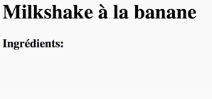
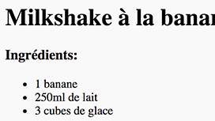
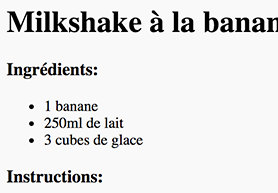
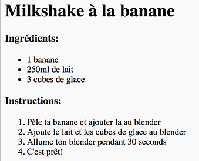
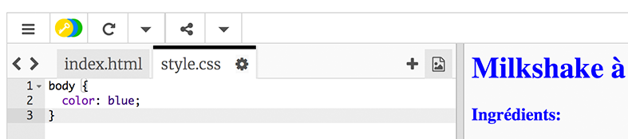
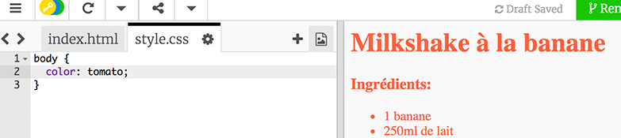
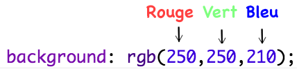
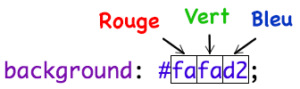
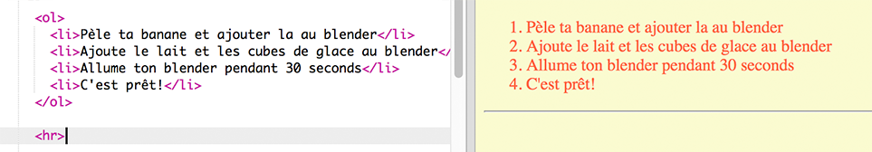

---
title: Recette de cuisine
level: HTML & CSS 1
language: fr-FR
embeds: "*.png"
materials: ["Club Leader Resources/recipe-finished/*.*", "Project Resources/template/*.*"]
stylesheet: web
...

# Introduction { .intro}

Dans ce projet, tu vas apprendre a créer ta propre page internet pour ta recette de cuisine favorite.


# Étape 1: Choisi ta recette { .activity}

Avant de commencer a coder, tu va devoir choisir une recette

## Liste d'activités { .check}

+ Pense à une recette que tu peux partager avec tes copains. Cela peut etre:
	+ Une recette que tu as trouvé sur internet;
	+ Ton plat favoris;
	+ Quelques chose que tu as inventé!

L'exemple de recette pour ce projet est pour faire un milkshake a la banane. Tu peux copier cette recette si tu n'as pas d'idées.

# Étape 2: Ingrédients { .activity}

Commençons par lister les ingrédients de notre recette.

## Liste d'activités { .check}

+ Ouvre ce trinket: [jumpto.cc/trinket-template](http://jumpto.cc/trinket-template). Si tu lis ce projet en ligne, tu peux aussi utiliser la version incorporé ci dessous.

<div class="trinket">
  <iframe src="https://trinket.io/embed/html/ef4c882ae6" width="100%" height="400" frameborder="0" marginwidth="0" marginheight="0" allowfullscreen>
  </iframe>
</div>

+ Pour la liste des ingrédients, on va utiliser une __liste désordonné__, en utilisant le tag `<ul>`. Va a la ligne 8 de ton code et ajoute ce code HTML, remplace le texte dans ton `<h1>` avec le titre de ta recette:

```
<h1>Milkshake à la banane</h1>

<h3>Ingrédients:</h3>

<ul>

</ul>
```

+ Regarde ton résultat, et tu devrais voir tes 2 titres.



Tu ne seras pas en mesure de voir ta liste encore, parce qu'il n'y a aucun élément à ta liste!

+ La prochaine étape sera d'ajouter des éléments à ta liste, en utilisant le tag `<li>`. Ajouter le code suivant à l'intérieur de ton tag `<ul>` :

```
<li>1 banana</li>
```


Comme il s'agit d'une liste désordonné, il n'y a pas de numéro a tes éléments, juste des points.

##Défi: Plus d'ingrédients {.challenge}
Peux tu ajouter plus d'ingrédients à __ta__ recette?

Ta page devrais ressembler a ceci:



## Enregistre ton projet {.save}

# Étape 3: Method { .activity }

Next, let’s explain how to make your recipe.

## Liste d'activités { .check}

+ Tu vas maintenant utiliser une autre liste pour tes instructions, mais cette fois, tu vas utiliser une __liste ordonné__, en utilisant le tag `<ol>`.

Une liste ordonné est une liste numéroté, que tu dois utiliser quand les étapes sont importantes.

Ajoute ce code en dessous de ta liste d'ingrédients, en vérifiant qu'elle se trouve toujours dans ton tag `<body>`.

```
<h3>Instructions:</h3>

<ol>

</ol>
```



+ Maintenant, tu as juste a ajouter des éléments à ta nouvelle liste:

```
<li>Pèle ta banane et ajouter la au blender</li>
```


T'as vu, la liste est automatiquement numérotée!

##Défi: Plus d'étapes {.challenge}
Serais tu capable d'ajouter toutes les étapes pour créer __ta__ recette de cuisine ?

Ceci devrais ressembler a l'image ci-dessous:



## Enregistre ton projet {.save}

# Étape 4: Couleurs! { .activity}

Il est temps d'ajouter un peu de couleur a notre page de recette.

## Liste d'activités { .check}

+ Tu sais maintenant comment ajouter de la couleur au texte de ta page. Ajoute ce code dans ton fichier `style.css`, pour rendre tout le texte de ta page bleu:

```
body {
    color: blue;
}
```



+ Ton navigateur connais plein de couleurs comme `blue`, `yellow` (jaune) et même `lightgreen` (vert clair), mais sais tu que ton navigateur connais en faite les __noms__ de 500 couleurs différentes ?

Il existe une liste de toutes les couleurs que tu peux utiliser: [jumpto.cc/web-colours](http://jumpto.cc/web-colours), qui comprend des noms de couleurs comme `tomato`, `firebrick` et `peachpuff`.

Change la couleur de ton texte de `blue` à `tomato`.



+ Ton navigateur connais enormément de couleurs, mais en faite il connais les __valeurs de couleurs__ de plus de 16 millions de couleurs!

Peut etre le sais tu deja, mais toutes les couleurs sont fabriqués a partir de trois couleurs primaire: rouge, vert et bleu. Pour indiquer à ton navigateur quelle couleur tu veux afficher, tu dois juste lui définir la quantité de chaque couleurs primaire que tu veux utiliser.

La quantité de rouge, vert et bleu peuvent s'écrirent en chiffres compris entre `0` et `255`.



Ajoute ce code à ton CSS, sur le selecteur body de ta page, pour afficher un fond jaune léger.

```
background: rgb(250,250,210);
```


+ Si tu préfères, tu peux aussi indiquer à ton navigateur quelle couleur afficher en utilisant un code héxadécimal (plus connue sous le nom de __hex code__). Cela fonctionne de façon similaire à la méthode `rgb()`, à l'exception que le hex code commence toujours par `#`, et un 'nombre' hexadecimal se défini entre `00` et `ff` pour la quantité de rouge, vert et bleu.



Remplace ton code `rgb()` dans ton CSS par ce hex code:

```
background: #fafad2;
```


Tu devrais voir la même couleur de fond qu'avant!

## Enregistre ton projet {.save}

# Étape 5: Touches finales { .activity}

Et si on ajoutais encore un peu plus d'HTML et CSS pour améliorer notre page.

## Liste d'activités { .check}

+ Tu peux ajouter une ligne horizontal à la fin de ta recette, en utilisant le tag <hr />.



Tu remarqueras que ce tag n'a pas besoin d'un tag de fin, tout comme le tag ``.

+ La ligne que tu viens d'ajouter n'est pas en phase avec le reste de ta page. Règlons ce problème en ajoutant un peu de code CSS:

```
hr {
    height: 2px;
    border: none;
    background-color: tomato;
}
```


+ Tu peux même changer le style des puces avec ce code CSS:

```
ul {
    list-style-type: square;
}
```


##Défi: Plus de couleurs! {.challenge}
Change les couleurs de tonn code en utilsant des noms de couleurs, valeurs `rbg()` et hex code. Il y a une tonne de couleurs disponible ici <a href="http://jumpto.cc/web-colours" target="_blank">jumpto.cc/web-colours</a>.

Voila quelques exemples de couleurs:

+ Rouge peux s'écrire:
	+ `red` (evidemment!)
	+ `rgb(255,0,0)` (plein de rouge, pas de bleu ni de vert)
	+ `#ff0000`

+ Olive peux s'écrire:
	+ `olive`
	+ `rgb(128, 128, 0)` (un peu de rouge et de vert, pas de bleu)
	+ `#808000`

Essaye de faire en sorte que tes couleurs vont bien avec ta recette!

## Enregistre ton projet {.save}

##Défi: Commentaires {.challenge}
Demande à tes amis de laisser un commentaire pour ta recette. Tu devras créer une autre liste pour faire cela.


## Enregistre ton projet {.save}

##Défi: Plus de style {.challenge}
Peux tu ajouter une image a ta page? ou changer la typographie? Regarde à quoi ta page peux ressembler:


Voila quelques lignes de codes qui pourront t'aider:

```
font-family: Arial / Comic Sans MS / Courier / Impact / Tahoma;
font-size: 12pt;
font-weight: bold;


```

## Enregistre ton projet {.save}
