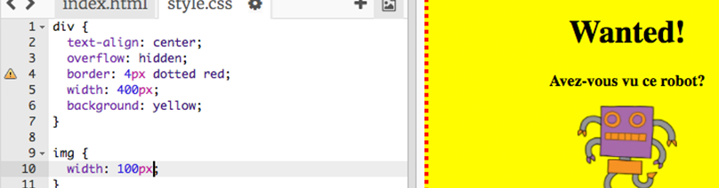
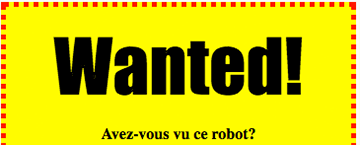

---
title: Wanted!
level: HTML & CSS 1
language: fr-FR
embeds: "*.png"
materials: ["Club Leader Resources/wanted-finished/*.*", "Project Resources/wanted/*.*", "Project Resources/template/*.*"]
stylesheet: web
...

# Introduction { .intro}

Dans ce projet, tu vas apprendre a créer ton propre poster.


# Step 1: Style ton poster { .activity}

Commençons par éditer le code CSS pour ton poster.

## List d'activités { .check}

+ Ouvre ce trinket: <a href="http://jumpto.cc/web-wanted" target="_blank">jumpto.cc/web-wanted</a>. Si tu es sur la version en ligne, tu peux aussi utiliser la version embarquée de Trinket:

<div class="trinket">
	<iframe src="https://trinket.io/embed/html/58318bee1f" width="100%" height="550" frameborder="0" marginwidth="0" marginheight="0" allowfullscreen>
	</iframe>
</div>

+ Clique sur l'onglet "style.css". Tu verras qu'il y a déjà une propriété CSS pour l'élément `div` qui contient les différentes parties de ton poster.

	```
	div {
		text-align: center;
	    overflow: hidden;
	    border: 2px solid black;
	    width: 300px;
    }	
	```

+ Commençons par changer la proriété `text-align`:

	```
	text-align: center;
	```
	
	Que ce passe-t-il lorsque tu changes la valeur `center` en `left` ou `right`?

+ Et qu'en est-il de la propriété `border` ?

	```
	border: 2px solid black;
	```

	`2px` veux dire 2 pixels. Qu'est-ce qui se passe si tu changes `2px solid black` en `4px dotted red`?

+ Change la longueur `width` de ton poster a `400px`. Qu'est ce qui change sur ton poster?

+ Ajoutons un peu de CSS pour changer la couleur de fond. Va à la ligne 5 de ton code et appuie sur la touche 'Entrer', pour commencer une nouvelle ligne.

	

	Entre le code suivant sur ta nouvelle ligne:

	```
	background: yellow;
	```

	Fait attention a _correctement_ écrire le code ci-dessus. Tu devrais voir le fond de ton `<div>` changer en jaune. 

	

##Defi: Améliore ton poster {.challenge}
Ajoute la propriété CSS suivante a ton style `div`:

```
border-radius: 40px;
```

Qu'est ce que cette propriété a transformé ? Que ce passe t'il si tu changes la valeur de pixels dans le code ci-dessus?

## Enregistre ton projet {.save}

# Etape 2: Style ton image { .activity}

Continuons en améliorant l'image de ton poster.

## Liste d'activités { .check}

+ Pour l'instant. il n'y a pas de propriétés CSS pour ton tag ``, et si on en rajoutais une!

	Premièrement, ajoute le code CSS suivant après le code pour ton `div`

	```
	img {

	}
	```

	

+ On peux maintenant rajouter les propriétés CSS pour les images entre les crochets `{` et `}`

	Par exemple, ajoute ce code entre les crochets pour définir la longueur de ton image:

	```
	width: 100px;
	```

	Tu devrais voir la taille de ton image changer, sa longueur est maintenant de 100 pixels.

	

+ Tu peux aussi ajouter une bordure a ton image avec ce code:

	```
	border: 1px solid black;
	```

+ As-tu remarqué qu'il n'y a pas beaucoup d'espace entre l'image et la bordure?

	

	Tu peux ajouter plus d'espace autour de l'image en utilisant la propriété `padding`:

	```
	padding: 10px;
	```

	`padding` est l'espacement entre le contenu (dans notre cas, l'image) et sa bordure.

	

	Que se passe t'il si tu changes la valeur du `padding` a `50px`?

##Défi: Améliore ton image {.challenge}
Peux tu changer la couleur de fond de ton image? et ajouter des bords arrondis ?

## Enregistre ton projet {.save}

# Step 3: Style ton titre { .activity .new-page }

Et maintenant, améliorons le style de ton titre, le tag `<h1>`.

## Liste d'activités { .check}

+ Ajoute le code suivant en dessus du code CSS pour ton image:

	```
	h1 {

	}
	```
	C'est ici que tu va placer tes propriétés CSS pour ton titre `<h1>`.
	
+ Pour changer la typographie de ton `<h1>`, ajoute le code suivant entre les crochets.

	```
	font-family: Impact;
	```

+ Tu peux aussi changer la taille de ton titre:

	```
	font-size: 50pt;
	```

+ As tu remarqué qu'il y a beaucoup d'espace en le titre `<h1>` et tout ce qu'il y a autour ?

	

	C'est parce qu'il y a une marge autour du titre. Une marge, c'est l'espace entre l'élément (dans ce cas le titre) et les autres éléments autour de lui.

	Tu peux rendre la marge plus petite avec ce code:

	```
	margin: 10px;
	```

	

+ Tu peux aussi souligner ton titre:

	```
	text-decoration: underline;
	```

##Défi: Rend ton poster encore plus cool! {.challenge}
Ajoute plus de code CSS pour styler tes titres `<h3>` et tes paragraphes.


Voici une liste de propriétés CSS que tu peux utiliser:

```
color: black;
background: white;
font-family: Arial / Comic Sans MS / Courier / Impact / Tahoma;
font-size: 12pt;
font-weight: bold;
text-decoration: underline overline line-through;
margin: 10px;
padding: 10px;
width: 100px;
height: 100px;
```

## Enregistre ton projet {.save}

##Défi: Fait la pub d'un evenement! {.challenge}
Serais tu capable de créer un poster pour un évenement qui a lieu de ton école? ca peut etre une piece de théatre, un événement sportif, ou même encore une poster pour faire de la publicité à Code Club!

## Enregistre ton projet {.save}