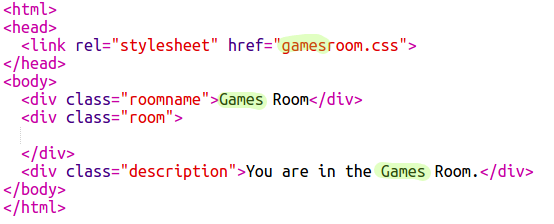

# Introduction {.intro}

In this project, you'll create a set of linked rooms where each room is a different web page which you can decorate with HTML.

  <iframe src="https://trinket.io/embed/html/ba5d27ec68?outputOnly=true&start=result" width="600" height="450" frameborder="0" marginwidth="0" marginheight="0" allowfullscreen>
  </iframe>
  

__Instructions__: Click the doors to move between rooms.

# Step 1: Linking to another web page in the same project {.activity}

Web projects can be made up of lots of HTML files linked together.

## Activity Checklist { .check}

+ Open this trinket: <a href="http://jumpto.cc/web-rooms" target="_blank">jumpto.cc/web-rooms</a>.

	The project should look like this:

	

+ The trinket should autorun and you will find yourself in the Hall:

	

+ Look at the list of file tabs for this trinket. Can you see `tvroom.html`? Click on it.

	

	This is another html file in the same project.

+ To get to `tvroom.html` you need to add a link in `index.html`.

	Add the highlighted code inside the `
` with the class `room`:

	

+ Test your trinket by clicking on the __TV Room__ link to see the `tvroom.html` webpage.

	Note that `tvroom.html` also has its own `tvroom.css` style file which defines the layout for this page.

	

##Challenge: Add another link {.challenge}

Add an `<a>` link to the `tvroom.html` webpage to get you back to the Hall webpage which is called `index.html`. The link text should be 'Hall'.

The TV Room webpage should then have a clickable link like this:

Make sure you test your code. You should be able to move from the Hall to the TV Room and back again by clicking on links.  

## Save Your Project {.save}

# Step 2: Add another room {.activity}

Now let's add another room, a __Games Room__.

+ Click on the add page __+__ button:

	

	Type `gamesroom.html` as the page name:

  	

+ The HTML for the __Games Room__ is very similar to `tvroom.html` so __copy__ that and __paste__ it into `gamesroom.html`.

	Edit the highlighted items so they say Games not TV:

	

+ Your `gamesroom.html` now uses `gamesroom.css` which doesn't exist yet.

	Create `gamesroom.css` by clicking on the add page __+__ button.

+ The CSS for the __Games Room__ is very similar to `tvroom.css` so __copy__ that and __paste__ it into `gamesroom.css`.

	

+ Add a link from the Hall to the Games room:

	

+ Test your project by clicking on the Games Room link

	The __Games Room__ should look like this:

	

	Not very exciting, but you can fix that in the next challenge.

## Save Your Project {.save}

##Challenge: Style and link the Games Room {.challenge}

Edit the HTML and CSS for the __Games Room__ so that the webpage looks like this:

Hint: You'll need to change the background colour, font colour and border colour in `gamesroom.css`. The bright green colour is called `chartreuse`.  

Hint: You'll need to add an `<a>` link in `gamesroom.html` which links to `hall.html`.

## Save Your Project {.save}

# Step 3: Make the links look like doors {.activity}

Links don't just have to be text. Let's make a clickable door using a `
`.

## Activity Checklist { .check}

+ Open `index.html` and add a `
` around the __TV Room__ link text. It needs to be inside the `<a>` to make it clickable.

  Add `id="hall2tv"` to label it as the door from the Hall to the TV Room so that you can style the door.

    

+ Click on the `style.css` tab, go to the bottom and add the following CSS to change the size and colour of the door:

	

+ Test your webpage by clicking anywhere on the door, not just on the text.

+ Now let's make it look a bit more like a door by adding a border around three sides:

	

+ And let's add some CSS to make the text on the door look better:

	

+ You've probably noticed that the door is floating in the air. Let's fix that by positioning the door inside the room.

	

+ Test your webpage by clicking on the door to get to the __TV Room__.

## Save Your Project {.save}

##Challenge: Add more doors! {.challenge}

Turn the other links in your project into doors in the same way.

For each door you'll need to:

+ Edit the door link to use a `
` with an id such as `hall2games` so that you can style it.

	For example:

	`<a href="gamesroom.html">
Games Room
</a>`

+ Add CSS for the door id to the `.css` file for its room. Use _copy_ and _paste_ to save time. You can make each door look different if you like.

+ Position the door using `bottom:` and `left:` or `right:`.

The Hall might look like this:

The TV Room should look something like this:

# Step 4: Adding a background image {.activity}

Let's decorate the hall with a background image.

## Activity Checklist { .check}

+  Edit the `style.css` to add a background image to the Hall:

	

	The image will be repeated to fill the whole room.

## Save Your Project {.save}

##Challenge: Add wallpaper to the Games Room {.challenge}

Can you decorate the games room with a background image?

You can use the `space-invader.png` background image which is included in your project.

You'll need to:

+ Add a `background-image:` to the `.room` CSS for the Games Room.

The decorated room should look like this:

## Save Your Project {.save}

##Challenge: Make it yours! {.challenge}

Add more rooms to your project. Remember that you can use __copy__ and __paste__ to save time and then just change the things that need to be different.

For each room you will need to:

+ Create a `.html` file
+ Add door links to and from the new 'room'
+ Create a `.css` file with the styles for your new room and its doors

You can change the `background-color:` for each room. Click on the images icon to see the background images you can choose from:

## Save Your Project {.save}
