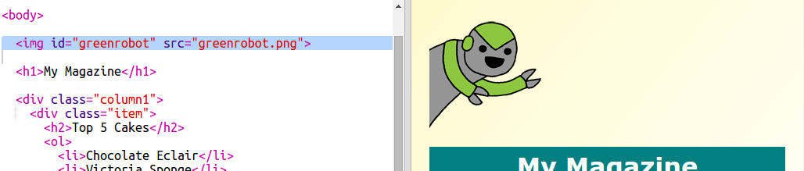

---
title: Magazine
description: Créer un site Web magazine à plusieurs pages. 
layout: project
notes: "Magazine - notes.md"
...

# Introduction { .intro}

Dans ce projet, vous apprendrez à utiliser le HTML et CSS pour créer une site Web magazine à plusieurs pages avec un agencement à deux colonnes. Vous réviserez égament beaucoup de techniques HTML et CSS d'autres projets. 

  <iframe src="https://trinket.io/embed/html/a41e4e1c5c?outputOnly=true&start=result" width="600" height="500" frameborder="0" marginwidth="0" marginheight="0" allowfullscreen>
  </iframe>
  

# Étape 1 : En-tête et arrière-plan

Les sites Web de style magazine ont souvent beaucoup de petits objets sur une page. Tout d'abord, vous allez créer un en-tête et un arrière-plan pour votre magazine. 

## Liste de contrôle de l'activité { .check}

+ Ouvrez ce trinket : <a href="http://jumpto.cc/web-magazine" target="_blank">jumpto.cc/web-magazine</a>. 

	Le projet doit ressembler à ça :

	

+ Ajoutons un en-tête. 

	Vous pouvez trouver un meilleur titre pour votre magazine. 

	

+ Pouvez-vous appliquer un style à l'en-tête ?

	Voici un exemple, mais vous pouvez choisir votre propre style :

	

+ Maintenant, créons un arrière-plan intéressant en utilisant un dégradé et en choisissant une police pour le magazine. 

	Voici quelques exemples de style pour vous rapeller comment créer un dégradé : 

	

## Enregistrez votre projet {.save}

# Étape 2 : Créer des colonnes

Les sites Web utilisent souvent plusieurs colonnes. Créons un agencement à deux colonnes pour votre magazine. 

## Liste de contrôle de l'activité { .check}

+ D'abord, créez deux colonnes `div`.

	Ajoutez le HTML surligné à `index.html` :

	

+ Maintenant, stylisez les divisions de colonnes pour que l'une soit flottante vers la gauche et l'autre vers la droite. 

	

	Chaque colonne est inférieure à 50 %, il y a donc de la marge pour un remplissage. 

	Vous devez ajouter quelque chose à une colonne pour voir l'effet. 

+ Ajoutons une image de chaton au sommet de la colonne 2. 

	

	Remarquez sur l'image de chaton est positionnée sur à peu près la moitié de la page, dans la seconde colonne. 

	C'est un peu gros !

+ Utilisons `max-width: ` pour que les images s'adaptent à leur conteneur. 

	Ajoutez le style suivant à `style.css`.

	

	Il s'appliquera à toutes les images que vous utilisez dans votre magazine, et pas seulement au chaton.

+ Maintenant, ajoutez une classe `photo` à l'image pour que vous puissiez y appliquer un style :

	

+ Puis stylisez l'image pour y ajouter une ombre et une torsion afin que l'image sorte de la page :

	

	Faites quelques changements à moins que vous n'aimiez le résultat. 

# Étape 3 : Styliser les objets du magazine

Appliquons-nous à rendre l'agencement un peu plus intéressant. 

## Liste de contrôle de l'activité { .check}

+ Ajoutez une balise `div` autour de votre image avec une `class` et ajoutez un en-tête `h2` :

	

+ Maintenant, stylisez l'objet et l'en-tête. 

	Voici un exemple, mais vous pouvez faire quelque changements :

	

## Enregistrez votre projet {.save}

##Challenge: Ajouter des objets à la colonne de gauche {.challenge}

Pouvez-vous ajouter une liste ordonnée et un sticker de texte dégradé à la colonne de gauche ? 

Voici un exemple :

Voici le code pour l'exemple, mais vous pouvez le changer ou faire le vôtre.

HTML :

CSS :

## Enregistrez votre projet {.save}

# Étape 4 : Ajouter une seconde page

Ajoutons une seconde page à votre site Web magazine. 

## Liste de contrôle de l'activité {.check}

+ Ajoutez une nouvelle page à votre projet et nommez-la `page2.html` :

+ La Page 2 sera trés similaire à la première page de votre magazine pour que vous puissiez copier le html de `index.html` et le coller dans `page2.html`.

Remarquez que les deux pages utilisent le même `style.css`. Elles partageront donc le même style. 

+ Modifiez le titre `<h1>` par page2 : 

+ Maintenant, il vous faudra des liens entre vos pages pour pouvoir accéder à la page 2 et revenir à la première page. 

Retourner à `index.html`. Ajoutez un lien dans une div à l'intérieur de la colonne 2 dans `index.html`:

+ Testez qu'il est possible de cliquer sur votre nouveau lien et de passer à la page 2 de votre magazine. 

##Challenge: Ajouter un lien de retour à la première page {.challenge}

Pouvez-vous ajouter un lien vers la `page2.html` pour pouvoir cliquer et revenir à la première page ?

Indice : Regardez le HTML que vous avez utilisé pour créer un lien vers la page 2. 

##Challenge: Remplir votre seconde page {.challenge}

Voici le code pour les exemples, mais vous pouvez modifier les `div` ou utiliser vos propres idées.  

Cliquez sur l'icône images pour voir les images qui sont disponibles à l'utilisation :

Souvenez-vous que vous pouvez mettre en ligne vos propres images pour les utiliser. Assurez-vous d'avoir les autorisations nécessaires pour utiliser les images que vous mettez en ligne. 

# Étape 5 : Ajouter une animation

Ajoutons une animation amusante à votre magazine. 

## Liste de contrôle de l'activité {.check}

+ Allez dans `index.html` et incluez l'image `greenrobot.png` au sommet de votre page. 

+ Maintenant, ajoutez le CSS pour animer votre robot :

##Challenge: Ajouter une autre animation {.challenge}

Pouvez-vous ajouter une animation à la seconde page de votre magazine ? 

