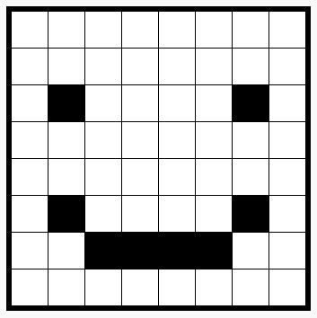

# Introduction {.intro}

In this project, you'll create a pixel art editor. As well as using HTML and CSS you'll learn how to use JavaScript to add interactivity to your project.

  <iframe src="https://trinket.io/embed/html/0e102a306b?outputOnly=true&start=result" width="600" height="450" frameborder="0" marginwidth="0" marginheight="0" allowfullscreen>
  </iframe>
  

__How to use the editor__: Click on a colour from the palette to choose your pen colour then click on pixels to change their colour.

# Step 1: Creating a grid of pixels {.activity}

Let's create a grid of pixels that you can use for creating pixel art. CSS provides table styles for grid and table layouts.

Tables contain rows which contain cells. You are going to create a table with a black background and then put white pixels into it.

## Activity Checklist { .check}

+ Open this trinket: <a href="http://jumpto.cc/web-pixel" target="_blank">jumpto.cc/web-pixel</a>.

	The project should look like this:

	

+ Add the following html into the `<body>` of your `index.html` file to create a `
` as a container for your pixel art and give it an `art` id so you can style it:

	

+ Now go to your `style.css` file and add the table styling for the art `
`.

	

	This creates a table with a border and sets the spacing inside the grid.

	It doesn't look very interesting yet, you need to put rows of pixels inside it.

 + Now go back to your `index.html` file and add a row of 3 pixels inside the art `
`:

	

	 Notice that the three pixel lines are the same. Type the first one and then use copy and paste to create the others.

 	This time you're using classes to style the divs as there will be lots of them.

 + Add the following style for the rows and cells:

	

 	Now your pixels will line up in a grid with black lines around them.

 + Now add another two rows of pixels to create a 3 x 3 grid. Remember to use copy and paste to save time.

	

##Challenge: Resize your grid {.challenge}

3x3 is quite a small grid for pixel art. Can you make the grid bigger? 8x8 is a good size for pixel art.

Try using cut and paste rather than typing everything out.

## Save Your Project {.save}

# Step 2: Colour the pixels {.activity}

HTML is used to organise your content and CSS to style it. JavaScript is a programming language that can be used to change a web page as you interact with it.

You could use HTML and CSS to set the background colour of individual pixels, but that would be a slow way to work! Instead you're going to add some JavaScript code to colour pixels automatically when you click on them.

+ In JavaScript, code is placed in a `function` that can be called when we want to run that code.

	You're going to create a function called `setPixelColour`

	The `setPixelColour` function needs to know which pixel to change the colour of, this is an `input`.

	Add the following code to the `script.js` file to set the background colour of a pixel:

	

	Notice that `backgroundColor` uses the American spelling of colour.

+ Now we need to call that function when a pixel is clicked on.

	HTML uses `onclick` to call a function when an element is clicked on. You'll need to pass in 'this' as the input so your function knows which pixel to change the colour of.

	Go to `index.html` and add the following code to the first pixel:

	

+ Test your code by clicking in the first pixel. It should turn black:

	

	You only added `onclick` code to the first pixel so this won't work for the other pixels yet.

##Challenge: Make all pixels clickable {.challenge}

Can you make all the pixels clickable? Use cut and paste to make it quicker.

Create a quick piece of pixel art.

Tip: You can click __Autorun__ to clear all of the pixels.

# Step 3: Add a colour palette {.activity}

Did you find it annoying that you couldn't change a pixel colour back to white if you made a mistake? Let's fix that by creating a colour palette so that you can click on a colour to change the pen.

+ First create a pen style.

	Add the following code at the bottom of your `style.css` file:

	

+ Now create black and white pen colours that use that style.

	Add the following code to your `index.html` after the `<body>`:

	

	`style=` allows you to add CSS inside your HTML which is convient here.

+ You want to be able to change the pen colour when a palette colour is clicked on.

	Variables are used to store information. Let's create a penColour variable in `script.js`.

	Add the following code at the top of the file:

	

	Then add a function to change the penColour:

	

+ You'll also need use the pen colour when you change the colour of a pixel.

	Change the `setPixelColour` function to use the `penColour` variable instead of `black`:

	 

+ Now you need to call the `setPenColour` function when a pen colour gets clicked.

	Add the highlighted `onclick` code to your pen colours:

	

+ Now test that you can switch the pen colour between black and white to fill in or delete pixels.

## Save Your Project {.save}

##Challenge: Add more colours to the palette {.challenge}

Can you add more colours to the palette? Choose the colours that you want to create pixel art with.

Then create some cool pixel art.

Hint: The bright green colour is called `chartreuse`.

Ask your club leader if you can use the Windows Snipping Tool or an alternative to save a copy of your pixel art as an image.

## Save Your Project {.save}
