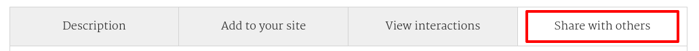
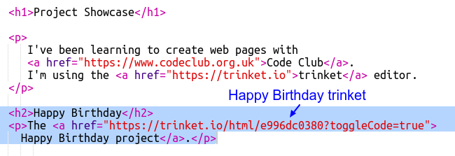
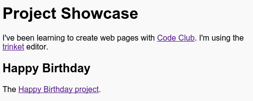
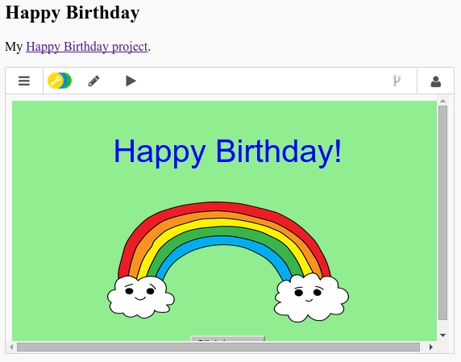

# Introduction {.activity}

Dans ce projet, tu va créer un portfolio de tes projets HTML et apprendre comment faire des liens et embarquer des ressources dans tes pages web.

# Étape 1: Ajouter des liens à ta page {.activity}

Text links allow you to click on words to go to another web page, they are usually underlined.

## Liste d'activités { .check}

+ Ouvre ce trinket : <a href="https://trinket.io/html/9ad31460f0">https://trinket.io/html/9ad31460f0</a>. Si tu lis ceci en ligne, choisi ce lien. tu peux aussi utiliser le trinket ci-dessous.

+ HTML utilise l'élément `<a>` pour les liens.

+ Cherche l'élément `<a>` dans ton projet.

+ Ajoute l'addresse du site web de Code Club <a href="https://www.codeclub.org.uk">`https://www.codeclub.org.uk`</a> ainsi que son texte:

+ Clique Run pour tester ton trinket.

+ Clique sur le lien Code Club pour tester ta page web. Ton trinket devrais maintenant afficher le site web de Code Club

+ Pour retourner sur ta page, tu peux:

	+ Cliquer à nouveau sur Run,

	+ Appuyer sur la touche 'Retour' de ton clavier, ou:

	+ Clique-droit et choisir Retour

## Liste d'activités { .check}

+ Maintenant mets ton lien dans une phrase à l'intérieur d'un paragraphe.

Test ta page web.

## Défi: Ajouter un autre lien {.challenge}

Ajoute une phrase avec un lien qui t'as aider pour créer tes projets web. Par exemple: <a href="https://trinket.io">https://trinket.io</a> ou <a href="http://colours.neilorangepeel.com">http://colours.neilorangepeel.com</a>.

# Enregistre {.activity}

# Étape 2: Lien vers un trinket {.activity}

Tu peux créer un lien vers un trinket.

## Liste d'activités { .check}

+ As-tu gardé un lien de ton projet Joyeux Anniversaire? Si oui, ouvre le trinket dans un autre navigateur ou un autre onglet. Sinon, ouvre le trinket suivants: <a href="https://trinket.io/html/e996dc0380">https://trinket.io/html/e996dc0380</a>

+ Clique sur le menu Partage en haut de ton trinket et choisi Lien:

Si tu ouvres ton trinket depuis ton compte, cherches l'option 'Partage' ('Share' en anglais) en dessous de ton trinket:

+ Choisi l'option 'Only show code or result (let users toggle between them)' (Montre seulement lecode ou le résultat) et copie le lien dans ton trinket.

+ Return sur ton trinket Portfolio et ajoute un titre `<h2>` et un lien vers ton projet Joyeux Anniversaire.
+ Go back to your Project Showcase trinket and add an `<h2>` heading and a link to your Happy Birthday Project.

Test ta page web, ça devrais ressembler a cela:

Clique sur le lien Joyeux Anniversaire pour tester qu'il te mène au trinket.

## Enregistre ton projet {.save}

## Défi: Créer une liste de tes projets {.challenge}

Ajoute un peu plus de code que tu as déjà crée pendant Code Club. Utilise les titres `<h2>` pour organiser ta page web.

Si tu n'as pas de liens vers les projets que tu as crée avant, tu peux utiliser ces exemples Code Club:

+ Joyeux Anniversaire: <a href="https://trinket.io/html/e996dc0380">https://trinket.io/html/e996dc0380</a>

+ Raconte une histoire: <a href="https://trinket.io/html/c8afdef912">https://trinket.io/html/c8afdef912</a>

+ Wanted: <a href="https://trinket.io/html/ebeb56398a">https://trinket.io/html/ebeb56398a</a>

+ Recette de cuisine: <a href="https://trinket.io/html/c0fd9b40cd">https://trinket.io/html/c0fd9b40cd</a>

+ Lettre mystère: <a href="https://trinket.io/html/1d4d4c5ce1">https://trinket.io/html/1d4d4c5ce1</a>

Ta page terminé devrais ressembler à ceci:

## Enregistre ton projet {.save}

# Étape 3: Embarque encore plus de projets {.activity}

En plus de lié des trinkets tes pages web, tu peux aussi embarqué tes trinkets dans ta page web.

## Liste d'activités { .check}

+ Tu peux essayer de travailler en mode plein-écran comme ça tu auras plus de place:

Appuye sur Esc pour quitter le mode plein-écran

+ Lance ton trinket et clique sur le lien Joyeux Anniversaire

+ Clique sur le menu trinket et choisi __embed__. Si tu n'es pas en plein-écran tu devras peut être faire défiler ta page web. Utilise la barre de défilement a droite ou la flêche du bas.

## Activity Checklist { .check}

+ Choisi 'Only show code or result (let users toggle between them)' et __copie__ le code embarqué pour ce trinket.

+ Trinket a crée un peu de HTML pour toi pour ajouter a ta page web. En utilisant un élément `<iframe>` qui te permet d'embarquer du contenu dans ta page.

+ Maintenant colle ce code sous le lien de ton trinket Joyeux Anniversaire:

+ Lance ton trinket pour le tester et regarde si tu peux voir ton project Joyeux Anniversaire dans ta page web.

+ Tu verras que le bas de ton trinket ne s'affiche pas. Tu peux changer cela en changeant la hauteur de l'élément `<iframe>`.

Défini la hauteur a __400__. Si tu changes le projet Joyeux Anniversaire tu devras peut etre utiliser une valeur différentes.

## Enregistre ton projet {.save}

## Défi: Embarque encore plus de projets {.challenge}

Implémente encore plus de projets dans ton portfolio. Rappelle toi que tu peux facilement trouver leur page trinket en cliquant sur les liens sur ta page web.

# Étape 4: Crée un sommaire {.activity}

Maintenant ajoutons un sommaire pour facilement trouver chaque projet.

## Liste d'activités { .check}

+ EN plus d'être capable de créer des liens vers d'autres page, on peux créer un lien qui mène a un endroit d'une page si on lui donne un id.

Ajoute un id au titre `<h2>` pour le projet Joyeux Anniversaire:

+ Ajoute un id pour chaque projets et donne leur un nom court: histoire, wanted, recette et lettre.

+ Tu peux crée un lien vers un élément avec un id en ajoutant un symbole dièse (hashtag) au debut de son nom, `#anniversaire`. 

Créer une liste de liens vers tes projets. (Tu as appris les listes ordonnées dans le projet recette de cuisine).

+ Lance ton projet et test le en cliquant sur les liens pour faire défiller ta page vers tes projets

## Enregistre ton projet {.save}

# Étape 5: Revenir en haut {.activity}

## Liste d'activités { .check}

+ C'est aussi pratique d'etre capable de revenir au début de ta page en un clique. HTML peux faire ca avec `#top`.

+ Ajoute un lien `#top` après chqaue projet de ta page web.

+ Test tes liens en cliquant sur ton lien Top pour revenir en haut de ta page.

## Enregistre ton projet {.save}

## Défi: Améliore ton portfolio {.challenge}

Utilise le CSS que tu as appris pour rendre ta page encore plus cool! Essaye de changer la couleur de fond de ta page et la police pour les titres.

Tu peux aussi trouver des informations a propos de chaque projets que tu as aimé faire.

## Défi: Crée un nouveau showcase {.challenge}

Trinkets n'est pas la seule chose que tu peux embarquer dans une page web. Tu peux incorporer des videos, gadgets ou des projets Scratch.

Ouvre le Trinket Exemple Scratch et lance le: <a href="https://trinket.io/html/9f7212b8fe">https://trinket.io/html/9f7212b8fe</a>

Va sur le site web de Scratch et trouve un projet que tu aimes bien. Ca peut etre un des tiens ou un que tu as trouvé.

Si tu es enregistré tu peux cliquer sur le bouton 'Embed' en dessous du projet que tu as choisi pour recupérer le code HTML et l'incorporer à ton projet.

Si tu n'es pas enregistré, cherche un numero de projet Scratch dans son addresse web.

Créer une copie de ton exemple Scratch `<iframe>` et change le numero pour importer le projet que tu veux ajouter à ta page.
Make a copy of the `<iframe>` code in the Scratch Embed example and change the project number to the one for the project you want to embed:

## Enregistre ton projet {.save}
