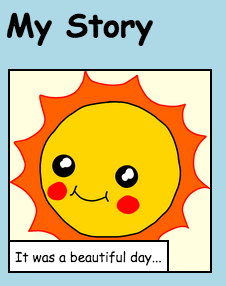

# Introduction { .intro}

Dans ce project, tu vas apprendre comment créer ta propre page web pour raconter une histoire, une blague ou un poème


# Etape 1: Trouver une histoire à raconter { .activity}

Avant de commencer à coder, il faut trouver une histoire à raconter.

## A faire { .check}

+ Pense à l'histoire que tu veux raconter. Ça pourrait être:
	+ Une histoire célèbre
	+ Une histoire que tu as inventée
	+ Quelque chose qui t'est arrivé ou à quelqu'un que tu connais

	Ce n'est pas forcément une histoire. Ça peut être une blague, un poème ou ce que tu veux!

# Etape 2: Edite ton histoire { .activity}

Commençons par éditer le contenu HTML et le style CSS de la page web de l'histoire

## A faire { .check}

+ Ouvrir ce lien Trinket : <a href="http://jumpto.cc/web-story" target="_blank">jumpto.cc/web-story</a>.

Si tu es sur la version en ligne, tu peux aussi utiliser la version embarquée de Trinket:
<div class="trinket">
 <iframe src="https://trinket.io/embed/html/8083cfebb3" width="100%" height="400" frameborder="0" marginwidth="0" marginheight="0" allowfullscreen>
 </iframe>
</div>

+ Comme tu l'as vu dans le project 'Bon anniversaire', le contenu de la page web doit être  entre les balises (ou 'tag') `<body>` et `</body>` (regarde la ligne 7 du code).

	

+ Peux tu citer les balises qui sont utilisées pour créer les différentes sections de la page web?

	

	+ `<h1>` est un __titre__. Tu peux utiliser les niveaux 1 à 6 pour créer des titres de tailles différentes;
	+ `<div>` est un raccourci pour __division__. C'est une façon de regrouper des éléments ensemble. Dans cette page web, tu l'utiliseras pour grouper les éléments de chaque partie de ton histoire;
	+ `` est une __image__;
	+ `<p>` est __paragraphe__ de texte.

##Défi: Fais des changements {.challenge}
Edite le code HTML et CSS pour modifier ta page web



Tu peux changer les couleurs utilisées dans la page, et tu peux aussi utiliser des polices de caractères différentes, comme <span style="font-family: Arial;">Arial</span>, <span style="font-family: Comic Sans MS;">Comic Sans MS</span>, <span style="font-family: Impact;">Impact</span> et <span style="font-family: Tahoma;">Tahoma</span>.

Si tu as besoin d'aide, tu peux t'inspirer du projet 'Bon anniversaire'

## Sauvegarde ton projet {.save}

# Etape 3: Raconte ton histoire { .activity}

Ajoutons une partie à ton histoire.

## A faire { .check}

+ Va à la ligne 17 du code, et ajoute une balise ouvrante `<div>`, puis une balise fermante `</div>`

	

+ Ajoute un paragraphe de texte dans ta nouvelle balise `<div>`.

	

+ Pour finir, tu peux ajouter une image dans ta nouvelle partie, en ajoutant ce code dans ta balise `<div>`:

	```
	
	```

	As tu remarqué que les balises `` sont un peu différentes des autres balises? En effet, elles n'ont pas pas de balise fermante!

+ Pour utiliser une image d'internet, il faut que tu ajoutes entre guillemets dans ta balise sa __source__, c'est à dire son adresse (on dit aussi URL).
	Suis ce lien <a href="http://jumpto.cc/web-images" target="_blank">jumpto.cc/web-images</a>, et choisis une image que tu aimerais ajouter à ton histoire.

+ Fais un clic droit sur l'image, et choisis 'copier l'adresse de l'image'.
	

+ Colle l'adresse entre les guillemets dans ta balise ``. Tu devrais voir ton image apparaître!

	

+ __Si tu as un compte Trinket__, tu peux aussi ajouter tes propres images à ta page! Il te suffit de cliquer sur l'icône image dans trinket et ensuite cliquer sur 'télécharger' (ou 'upload')

	

+ Trouve ton image sur ton ordinateur, puis dépose la dans Trinket

	

+ Tu n'as ensuite plus qu'à ajouter le nom de ta nouvelle image entre guillemets dans ta balise ``, comme ceci

	```
	
	```

## Sauvegarde ton projet {.save}

## Défi: continue! {.challenge}
Utilise ce que tu as appris dans ce projet pour finir ton histoire! Voici un exemple:


## Save Your Project {.save}

## Community Contributed Translation { .challenge .pdf-hidden }

This project was translated by Jean-Baptiste Charlety. Our amazing translation volunteers help us give children around the world the chance to learn to code.  You can help us reach more children by translating a Code Club project via [Github](https://github.com/CodeClub/curriculum_documentation/blob/master/contributing.md) or by getting in touch with us at hello@codeclubworld.
