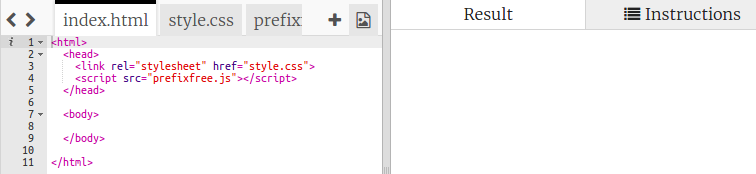
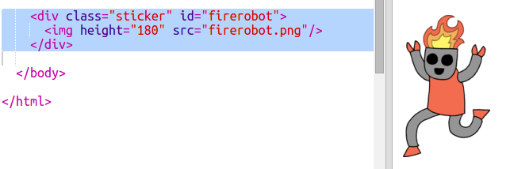
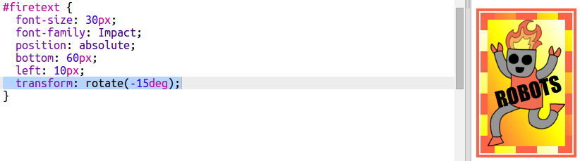
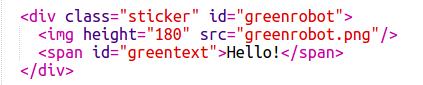
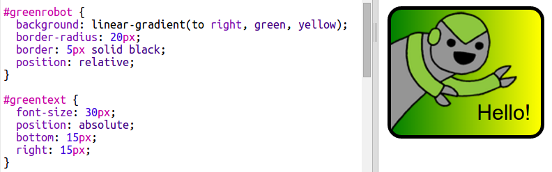

# Introduction { .intro}

Dans ce projet, vous allez créer tout un tas de stickers amusants que vous pouvez utiliser pour décorer vos pages Web. Vous allez apprendre à utiliser des dégradés que changent graduellement d'une couleur à une autre pour que vos stickers aient l'air cool. 

# Étape 1 : Sticker codage coloré {.activity}

Un dégradé est un changement graduel d'une couleur à une autre. Les dégradés peuvent être utilisés pour créer des effets cool. Vous allez les employer pour créer des stickers que vous pouvez utiliser sur vos pages Web. 

+ Ouvrez ce trinket : <a href="http://jumpto.cc/web-stickers" target="_blank">jumpto.cc/web-stickers</a>. 

	Le projet doit ressembler à ça :

	

+ Faisons un sticker 'I <3 Coding'. 

	Utilisez une `
` avec une classe `sticker` et un id `coding` pour que vous puissiez y appliquer un style : 

	

+ Hmm vous venez d'avoir une erreur ? C'est parce que '<' est un caractère spécial en HTML. À la place de '<', vous devez utiliser le code spécial `&lt;`. 

	Mettez à jour votre code pour utiliser `&lt;` afin que l'erreur disparaisse. 

	

	` ` donne une nouvelle ligne. 

+ Maintenant, rendons le sticker plus intéressant. 

	Passez au fichier `style.css`. Vous allez voir que la classe `.sticker` vous a été fournie. Elle agencera les stickers sur la page et centrera leur contenu. 

	Souvenez-vous que vous avez ajouté l'id `coding` à votre sticker. Au bas de `style.css`, ajoutez le code suivant pour styliser le texte :

	

+ Maintenant, vous pouvez ajouter un dégradé à l'arrière-plan du sticker. Un dégradé linéaire passe d'une couleur à une autre le long d'une ligne droite.

	Ce dégradé sera rouge au sommet et magenta en bas. Ajoutez le code dégradé à votre style `coding` :

	

+ Vous pouvez améliorer le résultat en ajoutant un remplissage et des angles arrondis. 

	Ajoutez le code en surbrillance :

	

	Le style `padding` ajoute un remplissage de 50 px au sommet et au bas et de 30 px à gauche et à droite. 

## Enregistrez votre projet {.save}

# Étape 2 : Sticker HTML & CSS {.activity}

Les dégradés peuvent aussi changer la couleur du centre vers les bords, c'est ce qu'on appelle un dégradé radial. 

+ Créons un sticker avec le texte `HTML & CSS.`  `&` est un autre caractère qui nécessite un encodage en HTML, le code est `&amp;`.

	Ajoutez le code en surbrillance pour créer un nouveau sticker : 

	

+ Maintenant, passez à votre fichier `style.css` et ajoutez un style pour votre nouveau sticker.

	

	Le code `text-shadow` ajoute une ombre qui s'étend de 2 px au-dessous et sur la droite du texte pour le faire ressortir. 

+ Maintenant passons au dégradé. Cette fois, utilisons un dégradé radial. La couleur variera du jaune au centre au orange puis au rouge. 

	

	Remarquez que les dégradés peuvent inclure de multiples couleurs, et pas seulement deux. 

+ Le sticker aura une bien meilleure apparence avec un peu de remplissage et une bordure arrondie. 

	Ajoutez le code en surbrillance :

	

## Enregistrez votre projet {.save}

##Challenge: Créez votre propre sticker dégradé {.challenge}

Maintenant, créez votre propre sticker dégradé. Essayez des dégradés linéaires et radiaux en utilisant de multiples couleurs HTML. 

Il vous faudra :

+ Ajouter une `
` avec le texte de votre sticker à `index.html` et lui donner la classe `sticker` ainsi qu'un nouvel `id`.
+ Ajouter un style pour l'`id` que vous avez choisi dans `style.css`. Vous pouvez copier l'un des styles de sticker que vous avez déjà réalisé et le modifier. 

Voici une liste de tous les noms de couleurs que vous pouvez utiliser : [jumpto.cc/web-colours](http://jumpto.cc/web-colours), qui inclut les noms de couleurs comme `tomato`, `firebrick` et `peachpuff`.

Si vous voulez changer la couleur du texte, vous pouvez utiliser `color:`.

Voici un exemple de ce que vous pouvez faire avec de multiples couleurs dans un dégradé linéaire :

## Enregistrez votre projet {.save}

# Étape 3 : Sticker robot fantaisiste {.activity}

Vous pouvez faire un sticker dégradé en utilisant une image. Si vous utilisez une image avec un arrière-plan transparent, alors le dégradé se verra à travers. 

Vous pouvez aussi créer des dégradés dans plusieurs directions différentes. 

+ Ajoutez un sticker à `index.html` en utilisant l'image `firerobot.png` :

	

	Vous pouvez ajuster la `height` pour redimensionner l'image, la largeur changera automatiquement. 

+ Normalement, un dégradé linéaire part du haut vers le bas, mais vous pouvez utiliser `to` pour changer la direction. Par exemple : `to top`, `to left`, ou `to right`.

	Pour un dégradé diagonal, vous avez deux directions. Cet exemple utilise `to bottom left`.

	Ajoutez ce style à `style.css` pour donner à votre nouveaux stick robot un dégradé diagonal et une bordure fantaisiste :

	

	Notez que vous pouvez utiliser `outline` pour créer une autre bordure en dehors de l'habituelle. 
	`outline-offset` donne l'écart entre la bordure et le contour. 

+ Ajoutons un peu de texte à ce sticker. 

	Ajoutez un `` contenant le texte "ROBOTS" à `index.html` et donnez-lui un id. 

	

+ Le texte aura une meilleure apparence si vous le grossissez et le positionnez. 

	Pour positionner le texte, il vous faudra ajouter `position: relative;` à `#greensticker` et `position: absolute` à `#greentext`. Le positionnement est abordé plus en détails dans le projet `Construire un robot`. 

	Ajoutez le code suivant à `style.css`:

	

+ Et pour le twist final, faisons pivoter le texte en utilisant `transform: rotate`.

	

	Essayez de changer le nombre de degrés de rotation du texte. 

## Enregistrez votre projet {.save}

##Challenge: Faire plus de stickers {.challenge}

Maintenant, essayez de faire plus de stickers en utilisant différentes directions de dégradés et en ajoutant des images, du texte et en utilisant des bordures et des contours. 

Astuce : Vous allez devoir ajouter du HTML et CSS pour chaque sticker. 

Vous pouvez copier et modifier l'un de vos exemples et faire des changements pour créer un nouveau sticker. 

Votre projet inclut déjà un ensemble d'images de robot. Cliquez sur l'icône images pour voir les images disponibles. 

Cet exemple utilise un dégradé linéaire avec `to right` :

## Enregistrez votre projet {.save}
