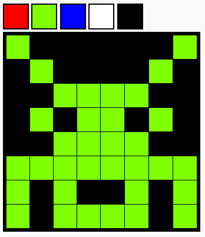
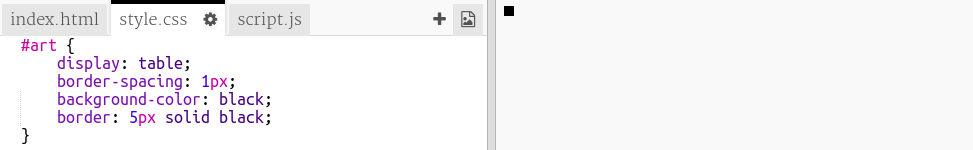
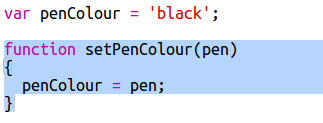

---
title: Crtanje pikselima
level: HTML & CSS 2
language: hr-HR
embeds: "*.png"
materials: ["Club Leader Resources/*.*","Project Resources/*.*"]
stylesheet: web
...

# Uvod {.intro}

U ovom projektu napravit ćemo editor za izradu crteža pomoću piksela. Osim HTML-a i CSS-a, za dodavanje interaktivnosti u projekt, koristit ćemo i JavaScript.

  <iframe src="https://trinket.io/embed/html/0e102a306b?outputOnly=true&start=result" width="600" height="450" frameborder="0" marginwidth="0" marginheight="0" allowfullscreen>
  </iframe>
  

__Kako koristiti editor__: Klikni na boju iz palete i odaberi boju olovke. Zatim klikni na piksele i promijeni im boju.

# Korak 1: Stvaranje rešetke piksela {.activity}

Napravimo rešetku piksela koju ćeš upotrijebiti za stvaranje svojih crteža. To ćemo postići tablicom koju ćemo oblikovati pomoću CSS-a.

Tablice sadrže retke koji sadrže ćelije. Kreirat ćemo tablicu s crnom pozadinom na koju ćemo staviti bijele piksele.

## Zadatci { .check}

+ Klikom na poveznicu: <a href="http://jumpto.cc/web-pixel" target="_blank">jumpto.cc/web-pixel</a>. otvori sučelje za izradu stranice. Čitaš li ovaj dokument online možeš koristiti i ugrađeni prozor koji se nalazi ispod ovog teksta: 

  <iframe src="https://trinket.io/embed/html/705f264f59" width="100%" height="400" frameborder="0" marginwidth="0" marginheight="0" allowfullscreen>
  </iframe>

+ U tijelo `<body>` datoteke `index.html` dodaj sljedeći kôd. 

	

 	Oznakom `
` stvorili smo mjesto za crtež, a dodajući joj naziv (`id="art"`) omogućili joj dodatno oblikovanje.
	
	Sada otvori datoteku `style.css` i dodaj oblikovanje za tablicu: 

	

	Prethodni kôd stvara tablicu s okvirom i postavlja razmak unutar rešetke. 

	Još ne izgleda zanimljivo, potrebno je postaviti retke s pikselima unutar rešetke.
	
	

 + Vrati se u datoteku `index.html` i dodaj red s 3 piksela u oznaku `
` naziva (id) `art`:

	

 	Primijeti da su tri linije s klasom "pixel" jednake. Upiši prvu, a zatim ju __kopiraj__ i __zalijepi__ još dvije.
	
	Ovaj puta upotrebljavamo klase za oblikovanje oznake `
` jer će ih biti puno:

 	Dodaj sljedeće oblikovanje za retke i ćelije:

	

 	Sada su pikseli smješteni u mreži sa crnim linijama oko njih.

 + Dodaj još dva retka piksela kako bi se stvorila rešetka 3 x 3. Ne zaboravi koristiti mogućnosti __kopiraj__ i __zalijepi__ i time uštedjeti vrijeme.

	
	
    
##Izazov: 
Promijeni veličinu svoje rešetke {.challenge}

3 x 3  je prilično mala rešetka za crteže s pikselima. Možeš li povećati rešetku? 8 x 8 je dobra veličina. 

U izradi rešetke koristi mogućnosti kopiraj i zalijepi, nemoj sve tipkati.

## Spremi projekt {.save}

# Korak 2: Oboji piksele {.activity}

HTML se koristi za organiziranje sadržaja na stranici, a  CSS za njegovo oblikovanje. JavaScript je programski jezik koji se može koristiti za promjenu web stranice tijekom interakcije s njom.

Za postavljanje pozadine pojedinačnih piksela moguće je koristiti HTML i CSS, ali to je sporo. Umjesto toga dodat ćemo JavaScript kôd koji će automatski obojati piksel kada se klikne na njega. 

+ U JavaScriptu se kôd smješta u `funkciju` koja se poziva kada se treba pokrenuti taj kôd. 

	Napravimo funkciju imena `setPixelColour`

	Funkcija `setPixelColour` mora znati koji piksel treba promijeniti boju. To je `input` (ulaz).
	Dodaj sljedeći kôd u datoteku `script.js` kako bi se postavila boja pozadine piksela:

	

	
+ Sada je potrebno pozvati funkciju kada se klikne na piksel.

	HTML koristi `onclick` za pozivanje funkcije kada je element kliknut. 

	Otvori datoteku `index.html` i dodaj sljedeći kôd prvom pikselu:

	

+ Isprobaj kôd klikom na prvi piksel. Trebao bi postati crn:

	

	Kako je  `onclick` dodan samo prvom pikselu, još neće funkcionirati za ostale. 

##Izazov: Neka svi pikseli reagiraju na klik mišem {.challenge}

Možeš li doraditi kôd tako da svi pikseli reagiraju na klik mišem? Koristi mogućnosti izreži i zalijepi za ubrzavanje postupka.

Napravi jedan brzi crtež koristeći piksele.

Savjet: Za brisanje svih piksela klikni __Autorun__.

# Korak 3: Dodaj paletu boja {.activity}

Misliš li da je naporno to što ne možeš promijeniti boju piksela u bijelo kada pogriješiš? Popravimo to stvaranjem palete boja tako da se može kliknuti na boju da bi se promijenila olovka.

+ Napravimo najprije stil za olovku. 

	Dodaj sljedeći kôd na kraj datoteke `style.css`:

	

+ Sada napravi crnu i bijelu olovku koje koriste prethodni stil. 

	Sljedeći kôd upiši iza oznake `<body>` u datoteku `index.html`:

	

	`Style =` omogućuje dodavanje CSS kôda unutar HTML dokumenta.

+ Sada želimo omogućiti promijenu boju olovke kada se klikne boja s palete. 

	Varijable se koriste za pohranjivanje podataka. Izradimo varijablu penColour u datoteci `script.js`. ,

	Dodaj sljedeći kôd na početak datoteke:

	

	Zatim dodaj funkciju za promjenu vrijednosti varijable penColour:

	

+ Obojanu olovku potrebno je koristiti i kada se želi promijeniti boja piksela. 

	Promijeni funkciju `setPixelColour` da koristi vrijednost varijable` penColour` umjesto `black`:

	 

+ Sada treba pozvati funkciju `setPenColour` kada se klikne boja olovke.

	Dodaj označeni `onclick` kôd  bojama olovke:

	

+ Provjeri možeš li promijeniti boju olovke između crne i bijele da ispuniš ili izbrišeš piksele.

Spremi promjene u projektu {.save}

## Izazov: Dodaj više boja u paletu {.challenge}

Možeš li dodati više boja u paletu? Odaberi boje s kojima želiš kreirati svoje crteže.

Zatim izradi neki _cool_ crtež pomoću piksela.

Savjet: Svijetlo zelena boja zove se "chartreuse".

! [screenshot] (piksel-art-final.png)

Zamoli voditelja radionice da ti dopusti da iskoristiš _Alat za izrezivanje_ (Windows Snipping Tool) ili neki drugi program i spremi kopiju svog crteža u obliku slike.

Spremi projekt {.save}

