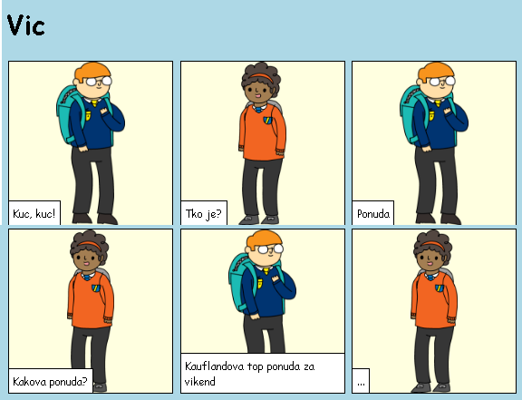
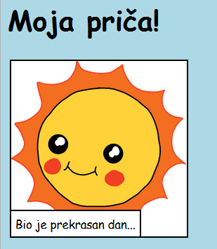
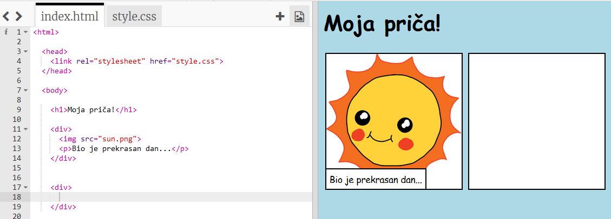
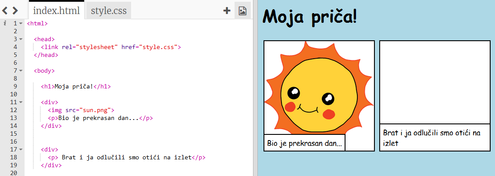
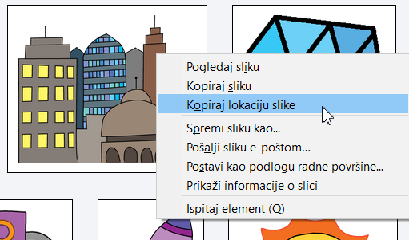
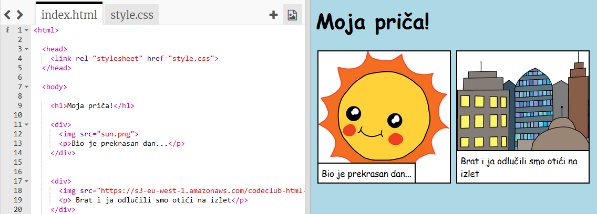

---
title: Ispričaj priču
level: HTML & CSS 1
language: hr-HR
embeds: "*.png"
materials: ["Club Leader Resources/*.*","Project Resources/*.*"]
stylesheet: web
...

# Uvod { .intro}

U ovom projektu naučit ćeš napraviti web stranicu za pričanje priče, vica ili pjesme.


# Korak 1: Odluči o čemu ćeš pisati { .activity}

Prije nego što započneš s pisanjem kôda odluči o čemu ćeš pisati.

## Zadatci { .check}

+ Razmisli o priči koju želiš ispričati. To može biti:
	+ Poznata priča;
	+ Izmišljena priča;
	+ Nešto što se dogodilo tebi ili nekome koga poznaješ.

	Osim priče to može biti vic, pjesma ili bilo što drugo što ti padne na pamet.

# Korak 2: Uređivanje priče { .activity}

Započnimo s uređivanjem HTML sadržaja i CSS stila naše stranice.

## Zadatci { .check}

+ Otvori Trinket sučelje klikom na poveznicu <a href="http://jumpto.cc/web-story" target="_blank">jumpto.cc/web-story</a>. Čitaš li ovaj dokument online, možeš koristiti i prozor koji se nalazi ispod ovog teksta. 
<div class="trinket">
	<iframe src="https://trinket.io/embed/html/8083cfebb3" width="100%" height="400" frameborder="0" marginwidth="0" marginheight="0" allowfullscreen>
	</iframe>
</div>

+ Vjerojatno se sjećaš iz projekta 'Sretan rođendan' da se sadržaj internetske stranice piše u tijelo ,`<body>`, HTML dokumenta.

	Dio za sadržaj na našoj web stranici počinje u sedmom redu kôda. Nalazi se unutar oznaka `<body>` i `</body>`.

	

+ Možeš li pronaći oznake koje se koriste za kreiranje različitih dijelova stranice?

	

	+ `<h1>` je  __heading__ (naslov). Za promjenu veličine naslova koriste se brojevi od 1 do 6;
	+ `<div>` je skraćeno od __division__ (pregrada). Koristi se za grupiranje elemenata. 
	+ `<p>` je __paragraph__ (odlomak) teksta.

##Izazov: Napravi nekoliko izmjena {.challenge}
Uredi HTML i CSS kôd tako da prilagodiš svoju stranicu.



Možeš mijenjati boje ili vrstu slova. Na primjer, <span style="font-family: Arial;">Arial</span>, <span style="font-family: Comic Sans MS;">Comic Sans MS</span>, <span style="font-family: Impact;">Impact</span> and <span style="font-family: Tahoma;">Tahoma</span>.

Trebaš li pomoć, iskoristi projekt 'Sretan rođendan'.

## Spremi promjene u projektu {.save}

# Korak 3: Pričanje priče { .activity}

Dodajmo drugi dio priče.

## Zadatci { .check}

+ Idi u 17. red kôda i dodaj novi komplet `<div>` oznaka. To će stvoriti novi odjeljak za slijedeći dio tvoje priče.

	

+ Unutar nove `<div>` oznake dodaj odlomak teksta.

	

+ Na kraju dodaj i sliku. Za dodavanje slike unutar oznake `<div>` koristiti oznaku ``: 

	```
	
	```

	Primjeti da su `` oznake drugačije od drugih oznaka: nemaju završnu oznaku.

+ Za dodavanje slike u HTML dokument potrebno je, unutar navodnika, dodati __izvor (source)__ slike. Pronađimo sliku koju ćemo dodati priči.

	Slijedi link <a href="http://jumpto.cc/web-images" target="_blank">jumpto.cc/web-images</a> i pronađi sliku koju želiš uključiti u svoju priču.

+ Pritisni desnim klikom miša na sliku, a zatim odaberi naredbu 'Kopiraj lokaciju slike (Copy image URL)'. URL je adresa slike.

	

+ Zalijepi URL između navodnika unutar oznake ``. Na stranici bi se sada trebala pojaviti odabrana slika. 

	
	

+ __Imaš li Trinket račun__ na stranicu možeš dodavati i vlastite slike. 

+ Klikni na ikonu za dodavanje slike koja se nalazi u gornjem desnom kutu trinket sučelja za unos kôda. Klikni na gumb 'Upload'.

	

+ Pronađi sliku na računalu i povuci je na mjesto predviđeno za to.

	

+ Sada možeš samo promijeniti ime slike koje se nalazi između navodnika unutar oznake ``:

	```
	
	```

## Spremi promjene u projektu {.save}

##Izazov: Nastavi! {.challenge}
Iskoristi naučeno u ovom projektu i završi svoju priču. Pogledaj primjer:


## Spremi projekt {.save}
