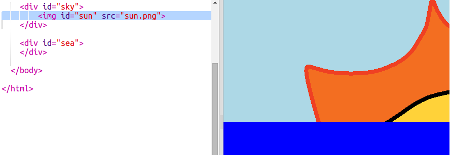

---
title: Izlazak sunca
level: HTML & CSS 2
language: hr-HR
embeds: "*.png"
materials: ["Club Leader Resources/*.*","Project Resources/*.*"]
stylesheet: web
...

# Uvod { .intro}

U ovom projektu naučit ćeš kako iskoristiti CSS i napraviti animaciju izlaska Sunca.

<div class="trinket">
  <iframe src="https://trinket.io/embed/html/abcc0284a3?outputOnly=true&start=result" width="600" height="400" frameborder="0" marginwidth="0" marginheight="0" allowfullscreen>
  </iframe>
  
</div>

# Korak 1: Stvaranje Sunca { .activity}

Započnimo s dodavanjem slike Sunca i postavimo ga na početno mjesto pomoću CSS-a.

## Zadatci { .check}

+ Otvori sučelje koje se nalazi na poveznici: <a href="http://jumpto.cc/web-sunrise" target="_blank">jumpto.cc/web-sunrise</a>. Čitaš li ovo online, možeš koristiti i ugrađenu verziju sučelja za ovaj projekt koja se nalazi ispod ovog teksta. 


<div class="trinket">
  <iframe src="https://trinket.io/embed/html/5085f92143" width="100%" height="400" frameborder="0" marginwidth="0" marginheight="0" allowfullscreen>
  </iframe>
</div>

+ Pogledaj u tijelo (`body`) `index.html` datoteke i pronaći ćeš oznake `div` za more (sea) i nebo (sky).

    ```
    <div id="sky">
    </div>
    
    <div id="sea">
    </div>
    ```

+ Slika sunca je već ukljućena u projekt. 

    Dodaj sliku sunca unutar elementa `div id="sky"` i dodaj mu id tako da omogućiš naknadno uređivanje:

    

+ Primijeti da je slika prevelika. Dodaj CSS kôd u `style.css` datoteku kojim ćeš odrediti visinu slike:

    

    Širina slike će se automatski prilagoditi kako bi proporcije ostale iste. 

+ Na kraju dodaj kôd kojim ćeš sliku sunca postaviti na željenu poziciju:

    


## Spremi projekt {.save}

# Korak 2: Animiranje izlaska sunca { .activity}

Za animaciju izlaska sunca potrebno je definirati način na koji se sunce kreće i koliko će mu biti potrebno da izađe.

Kako bi to postigli potrebno je  definirati popis __ključnih točaka (key frames)__. Svaka ključna točka definira CSS svojstva elementa u određenom trenutku animacije. 

## Zadatci  { .check}

+ Za početak, potrebno je upotrijebiti `@keyframes` za kreiranje nove animacije. 

    Dodajte sljedeći CSS kôd na kraj datoteke `style.css`:

    ```
    @keyframes sunrise {
        0% {top: 90%;}
        100% {top: 0;}
    }
    ```

    Ovaj kôd određuje gdje će se sunce postaviti na početku (`0%`) i kraju (`100%`) animacije.

    Zbog toga što se slika sunca nalazi unutar oznake `div` za nebo, postavljene `top` i `left` pozicije su unutar neba: `top: 100%` postavlja sunce u donji dio neba, a ne donji dio web stranice.

+ Nakon što smo napravili animaciju `sunrise`, potrebno je samo reći suncu da ju iskoristi! 

    Dodaj istaknuti kôd za sunce u CSS datoteku:

    

   Taj kôd govori suncu da provede 10 sekundi animirajući izlazak sunca.

+ Za ponovno pokretanje animacije u Trinket sučelju dovoljno je kliknuti gumb **Autorun**. 

## Spremi projekt {.save}

##Izazov: Dijagonalna animacija {.challenge}

Možeš li animaciji `sunrise` dodati kôd kako bi sunce započelo s kretanjem u donjem lijevom dijelu neba i kretalo se dijagonalno do svoje pozicije u gornjem dijelu centra?

Za to možeš koristiti svojstvo `left`. Na primjer:

```
left: 40%;
```


## Spremi promjene u projektu {.save}


# Korak 3: Beskonačna animacija { .activity}

Napravimo animaciju koja će se beskonačno ponavljati.

## Zadatci { .check}

+ Želiš li da sunce izađe pa zađe, animaciji trebaš dodati još __ključnih točaka__.

    ```
    @keyframes sunrise {
        0%   {top:90%; left:0;}
        33%  {top:0; left:40%; }
        66%  {top:0; left:40%; }
        100% {top:90%; left:80%; }
    }
    ```
 Ovo znači da animacija započinje i završava na dnu neba, a na vrhu ostaje od 33% do 66% animacije.

+ Sada je potrebno dodati riječ `infinite` u animaciju `#sun` kako bi se ona ponavljala beskonačno: 

    

+ Testiraj animaciju. Izlazi li sunce i zalazi? 


## Spremi promjene u projektu {.save}

# Korak 4: Animiranje neba { .activity}

Animacija se ne koristi samo za kretanje. Animirajmo nebo tako da postaje tamnije po noći.

## Zadatci { .check}

+ Dodaj animaciju `sky` u CSS datoteku:

    ```
    @keyframes sky {
        0% {background: black}
        100% {background: lightblue}
    }
    ```

    Primijeti da se sada animira boja, a ne pozicija.

+ Dodaj sljedeći kôd nebu kako bi ono koristilo ovu novu animaciju:

    ```
    animation: sky 10s;
    ```

    

+ Pokreni **Autorun** i testiraj animaciju. 

## Spremi projekt {.save}

##Izazov: Poboljšaj nebo {.challenge}

Možeš li promijeniti animaciju neba tako da se podudara sa suncem: ostaje plavo tijekom dana i postaje tamno dok sunce zalazi. Neka se i ova animacija ponavlja beskonačno. 


##Izazov: Više animacija {.challenge}

Možeš li animirati drugu sliku? Moguće je animirati poziciju, boju, oblik, veličinu, prozirnost ili bilo što drugo. 
Pokušaj promjeniti i trajanje animacije.

Za svaki element koji želiš animirati trebat ćeš:

+ Uključiti ga u HTML i pridružiti mu id.
+ Urediti id.
+ Stvoriti `@keyframes` pravilo.
+ Koristiti `animation:` za pokretanje animacije definirane s `@keyframes`. 

Klikni na ikonu za umetanje slika i pogledaj koje su sve slike uključene u ovaj projekt:


Želiš li, možeš postaviti i svoje slike.  

Ne zaboravi, elemente možeš postaviti i u more, jednako kao u nebo:


U ovom primjeru duga koristi svojstvo opacity (prozirnost) za efekt nestajanja:

```
@keyframes fade {
  0%   {opacity: 0;}
  50%  {opacity: 100;}
  66%  {opacity: 0;}
  100%   {opacity: 0;}
}
```

Brod koristi negativni početni položaj tako ga nije moguće vidjeti u jednom dijelu animacije:

```
 @keyframes left-right {
  0%    {left:-50%;}
  100%  {left:200%;}
}
```

## Spremi projekt {.save}
