---
title: Povezane Sobe
level: HTML & CSS 2
language: hr-HR
embeds: "*.png"
materials: ["Club Leader Resources/*.*","Project Resources/*.*"]
stylesheet: web
...

# Uvod {.intro}

U ovom projektu napravit ćeš niz povezanih soba. Svaka soba je, ustvari, druga web stranica koju možeš uređivati u HTML-u. 

  <iframe src="https://trinket.io/embed/html/ba5d27ec68?outputOnly=true&start=result" width="600" height="450" frameborder="0" marginwidth="0" marginheight="0" allowfullscreen>
  </iframe>
  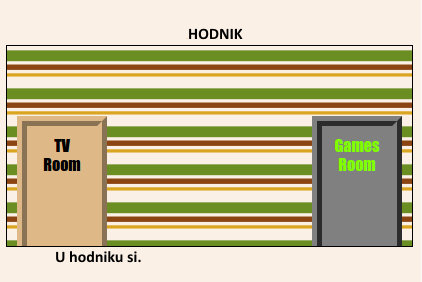

__Upute__: Za promjenu sobe klikni vrata.

# Korak 1: Povezivanje s drugom web stranicom u istom projektu. {.activity}

Web projekt može biti napravljen od više povezanih HTML datoteka.

## Zadatci { .check}

+ Klikom na poveznicu: <a href="http://jumpto.cc/web-rooms" target="_blank">jumpto.cc/web-rooms</a> otvori sučelje za izradu stranice. Čitaš li ovaj dokument online možeš koristiti i ugrađeni prozor koji se nalazi ispod ovog teksta: 

  <iframe src="https://trinket.io/embed/html/ef608f0733" width="100%" height="400" frameborder="0" marginwidth="0" marginheight="0" allowfullscreen>
  </iframe>

+ Projekt bi se trebao pokrenuti sam i smjestiti te u hodnik (Hall):

	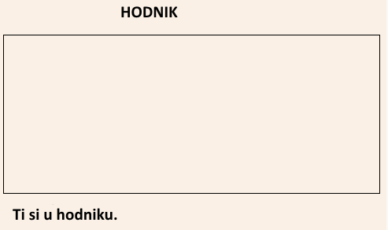

+ Pogledaj kartice s datotekama uključenim u projekt. Pronađi karticu `tvroom.html` i klikni na nju.

	

	To je druga html datoteka istog projekta. 

+ Da bi s početne stranice došli do datoteke `tvroom.html` potrebno je dodati poveznicu (link) u datoteku `index.html`. 

	Oznaci `
` s klasom `room` dodaj označeni kôd: 

	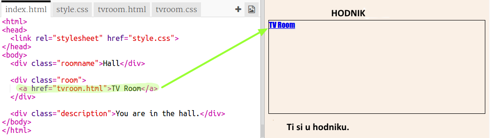

+ Provjeri rezultat klikom na poveznicu __TV Room__. Otvorit će se stranica `tvroom.html`.

	Primijeti da `tvroom.html` datoteka također ima svoju `tvroom.css` datoteku koja određuje izgled ove stranice. 

	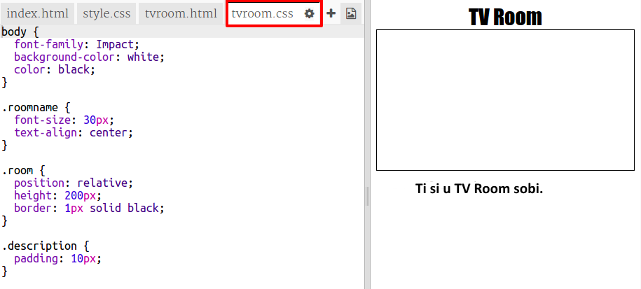

	
##Izazov: Dodaj drugu poveznicu {.challenge}

Oznakom `<a>` dodaj poveznicu na stranicu `tvroom.html` koja će te vratiti natrag u hodnik (Hall), odnosno na stranicu `index.html`. Tekst poveznice neka bude 'Hall' (ili hodnik, želiš li koristiti nazive na hrvatskom jeziku. U tom slučaju promijeni naziv 'Hall' u 'Hodnik' na stranici index.html, te nazive 'TV Room' u 'TV soba' na obje stranice. Također možeš promijeniti tekst 'You are in the' u 'Nalaziš se u').

Stranica TV Room (TV soba) sada treba imati poveznicu kao na slici: 

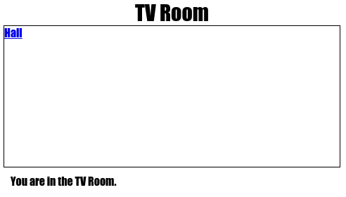

Provjeri kôd. Klikom na poveznice trebaš se pomicati iz hodnika (Hall) u TV sobu (TV Room) i natrag.

## Spremi projekt {.save}

# Korak 2: Dodaj drugu sobu {.activity}

Dodajmo sada __Sobu za igru__, (Games Room). 

+ Klikni gumb __+__ kako bi se dodala nova stranica:

	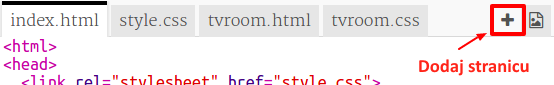

	Ime stranice neka bude `igra.html`:

  	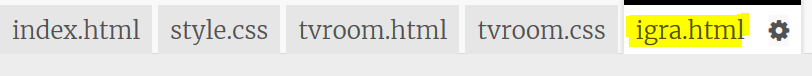

+ HTML kôd sobe za igru je sličan kôdu stranice`tvroom.html` pa __kopiraj__ kôd sa stranice  `tvroom.html` __zalijepi__ ga u datoteku `igra.html`.
	
	Promijeni istaknute nazive tako da piše __Soba za igru__ (Games Room, koristiš li engleske nazive)  umjesto __TV soba__ (TV Room):

		

+ Datoteka `igra.html` sada koristi datoteku  `igra.css` koja još ne postoji. 

	Klikom na gumb __+__ kreiraj datoteku `igra.css` . 

+ CSS kôd za sobu za igru je sličan kôdu iz datoteke `tvroom.css`. __Kopiraj__ kôd iz datoteke `tvroom.css` i __zalijepi__  ga u datoteku `igra.css`.

	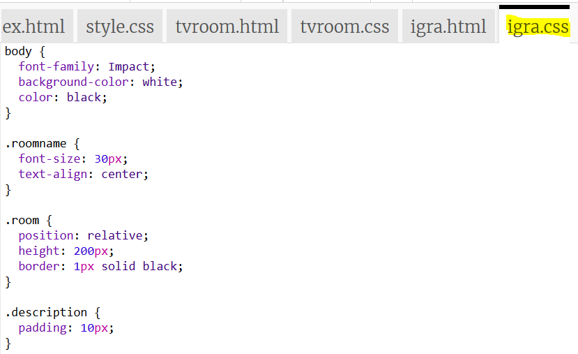

+ Dodaj poveznicu iz hodnika (Hall) u sobu za igru (Games room):

	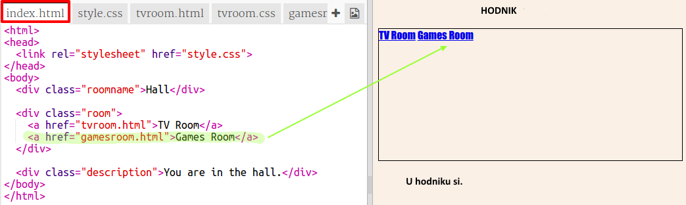

+ Provjeri rezultat klikom na poveznicu Soba za igru (Games Room). 

	Stranica __Soba za igru__ treba izgledati ovako: 

	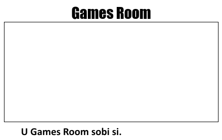

	Nije previše zanimljiva, ali to možeš popraviti u sljedećem izazovu. 

## Spremi promjene u projektu {.save}

##Izazov: Uredi i poveži Sobu za igru (Games Room) {.challenge}

Uredi HTML i CSS kôd stranice __Soba za igru__ tako da ona izgleda ovako: 

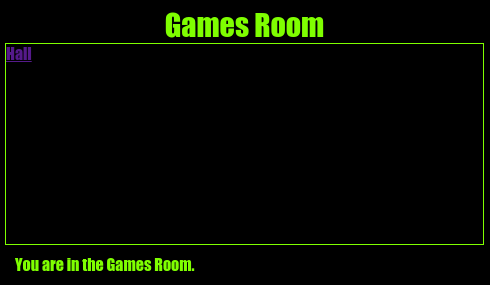

Pomoć: Morat ćeš promijeniti boju pozadine, boju slova i boju obruba u datoteci `igra.css`. Svijetlo zelena se naziva `chartreuse`.  

Pomoć: Nemaš li poveznicu na hodnik, dodaj oznaku `<a>` u datoteku `igra.html` koja vodi do datoteke  `index.html`.

## Spremi promjene u projektu {.save}

# Korak 3: Neka poveznice izgledaju kao vrata {.activity}

Poveznice ne moraju biti samo tekstovi. Pomoću oznake `
` napravit ćemo vrata na koja je moguće kliknuti.

## Zadatci { .check}

+ Otvori datoteku `index.html` i oko teksta za povezivanje __TV soba__ (TV Room) dodaj oznaku `
`. Da bi se na nju moglo kliknuti mora biti unutar oznake `<a>`.

  Dodaj `id="hall2tv"` za omogućavanje dodatnog uređivanja. 

  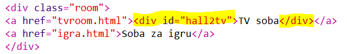  

+ Klikni na karticu `style.css`, idi na kraj datoteke i dodaj sljedeći CSS kôd kojim ćeš promijeniti boju i veličinu vrata:

	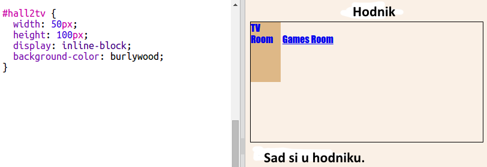

+ Testiraj svoju web-stranicu klikom na bilo koji dio vrata, ne samo na tekst.

+ Da bi poveznica i izgledala kao vrata, s tri strane dodat ćemo obrub.

	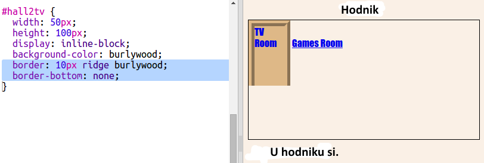

+ Dodaj sljedeći CSS kôd kako bi tekst na vratima izgledao bolje.

	

+ Vjerojatno primjećuješ da vrata izgledaju kao da lebde. To ćemo popraviti tako da vrata premjestimo unutar sobe.

	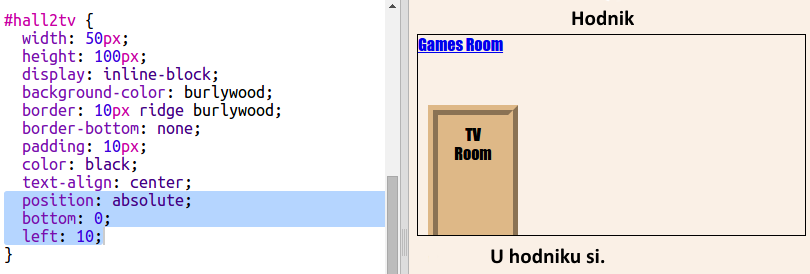	

+ Testiraj stranicu klikom na vrata.

## Spremi promjene u projektu {.save}

##Izazov: Dodaj više vrata {.challenge}

Pretvori ostale poveznice u projektu u vrata na isti način. 

Za svaka vrata ćeš morati:

+ Urediti poveznicu pomoću oznake `
` s nazivom (id) kao što je`hall2games` kako bi se naknadno mogla urediti.

	Na primjer: 

	`<a href="igra.html">
Soba za igru
</a>`

+ Dodati CSS kôd definiranom id-u u `.css` datoteci. Za uštedu vremena slobodno koristi mogućnosti _kopiraj_ i _zaplijepi_. Slobodno svaka vrata uredi drugačije. 

+ Promijeni mjesto vrata koristeći `bottom:` i `left:` ili `right:`.

Hodnik (Hall) bi mogao izgledati ovako:

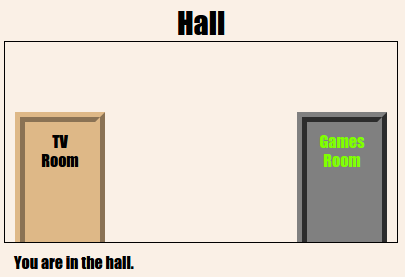

TV soba (TV Room) može izgledati ovako:

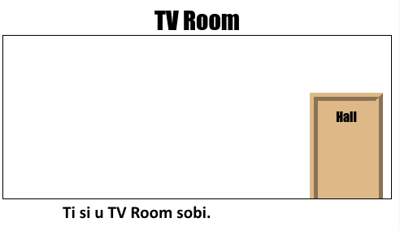	

# Korak 4: Dodavanje slike u pozadinu {.activity}

Uredimo hodnik tako što ćemo mu dodati sliku u pozadinu.

## Zadatci{ .check}

+  Dodaj sljedeći kôd u datoteku `style.css`. Njime će se dodati slika u pozadinu hodnika:

	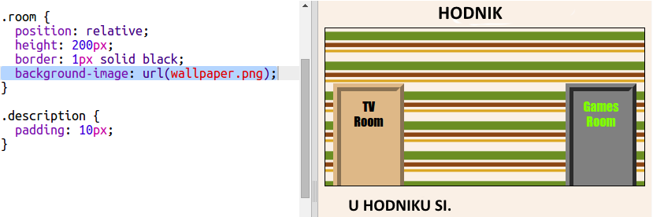	

	Slika će se ponoviti da bi popunila sobu. 

## Spremi projekt {.save}

##Izazov: Dodaj pozadinsku sliku u Sobu za igru (Games Room) {.challenge}

Možeš li urediti sobu za igru s pozadinskom slikom?

Možeš koristiti `space-invader.png`. Ona je već učitana u projekt. 

Trebat ćeš:

+ Dodati sliku pomoću `background-image:` u stil `.room` u css datoteku za sobu za igru. 

Uređena soba bi trebala izgledati ovako :

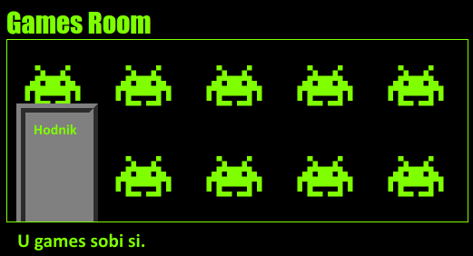	

##Spremi projekt {.save}

##Izazov: Načini je svojom! {.challenge}

Dodaj još soba u svoj projekt. Za uštedu vremena slobodno koristi mogućnosti __kopiraj__ i __zalijepi__, te promijeni one elemente koje želiš. 

Za svaku sobu ćeš trebati:

+ Napraviti `.html` datoteku
+ Dodati poveznice za vrata __u__ i __iz__ nove 'sobe'
+ Za novu sobu napraviti `.css` datoteku sa stilom. 

Pomoću `background-color:` možeš promijeniti boju pozadine svake sobe. Klikni na ikonu za dodavanje slike i provjeri koje pozadinske slike možeš koristiti:

	

## Spremi projekt {.save}

