---
title: Pregled projekata
level: HTML & CSS 1
language: hr-HR
embeds: "*.png"
materials: ["Club Leader Resources/*.*","Project Resources/*.*"]
stylesheet: web
...

# Uvod {.activity}

U ovom projektu napravit ćeš pregled svojih HTML projekta, te učiti o poveznicama i ugrađivanju izvora. 

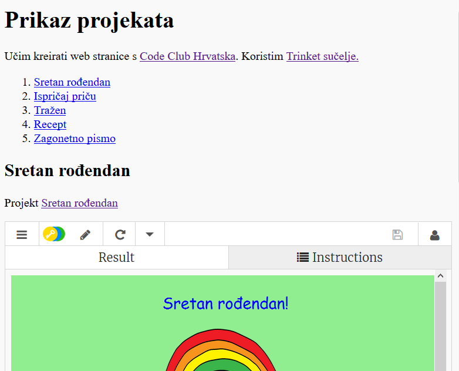

# Korak 1: Dodavanje poveznica (linkova) na web stranice {.activity}

Tekstualne poveznice omogućuju da posjetimo drugu web stranicu jednostavnim klikom na riječ. Te riječi su obično podvučene.

## Zadatci { .check}

+ Otvori sučelje za izradu stranice klikom na poveznicu: <a href="https://trinket.io/html/9ad31460f0">https://trinket.io/html/9ad31460f0</a>. Čitaš li ovaj dokument online možeš koristiti i ugrađeni prozor koji se nalazi ispod ovog teksta: 

  <iframe src="https://trinket.io/embed/html/9ad31460f0" width="100%" height="400" frameborder="0" marginwidth="0" marginheight="0" allowfullscreen>
  </iframe>

+ HTML za poveznice koristi oznaku `<a>`. 

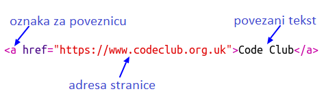

+ Pronađi oznake `<a>` u svom projektu. 

+ Promijeni tekst 'Project Showcase' u 'Pregled projekata', dodaj adresu web stranice Code Cluba <a href="http://codeclubcroatia.org/">Code Club Hrvatska</a> i poveži tekst:

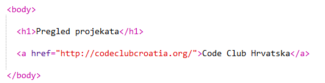

+ Ako nemaš uključenu mogućnost 'Autorun' gumbom 'Run' provjeri rezultat.

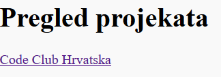

+ Klikni na poveznicu Code Club Hrvatska i prikazat će ti se web stranica Code Club Croatia: 	

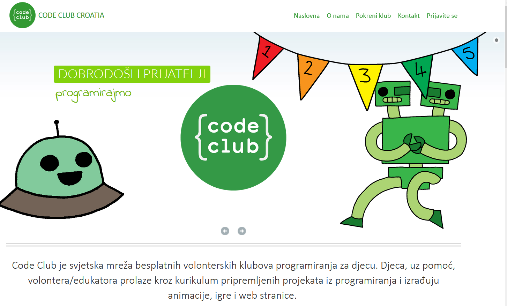

+ Za povratak na svoju stranicu možeš: 

	+ Pokrenuti (Run) ponovo trinket dokument,

	+ Pritisnuti tipku 'Backspace' na tipkovnici, ili

	+ Kliknuti desnom tipkom miša i izabrati povratak. 

## Zadatci { .check}

+ Postavi poveznicu u rečenici unutar odlomka.

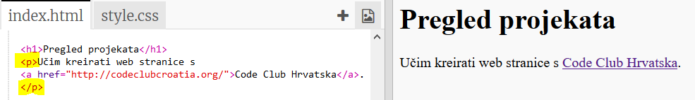

 i provjeri radi li. 

## Izazov: Dodaj drugu poveznicu {.challenge}

Dodaj rečenicu s poveznicom neke web stranice korisne za izradu web projekata. Na primjer: <a href="https://trinket.io">https://trinket.io</a> ili <a href="http://colours.neilorangepeel.com">http://colours.neilorangepeel.com</a>.

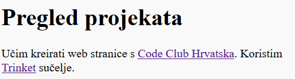

# Spremi projekt{.activity}

# Korak 2: Poveznica za Trinket sučelje {.activity}

Povežimo se s web stranicom  Trinket sučelja. 

## Zadatci { .check}

+ Imaš li spremljenu poveznicu projekta 'Sretan rođendan'? Ako imaš, otvori ga u novoj kartici ili prozoru. U suprotnom otvori završeni primjer tog projekta koji se nalazi na adresi: <a href="https://trinket.io/html/e996dc0380">https://trinket.io/html/e996dc0380</a>

+ Klikni na gumb 'Share', te iz dobivenog izbornika odaberi naredbu 'Link':

+ Iz padajućeg izbornika u dijelu 'Customize' odaberi naredbu kojom će se pokazati kôd ili rezultat, ovisno o želji korisnika: 'Only show code or result (let users toggle between them)' i kopiraj dobivenu poveznicu. 

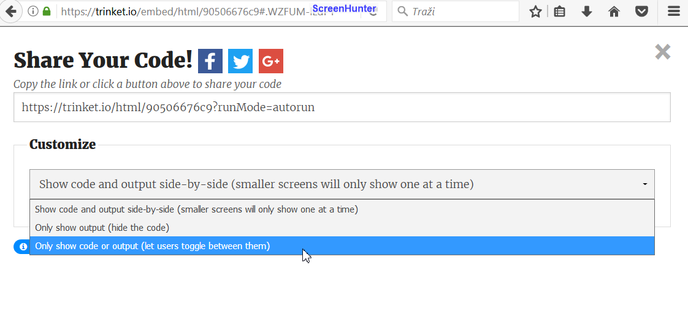

+ Vrati se na svoju stranicu 'Pregled projekata'. Dodaj `<h2>` naslov i poveznicu na projekt Sretan rođendan. 

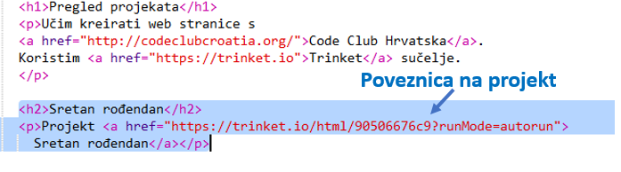

Provjeri izgled svoje stranice, trebala bi izgledati otprilike ovako:

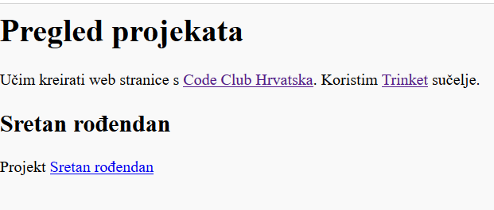

Klikni na poveznicu Sretan rođendan i provjeri otvara li taj projekt.

## Spremi promjene u projektu {.save}

## Izazov: Kreiraj popis svojih projekta {.challenge}

Dodaj i ostale svoje HTML &amp; CSS projekte kreirane u Code Clubu. Za organizaciju stranice koristi naslove `<h2>` razine. 

Ako nemaš poveznice s tim projektima koristi Code Club primjere:

+ Sretan rođendan: <a href="https://trinket.io/html/e996dc0380">https://trinket.io/html/e996dc0380</a>

+ Ispričaj priču: <a href="https://trinket.io/html/c8afdef912">https://trinket.io/html/c8afdef912</a>

+ Tražen: <a href="https://trinket.io/html/ebeb56398a">https://trinket.io/html/ebeb56398a</a>

+ Recept: <a href="https://trinket.io/html/c0fd9b40cd">https://trinket.io/html/c0fd9b40cd</a>

+ Zagonetno pismo: <a href="https://trinket.io/html/1d4d4c5ce1">https://trinket.io/html/1d4d4c5ce1</a>

Na kraju bi stranica trebala izgledati ovako:

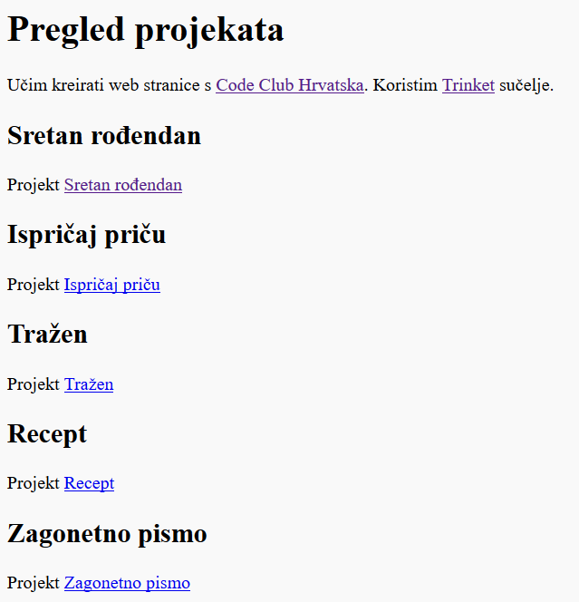

## Spremi promjene u projektu {.save}

# Korak 3: Ugrađivanje projekata {.activity}

Osim povezivanja projekata na web stranici, možemo ih i ugraditi. 

## Zadatci { .check}

+ Kako biste imali više prostora, preporučujemo rad preko cijelog zaslona (Fullscreen):

Za izlazak iz načina preko cijelog zaslona dovoljno je pritisnuti tipku Escape.

+ Pokreni projekt i klikni na poveznicu projekta Sretan rođendan. 

+ Otvori izbornik i odaberi naredbu __Embed__. Ako ne radiš u prikazu preko cijelog zaslona možda ćeš se morati pomicati prema dolje. Za pomicanje (skrolanje) koristi klizač ili strelicu prema dolje na tipkovnici.

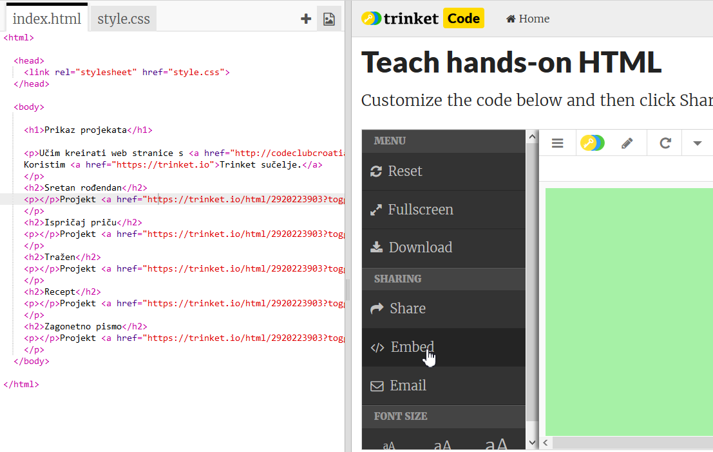

## Zadatci { .check}

+ Iz izbornika odaberi mogućnost 'Only show code or result (let users toggle between them))' i __kopiraj__ dobiveni kôd za ugrađivanje. 

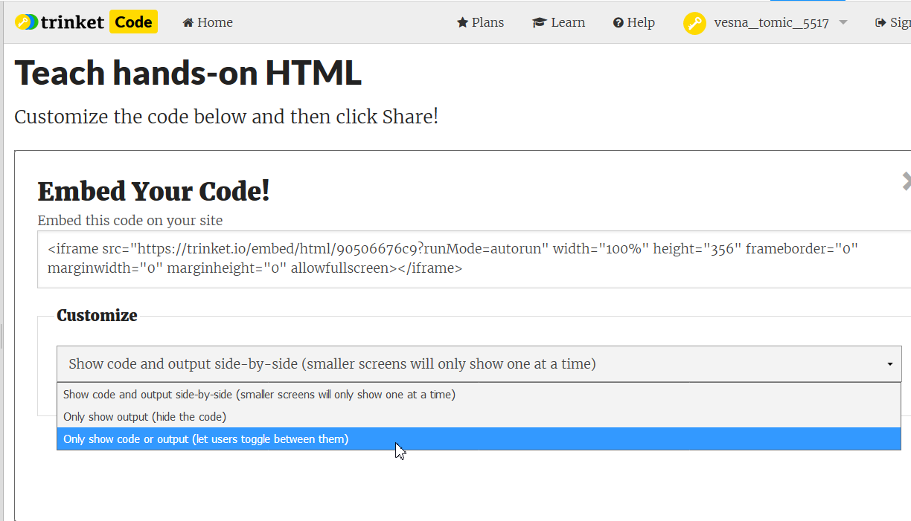

+ Trinket je kreirao HTML kôd koji ti omogućuje ugrađivanje u web stranicu. Za ugrađivanje sadržaja u web stranicu koristi se oznaka `<iframe>`. 

+ Zalijepi dobiveni kôd u svoj HTML dokument nakon poveznice na projekt Sretan rođendan:

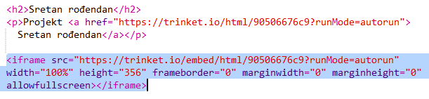

+ Pokreni projekt i provjeri rezultat. Ako je sve u redu, projekt Sretan rođendan bit će ugrađen u stranicu. 

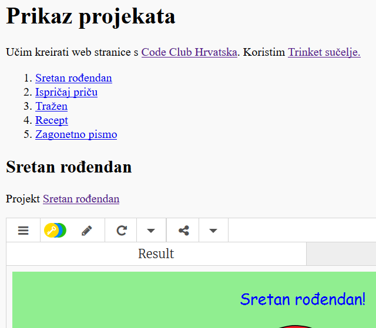

+ Može se dogoditi da se na stranici ne prikazuje donji dio ugrađeng sadržaja. U tom slučaju je potrebno promijeniti vrijednost visine (height) unutar oznake `<iframe>`. 

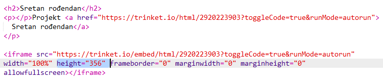

Postavi visinu na __400__. Ako to nije dovoljno odaberi drugu vrijednost. 

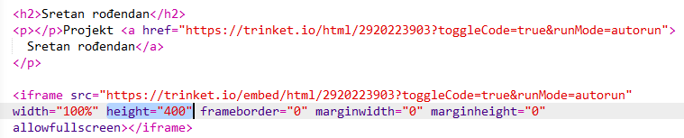

## Spremi promjene u  projektu {.save}

## Izazov: Ugradi još projekata {.challenge}

Ugradi u stranicu i svoje ostale projekte. Jednostavno ćeš ih pronaći preko već napravljenih poveznica. 

# Korak 4: Tablica sadržaja {.activity}

Kako bi lakše došli do određenog projekta napravimo tablicu sadržaja.  

## Zadatci { .check}

+ Kao što se možemo povezivati sa stranicama, moguće se povezati i s dijelovima stranice. Za to je potrebno postaviti identifikator, `<id>` na dio stranice s kojim se želimo povezati. 

Dodaj id  `<h2>` oznaci projekta 'Sretan rođendan':

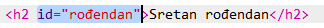

+ Dodaj id svakom od svojih projekata i daj im kratka imena : priča, tražen, recept i pismo. 

+ S elementom koji ima id povezuje se znakom ‘#’ koji se stavlja ispred njegovog imena. Npr. `#rođendan`. 

Kreiraj poredanu listu veza do svojih projekata. (S poredanim listama upoznali smo se u projektu Recept)

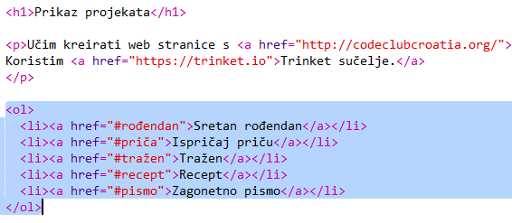

+ Pokreni projekt i testiraj ga odabiranjem poveznica projekata. 

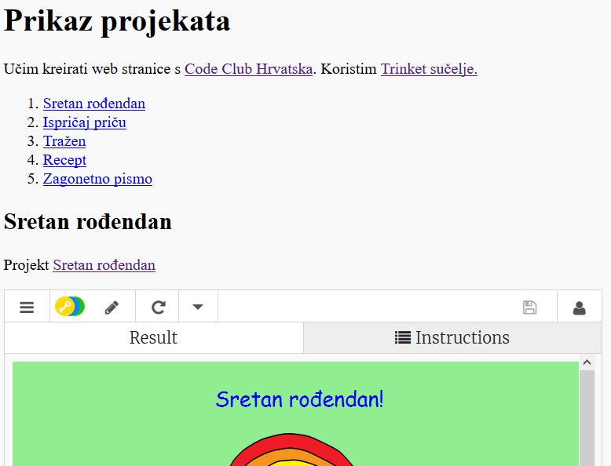

## Spremi promjene u projektu {.save}

# Korak 4: Povratak na vrh {.activity}

## Zadatci { .check}

+ Jedna od korisnih mogućnosti je povratak na vrh stranice. HTML ima `#top` za tu radnju. 

+ Dodaj vezu na `#top` nakon svakog ugrađenog projekta na svojoj webstranici:

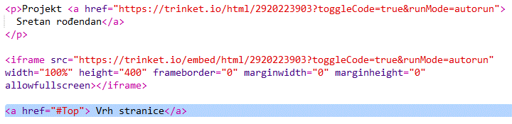

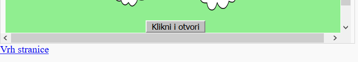

+ Provjeri poveznice klikom na tekst 'Vrh stranice' iza svakog projekta.  

## Spremi promjene u projektu {.save}

## Izazov: Unaprijedi svoju stranicu {.challenge}

Iskoristi CSS naučen u prethodnim projektima i napravi stranicu zanimljivijom. Pokušaj promjeniti boju pozadine stranice ili font korišten za naslove. 

Također možeš dodati neke informacije o svakom projektu i što ti se svidjelo kod njegove izrade. 

## Izazov: Kreiraj novu stranicu s pregledima {.challenge}

Trinketi nisu jedine stvari koje se ugrađuju u web stranicu. Moguće je ugraditi video, widgete(kao na primjer vremenski widget) ili Scratch projekte.

Otvori  primjer Scratch projekta ugrađenog u Trinket i pokreni ga: <a href="https://trinket.io/html/9f7212b8fe">https://trinket.io/html/9f7212b8fe</a>

Odi na Scratch web stranicu i pronađi projekt koji ti se sviđa. To može biti i jedan od tvojih projekata.

Ako si prijavljen odaberi gumb 'Embed' koji se nalazi ispod projekta kako bi dobio HTML ugrađeni kôd. 

Ako nisi prijavljen onda potraži neki Scratch projekt sa Scratch web stranice. 

Kopiraj dobiveni `<iframe>` kôd i zalijepi ga u svoj HTML dokument:

## Spremi projekt {.save}
