---
title: Recept
level: HTML & CSS 1
language: hr-HR
embeds: "*.png"
materials: ["Club Leader Resources/*.*","Project Resources/*.*"]
stylesheet: web
...

# Uvod { .intro}

U ovom projektu napravit ćemo stranicu najdražih recepata.

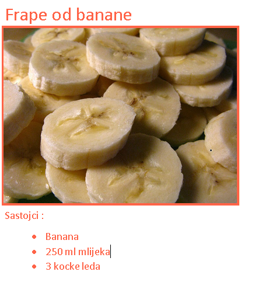

# Korak 1: Pripremi recept { .activity}

Prije nego krenemo s pisanjem kôda odaberi jedan od svojih najdražih recepata.

## Zadatci { .check}

+ Razmisli o receptu koji želiš podjeliti s prijateljima. To može biti:
	+ Recept s neke internetske stranice;
	+ Tvoje omiljeno jelo ili
	+ Nešto izmišljeno!

Recept koji ćemo koristiti u ovom projektu kao primjer je recept za frape od banana. Nemaš li svoj recept, slobodno koristi ovaj.

# Korak 2: Sastojci { .activity}

Popišimo najprije sve potrebne sastojke.

## Zadatci { .check}

+ Otvori predložak na poveznici: [jumpto.cc/trinket-template](http://jumpto.cc/trinket-template). Ako čitaš ovaj dokument na internetu možeš koristiti i prozor koji se nalazi ispod ovog teksta. 

<div class="trinket">
  <iframe src="https://trinket.io/embed/html/ef4c882ae6" width="100%" height="400" frameborder="0" marginwidth="0" marginheight="0" allowfullscreen>
  </iframe>
</div>

+ Za popis sastojaka korsitit ćemo __neporedanu listu__. Za definiranje neporedane liste koristi se oznaka `<ul>`. Odi u osmi red predloška i dodaj sljedeći HTML kôd. Tekst koji se nalazi unutar `<h1>` oznaka zamijeni s naslovom svog odabranog recepta. 

```
<h1>Frape od banana</h1>

<h3>Sastojci:</h3>

<ul>

</ul>
```

+ Stranica bi sada trebala izgledati ovako: 


Elementi liste se još uvijek ne vide, jer nisu dodani. 

+ Sljedeći korak je dodavanje sastojaka na listu. Za dodavanje elemenata liste koristi se oznaka `<li>`. Unutar `<ul>` oznake dodaj sljedeći kôd:

```
<li>1 banana</li>
```
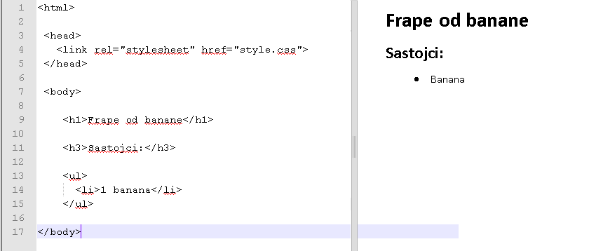

Budući da je lista __neporedana__, sastojci nisu označeni brojevima već točkama.

##Izazov: Više sastojaka {.challenge}
Možeš li dodati sve sastojke svog odabranog recepta?

Web stranica bi trebala izgledati poput ove:

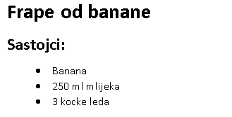

## Spremi projekt {.save}

# Korak 3: Priprema { .activity }

Objasnimo sada način pripreme recepta:

## Zadatci { .check}

+ Za opis načina pripreme recepta koristit ćeš novu listu. Ovaj puta to će biti __poredana lista__. Ona se definira oznakom `<ol>`.

Poredana lista je brojčana lista koja se koristi kada je redoslijed koraka bitan.

Dodaj ovaj kôd ispod liste sa sastojcima. Svakako pazi da ga upišeš unutar oznake `<body>`:

```
<h3>Priprema:</h3>

<ol>

</ol>
```

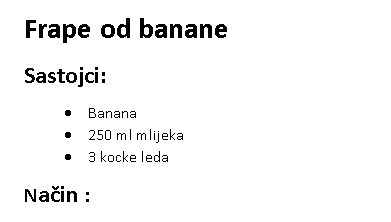

+ Sada dodaj korake u listu:

```
<li>Oguli bananu i stavi ju u blender</li>
```

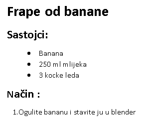

Primjeti da su koraci na listi automatski numerirani!

##Izazov: Više koraka {.challenge}

Možeš li dodati na listu sve korake za pripremu __svog__ recepta?

To bi trebalo izgledati otprilike ovako: 

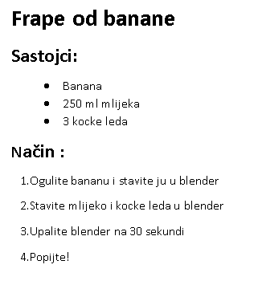

## Spremi promjene u projektu {.save}

# Korak 4: Boje { .activity}

Dodajmo na stranicu s receptom malo boja!

## Zadatci { .check}

+ Već smo naučili dodati na stranicu tekst u različitim bojama. U `style.css` datoteku dodaj sljedeći kôd. On će sav tekst na stranici prikazati u plavoj boji:

```
body {
    color: blue;
}
```

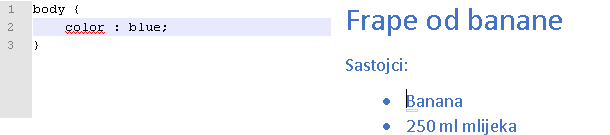

+ Preglednik prepoznaje boje kao što su `blue`(plava), `yellow`(žuta) i čak `lightgreen`(svijetlo zelena). Je li ti poznato da preglednik ustvari prepoznaje više od 140 imena različitih boja?

Na sljedećoj poveznici se nalazi popis boja koje se mogu koristiti: [jumpto.cc/web-colours](http://jumpto.cc/web-colours). Primjeti da ovaj popis uključuje imena kao što su `tomato`(rajčica), `firebrick`(cigla) ili `peachpuff`(breskva).

Promjeni boju teksta iz `blue` u `tomato`.

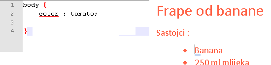

+ Preglednik prepoznaje 140 imena boja, ali zapravo zna šifre (vrijednosti) više od 16 milijuna boja!


Kao što možda znaš, sve boje se mogu napraviti od tri osnovne boje: crvene, zelene i plave. Da bi rekli pregledniku koju boju treba prikazati, potrebno je odrediti koliko će koristiti crvene, zelene i plave boje. 

Količina crvene, zelene i plave boje određuju se brojem imeđu `0` i `255`.


Dodaj sljedeći CSS kôd za tijelo (body) stranice, kako bi se prikazala svijetlo žuta pozadina:

```
background: rgb(250,250,210);
```

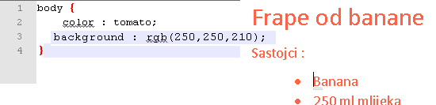

+ Ako ti se više sviđa, boje možeš prikazati koristeći heksadecimalni kod (ili hex code). On funkcionira na sličan način kao rgb() kôd iznad, osim što svaki heksadecimalni kôd počinje znakom '#', a za određivanje količine crvene, zelene i plave boje koristi heksadecimalne brojeve između '00' i 'ff'.

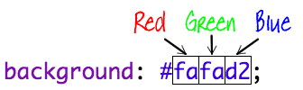

Zamijeni 'rgb()' kôd u CSS datoteci heksadecimalnim kodom:

```
background: #fafad2;
```

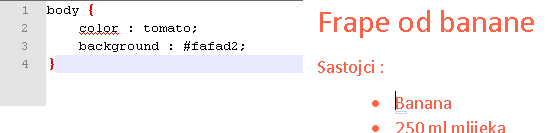

Rezultat bi trebala biti jednaka svijetlo žuta boja kao i ranije!

## Spremi promjene u projektu {.save}

# Korak 5: Završni detalji { .activity}

Dodajmo još malo HTML i CSS kôda i poboljšajmo web stranicu! 

## Zadatci { .check}

+ Oznakom `<hr>` dodaj vodoravnu liniju na kraj recepta. 

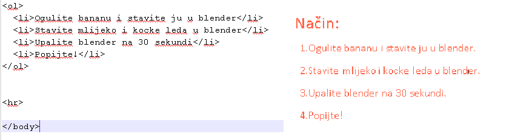

Primjeti da i ova oznaka nema završnu oznaku. Jednako kao oznaka ``.

+ Dodana linija ne podudara se sa stilom ostatka web stranice. Popravimo to sljedećim CSS kôdom: 

```
hr {
    height: 2px;
    border: none;
    background-color: tomato;
}
```

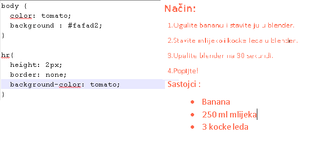

+ Sljedećim CSS kôdom možeš promjeniti izgled grafičkih oznaka u neporedanoj listi:

```
ul {
    list-style-type: square;
}
```

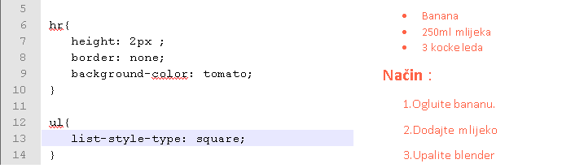

##Izazov: Još boja!{.challenge}

Promjeni boje na svojoj stranici koristeći imena boja, `rgb()` vrijednosti i heksadecimalnim kodovima. Ovdje možeš pronaći popis boja: <a href="http://jumpto.cc/web-colours" target="_blank">jumpto.cc/web-colours</a>.

Evo nekih primjera boja:

+ Crvena može biti napisana ovako:
	+ `red` (očito!)
	+ `rgb(255,0,0)` (puno crvene, bez plave i zelene)
	+ `#ff0000`

+ Maslinasto zelena može biti napisana na sljedeći način:
	+ `olive`
	+ `rgb(128, 128, 0)` (malo crvene, malo zelene, bez plave)
	+ `#808000`

Pokušaj koristiti boje koje se slažu s tvojim receptom.

## Spremi promjene u projektu{.save}

##Izazov: Osvrti {.challenge}

Pitaj nekoliko prijatelja da ostave svoj osvrt i ocjenu recepta. Za prikaz osvrta trebat će ti još jedna lista.

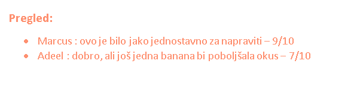

## Spremi promjene u projektu {.save}

##Izazov: Više uređivanja {.challenge}

Možeš li na svoju stranicu dodati sliku? Ili promjeniti font? Pogledaj primjer: 


Sljedeći kôd ti može pomoći u rješavanju ovog izazova:

```
font-family: Arial / Comic Sans MS / Courier / Impact / Tahoma;
font-size: 12pt;
font-weight: bold;


```

## Spremi projekt{.save}
