---
title: Sretan rođendan
level: HTML & CSS 1
language: hr-HR
embeds: "*.png"
materials: ["Club Leader Resources/*.*","Project Resources/*.*"]
stylesheet: web
...

# Uvod { .intro}

U ovom projektu upoznat ćemo se s HTML-om i CSS-om tako što ćemo izraditi rođendansku čestitku.

<div class="trinket">
  <iframe src="https://trinket.io/embed/html/e996dc0380?outputOnly=true&start=result" width="600" height="450" frameborder="0" marginwidth="0" marginheight="0" allowfullscreen>
  </iframe>
  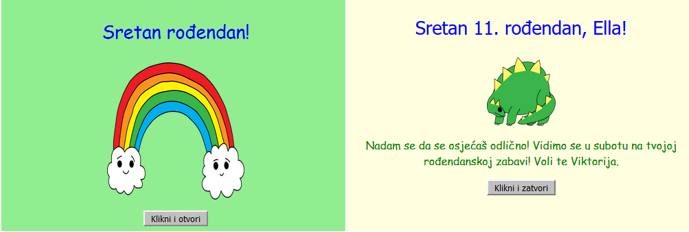
</div>

# Korak 1: Što je HTML? { .activity}

HTML je  __HyperText Markup Language__, a njime se koristimo za izradu web stranica. Pogledajmo primjer!

## Zadatci { .check}

+ Za pisanje HTML kôda u ovim projektima koristit ćemo online sučelje imena Trinket. Ono se nalazi na adresi: <a href="http://jumpto.cc/web-intro" target="_blank">jumpto.cc/web-intro</a>. Također je moguće koristiti ugrađenu verziju Trinketa koja se nalazi ispod ovog teksta.

<div class="trinket">
	<iframe src="https://trinket.io/embed/html/850a678202" width="100%" height="400" frameborder="0" marginwidth="0" marginheight="0" allowfullscreen>
	</iframe>
</div>

+ Kôd koji se nalazi s lijeve strane Trinket sučelja je HTML. S desne strane prikazana je web stranica - rezultat HTML koda s lijeve strane.

	HTML koristi oznake (tags) za izradu web stranica. Vidiš li HTML u osmom redu kôda?

	```
	<p>Hi. My name is Andy.</p>
	```

	`<p>` je primjer oznake, skraćeno od paragraph (odlomak). Odlomak započinje oznakom `<p>` i završava oznakom `</p>`.

+ Možeš li uočiti neku drugu oznaku? Jedna od oznaka koju možeš uočiti je oznaka `<b>` u devetom redu. Ona znači __bold__ i koristi se za podebljavanje teksta:

	```
	<b>running</b>
	```

	Još neki:

	+ `<html>` i `</html>` označavaju početak i kraj HTML dokumenta;
	+ `<head>` i `</head>` jest dio u kojem pišemo CSS (Više o tome ćemo kasnije!);
	+ `<body>` i `</body>` je mjesto za sadržaj web stranice.

	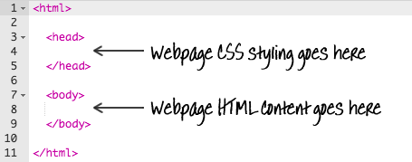


+ Napravi promjenu jednog odlomka u HTML-u (lijevo). Klikni 'Run' i trebala bi se vidjeti promjena na web stranici (desno)!
	Ako je uključena mogućnost Autorun, promjene na stranici će se prikazati odmah. 

	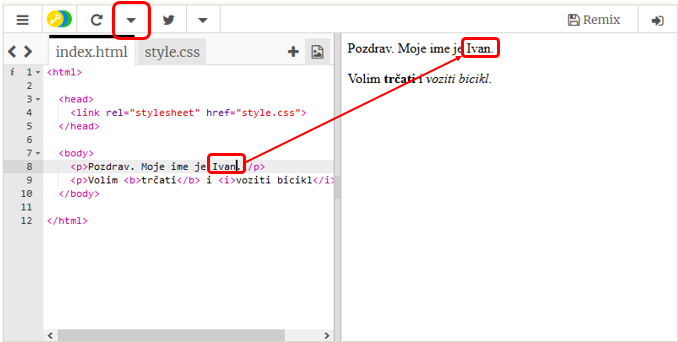

+ Zamijeni tekst prvog odlomka 'Hi. My name is Andy' s 'Pozdrav. Moje ime je Ivan'
+ Zamijeni tekst drugog odlomka 'I like running and riding my bike' s 'Volim trčati i voziti bicikl'.
	Slobodno ime Ivan zamijeni svojim imenom. Također zamijeni trčanje i vožnju biciklom aktivnosima koje voliš.

+ U slučaju pogreške promjene je moguće poništiti naredbom 'Reset' do koje se dolazi pomoću gumba s izbornicima (menu). Pokušaj!

	

## Spremi promjene u projektu {.save}

__Za spremanje projekata nije se potrebno registrirati na Trinket stranici!__ 

Ako nemaš Trinket račun, klikni na strelicu prema dolje i odaberi naredbu 'Link'. Dobit ćeš link koji možeš spremiti i vratiti se na njega kasnije. Taj postupak je potrebno ponoviti kod svake promjene jer se link mjenja.

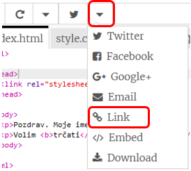

Imaš li Trinket račun, najlakši način za spremanje promjena je pomoću gumba 'Remix' koji se nalazi u gornjem dijelu prozora s web stranicom. To će spremiti kopiju stranice na tvoj profil.

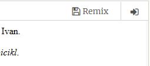

##Izazov: Dodaj još jedan odlomak {.challenge}
Možeš li, ispod dva postojeća, dodati i treći odlomak web stranici? Ne zaboravi da odlomak počinje oznakom `<p>`, a završava oznakom `</p>`.

Ovako sada treba izgledati tvoja stranica:

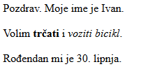

Možeš li podebljati i podvući tekst novog odlomka? Koristi `<u>` i `</u>` za podvlačenje teksta.

## Spremi promjene u projektu {.save}

# Korak 2: Što je CSS? { .activity}

CSS znači __Cascading Style Sheets__. To je jezik kojim se koristimo za dizajn i uljepšavanje web stranice. Web stranica se s CSS dokumentom može povezati u zaglavlju `<head>` HTML dokumenta:


## Zadatci { .check}

+ CSS navodi sva svojstva za pojedinu oznaku. Klikni na 'style.css' karticu za pregled CSS kôda svoje stranice.

	

+ Pronađi kôd:

	```
	p {
		color: black;
	}
	```

	Ovaj CSS kôd sadrži jedno svojstvo odlomaka. Ono određuje da će boja teksta u odlomcima biti crna.

+ U CSS kôdu promjeni riječ 'black' u 'blue'. To će promijeniti boju teksta u svim odlomcima u plavu.

	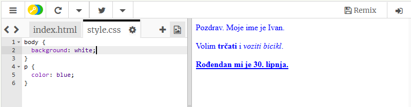

## Spremi promjene u projektu {.save}

##Izazov: Dodaj više stilova {.challenge}
Možeš li napraviti da tekst u odlomcima bude narančaste boje? Ili sivu pozadinu?

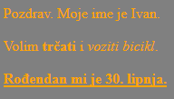

## Spremi promjene u projektu {.save}

# Korak 3: Izrada rođendanske čestitke { .activity}

Provjeri naučeno o HTML i CSS-u i napravi rođendansku čestitku.

## Zadatci { .check}

+ Otvori dokument: <a href="http://jumpto.cc/web-card" target="_blank">jumpto.cc/web-card</a> ili koristi ugrađenu verziju ispod teksta ako ovo čitaš na internetu.

<div class="trinket">
	<iframe src="https://trinket.io/embed/html/90506676c9" width="100%" height="400" frameborder="0" marginwidth="0" marginheight="0" allowfullscreen>
	</iframe>
</div>

Ne brini ako ne razumiješ cijeli kôd. Ova rođendanska čestitka izgleda dosadno, zato ćeš ju promjeniti koristeći HTML i CSS.

+ Klikni na gumb koji se nalazi na prednjoj strani čestitke i vidjeti ćeš kako se otvara.

	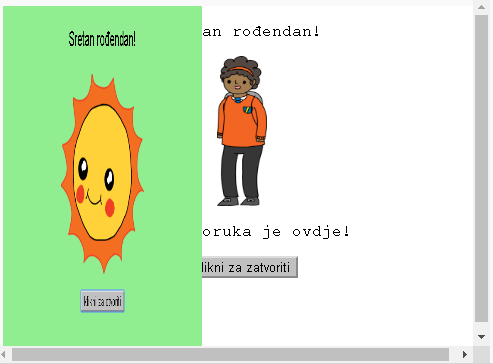

+ Odi do 14. reda kôda. Baš kao u prethodnom primjeru, možeš mijenjati tekst prilagođavajući ga svojim željama.

	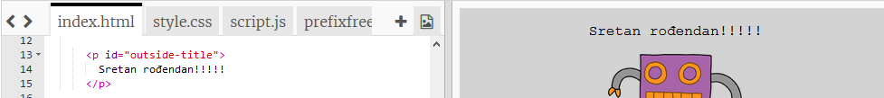

+ Možeš li pronaći HTML kôd za sliku robota? (Pomoć: Nalazi se u redu 17!) Promjeni riječ `robot` u `sun`, i vidjet ćeš promjenu slike!

	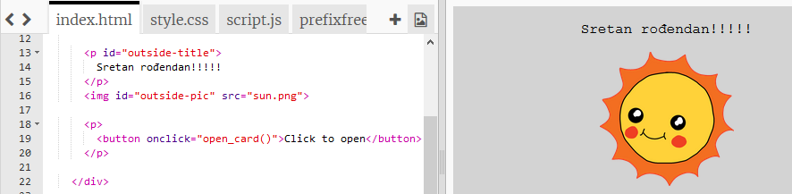

	Možeš koristiti bilo koju riječ od sljedećih: `boy`, `diamond`, `dinosaur`, `flowers`, `girl`, `rainbow`, `robot`, `spaceship`, `sun`, `tea`, ili `trophy`.

+ Možeš mijenjati i CSS datoteku čestitke. Klikni na karticu “style.css”. Počinje sa stilovima za vanjski dio čestitke (`outside`). Promjeni boju pozadine u `svijetlozelenu`.

	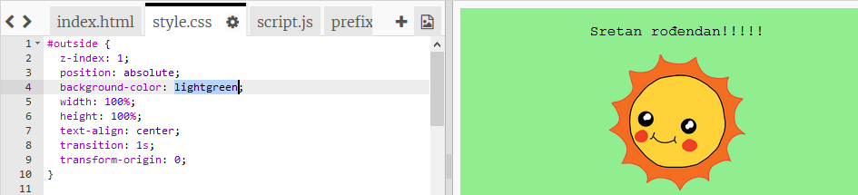

+ Možeš promjeniti i veličinu slike. Idi u 24. red i promijeni širinu i visinu vanjske slike na `200px` (`px` piksel).

	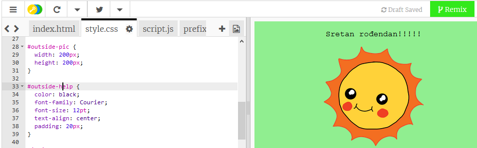	

+ Možeš mijenjati i font. Odi u 18. red i promjeni `font-family` u `Comic Sans MS` i veličinu fonta na `16pt`.

	

	Možeš koristiti i ostale fontove <span style="font-family: Arial;">Arial</span>, <span style="font-family: impact;">Impact</span> i <span style="font-family: tahoma;">Tahoma</span>. 

## Spremi promjene u projektu {.save}

##Izazov: Napravi svoju čestitku. {.challenge}
Koristi sve naučeno o HTML-u i CSS-u i završi izradu svoje čestitke. Ne treba nužno biti rođendanska čestitka, može biti za bilo koju drugu prigodu!

Evo primjer:


## Spremi projekt {.save}

Sada kada je čestitka gotova možeš ju podjeliti ili ju nekome poslati porukom elektroničke pošte.


