---
title: Zagonetno pismo
level: HTML & CSS 1
language: hr-HR
embeds: "*.png"
materials: ["Club Leader Resources/*.*","Project Resources/*.*"]
stylesheet: web
...

# Uvod {.intro}

U ovom projektu napravit ćeš zagonetno pismo koje izgleda kao da je svako slovo izrezano iz različitih novina, magazina, stripa ili nekog drugog izvora.  

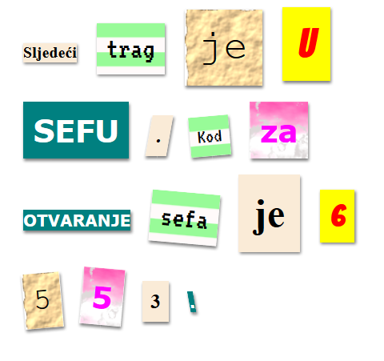

# Korak 1: Odaberi poruku {.activity}

Zagonetna pisma koriste se u filmovima i knjigama za slanje tajnih poruka. 

## Zadatci { .check}

+ Razmisli o tajnoj poruci dužine 11 do 12 riječi. Ako se ne možeš dosjetiti poruke, iskoristi ovu iz primjera: 'Sljedeći trag je u sefu. Kod za otvaranje sefa je 6553.'

+ Zapiši ili upamti odabranu poruku.  

# Korak 2: Uređivanje poruke {.activity}

Postavimo poruku na web stranicu. 

## Zadatci { .check}

+ Otvori sučelje koje se nalazi na poveznici: <a href="http://jumpto.cc/web-letter" target="_blank">jumpto.cc/web-letter</a>. Čitaš li ovo online, možeš koristiti i ugrađenu verziju sučelja za ovaj projekt koja se nalazi ispod ovog teksta. 

  <iframe src="https://trinket.io/embed/html/b5fbcf112e" width="100%" height="400" frameborder="0" marginwidth="0" marginheight="0" allowfullscreen>
  </iframe>

+ S oznakom  za odlomak `
` smo se upoznali u projektu 'Sretan rođendan'. Oznaku `` koristimo za grupiranje manjih dijelova teksta unutar odlomka, kako bi ih mogli različito oblikovati. 

## Zadatci { .check}

+ Promijeni riječi poruke stavljajući jednu riječ unutar svake `` oznake. Ako je tvoja poruka različite dužine od predložene, ukloni ili dodaj oznake ``. 

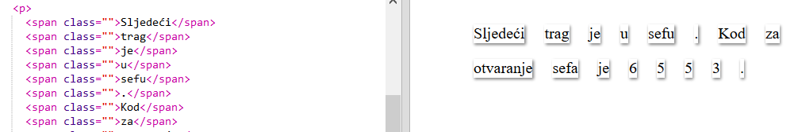

## Zadatci { .check}

+ Klkni na gumb Run i provjeri rezultat.

	Pogledaš li slova možeš uočiti da su oblikovana tako da izgledaju kao da su zaglavila na stranici. 

# Korak 3: Uporaba klasa {.activity}

## Zadatci { .check}

+ Primjećuješ li tekst `class=""` koji se nalazi unutar oznake ``? Možeš ga koristiti za oblikovanje više elemenata na isti način.  

+ Upotrijebi klasu `magazine1` na nekoliko `` oznaka i provjeri rezultat. 

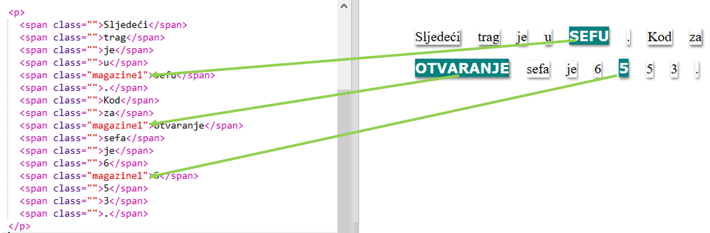

## Zadatci { .check}

+ Na jedan element je moguće primijeniti više klasa. Potrebno je samo ostaviti razmak između njihovih naziva. Dodaj klasu `big` u jednu `` oznaku u kojoj već imaš primjenjen stil magazine1. Provjeri rezultat. 

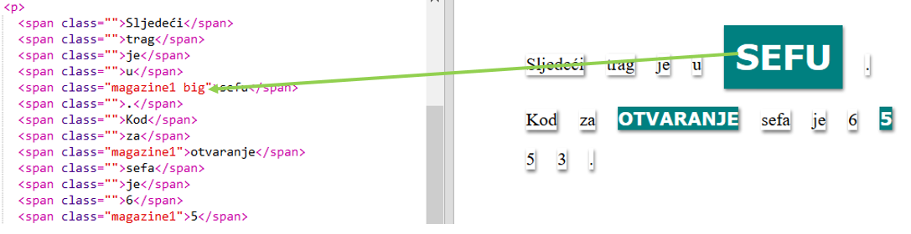

## Spremi projekt {.save}

## Izazov: Oblikuj svoju poruku {.challenge}

Iskoristi definirane stilove i oblikuj svoju poruku tako da izgleda kao zagonetno pismo. 

Dodaj sljedeće klase svojim `` oznakama: 

+ `newspaper`, `magazine1`, `magazine2`

+ `medium`, `big`, `reallybig`

+ `rotateleft`, `rotateright`

+ `skewleft`, `skewright`

Nemoj dodavati više od jedne klase iz istog reda pojedinoj `` oznaci.

Pogledaj primjer oblikovanog pisma:

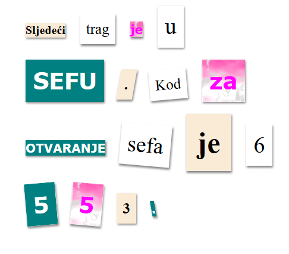

## Spremi promjene u projektu {.save}

# Korak 4: Uređivanje klasa {.activity}

## Zadatci { .check}

+ Odaberi karticu __'style.css'__. Pronađi stil za CSS klasu `newspaper`.

+ Primijeti da se točka '.' nalazi ispred naziva klase u CSS datoteci, ali ne i unutar oznake `` u HTML dokumentu.

+ Pogledaj ostale CSS klase korištene za oblikovanje zagonetnog pisma. Možeš li pronaći:

	+ Na koji način se u stilu `magazine1` tekst prikazuje velikim slovima?

	+ Kako se u stilu `magazine2` postavlja slika iza teksta?

+ Što se događa ako promijeniš `background-image` u stilu `magazine2` u `canvas.png`? Sviđa li ti se više `pink-pattern.png`, slobodno ga vrati.  

Želiš li, slobodno promijeni boje u magazine stilovima.

+ Pronađi CSS klase koje se koriste za okretanje i naginjanje riječi:

Pokušaj mijenjati brojeve unutar tih stilova kako bi se postizali različiti efekti. Provjeri rezultat.  

# Korak 5: Izrada nove klase  {.activity}

Izradimo stil kojim ćemo oblikovati tekst tako da izgleda kao da je izrezan iz stripa. Na poveznici <a href="http://jumpto.cc/web-fonts" target="_blank">jumpto.cc/web-fonts</a> možeš pronaći velik broj fontova besplatnih za uporabu. 

## Zadatci { .check}

+ U datoteci __style.css__, iza klase `magazine2` dodaj klasu `comic`. Ne zaboravi točku ispred imena klase. 

Ne brini se dobiješ li poruku 'The Rule is empty' (pravilo je prazno). To ćemo ubrzo popraviti. 

+ Dodaj CSS kôd u klasu comic. Slobodno koristi različite boje. Na sljedećoj poveznici možeš pronaći popis boja koje možeš koristiti: <a href="http://jumpto.cc/web-colours" target="_blank">jumpto.cc/web-colours</a>.

+ Upotrijebi stil comic u nekoj od `` oznaka u HTML dokumentu i provjeri rezultat: 

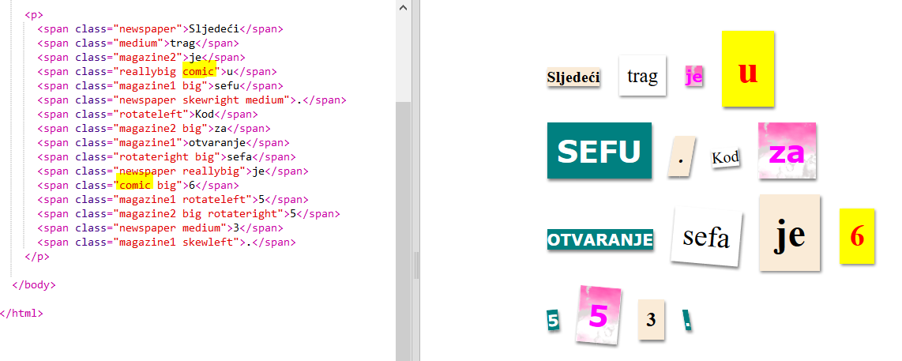

+ Sada možeš dodati neki zabavni font. Otvori novu karticu ili prozor preglednika. Slijedi poveznicu <a href="http://jumpto.cc/web-fonts" target="_blank">jumpto.cc/web-fonts</a> i potraži font __'bangers'__:

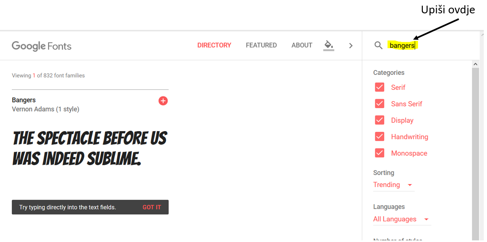

+ Klikni gumb 'Select this font (Odaberi ovaj font)':

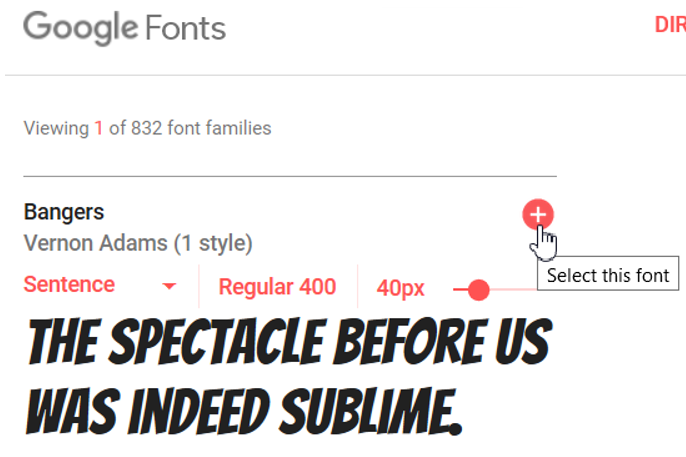

+ Na dnu stranice pojavit će se nova obavijest. Otvori ju kako bi se vidjelo sljedeće:

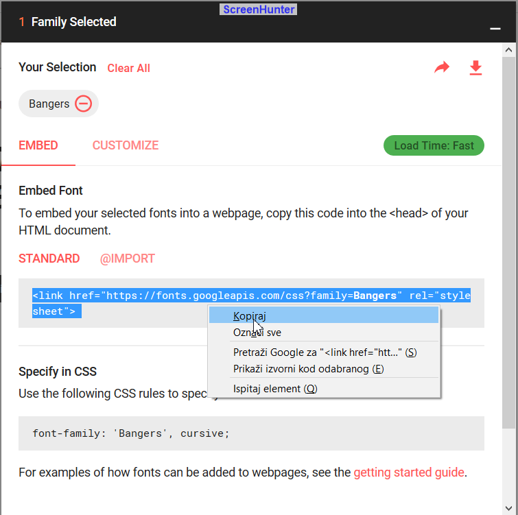

Kopiraj označen kôd. 

+ Zalijepi kopirani `<link>` kôd u zaglavlje (`<head>`) svoje web stranice:

To će ti omogućiti da iskoristiš font Bangers na svojoj stranici. 

+ Vrati se na karticu 'Google fonts', pronađi i kopiraj sljedeći font-family kôd:

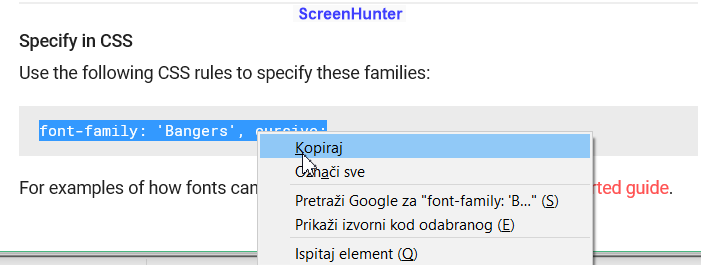

+ Vrati se u trinket sučelje i zalijepi kopirani kôd u datoteku __'style.css'__  u stil comic:

+ Provjeri rezultat. Trebao bi izgledati poput:  

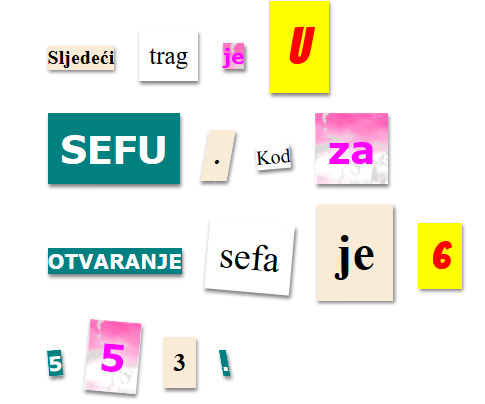

## Spremi promjene u projektu {.save}

## Izazov: Oblikuj tekst tako da izgleda kao stari prikaz na računalu {.challenge}

Kreiraj font izgleda staromodnog prikaza na računalu i primijeni ga na neke riječi:

Trebat će ti:

+ `VT323` font sa stranice <a href="http://jumpto.cc/web-fonts" target="_blank">jumpto.cc/web-fonts</a>. Trebaš li podsjetnik za postupak kopiranja fonta vrati se na korak 5.

+ Pozadinska slika `computer-printout-paper.png`. Trebaš li se podsjetiti kako se koristi pozadinska slika vrati se na korak 4.  	

## Izazov: Napravi svoj stil {.challenge}

Napravi novi stil kojim ćeš svoju poruku napraviti još zanimljivijom. Koristi naučeno u prethodnim projektima, a ideju možeš potražiti i u __style.css__ datoteci. 

Pogledaj primjer:

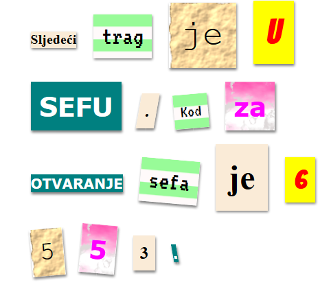

Dostupne slike pronaći ćeš klikom na karticu Slike trinket sučelja. Pokušaj postaviti za pozadinu jednu od sljedećih slika:  

+ `rough-paper.png`

+ `canvas.png`

Imaš li trinket račun možeš učitati i vlastite slike, kao u projektu 'Ispričaj priču'. 

Fontove potraži na poveznici <a href="http://jumpto.cc/web-fonts" target="_blank">jumpto.cc/web-fonts</a>, kopiraj njihovu oznaku `<link>` i pripadajući CSS kôd u trinket sučelje.  

## Spremi projekt {.save}
