---
title: Časopis
level: HTML & CSS 2
language: hr-HR
embeds: "*.png"
materials: ["Club Leader Resources/*.*","Project Resources/*.*"]
stylesheet: web
...

# Uvod { .intro}

U ovom projektu ćeš naučiti koristiti  HTML i CSS za izradu web časopisa s više stranica u dva stupca. Također ćeš ponoviti HTML i CSS iz prethodnih projekata.

  <iframe src="https://trinket.io/embed/html/a41e4e1c5c?outputOnly=true&start=result" width="600" height="500" frameborder="0" marginwidth="0" marginheight="0" allowfullscreen>
  </iframe>
  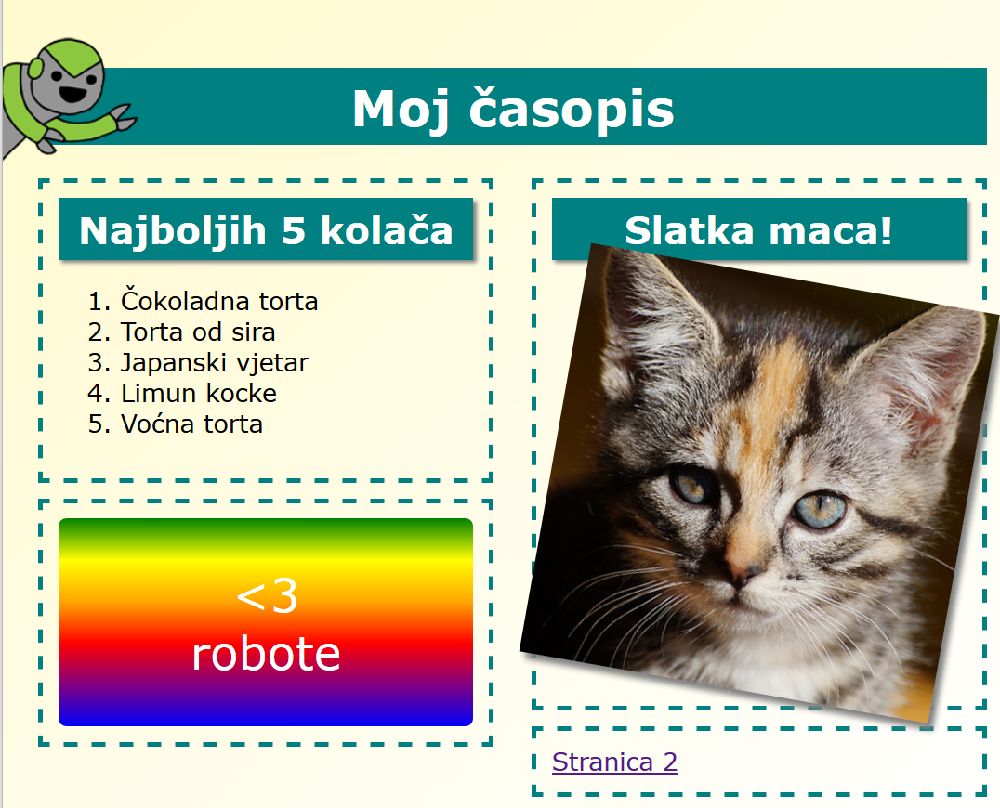

# Korak 1: Naslov i pozadina

Web stranice časopisa često imaju puno sitnih stavki na stranici. Zbog toga ćemo najprije napraviti naslov i pozadinu časopisa.

## Zadatci { .check}

+ Otvori sučelje koje se nalazi na poveznici: <a href="http://jumpto.cc/web-magazine" target="_blank">jumpto.cc/web-magazine</a>. Čitaš li ovo online, možeš koristiti i ugrađenu verziju sučelja za ovaj projekt koja se nalazi ispod ovog teksta. 

  <iframe src="https://trinket.io/embed/html/cef5e64bc0" width="100%" height="400" frameborder="0" marginwidth="0" marginheight="0" allowfullscreen>
  </iframe>

+ Dodajmo pozadinu. 

	Možeš razmisliti o boljem naslovu časopisa i upisati ga umjesto teksta 'Moj časopis'. 

	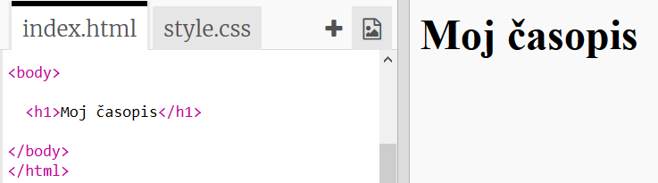

+ Možeš li oblikovati naslov?

	Pogledaj primjer, ali slobodno odaberi svoj stil:

	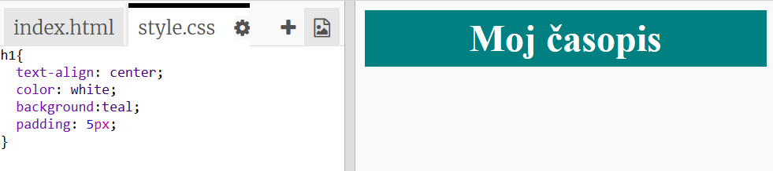

+ Napravimo sada zanimljivu pozadinu koristeći gradaciju (prijelaz boja) i odaberimo font za časopis.

	Ovo je primjer stila koji će te podsjetiti kako se koristi gradacija:  

	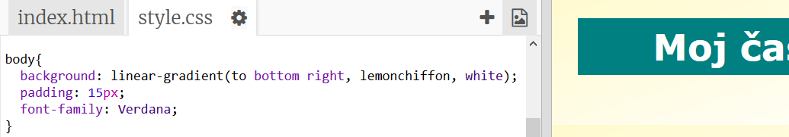

## Spremi projekt {.save}

# Korak 2: Stvaranje stupaca

Web stranice često upotrebljavaju više stupaca. Napravimo izgled s dva stupca za časopis. 

## Zadatci { .check}

+ Najprije u datoteci `index.html` napravi dvije `div` oznake za stupce.

	Dodaj istaknuti HTML kôd u `index.html` datoteku:

	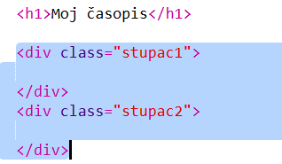

+ Sada u datoteci `style.css` oblikuj stupce tako da se jedan postavlja lijevo, a drugi desno: 

	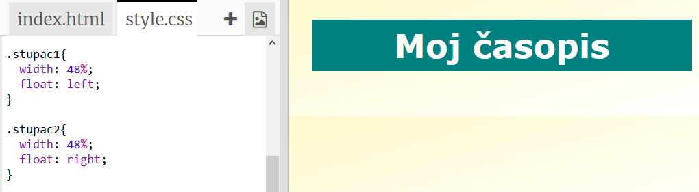

	Svaki je stupac manji od 50% pa je ostalo mjesta za razmak (padding). 

	Da bismo vidjeli učinak prethodnog kôda moramo dodati nekakav sadržaj u stupce.  

+ Dodajmo sliku mačića u stupac 2. 

	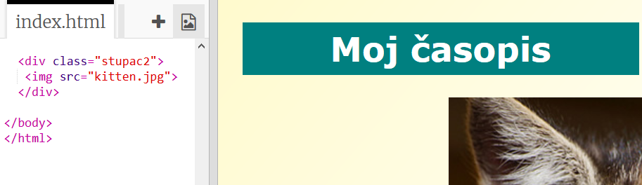

	Primijeti da je slika mačića postavljena na polovicu stranice, u drugi stupac.

	Ipak, malo je velika!

+ Upotrijebimo `max-width`: kako bismo sliku prilagodili mjestu koje je predviđeno za nju. 

	Dodaj sljedeći kôd u `style.css` datoteku.

	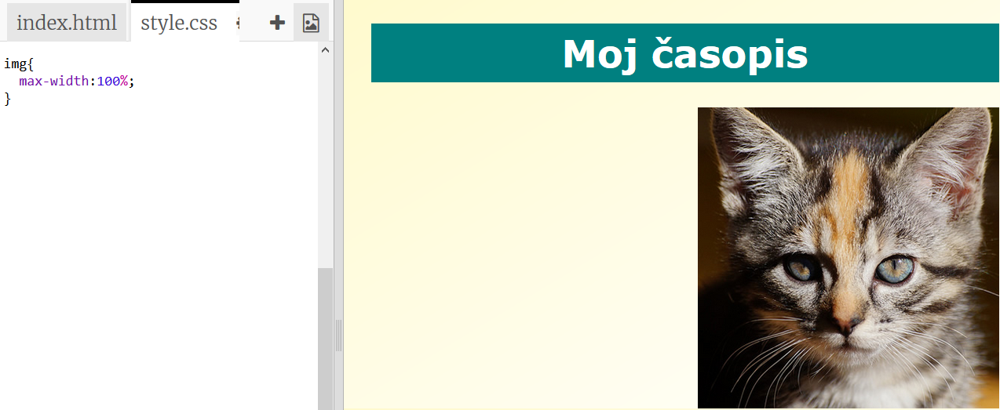

	Taj stil će se primijeniti na slike u časopisu, ne samo na mačića.

+ Sada slici mačića dodaj klasu `photo` kako bi ju mogli oblikovati:

	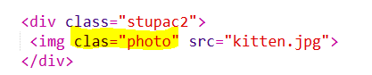

+ Uredi sliku dodavanjem sjene i zaokretanjem kako bi izgledala kao da je odvojena od stranice:

	

	Mijenjaj oblikovanja sve dok ne dobiješ izgled koji ti se sviđa. 

# Korak 3: Uredi stavke na časopisu

Napravimo zanimljiviji izgled.

## Zadatci { .check}

+ Oko slike dodaj oznaku `div` s klasom i dodaj naslov `h2`:

	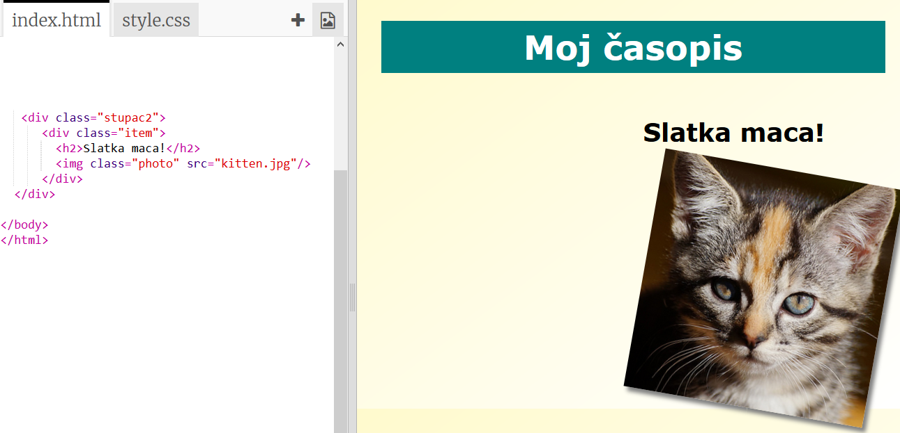

+ Sada uredi stavku i naslov 

	Pogledaj primjer, ali slobodno unesi izmjene:

	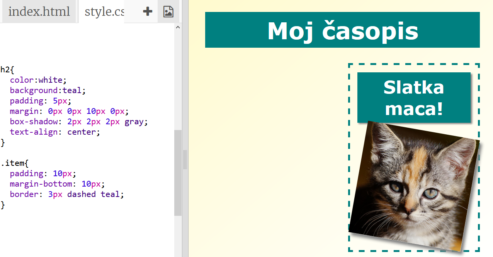

## Spremi promjene u projektu {.save}

##Izazov: Dodavanje stavki u lijevi stupac{.challenge}

Možeš li dodati poredanu listu i naljepnicu s tekstom i prijelazom boja u lijevi stupac?

Pogledaj primjer:

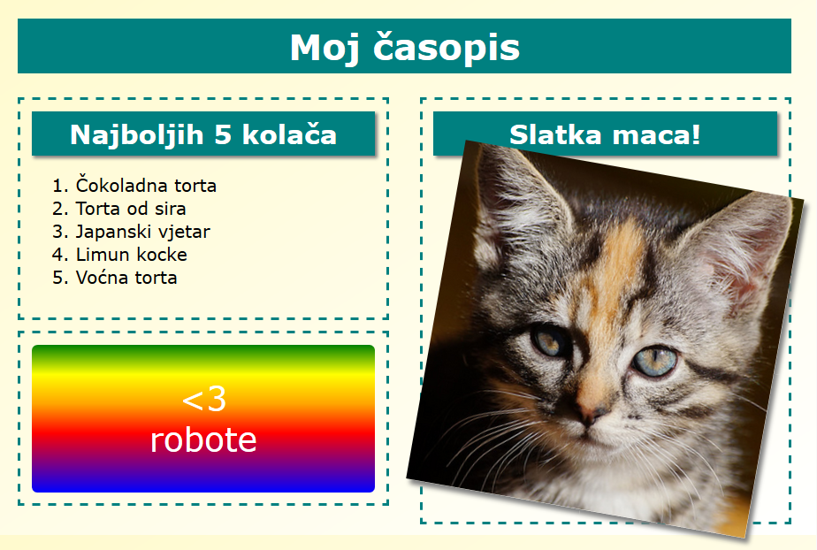

Ovdje je kôd za prethodni primjer, ali slobodno ga promijeni ili napravi vlastiti.

HTML:

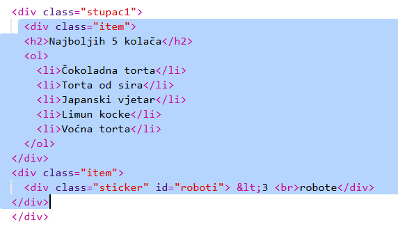

CSS:

## Spremi promjene u projektu{.save}

# Korak 4: Dodaj drugu stranicu

Dodajmo drugu stranicu web časopisu. 

## Zadatci{.check}

+ Dodaj novu stranicu i nazovi ju `page2.html`:

+ Druga stranica bit će slična prvoj tako da možeš kopirati html kôd iz datoteke "index.html" i zalijepiti ga na stranicu `page2.html`.

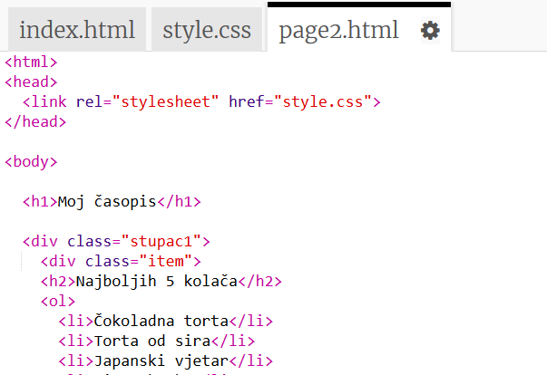

Napominjemo da obje stranice upotrebljavaju istu CSS datoteku -  `style.css`.

+ Promjeni naslov `<h1>` na stranici 2: 

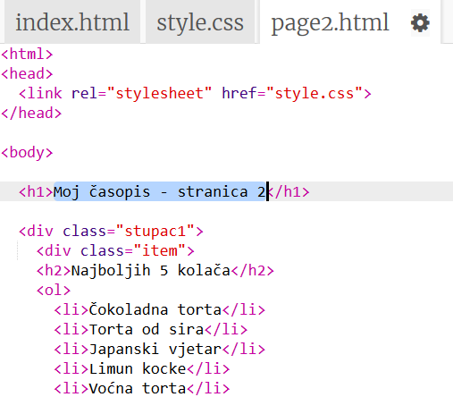

+ Sada će nam trebati poveznice kako bi sa stranice 1 došli na stranicu 2 i vratili se natrag.  

Vrati se u datoteku `index.html`. Dodaj poveznicu unutar oznake `
` stupca 2:

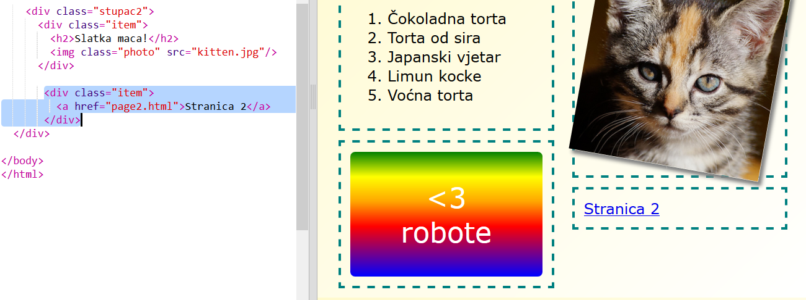

+ Provjeri možeš li kliknuti na novu poveznicu tako prijeći na stranicu 2. 

##Izazov: Dodaj poveznicu za povratak na prvu stranicu {.challenge}

Možeš li dodati poveznicu na stranicu `page2.html` koja će te vratiti na prvu stranicu?

Savjet: Pogledaj HTML kôd korišten za izradu poveznice na stranicu 2. 

##Izazov: Ispuni drugu stranicu {.challenge}

Ovo je primjer kôda, ali slobodno uključi svoje ideje i promijeni `div`.

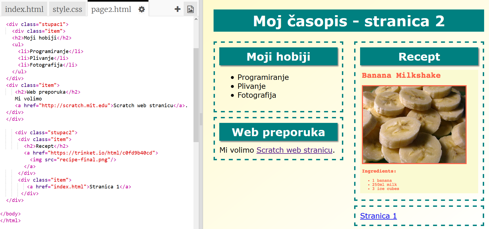

Klikni na ikonu za dodavanje slika i pregledaj dostupne slike:

Sjeti se da, ako želiš, možeš postaviti i svoje slike. Samo vodi računa o tome da imaš dozvolu za korištenje tih slika.

# Korak 5: Dodaj animaciju

Dodajmo u časopis zabavnu animaciju.

## Zadatci {.check}

+ Otvori datoteku `index.html` i na vrh stranice dodaj sliku `greenrobot.png`. 

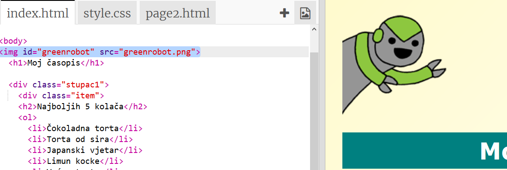

+ Sada dodaj CSS kôd kojim ćeš robota animirati.

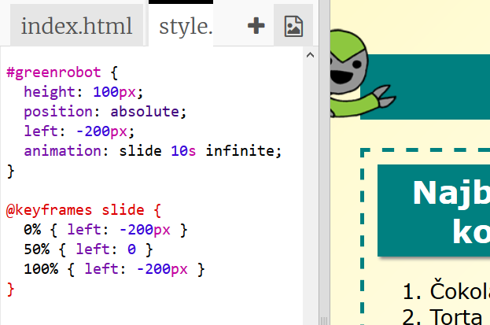

##Izazov: Dodaj još jednu animaciju {.challenge}

Možeš li dodati animaciju na drugu stranicu svog časopisa? 

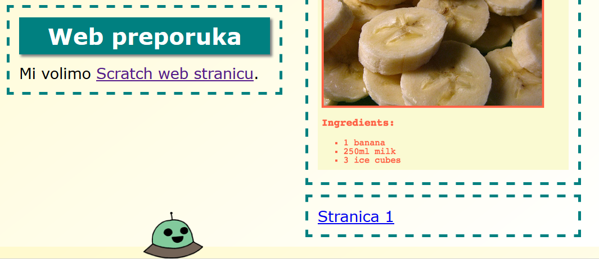

