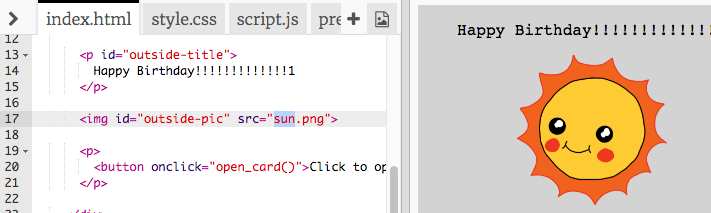
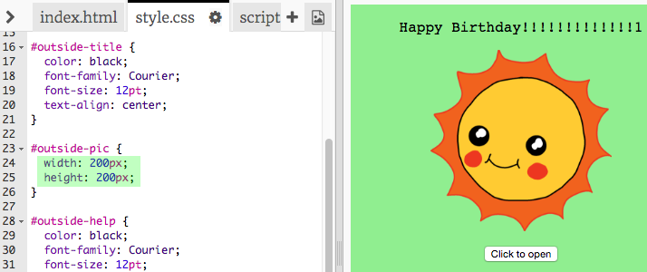

# Introduzione {.intro}

In questo progetto, ti verrà presentato il linguaggio HTML e CSS creando il tuo biglietto di auguri personalizzato.

<div class="trinket">
  <iframe src="https://trinket.io/embed/html/e996dc0380?outputOnly=true&start=result" width="600" height="450" frameborder="0" marginwidth="0" marginheight="0" allowfullscreen>
  </iframe>
  
</div>

# Passo 1: Cos’è l’HTML? { .activity}

HTML significa __HyperText Markup Language__ ed è il linguaggio utilizzato per creare le pagine Web. Vediamo un esempio!


## Lista di controllo delle attività { .check}

+ Per scrivere in HTML, utilizzerai un sito Web chiamato Trinket. Apri questo Trinket: <a href="http://jumpto.cc/web-intro" target="_blank">jumpto.cc/web-intro</a>.

	Il progetto si presenta così:

	

+ Il codice visualizzato sulla sinistra di Trinket è l’HTML. Sulla destra di Trinket, è invece visualizzata la pagina Web che il codice HTML ha creato.

	Per costruire le pagine Web, l’HTML utilizza dei __tag__. Riesci a vedere questa sintassi HTML alla riga 8 del codice?

	```
	<p>Hi. My name is Andy.</p>
	```

	`<p>` è un esempio di tag e sta per __paragrafo__. Puoi usare `<p>` per iniziare un paragrafo e `</p>` per terminarlo.

+ Riusciresti a individuare altri tag? Forse, un altro tag che hai individuato è `<b>`, che sta per __bold__ (grassetto):

	```
	<b>running</b>
	```

	Eccone altri:

	+ `<html>` e `</html>` indicano l’inizio e la fine del documento HTML;
	+ `<head>` e `</head>` contengono elementi come il CSS (di cui parleremo più tardi!);
	+ `<body>` e `</body>` racchiudono il contenuto del sito.

	

+ Inserisci una modifica in uno dei paragrafi di testo dell’HTML (a sinistra). Fai clic su "Run" (Esegui) e dovresti vedere il cambiamento sulla pagina Web (a destra)!

	

+ Se hai fatto un errore e desideri annullare le modifiche, fai clic sul pulsante menu e quindi su "Reset” (Reimposta). Prova!

	

## Salva il progetto {.save}

__Non è obbligatorio avere un account su Trinket per salvare i progetti!__

Se non hai un account su Trinket, fai clic prima sulla freccia in giù e poi su "Link". In questo modo potrai salvare un link che potrai aprire più tardi. Dovrai eseguire questa procedura ogni volta che farai qualche cambiamento perché cambierà anche il link!


Se hai un account su Trinket, il modo più semplice per salvare la pagina Web è di fare clic sul pulsante "Remix" situato sulla parte superiore di Trinket. Verrà così salvata una copia del Trinket sul tuo profilo.


##Sfida: Aggiungi un altro paragrafo {.challenge}
Riusciresti ad aggiungere un 3° paragrafo di testo alla pagina Web, al di sotto degli altri 2? Ricorda che il nuovo paragrafo deve iniziare con il tag `<p>` e terminare con `</p>`.

Ecco come dovrebbe presentarsi la tua pagina Web:


Riusciresti ad aggiungere testo in __grassetto__ e <u>sottolineato</u> nel nuovo paragrafo? Per sottolineare del testo, devi utilizzare `<u>` e `</u>`.

## Salva il progetto {.save}

# Passo 2: Cos’è il CSS? { .activity}

CSS significa __Cascading Style Sheets__. È il linguaggio utilizzato per lo stile delle pagine Web e renderle più belle. Puoi collegare la pagina Web a un file CSS nell’`<head>` di un documento HTML nel modo seguente:


## Lista di controllo delle attività { .check}

+ Il CSS elenca tutte le __proprietà__ di un tag particolare. Fai clic sulla scheda "style.css" per visualizzare il CSS della tua pagina Web.

	

+ Trova questo codice:

	```
	p {
		color: black;
	}
	```

	Questo codice CSS attribuisce una proprietà ai paragrafi, ossia che il colore del testo sia nero.

+ Nel CSS, cambia la parola "black" con "blue". Vedrai che il colore del testo di tutti i paragrafi diventerà blu.

	

## Salva il progetto {.save}

##Sfida: Aggiungi più stile {.challenge}
Riusciresti a cambiare in arancione il colore dei paragrafi di testo? O a rendere grigio lo sfondo?


## Salva il progetto {.save}

# Passo 3: Creazione di un biglietto di auguri { .activity}

Utilizza quanto appreso sull’HTML e il CSS per creare il tuo biglietto di auguri personalizzato.

## Lista di controllo delle attività { .check}

+ Apri questo Trinket: <a href="http://jumpto.cc/web-card" target="_blank">jumpto.cc/web-card</a> o utilizza la seguente versione integrata se stai leggendo queste istruzioni online.

<div class="trinket">
  <iframe src="https://trinket.io/embed/html/90506676c9" width="100%" height="400" frameborder="0" marginwidth="0" marginheight="0" allowfullscreen>
  </iframe>
</div>

Non ti preoccupare se non riesci a capire tutto il codice. Questo biglietto di auguri non è tra i più divertenti; apportiamo alcune modifiche al codice HTML e CSS.

+ Fai clic sul pulsante situato sulla parte anteriore del biglietto. Dovrebbe aprirsi e mostrare l’interno.

	

+ Vai alla riga 14 del codice. Come nell’esempio di prima, puoi modificare qualsiasi parte del testo del codice HTML per personalizzare il biglietto.

	

+ Riusciresti a trovare la sintassi HTML per l’immagine del robot? (Un indizio: è alla riga 17!) Sostituisci la parola `robot` con `sun` e vedrai l’immagine cambiare!

	

	Puoi usare ciascuna di queste parole: `boy`, `diamond`, `dinosaur`, `flowers`, `girl`, `rainbow`, `robot`, `spaceship`, `sun`, `tea` o `trophy`.

+ È possibile modificare anche il codice CSS del biglietto di auguri. Fai clic sulla scheda "style.css". Inizia con tutto il codice CSS per la parte esterna o `outside` del biglietto. Cambia il `background-color` (colore di sfondo ) in `lightgreen` (verde chiaro).

	

+ È possibile modificare anche le dimensioni di un’immagine. Vai al CSS `#outside-pic` e cambia la larghezza `width` e l’altezza `height` dell’immagine esterna a `200px` (`px` sta per pixel).

	

+ È possibile modificare anche il carattere. Vai al CSS `#outside-title` e sostituisci il tipo di carattere `font-family` con il `Comic Sans MS` e la dimensione del carattere `font-size` con `16pt`.

	

	Puoi usare anche altri caratteri: <span style="font-family: Arial;">arial</span>, <span style="font-family: impact;">Impact</span> e <span style="font-family: tahoma;">Tahoma</span>.

## Salva il progetto {.save}

##Sfida: Crea un biglietto personalizzato {.challenge}
Utilizza quanto appreso sull’HTML e il CSS per completare il biglietto personalizzato. Non deve necessariamente trattarsi di un biglietto di auguri. Può essere per qualsiasi occasione!

Ecco un esempio:


Altri nomi di colori CSS sono disponibili qui: <a href="http://jumpto.cc/colours" target="_blank">jumpto.cc/colours</a>.

## Salva il progetto {.save}

Hai terminato il biglietto e puoi ora condividerlo o inviarlo per e-mail a qualcuno.


