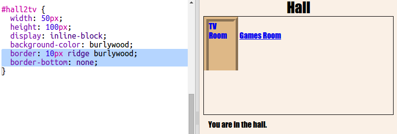

# Introduzione {.intro}

In questo progetto, creerai un insieme di stanze collegate dove ogni camera rappresenta una diversa pagina Web che puoi decorare con l’HTML.

  <iframe src="https://trinket.io/embed/html/ba5d27ec68?outputOnly=true&start=result" width="600" height="450" frameborder="0" marginwidth="0" marginheight="0" allowfullscreen>
  </iframe>
  

__Istruzioni__: Fai clic sulle porte per spostarti da una stanza all’altra.

# Passo 1: Collegamento a un’altra pagina Web dello stesso progetto {.activity}

I progetti sul Web possono essere composti da numerosi file HTML collegati tra loro.

## Lista di controllo delle attività { .check}

+ Apri questo trinket: <a href="http://jumpto.cc/web-rooms" target="_blank">jumpto.cc/web-rooms</a>.

	Il progetto si presenta così:

	

+ Trinket dovrebbe venire eseguito automaticamente e ti ritroverai nella Hall (Ingresso):

	

+ Osserva l’elenco delle schede dei file di questo trinket. Vedi il file `tvroom.html`? Fai clic su quel file.

	

	Si tratta di un altro file html dello stesso progetto.

+ Per passare a `tvroom.html` devi aggiungere un link a `index.html`.

	Aggiungi il codice evidenziato all’interno del tag `
` con `room` (stanza) come classe:

	

+ Verifica il trinket facendo clic sul link __TV Room__ (Sala TV) per visualizzare la pagina Web `tvroom.html`.

	`tvroom.html` presenta anche il suo file di stile `tvroom.css` che definisce il layout della pagina.

	

##Sfida: Aggiungi un altro link {.challenge}

Aggiungi un link `<a>` alla pagina Web `tvroom.html` per poter tornare alla Hall, la pagina di Ingresso denominata `index.html`. Il testo del link deve essere "Hall" (Ingresso).

La pagina Web TV Room (Sala TV) dovrebbe ora disporre di un link come questo sul quale è possibile fare clic:

Assicurati di testare il codice. Dovresti riuscire a spostarti dalla Hall (Ingresso) alla TV Room (Sala TV) e viceversa facendo clic sui link.  

## Salva il progetto {.save}

# Passo 2: Aggiungi un’altra stanza {.activity}

Aggiungiamo ora un’altra stanza, la __Games Room__ (Stanza dei giochi).

+ Fai clic sul pulsante __+__ di aggiunta di una pagina:

	

	Come nome della pagina, digita `gamesroom.html`:

  	

+ L’HTML per la __Games Room__ (Stanza dei giochi) è molto simile al codice del file `tvroom.html`; per cui __copia__ tale codice e __incollalo__ nella pagina `gamesroom.html`.

	Modifica gli elementi evidenziati in modo che vi sia scritto Games e non TV:

	

+ La pagina `gamesroom.html` utilizza `gamesroom.css` che ancora non esiste.

	Crea `gamesroom.css` facendo clic sul pulsante __+__ di aggiunta di una pagina.

+ Il CSS per la __Games Room__ (Stanza dei giochi) è molto simile al codice del file `tvroom.css`; per cui __copia__ tale codice e __incollalo__ nella pagina `gamesroom.css`.

	

+ Aggiungi un link dalla Hall (Ingresso) alla Games room (Stanza dei giochi):

	

+ Verifica il progetto facendo clic sul link Games Room (Stanza dei giochi)

	La __Games Room__ (Stanza dei giochi) si presenta così:

	

	Non proprio divertente, ma possiamo migliorarla con la prossima sfida.

## Salva il progetto {.save}

##Sfida: Attribuisci degli stili e collega la Games Room (Stanza dei giochi) {.challenge}

Modifica il codice HTML e CSS della __Games Room__ (Stanza dei giochi) in modo che la pagina Web appaia così:

Suggerimento: Dovrai modificare il colore di sfondo, carattere e bordi in `gamesroom.css`. Il verde acceso si chiama `chartreuse`.  

Suggerimento: Dovrai aggiungere un link `<a>` a `gamesroom.html` che si collega a `hall.html`.

## Salva il progetto {.save}

# Passo 3: Trasformiamo i link in porte {.activity}

I link non devono essere per forza composti da testo. Realizziamo una porta selezionabile usando un tag `
`.

## Lista di controllo delle attività { .check}

+ Apri `index.html` e aggiungi un tag `
` attorno al testo del link __TV Room__ (Sala TV). Deve essere all’interno del tag `<a>` per essere selezionabile.

  Aggiungi `id="hall2tv"` in modo che sia la porta dalla Hall (Ingresso) alla TV Room (Sala TV) e poter attribuire uno stile alla porta.

    

+ Fai clic sulla scheda `style.css`, scorri verso il basso e aggiungi il seguente codice CSS per modificare le dimensioni e il colore della porta:

	

+ Verifica la pagina Web facendo clic ovunque sulla porta, non solamente sul testo.

+ Ora rendiamola un po’ più simile a una porta aggiungendo un bordo su tre lati:

	

+ E aggiungiamo codice CSS per migliorare il testo presente sulla porta:

	

+ Avrai probabilmente notato che la porta è sospesa in aria. Risolviamo il problema posizionando la porta all’interno della stanza.

	

+ Verifica la pagina Web facendo clic sulla porta per passare alla __TV Room__ (Sala TV).

## Salva il progetto {.save}

##Sfida: Aggiungi altre porte! {.challenge}

Usando la stessa procedura, trasforma anche gli altri link del progetto in porte.

Per ciascuna porta, dovrai:

+ Modificare il link della porta utilizzando un tag `
` con un id quale `hall2games` in modo da potergli attribuire uno stile.

	Ad esempio:

	`<a href="gamesroom.html">
Games Room
</a>`

+ Aggiungere codice CSS per l’id della porta al file `.css` della relativa stanza. Usa _copia_ e _incolla_ per risparmiare tempo. Puoi fare in modo che ogni porta sia diversa dall’altra.

+ Posizionare la porta usando `bottom:` (basso) e `left:` (sinistra) o `right:` (destra).

La Hall (Ingresso) potrebbe presentarsi così:

La TV Room__ (Sala TV) dovrebbe essere simile a:

# Passo 4: Aggiunta di un’immagine di sfondo {.activity}

Decoriamo la Hall (Ingresso) con un’immagine di sfondo.

## Lista di controllo delle attività { .check}

+ Modifica `style.css` per aggiungere un’immagine sullo sfondo della Hall (Ingresso):

	

	L’immagine sarà ripetuta in modo da riempire l’intera stanza.

## Salva il progetto {.save}

##Sfida: Aggiungi la carta da parati alla Games Room (Stanza dei giochi) {.challenge}

Riusciresti a decorare la Games Room (Stanza dei giochi) con un’immagine di sfondo?

Per lo sfondo, puoi utilizzare l’immagine `space-invader.png` inclusa nel progetto.

Dovrai:

+ Aggiungere `background-image:` al CSS `.room` per la Games Room (Stanza dei giochi).

La stanza decorata si presenta così:

## Salva il progetto {.save}

##Sfida: Personalizzala! {.challenge}

Aggiungi altre stanze al progetto. Per risparmiare tempo, ricorda che puoi utilizzare __copia__ e __incolla__ e modificare solamente ciò che deve essere diverso.

Per ciascuna stanza, dovrai:

+ Creare un file `.html`
+ Aggiungere link con porte a e dalla nuova stanza
+ Creare un file `.css` con gli stili per la stanza nuova e relative porte

Per ciascuna stanza, puoi modificare il `background-color:` (colore dello sfondo). Fai clic sull’icona delle immagini per visualizzare le immagini di sfondo tra cui puoi scegliere:

## Salva il progetto {.save}
