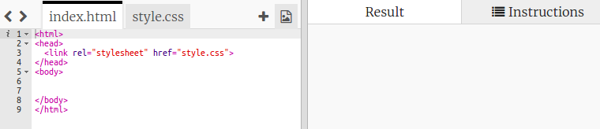
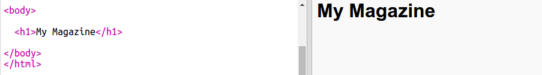
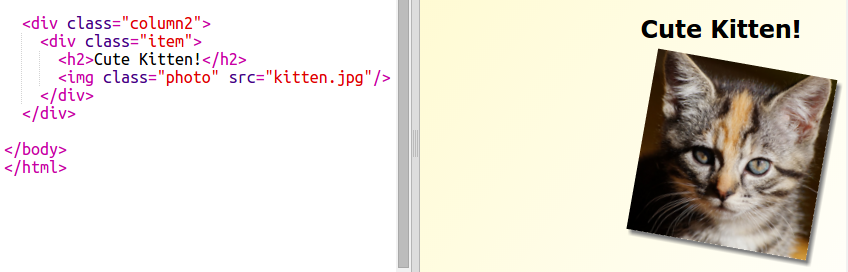
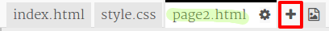
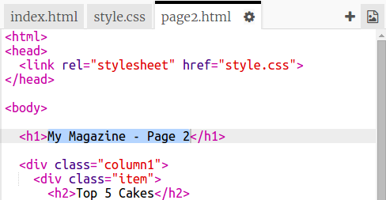

---
title: Rivista
description: Crea un sito Web in stile rivista a più pagine.
layout: project
notes: "Magazine - notes.md"
...

# Introduzione {.intro}

In questo progetto, imparerai a utilizzare il codice HTML e CSS per creare un sito Web in stile rivista a più pagine con layout a due colonne. Riesaminerai inoltre molte delle tecniche HTML e CSS apprese in altri progetti.

  <iframe src="https://trinket.io/embed/html/a41e4e1c5c?outputOnly=true&start=result" width="600" height="500" frameborder="0" marginwidth="0" marginheight="0" allowfullscreen>
  </iframe>
  

# Passo 1: Intestazione e sfondo

I siti Web in stile rivista presentano spesso numerosi oggetti di piccole dimensioni su una pagina. Per prima cosa, creerai un’intestazione e uno sfondo alla rivista.

## Lista di controllo delle attività { .check}

+ Apri questo trinket: <a href="http://jumpto.cc/web-magazine" target="_blank">jumpto.cc/web-magazine</a>.

	Il progetto si presenta così:

	

+ Aggiungiamo un’intestazione.

	Alla tua rivista, puoi attribuire un titolo migliore.

	

+ Riesci ad attribuire uno stile all’intestazione?

	Ecco un esempio ma puoi scegliere il tuo stile:

	

+ Creiamo ora uno sfondo interessante utilizzando una sfumatura e scegliamo un carattere per la rivista.

	Ecco alcuni esempi di stile come promemoria di come creare una sfumatura:

	

## Salva il progetto {.save}

# Passo 2: Creazione di colonne

I siti Web utilizzano spesso molteplici colonne. Creiamo un layout a due colonne per la rivista.

## Lista di controllo delle attività { .check}

+ Per prima cosa, crea due colonne con il tag `div`.

	Aggiungi l’HTML evidenziato a `index.html`:

	

+ Ora attribuisci uno stile alle divisioni in colonne in modo che una si sposti verso sinistra e l’altra verso destra.

	

	Ciascuna colonna è inferiore al 50%; c’è quindi spazio per un riempimento.

	Per vedere il risultato, dovrai aggiungere qualcosa a una colonna.

+ Aggiungiamo la foto di un gatto nella parte superiore della colonna 2.

	

	L’immagine del gatto è posizionata su circa metà della pagina nella seconda colonna.

	Però è un po’ grande!

+ Utilizziamo`max-width: ` per ridimensionare le immagini in modo che si adattino al loro contenitore.

	Aggiungi lo stile seguente a `style.css`.

	

	Verrà applicato a tutte le immagini utilizzate nella rivista, non solo a quella del gatto.

+ Ora aggiungi la classe `photo` all’immagine in modo da attribuirle uno stile:

	

+ E attribuisci uno stile all’immagine in modo da aggiungere un’ombra e una rotazione per far emergere la foto dalla pagina:

	

	Effettua delle modifiche finché non sarai soddisfatto/a del risultato.

# Passo 3: Attribuisci uno stile agli elementi della rivista

Rendiamo il layout un po’ più interessante.

## Lista di controllo delle attività { .check}

+ Aggiungi un tag `div` attorno all’immagine con una `class` e aggiungi un’intestazione `h2`:

	

+ Ora attribuisci uno stile all’elemento e all’intestazione.

	Ecco un esempio, ma puoi apportare delle modifiche:

	

## Salva il progetto {.save}

##Sfida: Aggiungi elementi alla colonna di sinistra {.challenge}

Riusciresti ad aggiungere un elenco ordinato e un’etichetta con testo sfumato alla colonna di sinistra?

Ecco un esempio:

Ecco il codice per l’esempio riportato in figura, ma puoi modificarlo o creare il tuo.

HTML:

CSS:

## Salva il progetto {.save}

# Passo 4: Aggiungi una seconda pagina

Aggiungiamo un’altra pagina al sito Web della rivista.

## Lista di controllo delle attività {.check}

+ Aggiungi una pagina nuova al progetto e nominala `page2.html`:

+ La pagina 2 sarà molto simile alla prima pagina della rivista. Puoi quindi copiare il codice html da `index.html` e incollarlo a `page2.html`.

Entrambe le pagine utilizzano lo stesso `style.css`; condividono quindi gli stili.

+ Modifica il titolo `<h1>` della pagina 2:

+ Dovrai ora inserire link tra le pagine in modo da poter passare alla pagina 2 da quella iniziale e viceversa.

Torna a `index.html`. Aggiungi un link all’interno del tag div nella colonna 2 di `index.html`:

+ Verifica che sia possibile fare clic sul nuovo link e spostarsi alla pagina 2 della rivista.

##Sfida: Aggiungi un link per tornare alla prima pagina {.challenge}

Riusciresti ad aggiungere un link a `page2.html` in modo che possa essere selezionato per tornare alla prima pagina?

Suggerimento: Osserva l’HTML utilizzato per creare un link alla pagina 2.

##Sfida: Compila la seconda pagina {.challenge}

Ecco il codice degli esempi, ma puoi modificare i tag `div` o creare idee tue.  

Fai clic sull’icona delle immagini per visualizzare le immagini disponibili per l’uso:

Ricordati che puoi anche caricare e utilizzare le tue immagini. Assicurati però di avere l’autorizzazione a utilizzare le immagini caricate.

# Passo 5: Aggiungi un’animazione

Aggiungiamo un’animazione divertente alla rivista.

## Lista di controllo delle attività {.check}

+ Vai a `index.html` e includi l’immagine `greenrobot.png` nella parte superiore della pagina.

+ Aggiungi ora il CSS per animare il robot:

##Sfida: Aggiungi un’altra animazione {.challenge}

Riusciresti ad aggiungere un’animazione alla seconda pagina della rivista?

