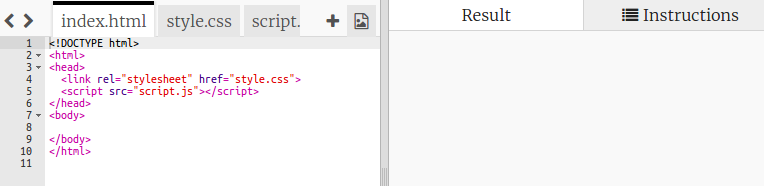
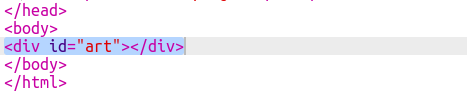

# Introduzione {.intro}

In questo progetto, creerai un editor di Pixel Art. Oltre a utilizzare il codice HTML e CSS, imparerai a usare il linguaggio JavaScript per aggiungere interattività al progetto.

  <iframe src="https://trinket.io/embed/html/0e102a306b?outputOnly=true&start=result" width="600" height="450" frameborder="0" marginwidth="0" marginheight="0" allowfullscreen>
  </iframe>
  

__Come utilizzare l’editor__: Fai clic su un colore della tavolozza per scegliere il colore della penna e fai quindi clic sui pixel per modificarne il colore.

# Passo 1: Creazione di una griglia di pixel {.activity}

Creiamo una griglia di pixel da utilizzare per la realizzazione della Pixel Art. Il CSS offre degli stili tabella per i layout di griglie e tabelle.

Le tabelle contengono righe, le quali a loro volta contengono celle. Creerai una tabella a sfondo nero con pixel bianchi all’interno.

## Lista di controllo delle attività { .check}

+ Apri questo trinket: <a href="http://jumpto.cc/web-pixel" target="_blank">jumpto.cc/web-pixel</a>.

	Il progetto si presenta così:

	

+ Aggiungi il seguente codice html nel `<body>` del file `index.html` per creare un `
` come contenitore della tua Pixel Art con id `art` in modo da potergli attribuire uno stile:

	

+ Vai ora al file `style.css` e aggiungi lo stile della tabella per l’arte `
`.

	

	Ciò consente di creare una tabella con un bordo e di definire lo spazio all’interno della griglia.

	L’aspetto non è ancora dei più interessanti. Devi inserire righe di pixel all’interno.

 + Torna al file `index.html` e aggiungi una riga di 3 pixel all’interno dell’arte `
`:

	

	 Le tre righe di pixel sono uguali. Digita la prima e quindi utilizza copia e incolla per creare le altre.

 	A questo punto, utilizza le classi per attribuire uno stile ai tag div in quanto ce ne saranno molti.

 + Aggiungi il seguente stile per righe e celle:

	

 	I pixel si allineeranno su una griglia contornati da linee nere.

 + Aggiungi adesso altre due righe di pixel per creare una griglia da 3x3. Ricordati di usare copia e incolla per risparmiare tempo.

	

##Sfida: Ridimensiona la griglia {.challenge}

3x3 è una griglia piuttosto piccola per la Pixel Art. Riesci a ingrandirla? Per la Pixel Art, 8x8 è una griglia di giuste dimensioni.

Prova a utilizzare taglia e incolla invece di digitare tutto.

## Salva il progetto {.save}

# Passo 2: Colora i pixel {.activity}

Il codice HTML viene impiegato per organizzare il contenuto, mentre il CSS per attribuirgli uno stile. JavaScript è un linguaggio di programmazione che può essere utilizzato per modificare una pagina Web durante l’interazione con la stessa.

Puoi utilizzare l’HTML e il CSS per impostare il colore di sfondo di pixel individuali, ma ci vorrebbe molto tempo! Andrai invece ad aggiungere codice JavaScript per colorare automaticamente i pixel quanto ci clicchi sopra.

+ In JavaScript, il codice viene posizionato in un tag `function` che può essere richiamato quando desideriamo eseguire tale codice.

	Creerai ora una funzione chiamata `setPixelColour`

	La funzione `setPixelColour` deve sapere di quale pixel modificare il colore. Tale istruzione si chiama `input`.

	Aggiungi il seguente codice al file `script.js` per impostare il colore di sfondo di un pixel:

	

	`backgroundColor` utilizza la lingua inglese con ortografia americana.

+ Dobbiamo ora richiamare quella funzione in modo che si attivi quando si fa clic su un pixel.

	L’HTML utilizza l’evento `onclick` per richiamare una funzione quando si fa clic su un elemento. Dovrai rendere "this" l’input in modo che la funzione sappia di quale pixel modificare il colore.

	Vai a `index.html` e aggiungi la seguente sintassi al primo pixel:

	

+ Verifica la sintassi facendo clic sul primo pixel. Dovrebbe diventare di colore nero:

	

	Hai aggiunto la sintassi `onclick` solamente al primo pixel; non funzionerà quindi ancora con gli altri pixel.

##Sfida: Rendi tutti i pixel selezionabili {.challenge}

Riesci a rendere tutti i pixel selezionabili? Utilizza taglia e incolla per velocizzare la procedura.

Crea un pezzetto veloce di Pixel Art.

Suggerimento: Fai clic su __Autorun__ (Esecuzione automatica) per annullare tutti i pixel.

# Passo 3: Aggiungi una tavolozza di colori {.activity}

Ti è seccato non poter modificare il colore di un pixel facendolo tornare bianco in caso di errore? Risolviamo subito il problema creando una tavolozza di colori in modo da poter fare clic su un colore per modificare la penna.

+ Per prima cosa, crea uno stile per la penna.

	Aggiungi la seguente sintassi in fondo al file `style.css`:

	

+ Adesso, crea i colori bianco e nero per la penna che utilizzano quello stile.

	Aggiungi la seguente sintassi al file `index.html` dopo il tag `<body>`:

	

	`style=` ti consente di aggiungere il CSS all’interno dell’HTML, opzione alquanto pratica in questo caso.

+ Desideriamo poter modificare il colore della penna quando si fa clic su un colore della tavolozza.

	Per memorizzare l’informazione, vengono utilizzate delle variabili. Creiamo la variabile penColour in `script.js`.

	Aggiungi la sintassi seguente in cima al file:

	

	Aggiungi quindi una funzione per modificare la variabile penColour:

	

+ Dovrai inoltre utilizzare il colore della penna quando cambi il colore di un pixel.

	Modifica la funzione `setPixelColour` in modo da utilizzare la variabile `penColour` invece di `black`:

	 

+ Adesso, dovrai richiamare la funzione `setPenColour` quando si fa clic su un colore della penna.

	Aggiungi la sintassi evidenziata `onclick` ai colori della penna:

	

+ Verifica se riesci a cambiare il colore della penna da nero a bianco e viceversa per riempire o annullare un pixel.

## Salva il progetto {.save}

##Sfida: Aggiungi più colori alla tavolozza {.challenge}

Riusciresti ad aggiungere più colori alla tavolozza? Scegli i colori con i quali vorresti creare la Pixel Art.

Dai quindi sfogo alla tua creatività nella Pixel Art.

Suggerimento: Il verde acceso si chiama `chartreuse`.

Chiedi al responsabile del corso se puoi utilizzare lo strumento di cattura di Windows o uno strumento alternativo per salvare una copia della tua Pixel Art come immagine.

## Salva il progetto {.save}
