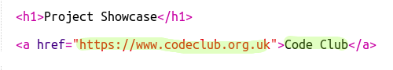
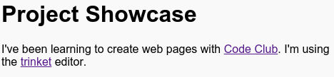

# Introduzione {.activity}

In questo progetto creerai una presentazione dei tuoi progetti in HTML e imparerai cosa sono i link e come inserire risorse.

# Passo 1: Aggiungere link alle pagine web {.activity}

I link di testo ti permettono di fare clic su alcune parole che ti porteranno su altre pagine web. Normalmente queste parole sono sottolineate.

## Lista di controllo delle attività { .check}

+ Apri questo trinket: <a href="https://jumpto.cc/web-showcase">jumpto.cc/web-showcase</a>.

	Il progetto dovrebbe avere questo aspetto:

	

+ HTML utilizza il tag `<a>` per i link.

+ Cerca il tag `<a>` nel tuo progetto.

+ Aggiungi l’indirizzo del sito web di Code Club <a href="https://www.codeclub.org.uk">`https://www.codeclub.org.uk`</a> e il testo del link:

+ Fai clic su "Run" (esegui) per provare il trinket.

+ Fai clic sul link di Code Club per provare la pagina web. Il trinket mostrerà la pagina di Code Club: 	

+ Per tornare alla pagina hai diverse opzioni:

	+ Esegui il trinket di nuovo,

	+ Premi il tasto Backspace sulla tastiera, oppure

	+ Premi il tasto destro del mouse e scegli Indietro.

## Lista di controllo delle attività { .check}

+ Ora metti il link in una frase all’interno di un paragrafo:

Prova la pagina web.

## Sfida: Aggiungi un altro link {.challenge}

Aggiungi una frase con un link a un sito web che hai usato per creare un progetto. Ad esempio: <a href="https://trinket.io">https://trinket.io</a> or <a href="https://trinket.io/docs/colors">https://trinket.io/docs/colors</a>.

## Salva il progetto {.save}

# Passo 2: Link a un trinket {.activity}

Puoi collegare la pagina web con un trinket.  

## Lista di controllo delle attività { .check}

+ Hai salvato il link del trinket Buon compleanno? Se lo hai fatto, apri il trinket in un’altra scheda o finestra del browser. Altrimenti, apri il trinket di esempio già finito: <a href="https://trinket.io/html/e996dc0380">https://trinket.io/html/e996dc0380</a>

Fai clic sul menu Share (condividi) nella parte superiore dello schermo e scegli Link:

Se hai aperto il trinket dal tuo account, cerca l’opzione Share che si trova sotto il trinket:

+ Seleziona "Only show code or result (let users toggle between them)" che significa "Mostra solo il codice o il risultato (permettere agli utenti di alternare tra i due)" e copia il link del trinket.

+ Torna al trinket Presentazione dei progetti e aggiungi un’intestazione <h2> e un link al tuo progetto Buon compleanno.

Prova la pagina web; dovrebbe avere questo aspetto:

Fai clic sul link Buon compleanno per provare se porta al trinket.

## Salva il progetto {.save}

## Sfida: Crea un elenco dei tuoi progetti {.challenge}

Aggiungi qualche altro progetto HTML e CSS che hai creato su Code Club. Usa le intestazioni `<h2>` per organizzare la tua pagina web.

Se non hai a disposizione i link dei progetti che hai creato, puoi usare gli esempi di Code Club:

+ Buon compleanno: <a href="https://trinket.io/html/e996dc0380">https://trinket.io/html/e996dc0380</a>

+ Racconta una storia: <a href="https://trinket.io/html/c8afdef912">https://trinket.io/html/c8afdef912</a>

+ Ricercato: <a href="https://trinket.io/html/ebeb56398a">https://trinket.io/html/ebeb56398a</a>

+ Ricetta: <a href="https://trinket.io/html/c0fd9b40cd">https://trinket.io/html/c0fd9b40cd</a>

+ Lettera misteriosa: <a href="https://trinket.io/html/1d4d4c5ce1">https://trinket.io/html/1d4d4c5ce1</a>

La pagina finita dovrebbe avere questo aspetto:

## Salva il progetto {.save}

# Passo 3: Inserire progetti {.activity}

Oltre a collegare i trinket come pagine web, possiamo anche inserirli in una pagina web.

## Lista di controllo delle attività { .check}

+ Magari preferisci provare a lavorare in modalità schermo intero per avere più spazio:

Premi il tasto Esc (escape) per uscire dalla modalità schermo intero.

+ Esegui il trinket e fai clic sul link Buon compleanno.

+ Fai clic sul menu trinket e seleziona __embed__(inserisci). Se non sei in modalità schermo intero, è possibile che tu debba scorrere. Usa la barra di scorrimento sulla destra oppure la freccia giù sulla tastiera.

## Lista di controllo delle attività { .check}

+ Seleziona "Only show code or result (let users toggle between them)" che significa "Mostra solo il codice o il risultato (permettere agli utenti di alternare tra i due)" e __copia__ il codice inserito per il trinket.

+ Il trinket ha creato un HTML perché tu lo includa nella pagina web. Utilizza un tag `<iframe>` che consente l’inserimento del contenuto in una pagina.

+ Ora incolla il codice sotto il link del trinket Buon compleanno:

+ Esegui il trinket per provarlo. Dovresti vedere il progetto Buon compleanno inserito nella pagina web.

+ È possibile che la parte inferiore del trinket non si veda. Puoi correggere modificando il valore dell’altezza (height) su `<iframe>`.

Impostare l’altezza a __400__. Se hai effettuato delle modifiche al progetto Buon compleanno, è possibile che debba scegliere un valore diverso.

## Salva il progetto {.save}

## Sfida: Integra altri progetti {.challenge}

Integra altri progetti nella Presentazione. Ricorda che puoi trovare facilmente le pagine del trinket facendo clic sui link della pagina web.

# Passo 4: Crea un indice {.activity}

Aggiungiamo un Indice in modo da accedere facilmente a tutti i progetti.

## Lista di controllo delle attività { .check}

+ Oltre a poter creare link ad altre pagine web, possiamo creare link alle parti di una pagina web se le attribuiamo un id.

Aggiungi un id all’intestazione `<h2>` del progetto Buon compleanno:

+ Aggiungi gli id a ciascun progetto e assegna dei nomi brevi: storia, ricercato, ricetta e lettera.  

+ Puoi creare un link a un elemento con un id se inserisci il simbolo hash ‘#’ davanti al nome. Ad esempio, `#compleanno`.

Crea un elenco ordinato di link ai tuoi progetti. (Gli elenchi ordinati sono spiegati nel progetto Ricetta).

+ Esegui il tuo progetto e provalo facendo clic sui link per spostarti tra i progetti.

## Salva il progetto {.save}

# Passo 5: Torna all’inizio {.activity}

## Lista di controllo delle attività { .check}

+ Inoltre può essere utile avere la possibilità di tornare all’inizio della pagina. HTML ha `#top` (inizio) a questo scopo.

+ Aggiungi un link a `#top` dopo ogni progetto inserito nella pagina web:

+ Prova i link facendo clic su Inizio per tornare all’inizio della pagina.

## Salva il progetto {.save}

## Sfida: Migliora la tua presentazione {.challenge}

Utilizza il CSS che hai imparato per rendere più interessante la tua pagina web. Prova a cambiare il colore dello sfondo della pagina o il tipo di carattere usato per le intestazioni.

Puoi anche aggiungere alcune informazioni su ciascun progetto e raccontare cosa ti è piaciuto della realizzazione.  

## Sfida: Crea una nuova presentazione {.challenge}

I trinket non sono l’unica cosa che puoi inserire in una pagina web. Puoi anche inserire video, widget (come un widget meteo) o progetti di Scratch.

Apri il trinket integrato di Scratch come esempio ed eseguilo: <a href="https://trinket.io/html/9f7212b8fe">https://trinket.io/html/9f7212b8fe</a>

Vai al sito web Scratch e trova un progetto che ti piace. Può essere uno dei tuoi o uno che hai trovato.

Se hai eseguito l’accesso, puoi fare clic sul pulsante "Embed" (inserisci) sotto al progetto per ottenere il codice HTML e poterlo inserire.

Se non hai eseguito l’accesso, cerca il numero di progetto Scratch al suo indirizzo web.

Fai una copia del codice `<iframe>` nell’esempio integrato di Scratch e cambia il numero di progetto con quello del progetto che vuoi inserire:

## Salva il progetto {.save}
