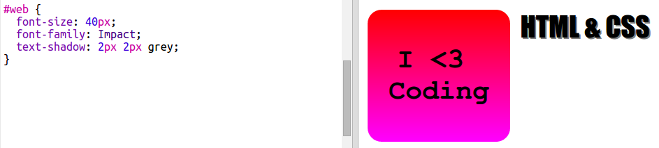
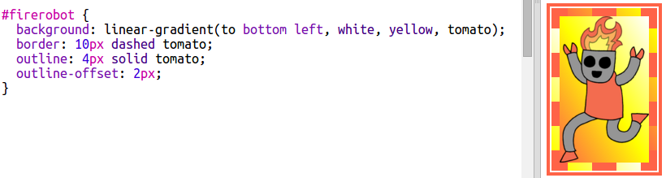

# Introduzione {.intro}

In questo progetto, creeremo tantissimi adesivi divertenti che potrai usare per decorare le pagine web. Imparerai a usare le sfumature dei colori per rendere i tuoi adesivi ancora più belli.

# Passo 1: Programmare un adesivo colorato {.activity}

Un gradiente è un cambiamento graduale da un colore a un altro. I gradienti possono essere usati per creare effetti incredibili. Impareremo a usarli per creare degli adesivi e decorare le pagine web.

+ Apri questo trinket: <a href="http://jumpto.cc/web-stickers" target="_blank">jumpto.cc/web-stickers</a>.

	Il progetto dovrebbe avere questo aspetto:

	

+ Realizziamo insieme un adesivo con scritto "Io <3 programmare".

	Usa un `
` con la class (categoria) `sticker` e un id `coding` per lo stile:

	

+ Hai notato che ti ha dato errore? Succede perché '<' è un carattere speciale in HTML. Invece di '<' devi usare il codice speciale `&lt;`.

	Aggiorna il codice con `&lt;` e l'errore sparirà.

	

	` ` inizia una nuova riga.

+ Ora rendiamo l'adesivo più interessante.

	Passa al file `style.css`. Vedrai che la categoria `.sticker` è stata creata. In questo modo gli adesivi appaiono sulla pagina e il contenuto viene centrato.

	Ricorda che hai aggiunto l'id `coding` all'adesivo. In fondo allo `style.css` aggiungi il codice seguente per dare lo stile al testo:

	

+ Ora puoi aggiungere un gradiente allo sfondo dell'adesivo. Un gradiente lineare passa da un colore a un altro secondo una linea retta.

	Questo gradiente cambierà dal rosso nella parte superiore al magenta nella parte inferiore. Aggiungi il codice del gradiente allo stile `coding`:

	

+ Puoi migliorare il risultato aggiungendo uno spazio intorno (il padding) e gli angoli arrotondati.

	Aggiungi il codice evidenziato:

	

	Lo stile del "padding" aggiunge uno spazio di 50px nella parte superiore e inferiore e uno spazio di 30px a sinistra e a destra.

## Salva il progetto {.save}

# Passo 2: Adesivo HTML & CSS {.activity}

I gradienti possono cambiare colore anche dal centro verso i bordi, e in questo caso è chiamato gradiente radiale.

+ Creiamo un adesivo con il testo `HTML & CSS.` `&` è un altro carattere che deve essere codificato in HTML, il codice è `&amp;`.

	Aggiungi il codice evidenziato per creare un nuovo adesivo:

	

+ Ora passa al file `style.css` e aggiungi uno stile al tuo nuovo adesivo:

	

	Il codice `text-shadow` aggiunge un'ombra che si estende di 2px al di sotto e a destra del testo per metterlo in risalto.

+ Ora ci occupiamo del gradiente. Questa volta usiamo un gradiente radiale. Il colore cambierà dal giallo centrale all'arancione e poi al rosso.

	

	Nota che i gradienti possono includere diversi colori, non solo due.

+ L'adesivo avrà un aspetto molto migliore con l'aggiunta dello spazio e un bordo arrotondato.

	Aggiungi il codice evidenziato:

	

## Salva il progetto {.save}

##Sfida: Crea il tuo adesivo con gradiente personale {.challenge}

Ora crea il tuo adesivo con gradiente. Prova a usare i gradienti lineare e radiale usando diversi colori HTML.

Ecco come si fa:

+ Aggiungi un `
` con il testo del tuo adesivo a `index.html` e assegna alla categoria `sticker` un nuovo `id`.
+ Aggiungi uno stile per l'`id` scelto in `style.css`. Puoi anche copiare gli stili di un adesivo già fatto e modificarlo.

Ecco un elenco di tutti i nomi di colori che puoi usare: [jumpto.cc/web-colours](http://jumpto.cc/web-colours), che include nomi di colori come `tomato`(pomodoro), `firebrick` (mattone) e `peachpuff`(pesca).

Se vuoi cambiare il colore del testo puoi usare `color:`.

Ecco un esempio di cosa puoi fare con diversi colori in un gradiente lineare:

## Salva il progetto {.save}

# Passo 3: Adesivo con un robot di fantasia {.activity}

Puoi creare un adesivo con gradiente usando un'immagine. Se utilizzi un'immagine con uno sfondo trasparente, il gradiente apparirà attraverso l'immagine.

Puoi anche creare gradienti che hanno diverse direzioni.

+ Aggiungi un adesivo a `index.html` utilizzando l'immagine `firerobot.png`:

	

	Puoi regolare l'altezza `height` per ridimensionare l'immagine, l'ampiezza cambierà automaticamente.

+ Normalmente la direzione di un gradiente è dall'alto verso il basso, ma puoi usare `to` per cambiare la direzione. Ad esempio: `to top` (in alto), `to left` (a sinistra) o `to right` (a destra).

	Per un gradiente diagonale, devi dare due direzioni. In questo esempio è utilizzato `to bottom left`(a verso il basso a sinistra).

	Aggiungi questo stile a `style.css` per dare al tuo nuovo adesivo con il robot un gradiente diagonale e un bordo originale.

	

	Nota che puoi usare `outline` (contorno) per creare un altro bordo al di fuori del solito.
	`outline-offset`(compensazione contorno) include uno spazio tra il bordo e il contorno.

+ Aggiungiamo un po' di testo a questo adesivo.

	Aggiungi uno `` contenente il testo "ROBOTS" a `index.html` e assegnagli un id.  

	

+ Il testo avrà un aspetto migliore se lo rendi più grande e lo posizioni.

	Per posizionare il testo dovrai aggiungere `position: relative;` to `#greensticker` e `position: absolute` a `#greentext`. Il posizionamento è trattato in maggiore dettaglio nel progetto "Costruisci un robot".

	Aggiungi il codice seguente a `style.css`:

	

+ E per il tocco finale, ruotiamo il testo utilizzando `transform: rotate`.

	

	Prova a cambiare il numero di gradi a cui il testo viene ruotato.

## Salva il progetto {.save}

##Sfida: Realizza altri adesivi {.challenge}

Ora prova a realizzare altri adesivi utilizzando altre direzioni del gradiente, aggiungendo immagini e testo e impiegando bordi e contorni.

Suggerimento: dovrai aggiungere HTML e CSS per ogni adesivo.

Puoi copiare e modificare uno degli esempi e fare cambiamenti per creare un nuovo adesivo.

Il tuo progetto include già una serie di immagini con i robot. Fai clic sull'icona delle immagini per vedere le immagini disponibili.

In questo esempio è utilizzato un gradiente con `to right` (a destra):

## Salva il progetto {.save}
