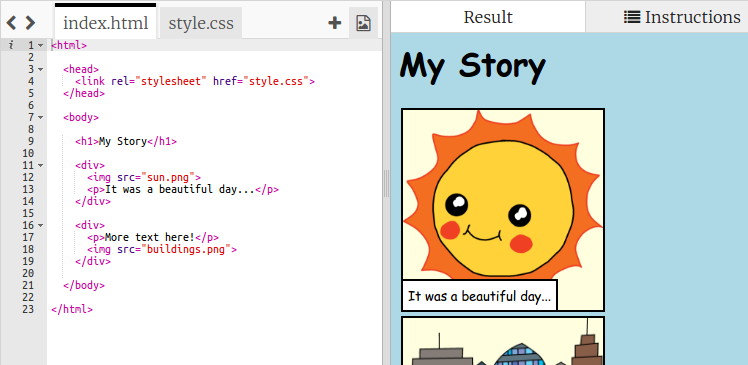
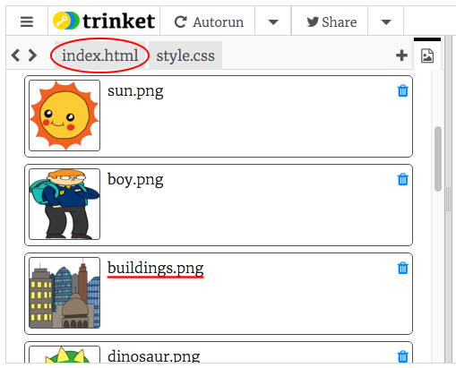
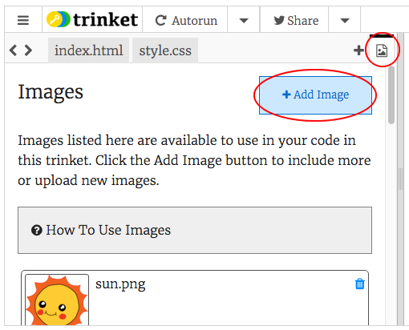

# Introduzione {.intro}

In questo progetto, imparerai a creare la tua pagina Web per raccontare una storia, una barzelletta o una poesia.


# Passo 1: Pensa a una storia { .activity}

Prima di iniziare a programmare, dovrai pensare a una storia da raccontare.

## Lista di controllo delle attività { .check}

+ Pensa alla storia che vorresti raccontare. Ad esempio:
	+ Una storia conosciuta;
	+ Una storia che ti sei inventato/a;
	+ Qualcosa che è successo a te o a qualcuno che conosci.

	Non deve essere necessariamente una storia. Può essere una barzelletta, una poesia o qualsiasi altra cosa che desideri tu!

# Passo 2: Scrittura della storia { .activity}

Iniziamo modificando il contenuto HTML e lo stile CSS della pagina Web della storia.

## Lista di controllo delle attività { .check}

+ Apri questo trinket: <a href="http://jumpto.cc/web-story" target="_blank">jumpto.cc/web-story</a>.

	Il progetto si presenta così:

	

+ Forse ti ricorderai dal progetto "Buon compleanno" che il contenuto di una pagina Web è incluso nel tag `<body>` del documento HTML.

	Vai alla riga 7 del codice. Dovresti essere in grado di visualizzare il contenuto della pagina Web all’interno dei tag `<body>` e `</body>`.

	

+ Sapresti dire quali tag sono utilizzati per creare le diverse parti della pagina Web?

	

	+ `<h1>` rappresenta una __heading__ (intestazione). Puoi utilizzare i numeri da 1 a 6 per creare intestazioni di diverse dimensioni;
	+ `<div>` è l’abbreviazione di __division__ (divisione) e serve per raggruppare diversi elementi insieme. In questa pagina Web, utilizzerai questo tag per raggruppare tutti gli elementi di ogni parte della storia;
	+ `` sta per __image__ (immagine);
	+ `<p>` indica un __paragraph__ (paragrafo) di testo.

##Sfida: Effettua delle modifiche {.challenge}
Modifica il codice HTML e CSS per personalizzare la pagina Web.


Puoi modificare i colori utilizzati nella pagina Web e puoi anche usare caratteri come <span style="font-family: Arial;">Arial</span>, <span style="font-family: Comic Sans MS;">Comic Sans MS</span>, <span style="font-family: Impact;">Impact</span> e <span style="font-family: Tahoma;">Tahoma</span>.

Altri nomi di colori CSS sono disponibili qui: <a href="http://jumpto.cc/colours" target="_blank">jumpto.cc/colours</a>.

Se ti serve aiuto, puoi consultare il progetto "Buon compleanno".

## Salva il progetto {.save}

# Passo 3: Racconta la tua storia { .activity}

Aggiungiamo ora una seconda parte alla storia.

## Lista di controllo delle attività { .check}

+ Vai alla riga 15 del codice e aggiungi un’altra coppia di tag `<div>` e `</div>` di apertura e chiusura. Verrà creata una nuova casella per la parte successiva della storia.

	

+ Aggiungi un paragrafo di testo all’interno del nuovo tag `<div>`.

	```
	<p>Aggiungi qui del testo!</p>
	```

	

+ Puoi infine aggiungere un’immagine nella nuova casella aggiungendo questa sintassi all’interno del tag `<div>`:

	```
	
	```

	

	I tag `` sono leggermente diversi dagli altri, in quanto non dispongono di un tag di chiusura.

+ Per le immagini in HTML, dovrai aggiungere la __fonte__ dell’immagine, all’interno delle virgolette.

	Fai clic sull’icona delle immagini per visualizzare le immagini disponibili per la tua storia.

	

+ Trova il nome di un’immagine che desideri aggiungere, ad esempio `buildings.png`. Fai clic su `index.html` per tornare al codice.

	

+ Puoi quindi aggiungere il nome dell’immagine tra le virgolette del tag ``.

	```
	
	```

	

# Passo 4: Trova le immagini che desideri { .activity}

Cerchiamo un’immagine sul Web da aggiungere alla storia.

## Lista di controllo delle attività { .check}

+ Vai a <a href="http://jumpto.cc/html-images" target="_blank">jumpto.cc/html-images</a> e trova un’immagine che desideri includere nella storia.

+ Fai clic con il tasto destro del mouse sull’immagine e quindi su "Copy image URL" (Copia URL dell'immagine). L’__URL__ è l’indirizzo dell’immagine.

	

+ Incolla l’URL tra le virgolette del tag ``. Dovrebbe apparire l’immagine!

	

## Salva il progetto {.save}

# Passo 5: Caricamento di immagini { .activity}

__Se hai un account su Trinket__, puoi anche caricare le tue immagini sulla pagina Web!

## Lista di controllo delle attività { .check}

+ Fai clic sull’icona delle immagini situata nella parte superiore di trinket e quindi su "Add Image" (Aggiungi immagine).

	

+ Trova l’immagine sul computer e trascinala in trinket.

	

+ Puoi quindi aggiungere il nome dell’immagine nuova tra le virgolette del tag ``, nel modo seguente:

	```
	
	```

## Salva il progetto {.save}

##Sfida: Continua tu! {.challenge}
Utilizza quanto appreso nel corso di questo progetto per finire di raccontare la tua storia! Ecco un esempio:


## Salva il progetto {.save}
